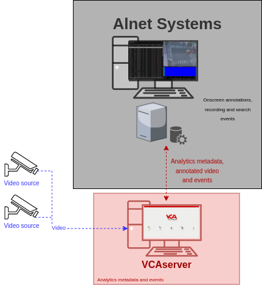
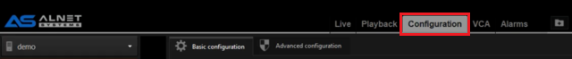
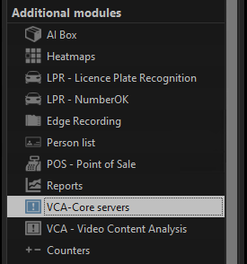
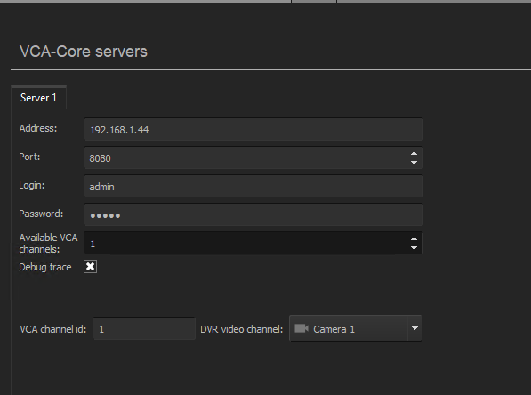
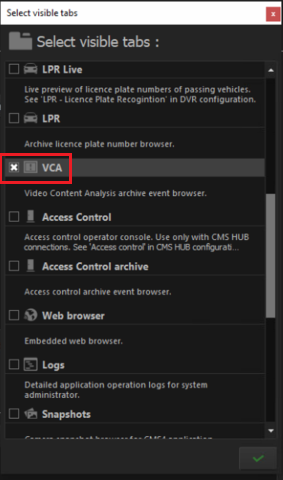
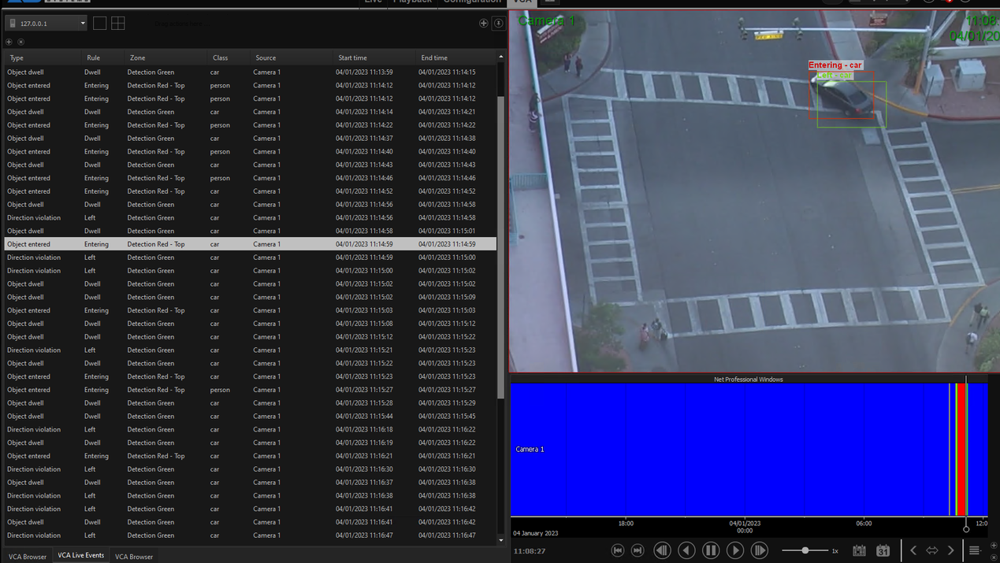

# Introduction

## Prerequisites

-   VCAserver version 2.2.0 or greater.
-   Net Professional service application.
-   CMS 4 Professional Client application.

## Supported Features

-   Metadata integration (using the VCA REST API).
-   Annotated RTSP.

## Architecture

Alnet will connect to the VCA channels to consume the metadata provided. The integration does not require the
configuration of VCAserver actions to send events to the VMS. The only requirement is that VCA rules are defined.

# VCAserver Configuration

## Confirming the RTSP port used for transmitting video footage

Check, and change if required, the RTSP port used by VCA for external connections to the channels within the VCA
service.

1.  From the main screen, click the **system cog** in the top right.

    

2.  Then, click on **System**.

    

3.  In **Network Settings**, you can see the RTSP port used by the VCAserver to send the RTSP stream of its channels.
    Change it if necessary and click **Save**.

    

    _Note: The syntax for connecting to these channels is:_ `rtsp://<device_ip>:<RTSP_port>/channels/<channel_id>`.

    Example: `rtsp://192.168.1.10:8554/channels/27`.

## Creating a Channel

Configure the VCAserver as required with the appropriate channel and logical rules. A basic setup is detailed below as
an example:

1.  Configure a source to connect to a camera.

    _Note: the recommended settings for the camera stream to VCA is a maximum resolution of D1 (640 x 480) with a frame_
    _rate of 15 frames per second. A lower resolution and frame rate will reduce the analytic accuracy, a higher_
    _resolution and frame rate will result in high CPU usage and can reduce analytical accuracy._

2.  Configure a **zone** for the channel.

3.  Configure **rules or filters** to trigger an event on object detection in the zone.

    

4.  Note the **Channel ID** as this will be needed when connecting to the RTSP stream from the CMS 4 Client.

    _Note: The channel ID can be located at the bottom of the channels menu._

    

For more information on creating and configuring channels in VCA please refer to the
[VCA core manual 2.4](https://documentation.vcatechnology.com/).

# Net Professional Configuration

## Adding a Network Camera

First, we configure an **ONVIF** device into the system. Run the Net Professional wizard.

1.  In **Network camera**, click **Add** and select the **Manufacturer** from the available options.

    

2.  Then, click **Next**.

3.  Click **Search** to discover the camera on the network. When the search is complete, select the IP camera you want
    to add and click **Next**.

    

4.  Confirm the camera model and click **Next**.

    

5.  Enter the **login** and **password** to access the camera and click **Next**.

    

6.  Make sure the camera properties have been detected correctly and click **Next**.

    

7.  Configure the **Video stream** and **Audio** as required. Then, click **Next**.

    

8.  Enable the **Advance** settings as required and click **Next**.

    

9.  Click **OK** to confirm the configuration and close the wizard.

    

# CMS 4 Client Configuration

## Connecting to the VCAserver

Next, we connect to the VCAserver to get the metadata provided on its channels.

1.  From the **CMS 4 Client**, click **Configuration** located top.

    

2.  Then, click **`VCA-Core` servers**, from the *Additional modules* menu.

    

3.  In **`VCA-Core` servers**, configure the **`Device1`** as follows:

    -   **Address:** Enter the IP address of the VCAserver.
    -   **Port:** Enter the web port configured in the VCAserver.
    -   **Login:** Enter the username to access the VCAserver.
    -   **Password:** Enter the password to access the VCAserver.
    -   **Available VCA channels:** Enter the number of channels you want to integrate with.
    -   **VCA channel id:** Enter the ID of the VCA channel you want to get the metadata from.
    -   **DVR video channel:** Select the camera that matches the channel configured in the VCAserver.

        

4.  Click **Apply** located bottom to save the configuration.

## Verifying the VCA Events

In the CMS 4 Client main screen, click **Select visible tabs** located top. Then, select **VCA** from the available
tabs and click the **green check** button located bottom to confirm.

Every time an event is triggered on the VCAserver, the notification will appear in the **VCA Live Events** tab showing
the details of the event such as object type, rule, zone, class, source and time, as well as, the recording of each
event.

