# Introduction

## Prerequisites

-   VCAserver version 2.4.2 or greater.
-   Arteco Omnia Suite version 24.3 or greater.

## Supported Features

-   ONVIF Metadata (object tracking annotations).
-   ONVIF Events (appear, disappear, enter, exit, tailgating, loitering).

## Architecture

Arteco OMNIA will connect to VCAserver and its channels to consume the ONVIF metadata from the objects (bounding box)
and the events from the rules.

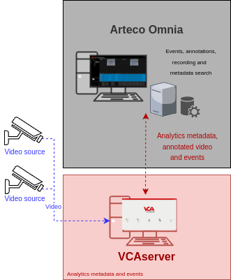

# VCAserver Configuration

## Confirming the ONVIF port used for transmitting video footage

Check, and change if required, the web port used by VCA for external connections to the channels within the VCA
service.

1.  From the main screen, click the **system cog** in the top right.

    

2.  Then, click on **System**.

    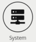

3.  In **Network Settings**, you can see the Web port used by the VCAserver to send the video of its channels.
    Change it if necessary and click **Save**.

    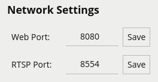

## Enabling ONVIF

1.  Navigate to **ONVIF** and tick the box against **Enabled** to enable the feature

    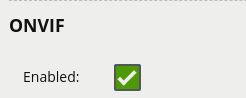

    *Note: ONVIF runs on the web server port (whatever that may be). This is the same port the user configured*
    *previously.*

## Creating a Channel

Configure the VCAserver as required with the appropriate channel and rules. A basic setup is detailed below as
an example:

1.  Configure a source to connect to a camera.

    _Note: the recommended settings for the camera stream to VCA is a maximum resolution of D1 (640 x 480) with a frame_
    _rate of 15 frames per second. A lower resolution and frame rate will reduce the analytic accuracy, a higher_
    _resolution and frame rate will result in high CPU usage and can reduce analytical accuracy._

2.  Select the **Tracking Engine** to identify objects in the scene.

3.  Create a **Zone** for the channel.

4.  Add **Rules** to trigger an event on object detection in the zone.

    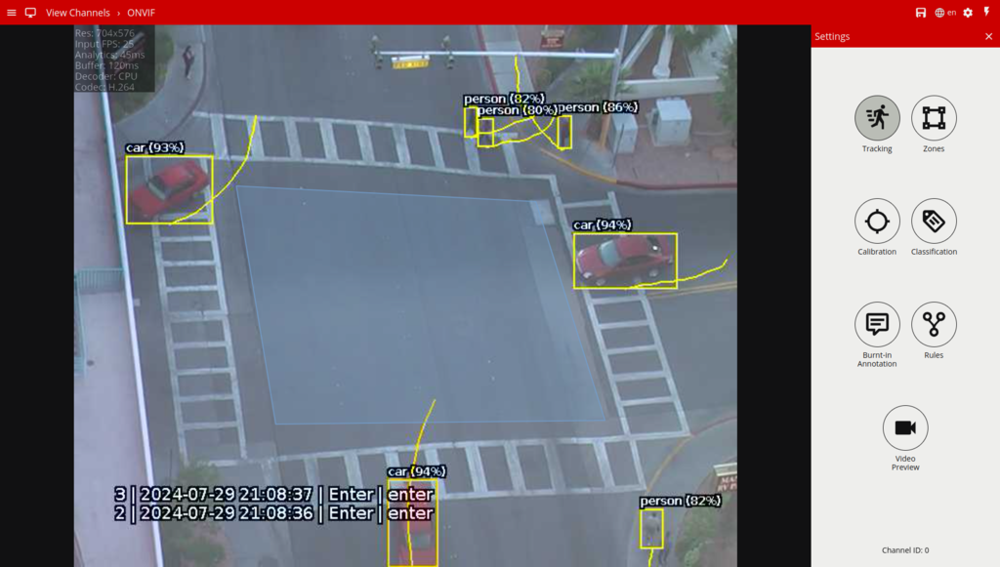

For more information on creating and configuring channels in VCA please refer to the
[VCA core manual 2.4](https://documentation.vcatechnology.com/).

# Arteco Omnia Configuration

## Adding a New Camera

1.  First, we add a new camera into the system. Click on the **cog icon** at the bottom to switch to the configuration
    environment.

    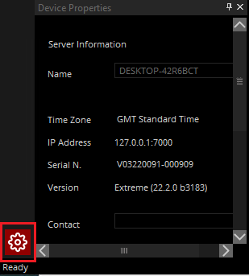

2.  In the *Device List* configuration tree, select the server you want to add the camera on.

    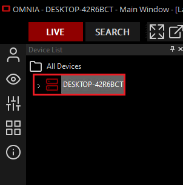

3.  Click **Video Channels** from the left menu.

    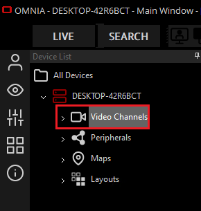

4.  In *DEVICES*, click **Manual Add** from the available options.

    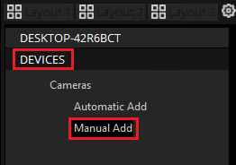

5.  In *Manual `Config`*, edit **Hardware Configuration** as illustrated below:

    -   **Camera Count:** Enter the number of cameras you want to configure.
    -   **Camera Type:** Select **ONVIF** from the drop-down list.

6.  In *Network Configuration*, configure the IP address of the VCAserver as follows:

    -   Tick the box against **Use Single IP Address**
    -   **First IP:** Enter the IP address of the VCAserver.
    -   **Last IP:** Enter the IP address of the VCAserver.
    -   **RTSP Port:** Enter the RTSP Port configured in the VCAserver.
    -   **HTTP Port:** Enter the web port to access the VCAserver.

        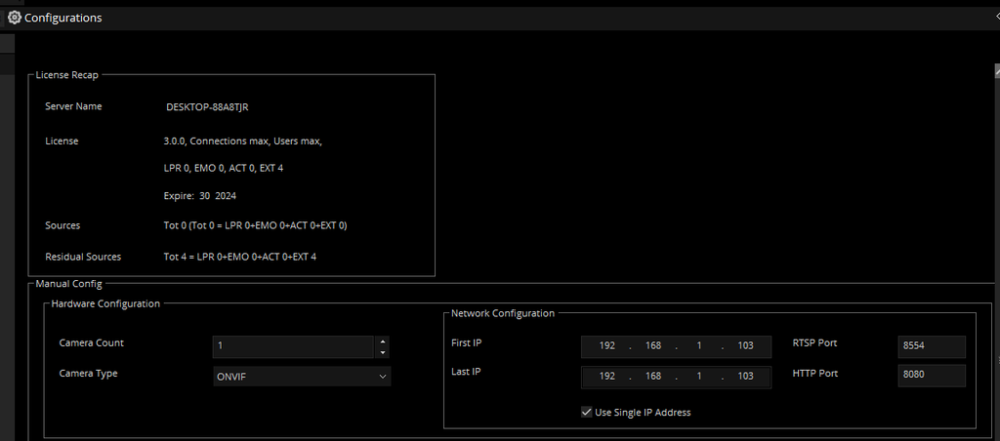

7.  In *Software Configuration*:

    -   **Username:** Enter the username to access the VCAserver.
    -   **Password:** Enter the password to access the VCAserver.
    -   **Base Name:** Enter a descriptive name for the VCAserver or its channels.
    -   Then, click **Confirm Configuration** to save the configuration.

8.  In *Add Recap*, click on **Add Cameras** and **OK** to confirm adding the camera.

    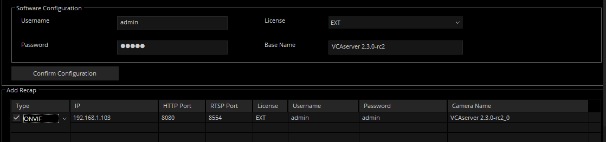

    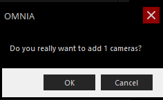

9.  Click **OK** to close the window.

    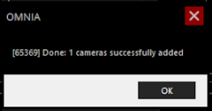

10.  A live image of the camera will be displayed in the preview window.

    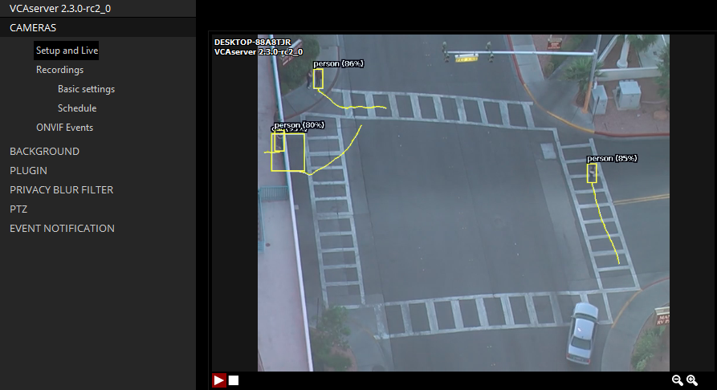

### Enabling ONVIF Metadata and Events

1.  In the *Setup and Live* page, navigate to the ONVIF properties on the right side.

2.  Then, tick the box against **Enable Events** and **Enable Metadata**.

    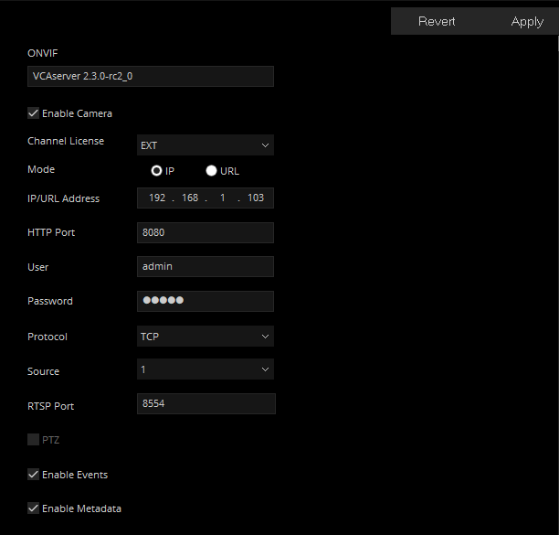

3.  Click **Apply** to save the configuration.

    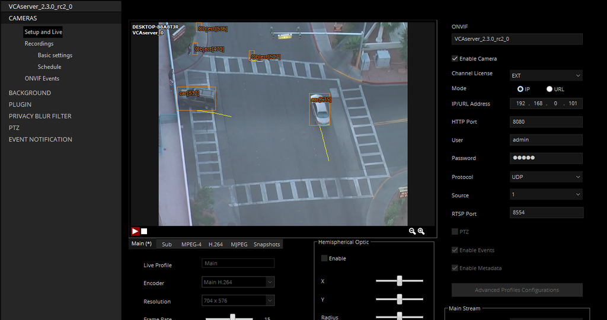

## Adding ONVIF Events

1.  Click **ONVIF Events** on the left menu.

    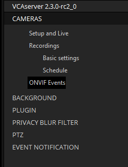

2.  In the *Available `Onvif` Events* page, tick the box against the available list of events you want to get
    notifications from.

    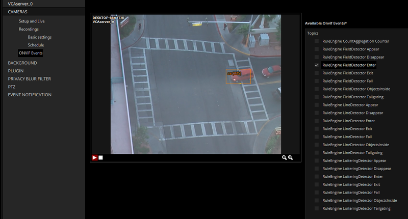

3.  Click **Apply** to save the configuration.

## Configuring Event Notification

1.  The next step is to configure the event notification. From the configuration page, click **EVENT NOTIFICATION**.
    Then, click **Channel Events**.

    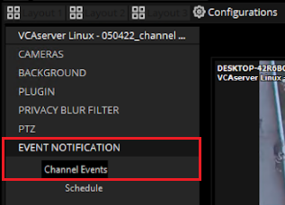

2.  In *Live Event Log*, edit the notification as illustrated below:

    -   **Send To Client:** Tick the box against **All events**.
    -   **Bookmark:** Tick the box against **All events**.
    -   **Status:** Select the status you want to assign to the notifications from the drop-down list.
    -   **Colour:** Select the colour to identify the notifications and click **OK**.
    -   Click **Apply** to save the configuration.

        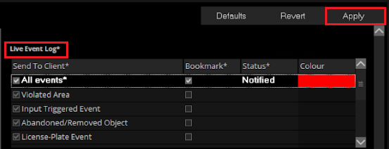

## Verifying the VCA Events

When VCAserver triggers a rule, a new bookmark will be listed in **Live Event** from the **LIVE** page as follows:

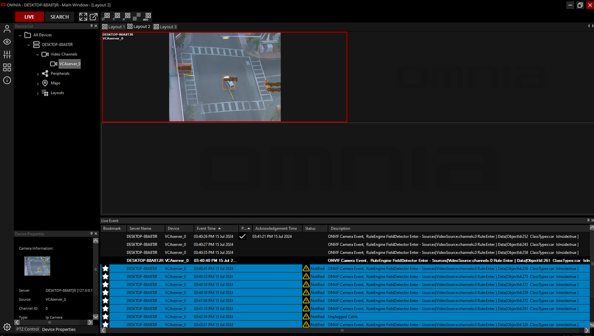

You can also review the event details and recording by clicking on the bookmark:

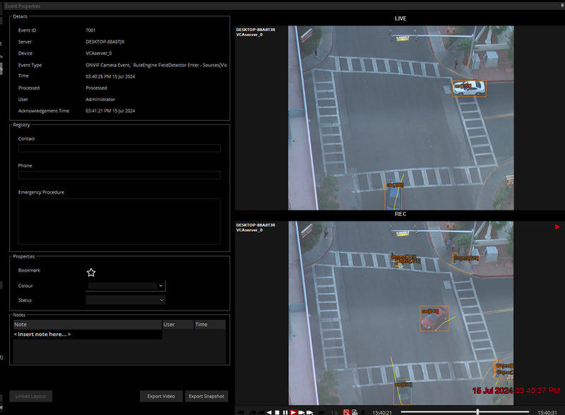
