# Introduction

## Prerequisites

-   VCAserver version 2.4.2 or greater.
-   Arteco Omnia Suite version 24.3 or greater.

## Supported Features

-   Annotated RTSP stream.
-   HTTP events with metadata available via tokens.
-   XML requests.

## Architecture

For this web UI integration, Arteco Omnia receives the annotated RTSP stream from the VCAserver and the alarms are sent
through HTTP requests with XML format and VCA tokens containing details about the event.

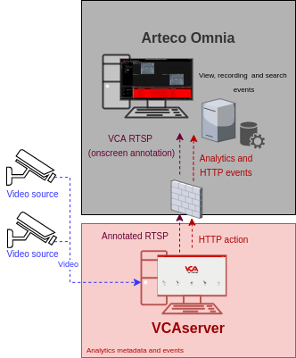

# VCAserver Configuration

## Confirming the RTSP port used for transmitting video footage

Check, and change if required, the RTSP port used by VCA for external connections to the channels within the VCA
service.

1.  From the main screen, click the **system cog** in the top right.

    

2.  Then, click on **System**.

    

3.  In **Network Settings**, you can see the RTSP port used by the VCAserver to send the RTSP stream of its channels.
    Change it if necessary and click **Save**.

    

    _Note: The syntax for connecting to these channels is:_

    `rtsp://<device_ip>:<RTSP_port>/channels/<channel_id>`.

    Example: `rtsp://192.168.1.44:8554/channels/0`.

## Enabling the Metadata

Arteco Omnia will consume the metadata through the action’s token system.

1.  From the main screen, click the **system cog**.
2.  Then, click **System**.
3.  Configure **Metadata** as follows:

    -   **Normalised coordinate range maximum:** Set the value to **100**.
    -   Enable **Flip Y axis coordinates**.
    -   Enable **Round coordinates to nearest integer**.

        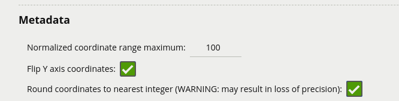

## Creating a Channel

Configure the VCAserver as required with the appropriate channel and logical rules. A basic setup is detailed below as
an example:

1.  Configure a source to connect to a camera.

    _Note: the recommended settings for the camera stream to VCA is a maximum resolution of D1 (640 x 480) with a frame_
    _rate of 15 frames per second. A lower resolution and frame rate will reduce the analytic accuracy, a higher_
    _resolution and frame rate will result in high CPU usage and can reduce analytical accuracy._

2.  Configure a **zone** for the channel.

3.  Select the **Tracking Engine** to identify objects in the scene.

4.  Configure **rules or filters** to trigger an event on object detection in the zone.

    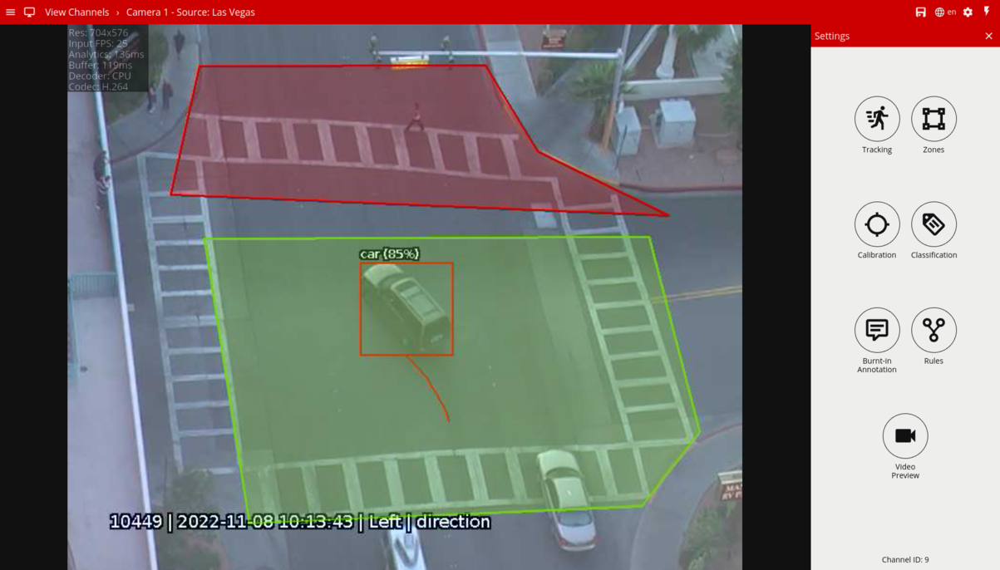

5.  Note the **Channel ID** as this will be needed when connecting to the RTSP stream from the Arteco Omnia.

    _Note: The channel ID can be located at the bottom of the channels menu._

    

For more information on creating and configuring channels in VCA please refer to the VCA core manual 1.6.

## Creating an Action

1.  Click the **system cog** in the top right to access the Settings.

    

2.  Then, click **Edit Actions**.

    

3.  Click **Add Action** and select **HTTP** from the list of available actions.

    

4.  Enter a descriptive name for the action.

5.  Click the arrow on the right of the action to expand the HTTP configuration options.

    -   **URI:** Enter the URI required by the Omnia server. Default endpoint:
        `http://<ipaddress>:<port>/arteco-mobile/event.fcg`

    -   **Port:** Enter the web port of the Arteco Omnia.
    -   **Headers:** Select **Custom** from the drop down menu, and configure the header as follows:

        ```Content-Type: Application/XML.```

    -   **Body:** Select **Custom** from the drop down menu. Then, add the XML required by the Arteco Omnia with the VCA
        tokens.

    -   **Method:** Select **POST** from the available methods.
    -   **Enable Authentication:** Check to enable authentication.
    -   **Username:** Enter the username to access the Omnia server.
    -   **Password:** Enter the password to access the Omnia server.
    -   **Sources:** Select **Add Source +** to display a list of the available Sources and logical rules and select the
        logical rule created for the source you want to send to the server.

        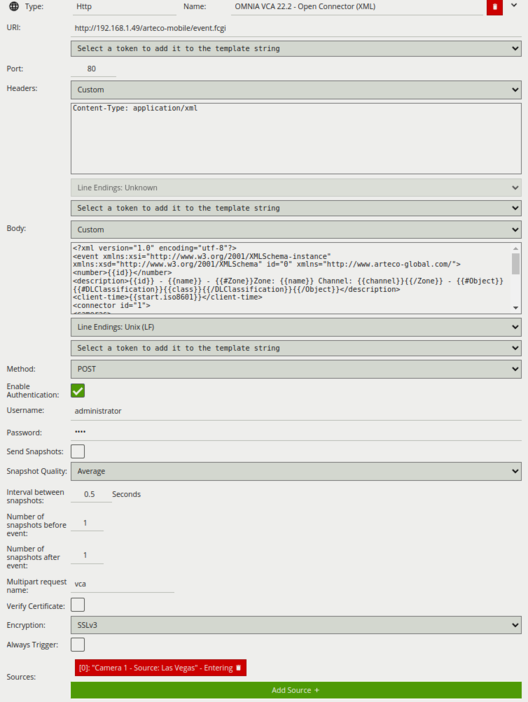

For this integration, the following tokens were used to send an information on the camera, zone and rule type that
triggered the event:

-   `{{#Zone}}Zone: {{name}}{{/Zone}}`: An array of zones associated with the event.
-   `{{#DLClassification}}{{class}}{{/DLClassification}}{{/Object}}`: The Deep-Learning classification name of the
    object.
-   `{{id}}`: The unique ID of the event.
-   `{{name}}`: The name of the event.
-   `{{host}}`: The hostname of the device that generated the event.
-   `{{ip}}`: The IP address of the device that generated the event.
-   `{{start.iso8601}}`: The start time of the event.
-   `{{#Object}}{{#Speed}}{{value}}{{/Speed}}{{/Object}}`: The estimated speed of the object.
-   `{{#Object}}{{outline.rect.bottom_right.y}}{{/Object}}`: The estimated height of the object
-   `{{#Object}}{{outline.rect.top_left.y}}{{/Object}}`: The y value of the bounding box's top-left coordinate.
-   `{{#Object}}{{outline.rect.top_left.x}}{{/Object}}`: The x value of the bounding box's top-left coordinate.
-   `{{#Object}}{{outline.rect.bottom_right.y}}{{/Object}}`: The y value of the bounding box's bottom-right coordinate.
-   `{{#Object}}{{outline.rect.bottom_right.x}}{{/Object}}`: The x value of the bounding box's bottom-right coordinate.

# Arteco Omnia Configuration

## Configuring a New Camera

1.  First, we add a new camera into the system. Click on the **cog icon** at the bottom to switch to the configuration
    environment.

    

2.  In the *Device List* configuration tree, select the server you want to add the camera on.

    

3.  Click on **Video Channels** from the left menu.

    

4.  In *DEVICES*, click on **Manual Add** from the available options.

    

5.  In *Manual `Config`*, edit **Hardware Configuration** as illustrated below:

    -   **Camera Count:** Enter the number of cameras you want to configure.
    -   **Camera Type:** Select `GENERIC-RTSP` from the drop-down list.

        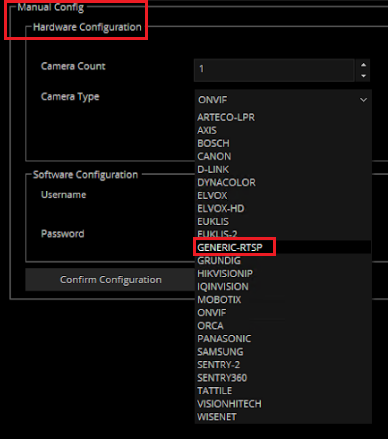

6.  In *Network Configuration*, configure the IP address of the VCAserver as follows:

    -   Tick the box against **Use Single IP Address**
    -   **First IP:** Enter the IP address of the VCAserver.
    -   **Last IP:** Enter the IP address of the VCAserver.
    -   **RTSP Port:** Enter the RTSP Port configured in the VCAserver.
    -   **HTTP Port:** Enter the web port to access the VCAserver.

        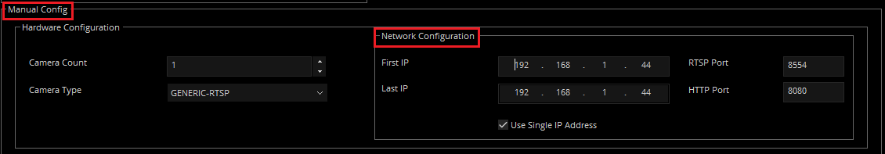

7.  In *Software Configuration*:

    -   **Username:** Enter the username to access the VCAserver.
    -   **Password:** Enter the password to access the VCAserver.
    -   **Base Name:** Type a descriptive name for the VCAserver or its channels.
    -   Then, click **Confirm Configuration** to save the configuration.

        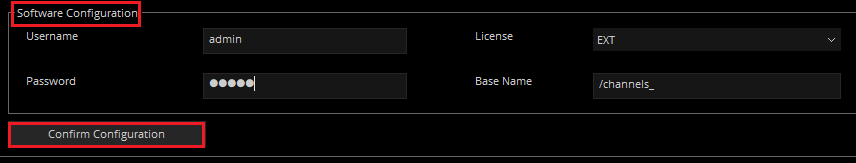

8.  In *Add Recap*, click on **Add Cameras** and **OK** to confirm adding the camera.

    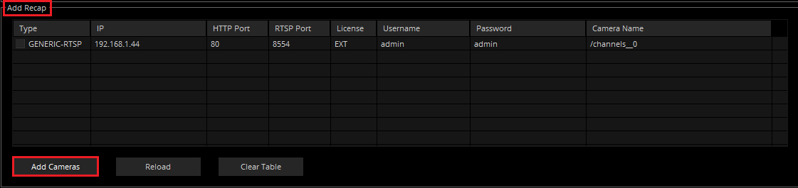

    

9.  Click **OK** to close the window.

    

### Configuring the VCA RTSP Stream

1.  Click on **Video Channels** from the left menu. Then, click on the newly created channel.

    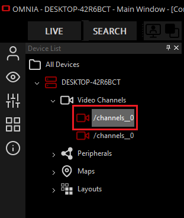

2.  In *Setup and Live*, update the configuration as follows:

    -   **Protocol:** Select **TCP** from the available options.

    -   In *Main Stream*, use `rtsp://<ip>` to type the RTSP URL of the VCA channel. Default format:
        `/channels/<channel id>`. Example `/channels/0`.

        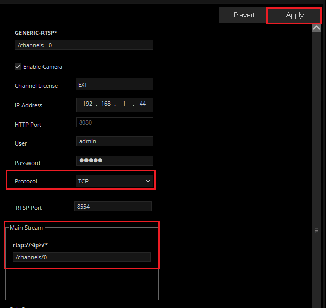

    -   Click **Apply** located top right to save the configuration.

3.  A live image of the camera will be displayed in the preview window.

    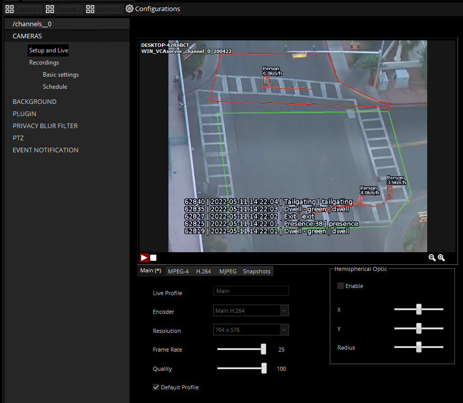

#### Assertions

1.  The VMS displayed the annotated RTSP stream of a VCA channel:

    -   Arteco OMNIA displayed the live image of the VCA channel.
    -   Arteco OMNIA displayed annotations:
        -   Zones.
        -   Objects with bounding box.
        -   VCAserver Event Log: event ID, event time, rule name and rule type.

## Configuring Event Notification

1.  The next step is to configure the event notification. From the configuration page, click on **EVENT NOTIFICATION**.
    Then, click on **Channel Events**.

    

2.  In *Live Event Log*, modify the notification as illustrated below:

    -   **Send To Client:** Tick the box against **All events**.
    -   **Bookmark:** Tick the box against **All events**.
    -   **Status:** Select the status you want to assign to the notifications from the drop-down list.
    -   **Colour:** Select the colour to identify the notifications and click **OK**.
    -   Click **Apply** to save the configuration.

        

## Verifying the VCA Events

When VCAserver triggers an event, a new bookmark will be listed in **Live Event** from the **LIVE** page as follows:

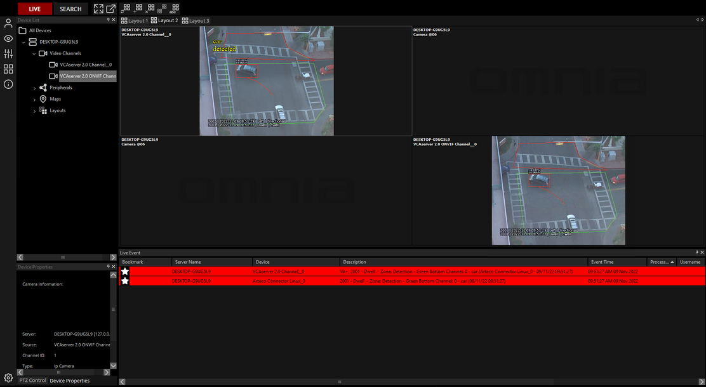

You can also review the event details and recording by clicking on the bookmark:

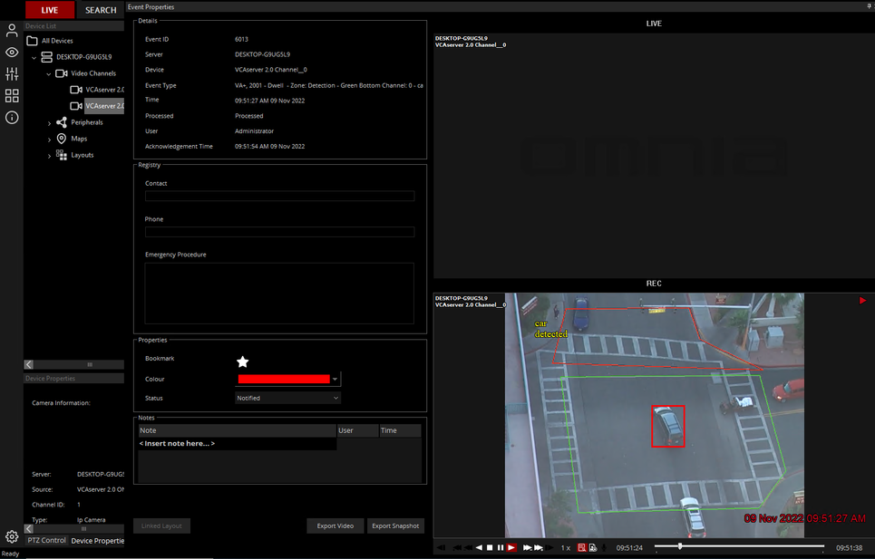

# Configuring the XML Request

## XML Elements Used in the Payload

-   `<?xml version="1.0" encoding="utf-8"?>`: It defines the XML version and the character encoding.
-   `<event>`: The representation of an Arteco event (root tag).
-   `<number>`: Used by the device in order to identify each event with an Identifier.
-   `<description>`: Used by the server in order to display the event information in the Arteco Omnia application.
-   `<client-time>`: The time of the event.
-   `<connector id="1">`: This ID is used inside the Arteco server and needs to match the Connector ID created within
    the Next server.
-   `<cameras>`: An element that contains information associated with the camera.
-   `<camera id="1">`: The ID of the camera you want to display in the Connector.
-   `<icon id="1">`: ID of the icon to be used in the Connector.
-   `<persistance>`: Indicates how long will the ROI last on screen (default value `PT4.00S`).
-   `<start-time>`: The ROI will start at this moment in the recording.
-   `<dimensions>`: The X and Y coordinates of the up-left corner of the ROI. They will be followed by the width and
    height of the ROI.
-   `<content>`: This tag can be used to superimpose a text on the recording playback.
-   `<color>`: Respectively stroke type, colour and thickness of the line of ROI.
-   `<data-block position="0">`: This block can contain plain text or HTML.
-   `<text>`: This block can contain plain text or HTML.

### Template of the XML Request With VCA Tokens

```XML
<?xml version="1.0" encoding="utf-8"?>
<event
  xmlns:xsi="http://www.w3.org/2001/XMLSchema-instance"
  xmlns:xsd="http://www.w3.org/2001/XMLSchema" id="0"
  xmlns="http://www.arteco-global.com/"
>
<number>{{id}}</number>
<description>
  {{#Zone}}Zone
  {{name}}{{/Zone}}{{#Object}}{{#DLClassification}},
  DL {{class}}{{/DLClassification}}
  {{/Object}}
</description>
<client-time>{{start.iso8601}}</client-time>
<connector id="1">
<cameras>
<camera id="1">
<icon id="18" />
<text>VCA event: {{name}}</text>
<overlay>
<roi-sequence>
<roi id="0">
<persistance>PT4.00S</persistance>
<start-time>{{start.iso8601}}</start-time>
<dimensions
  x="{{#Object}}{{outline.rect.top_left.x}}"
  y="{{outline.rect.bottom_right.y}}"
  width="{{width}}"
  height="{{height}}{{/Object}}"
/>
<stroke>
<color>#FFFF0000</color>
<line-type>solid</line-type>
<size>2</size>
</stroke>
</roi>
</roi-sequence>
<osd-text>
<content>
  {{#Object}}
    {{#DLClassification}}DL: {{class}} - {{/DLClassification}}
  {{/Object}} detected
</content>
<font color="#FFFFFF00" background="#00FFFFFF" />
<displacement x="10" y="10" />
</osd-text>
</overlay>
</camera>
</cameras>
<data-block position="0">
<text><![CDATA[
<HEAD><TITLE>new</TITLE>
<META content="text/html; charset=ISO-8859-1" http-equiv=content-type>
<STYLE type=text/css>
p {
margin-bottom: 0;
margin-top: 0;
}
body
{
background-color: #464655;
color: white;
font-family: verdana;
}
</STYLE>
<META name=GENERATOR content="MSHTML 11.00.10570.1001"></HEAD>
<BODY>
<P>
<FONT size=5>
{{#Zone}}Zone Name: {{name}}{{/Zone}}<br>
Rule: {{name}}<br>
{{#Object}}{{#DLClassification}}DL-Classification: {{class}}{{/DLClassification}}<br>
{{#Speed}}Speed: {{value}}Km/h{{/Speed}}{{/Object}}<br><br>
Event time: {{start.iso8601}}
Source: {{host}} - {{ip}}
</FONT>
</P>
</BODY>
]]></text>
<image>
<url />
<username />
<password />
</image>
</data-block>
<io />
<web />
</connector>
</event>
```
