# Introduction

## Prerequisites

-   VCAserver version 2.4.2 or greater.
-   Avigilon ACC7 or greater.

## Supported Features

-   ONVIF Events (appear, disappear, enter, exit, tailgating, loitering).
-   RTSP streams.

## Architecture

Avigilon ACC will connect to VCAserver and its channels to consume the ONVIF events from the rules.

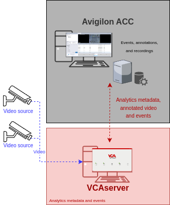

# VCAserver Configuration

## Confirming the ONVIF port used for transmitting video footage

Check, and change if required, the web port used by VCA for external connections to the channels within the VCA
service.

1.  From the main screen, click the **system cog** in the top right.

    

2.  Then, click on **System**.

    

3.  In **Network Settings**, you can see the Web port used by the VCAserver to send the video of its channels.
    Change it if necessary and click **Save**.

    

## Enabling ONVIF

1.  Navigate to **ONVIF** and tick the box against **Enabled** to enable the feature

    

    *Note: ONVIF runs on the web server port (whatever that may be). This is the same port the user configured*
    *previously.*

## Creating a Channel

Configure the VCAserver as required with the appropriate channel and rules. A basic setup is detailed below as
an example:

1.  Configure a source to connect to a camera.

    _Note: the recommended settings for the camera stream to VCA is a maximum resolution of D1 (640 x 480) with a frame_
    _rate of 15 frames per second. A lower resolution and frame rate will reduce the analytic accuracy, a higher_
    _resolution and frame rate will result in high CPU usage and can reduce analytical accuracy._

2.  Select the **Tracking Engine** to identify objects in the scene.

3.  Create a **Zone** for the channel.

4.  Add **Rules** to trigger an event on object detection in the zone.

    

For more information on creating and configuring channels in VCA please refer to the
[VCA core manual 2.4](https://documentation.vcatechnology.com/).

# Avigilon ACC Configuration

## Discovering Devices

1.  By default, Avigilon ACC automatically scans for new devices. If successfully scanned, the Discovered Devices window
    will pop-up. Verify 'VCAserver' is listed and click **Connect**.

    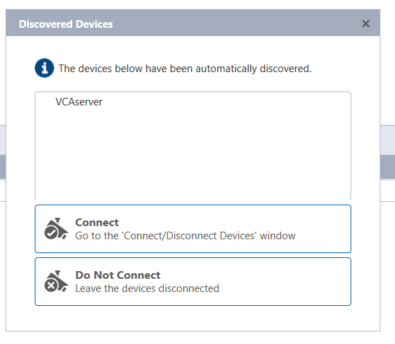

2.  In the *Connected Devices* table at the bottom, click **Connect...** to connect VCAserver to Avigilon ACC.

    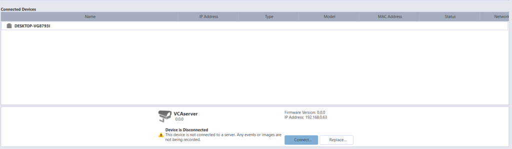

3.  The *Connect Device* window will pop-up. Verify and confirm the **Properties** and click **OK**.

    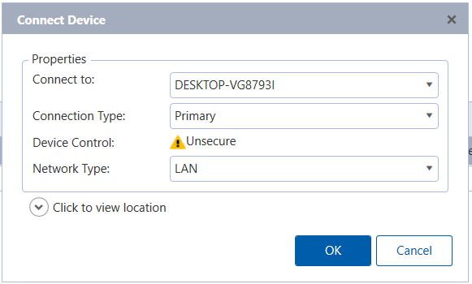

4.  Verify that the connection status in the table indicates 'Connected'.

    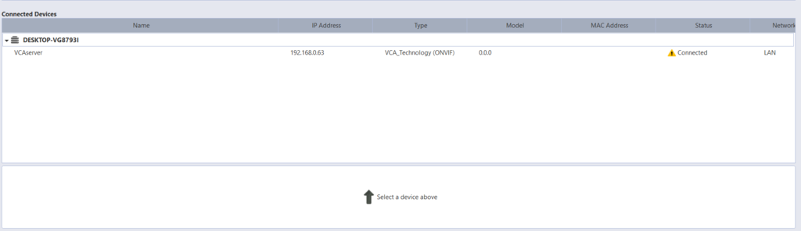

5.  A live image of the camera will be displayed in the *Live* page.

    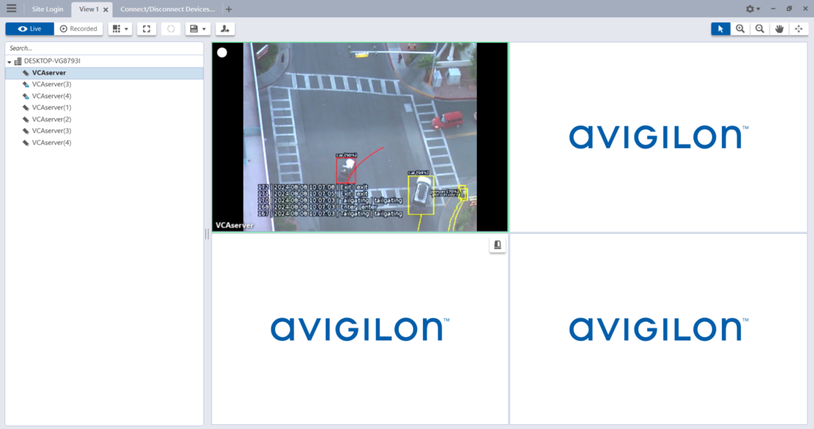

    _Note: VCAserver will have to be added manually if the device is not discovered on the network._

### Adding a Camera Manually

1.  Click **Find Device..** on the top left to add a new device manually.

    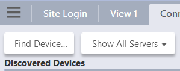

2.  In *Find Device*, adjust the table as illustrated below:

    -   **Device Type**: Select **ONVIF** from the drop-down list.
    -   **IP Address/Hostname**: Enter the IP Address or hostname to connect to the VCAserver.
    -   **Control Port**: Enter the web port configured in VCAserver.
    -   **User Name**: Enter the username to access the VCAserver.
    -   **Password**: Enter the password to access the VCAserver.
    -   Click **OK** to confirm the connection.

        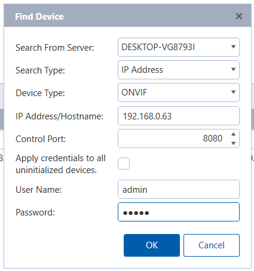

3.  Verify that the connection status in the table indicates 'Connected'.

## Subscribing to ONVIF Events

1.  Click on the **New Task** icon at top left to enable the side menu.

    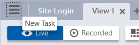

2.  Navigate to the *Manage* section and click **Site Setup**.

    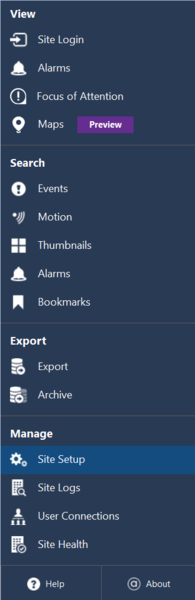

3.  Select the VCAserver you want to get the ONVIF events from and click **ONVIF Event Subscription**.

    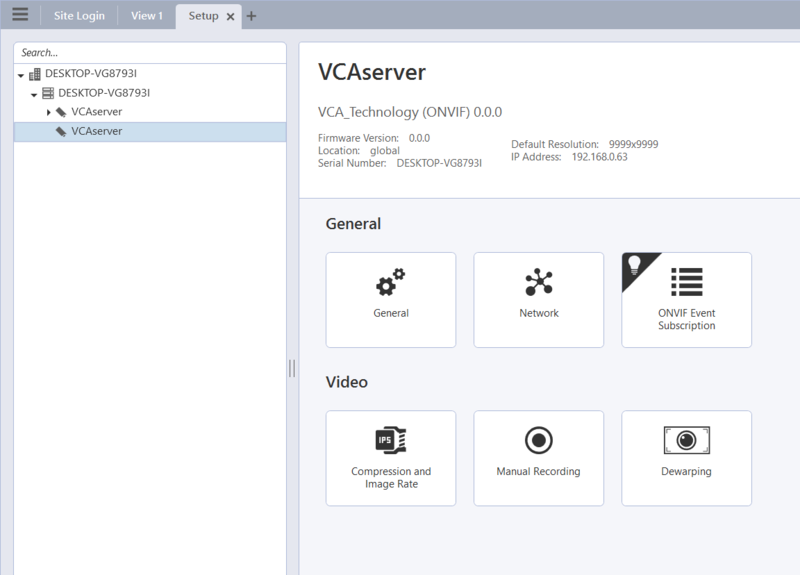

4.  Click **Add** to subscribe to a new event as a rule trigger or motion event. Then, select the corresponding rule
    from the available drop-down list and click **OK** to confirm.

    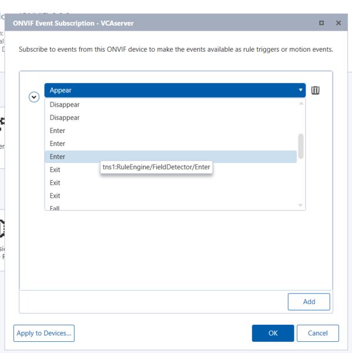

    _Note: You can hover over each event to verify the required ONVIF event type._

    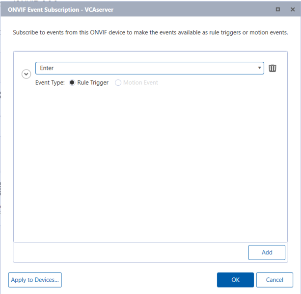

## Creating Alarms

1.  From the *Setup* view, click on the Avigilon server name to display the main menu.

    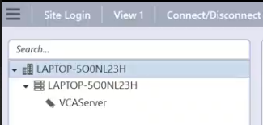

2.  Click **Alarms**.

    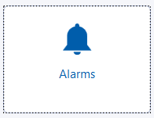

3.  In the pop-up window, click **Add** to create a new alarm. _Note: A basic setup is detailed below as an example._

    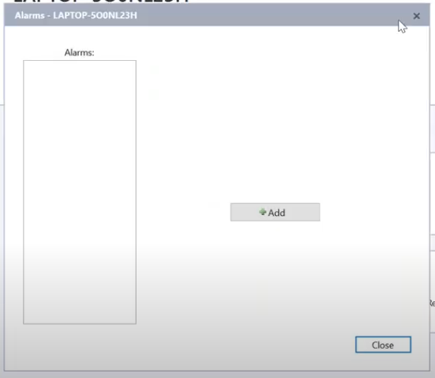

    -   **Select Alarm Trigger Source**: Select **External Software Event** from the drop-down list. Then, click
        **Next**.

        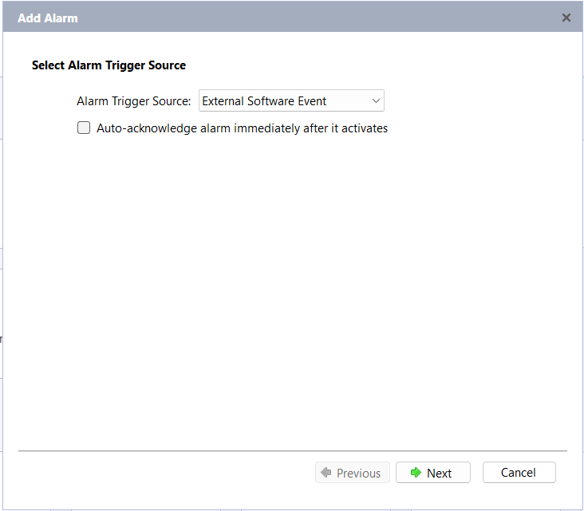

    -   **Select Linked Devices**: Tick the box against VCAserver and click **Next**.

        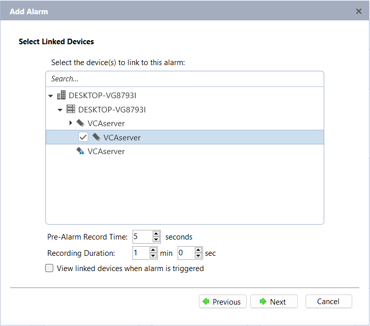

    -   **Select Alarm Recipients** and click **Next**.

        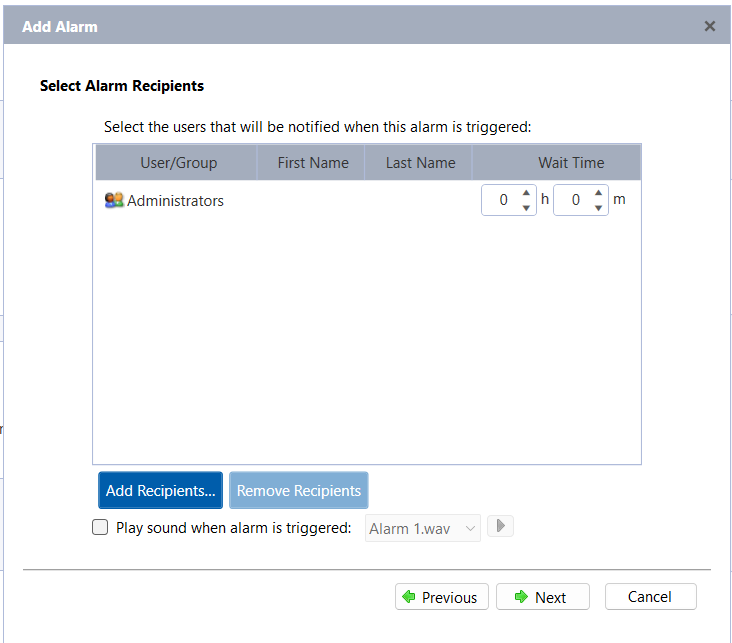

    -   **Select Alarm Acknowledgement Action** if required and click **Next**.

    -   Enter a descriptive **Name** and click **Finish** to confirm creating the alarm. Then click **Close** to close
        the window.

        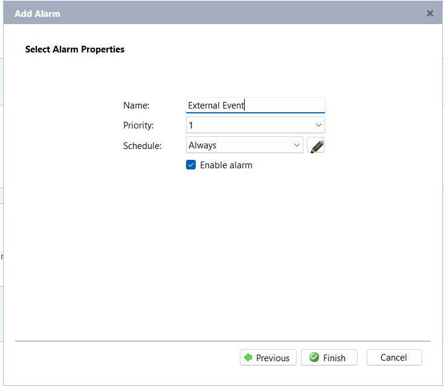

## Creating Rules

1.  From the *Setup* view, click on the Avigilon server name to display the main menu.

    

2.  Click **Rules**.

    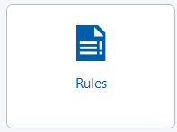

3.  In the pop-up window, click **Add** to create a new rule.

    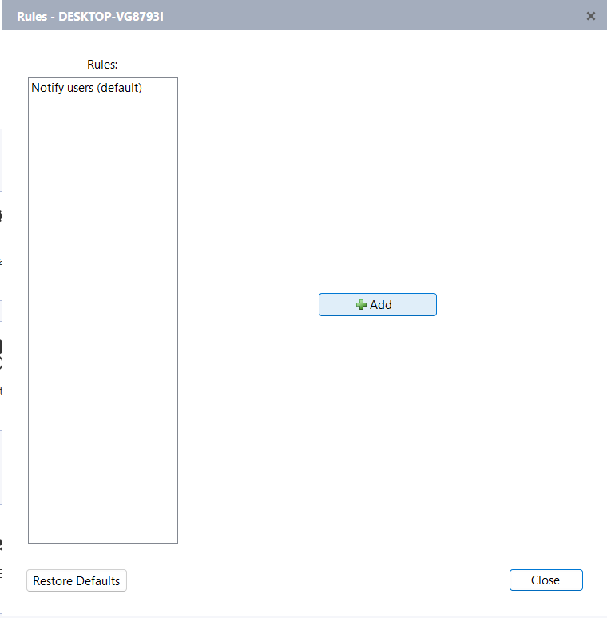

4.  In *Rule Setup*, select the event(s) that will trigger the rule action. Navigate to **Device Events** and select
    **ONVIF event started** from the available list.

    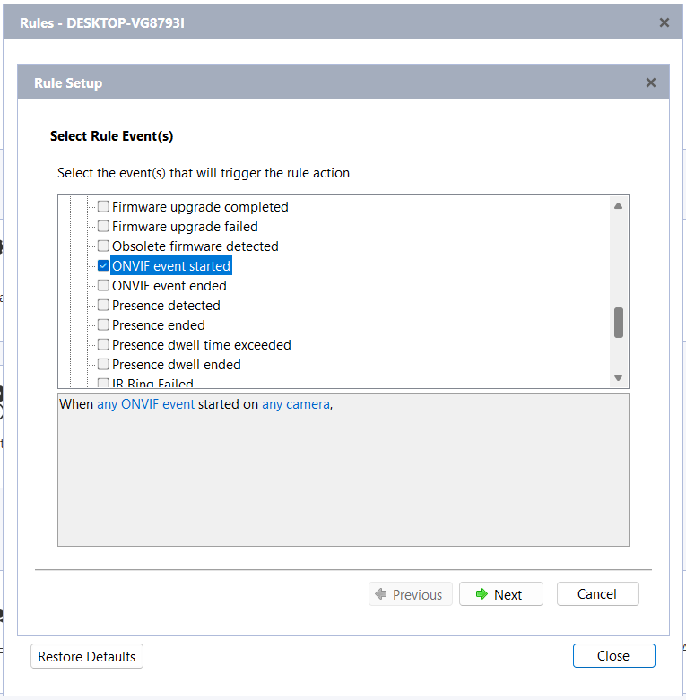

5.  Adjust the rule as follows:
    -   **When any ONVIF event**: Select the ONVIF event you want to get alarms from and click **OK**. _You can select_
        _any ONVIF event or tick the box against a specific rule._

        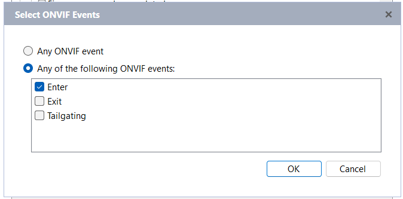

    -   **started on any camera**: Select the cameras and click **OK** to confirm. _You can select any camera on tick_
        _the box against a specific device._

        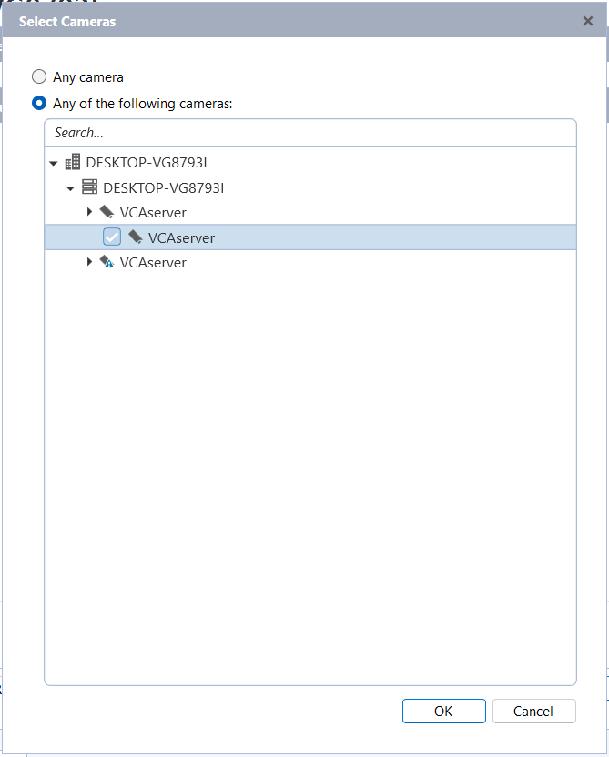

    -   Click **Next**.

        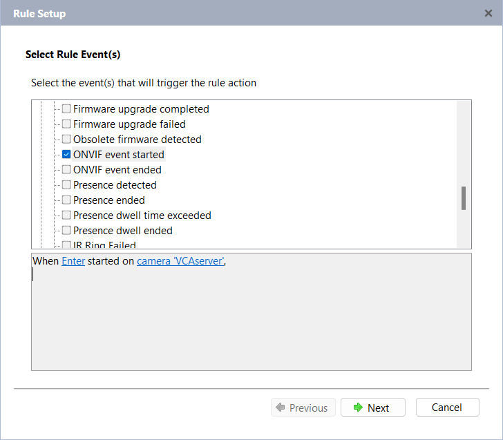

    -   Select the Rule Action(s). Navigate to *Alarm Actions* and tick the box against **Trigger an alarm**.

        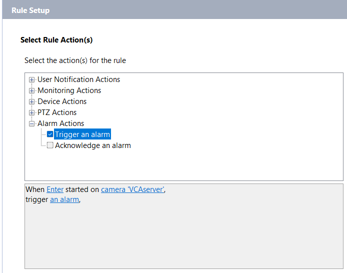

    -   Adjust the alarm as follows:
        -   **trigger an alarm**: Select the alarm created previously and click **OK**.

            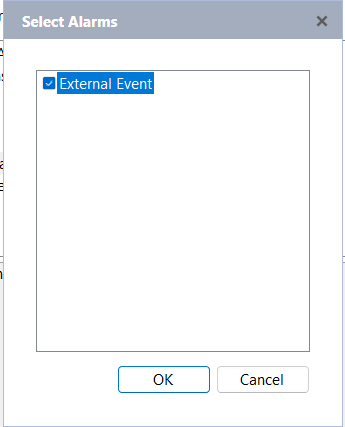

    -   Click **Next**.

    -   Add **Rule Condition(s)** if required and click **Next**.

    -   Enter a descriptive **Name** and click **Finish** to confirm creating the alarm. Then click **Close** to close
        the window.

        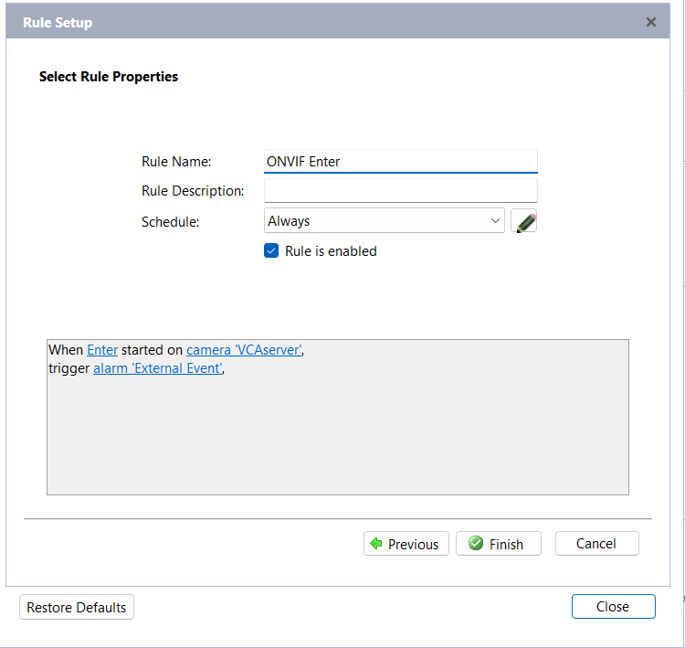

## Reviewing Alarms and ONVIF Events

### Alarms

1.  Click on the **New Task** icon at top left to enable the side menu.

2.  Navigate to the *Search* section and click **Alarms**.

    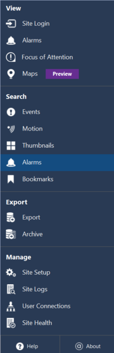

3.  Select the *Alarms to Search* and *Date Range* to display the results.

    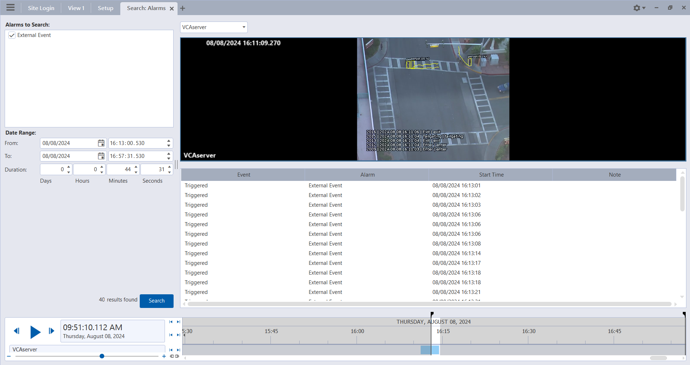

### ONVIF Events

1.  Click on the **New Task** icon at top left to enable the side menu.

2.  Navigate to the *Search* section and click **Events**.

    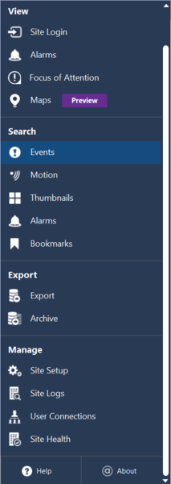

3.  Tick the box against the *Camera(s) to Search*, select the *Date Range* and tick the box against **ONVIF** from the
    *Events to Search for* list to display the results.

    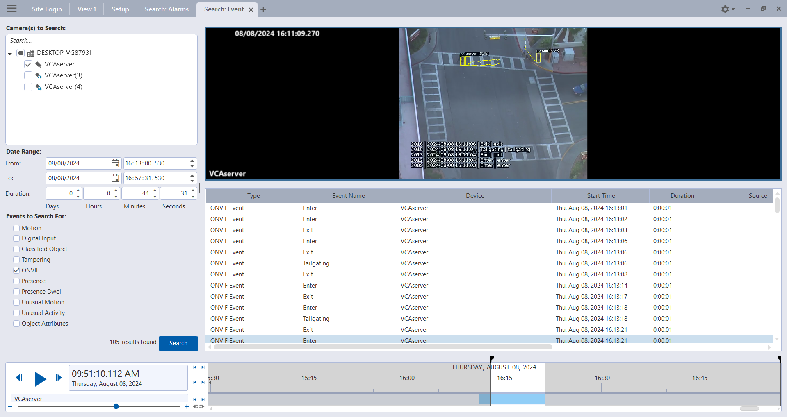

# Troubleshooting

## VCAserver Cannot Be Connected

If one of the VCA channels is not processing any video correctly (or displaying an error message), Avigilon ACC will
abort the the entire process of adding 'VCAserver', even if it can successfully stream from the other channels and the
message _'A communication error occurred while trying to connect to the device'_ will pop-up on the screen.

1.  Ensure the camera RTSP stream connection is correct and all the VCA channels are processing video as expected.

2.  Reconnect to the device as illustrated in the [configuration](#discovering-devices) section.

_Note: If a VCA channel goes down temporarily after successfully adding the device, the integration will continue to_
_work as expected once the channel returns online._
