# Introduction

## Prerequisites

-   VCAserver version 2.4.2 or greater.
-   Axxon One VMS version 4.1 or greater.

## Supported features

-   TCP events with metadata available via tokens.
-   Annotated RTSP.

## Architecture

In this web UI integration, the Axxon Next VMS receives the annotated RTSP stream from the VCAserver and the alarms
are sent through the TCP action with VCA tokens containing details about the event.

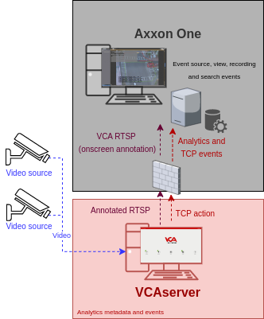

# VCAserver Configuration

## Confirming the RTSP port used for transmitting video footage

Check, and change if required, the RTSP port used by VCA for external connections to the channels within the VCA
service.

1.  From the main screen, click the **system cog** in the top right.

    

2.  Then, click on **System**.

    

3.  In **Network Settings**, you can see the RTSP port used by the VCAserver to send the RTSP stream of its channels.
    Change it if necessary and click **Save**.

    

    _Note: The syntax for connecting to these channels is:_ `rtsp://<device_ip>:<RTSP_port>/channels/<channel_id>`.

    Example: `rtsp://192.168.1.10:8554/channels/27`.

## Creating a Channel

Configure the VCAserver as required with the appropriate channel and logical rules. A basic setup is detailed below as
an example:

1.  Configure a source to connect to a camera.

    _Note: the recommended settings for the camera stream to VCA is a maximum resolution of D1 (640 x 480) with a frame_
    _rate of 15 frames per second. A lower resolution and frame rate will reduce the analytic accuracy, a higher_
    _resolution and frame rate will result in high CPU usage and can reduce analytical accuracy._

2.  Configure a **zone** for the channel.

3.  Configure **rules or filters** to trigger an event on object detection in the zone.

    

4.  Note the **Channel ID** as this will be needed when connecting to the RTSP stream from the Axxon server.

    _Note: The channel ID can be located at the bottom of the channels menu._

    

For more information on creating and configuring channels in VCA please refer to the
[VCA core manual 2.4](https://documentation.vcatechnology.com/).

## Creating an Action

1.  Click the **system cog** in the top right to access the settings.

    

2.  Click **Edit Actions**.

    

3.  Then, click **Add Action** and select **TCP** from the list of available actions.

    

4.  Enter a descriptive name for the action.

5.  Click the arrow on the right of the action to expand the TCP configuration options.

    -   **URI**: Enter the IP address of the Axxon server.
    -   **Port**: Enter the TCP port configured for the Event Source of Axxon.
    -   **Body**: Select **Custom** from the drop-down menu and add some tokens.
    -   **Sources**: Click **Add Source +** to display a list of the available rules and filters and select the rules
        created for the source you want to send to the Axxon server.

        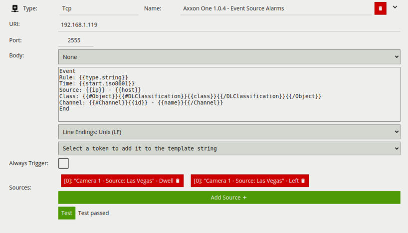

For this integration, the following Tokens were used to send an alert containing information on the camera, zone and
rule type that triggered the event and time.

Where:

-   Event: Represents the beginning of the message configured for the Event Source in Axxon.
-   `{{start.iso8601}}`: The start time of the event. The `iso8601` property is a date string in the ISO 8601 format.
-   `{{ip}}`: The IP address of the device that generated the event.
-   `{{host}}`: The hostname of the device that generated the event.
-   `{{#Channel}}{{id}}{{/Channel}}`: The id of the channel that the event occurred on.
-   `{{#Channel}}{{name}}{{/Channel}}`: The name of the channel that the event occurred on
-   `{{#Object}}{{#DLClassification}}{{/DLClassification}}{{/Object}}`: The classification generated by a deep learning
    model (e.g. Deep Learning Filter or Deep Learning Object Tracker). This token is a property of the
    object token. The algorithm must be enabled in order to produce this token. It has the following sub-properties:
    -   `{{class}}`: What the object has been classified as (person, vehicle).
-   End: Represents the end of the message configured for the Event Source in Axxon.

# Axxon One Configuration

## Configuring the VCAserver

First, we configure a new device into the system.

1.  From the **Configuration management** page, click **Devices** located top. Then, click **Add device...** in the left
    menu.

    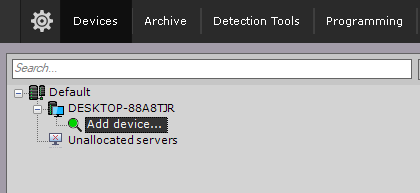

2.  In the **Add device...** page, configure the new device as follows:

    -   **Vendor**: Select **RTSP** from the drop down list.
    -   **Model**: Select the number of channel you want to configure.
    -   **IP Address**: Enter the RTSP URL of the VCA channel. In general form, the address is as follows:
        `rtsp://<IP_address>/<channels>/<channel_id>`.
    -   **Port**: Enter the RTSP port configured in the VCAserver.
    -   Enter the **username** and **password** to access the VCAserver.
    -   **ID**: Enter an ID for the device.
    -   **Name**: Enter a descriptive name for the device.
    -   Click the green plus **+** button on the right side to add the new device.

        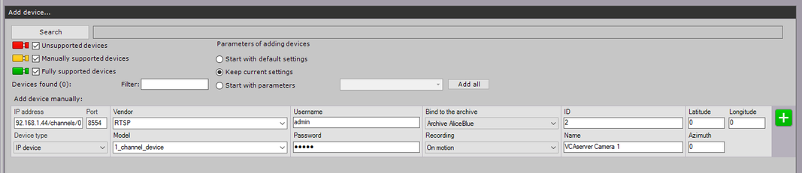

3.  Click **Apply** located bottom to confirm the settings.

### Verifying the VCA RTSP Stream

1.  Click the new device in the left menu and click the 'plus' on the left of the device to expand the configuration
    options and select the camera.

    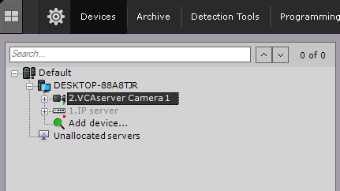

2.  ​The preview window will display a live image of the VCA channel alongside the settings.

    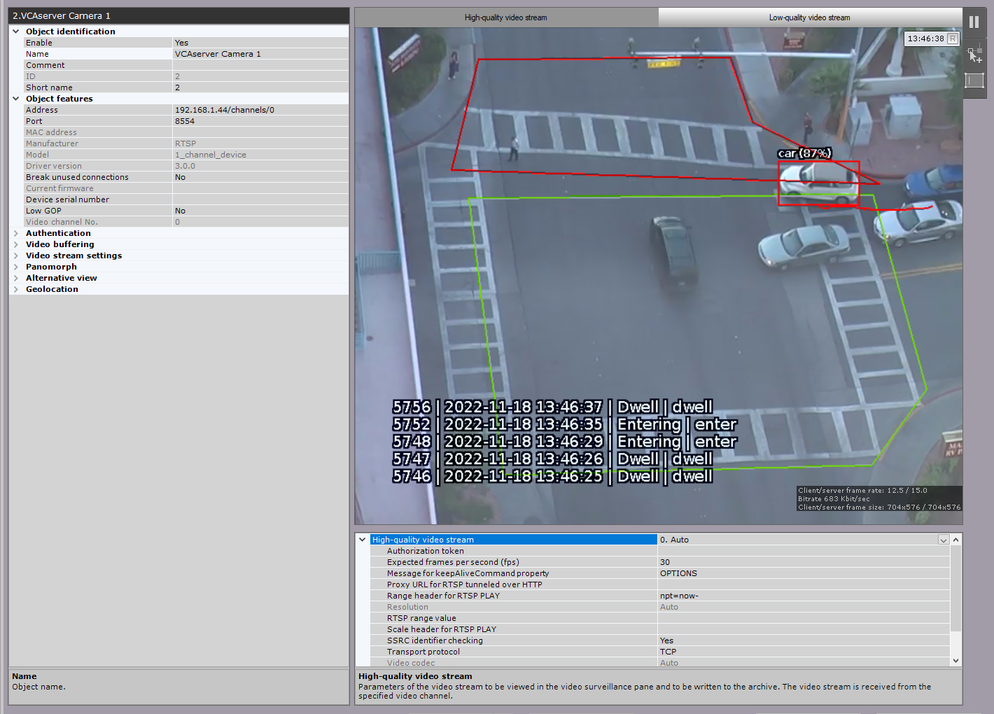

## Adding the Event Source

Now, we add the Event Source that will receive the TCP events from the VCAserver.

1.  Click **Add device** in the left menu.

    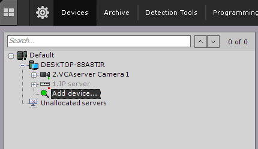

2.  In the **Add device...** page, configure the new device as follows:

    -   **Device Type**: Select Event Source form the drop down menu.

        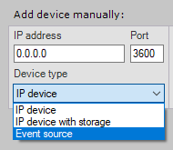

    -   **Vendor**: Select `POSLegacy` from the drop down list.
    -   **IP Address**: Enter the IP address of the Axxon server.
    -   **Port**: The default port is **2555**.
    -   **ID**: Enter an ID for the Event Source.
    -   **Name**: Enter a descriptive name for the device.
    -   Click the green plus **+** button on the right side to add the new device.

        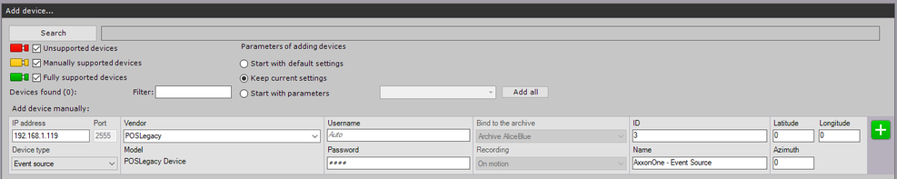

3.  Click **Apply** located bottom to confirm the settings.

### Configuring the Event Source

1.  Click the new Event Source device in the left menu.

    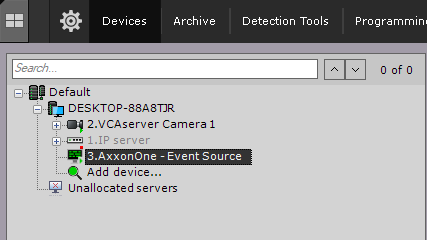

2.  In the **Event Source** page, configure **Other** as follows:

    -   **Transport Protocol**: Select **TCP** from the available options.
    -   **Port** The default port of the Event Source device _(this is the same port configured in the TCP action of_
        _the VCA server)._

    -   Select the **Font** and **Colour** as required.

        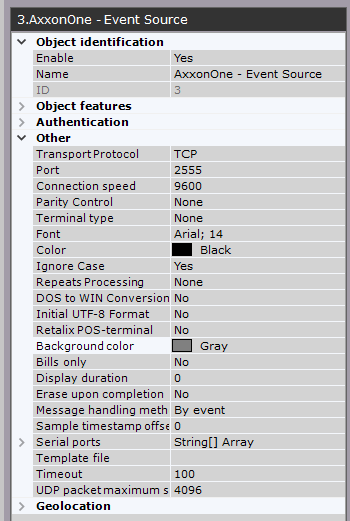

    -   In **Adjust text area**, adjust the red box and opacity accordingly _(the text will appear as an overlay on the_
        _video)._

        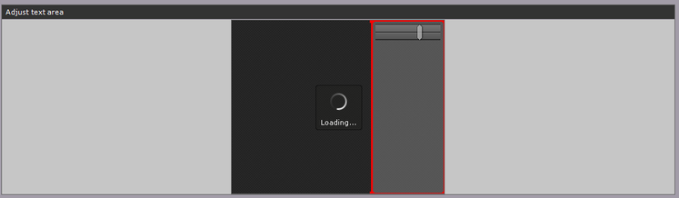

    -   In **Video sources**, select the device that will display the events as an overlay.
    -   In **Beginning words**, enter the word that represents the beginning of the events.
    -   In **End words**,  enter the word that represents the end of the events.

        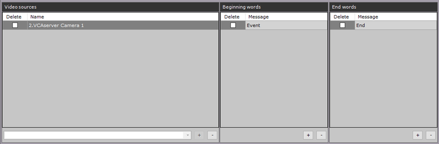

    -   In **Word highlighting**, enter the words you want to highlight when the events occur and select a colour to
        identify them.

        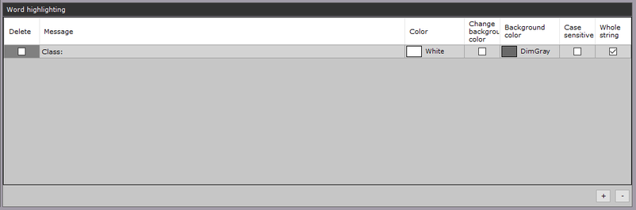

3.  Click **Apply** located bottom to confirm and save the settings.

_Make sure the port is opened on all intermediate firewalls and not used by any other software on the server machine._

## Verifying VCA Events

Click the **Live page** button located top left.

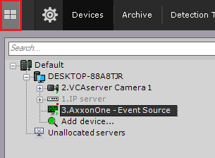

Then, validate that the VCA events are shown as an overlay in the video (click top left corner of the channel and select
**Event Source** from the list)

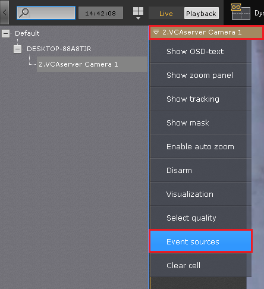

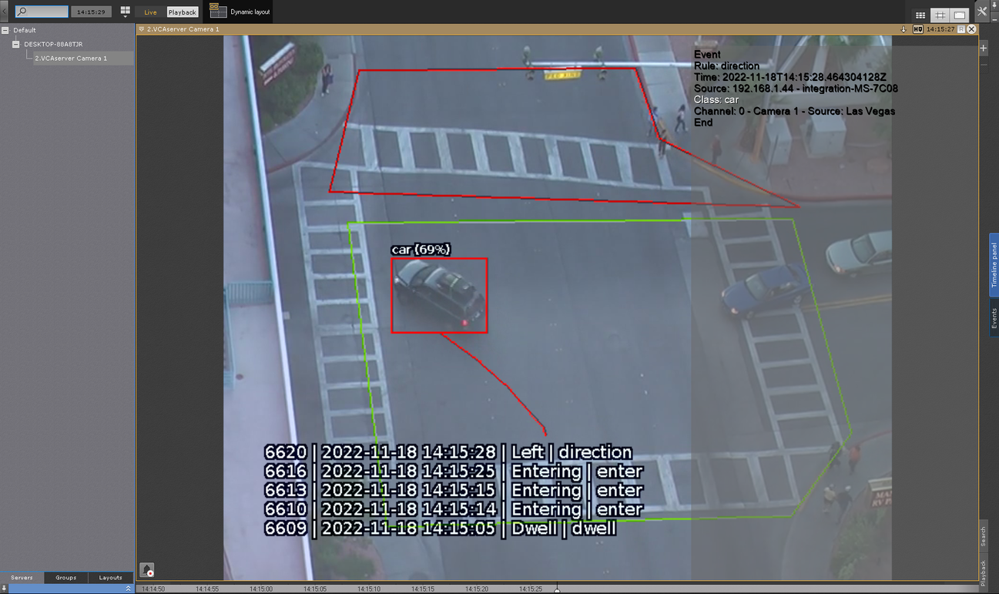
