# Introduction

## Prerequisites

-   VCAserver version 1.4 or greater.
-   Digifort Enterprise VMS version 7.3.0.

## Supported features

-   VCA JSON metadata: Event name, rule name, Region of Interest (ROI)/Zone, Object Class, Camera/Source, Date.
-   Annotated RTSP stream.

## Architecture

Digifort will connect to the VCA channels to consume the metadata provided. The integration does not require the
configuration of VCAserver actions to send events to the VMS. The only requirement is that VCA rules are defined.

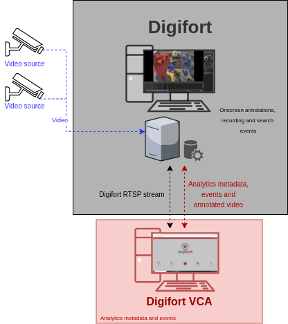

## VCAserver Configuration

### Confirming the RTSP port used for transmitting video footage

Check, and change if required, the RTSP port used by VCA for external connections to the channels within the VCA
service.

1.  From the main screen, click the **system cog** in the top right.

    

2.  Then, click on **System**.

    

3.  In **Network Settings**, you can see the RTSP port used by the VCAserver to send the RTSP stream of its channels.
    Change it if necessary and click **Save**.

    

    _Note: The syntax for connecting to these channels is:_ `rtsp://<device_ip>:<RTSP_port>/channels/<channel_id>`.

    Example: `rtsp://192.168.1.10:8554/channels/27`.

### Creating a Channel

The next step is to add the RTSP stream of the camera configured in Digifort within the VCAserver.

1.  In the **View Channel** page, click the plus **(+)** button to add a new video source.

    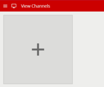

2.  In the **Video Sources** page, click the **Add Video Source** button and select **RTSP** from the available sources.

    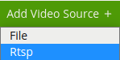

3.  Configure the RTSP source as follows:

    -   **Name:** Enter a descriptive name for the new video source.
    -   **URI:** Enter the default RTSP stream URL to request live video from a Digifort camera.
    -   **User ID:** Enter the username to access the Digifort server.
    -   **Password:** Enter the password to access the Digifort server.
    -   If required, **enable** Enable Keep-alive and Use RTP over TCP.

        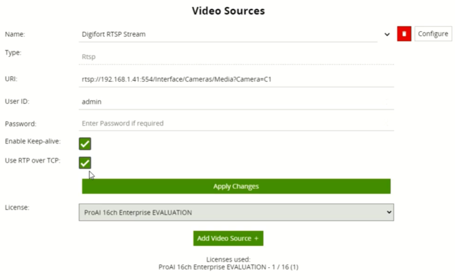

    _Note: the recommended settings for the camera stream to VCA is a maximum resolution of D1 (640 x 480) with a frame_
    _rate of 15 frames per second. A lower resolution and frame rate will reduce the analytic accuracy, a higher_
    _resolution and frame rate will result in high CPU usage and can reduce analytical accuracy._

    The syntax used to connect to a camera from Digifort is:
    `rtsp://<server_address>:<rtsp_port>/Interface/Cameras/Media?<argument=value>[&<argument=value>...]`

    Where:
    -   `<server_address>`: The IP address of the Digifort server.
    -   `<rtsp_port>`: The RTSP port configured in Digifort.
    -   `/Interface/Cameras/Media?`: Endpoint to the RTSP stream of the camera configured in Digifort.
    -   `<argument=value>`: The arguments are: the name of the camera or the media profiles types (recording,
        visualization or custom).

        **Example:** rtsp://192.168.1.100:554/Interface/Cameras/Media?Camera=D1

#### Configuring a Channel

Now, we calibrate the video and configure the zone and the rules that will trigger the events in the channel.

1.  From the **View Channels** page, click the previously added source.

    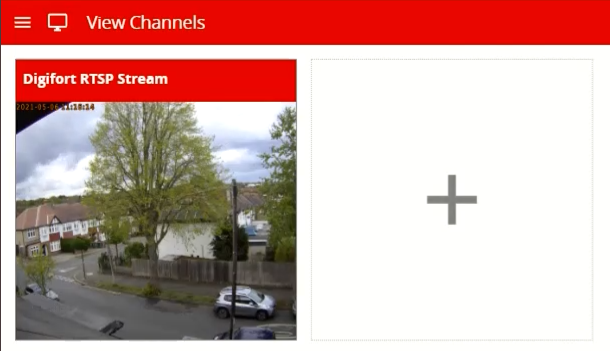

2.  In the channel settings page, click **Calibration** in the right menu.

    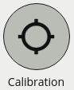

    -   **Enable** the option and use the mimics to match up with people or objects in the scene to help calibrate.
        They represent a height of 1.8 meters.

        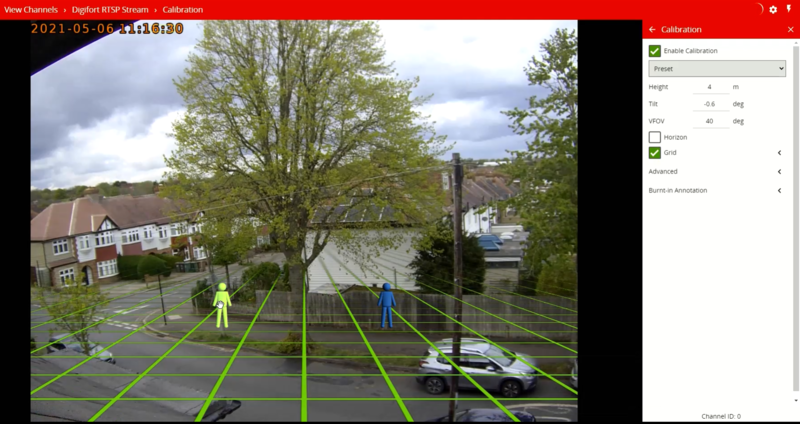

        _Calibration is required to allow the classification with the standard Object Tracker. If you are using DL_
        _Object/People Tracker then no calibration is required_.

3.  Return to the channel settings page and click **Zones** in the right menu.

    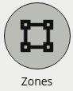

    -   Click **Create Zone +** located top right to create a detection zone.
    -   Position the zone and change the shape as required. You can add/remove nodes to create complex shapes.
    -   Enter a descriptive name for the zone and apply any colour to identify it.

        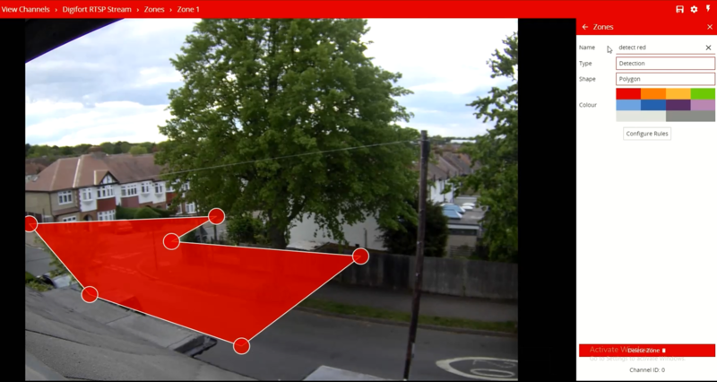

    -   Then, click the **Configure Rules** button below to go to the rules settings page.

        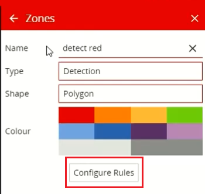

4.  In the **Rules** page, click **Add Rule +** located top right.

    -   Select the rule that will trigger the events.
    -   Attached the zone to the rule.
    -   Modify its properties as required.

        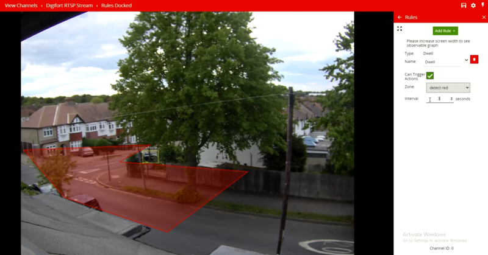

5.  Note the **Channel ID** as this will be needed when connecting to the channel from the Digifort analytics.

    _Note: The channel ID can be located at the bottom of the channels menu._

    

For more information on creating and configuring channels in VCA please refer to the VCA core manual 1.5.

## Digifort Enterprise Client Configuration

### Adding a New Camera

First, we configure a new camera/device in Digifort.

1.  Click **Recording Server** in the left menu.

    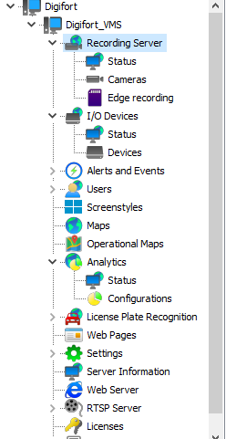

2.  Then, click **Cameras** and **Find** located bottom.

3.  In the **Media devices finder** window, click **Start** to search for any IP camera on the network.

4.  Select the camera you want to add. Then, click **Add selected device** located bottom.

    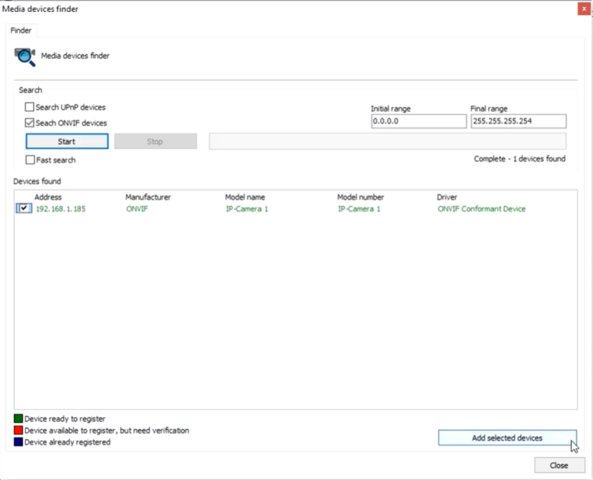

5.  In the **Camera registration** window, configure the new device as follows:

    -   **Camera Name:** Enter a descriptive name for the camera.
    -   **Camera description:** Enter a description for the camera.
    -   **User:** Enter the username to access the camera.
    -   **Password:** Enter the password to access the camera.
    -   **Recording Directory**: Configure the path for the recording.

        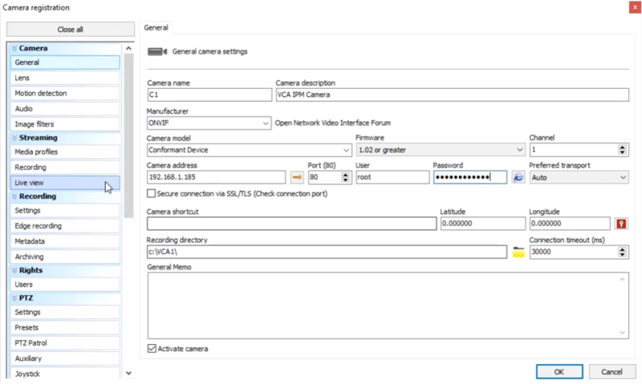

#### Configuring Media Profiles

1.  In **Streaming**, click **Media profiles** in the left menu.

    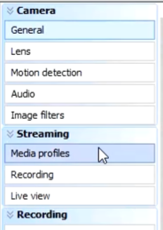

2.  Then, click **Recording** in the right side.

    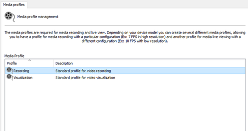

    -   Verify the **Video Settings** and click **Preview** to display a live image of the camera.

        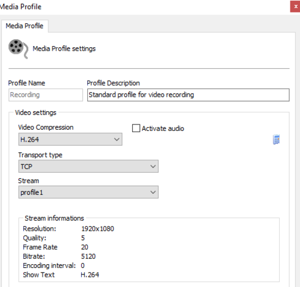

        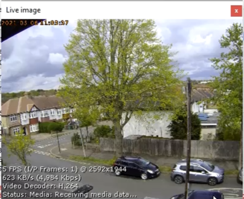

3.  Click **OK** to close the Media Profiles window.

4.  Click **Close** to close the Media device finder window.

### Configuring Analytics Monitoring

Next, we configure the analytics in Digifort.

1.  Click **Analytics** in the left menu. Then, click **Configurations**.

    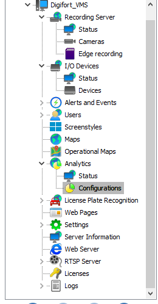

2.  Click **Add** located bottom.

3.  In the **Analytics configuration registration** window, configure the analytics as follows:

    -   **Name:** Enter a descriptive name.
    -   **Description:** Enter a description for the element.
    -   **Camera**: Select the camera configured in the VCAserver.
    -   **Processing type:** Select **Processing analytic on the external server** from the drop down menu.
    -   **Type:** Select **VCAserver** from the drop down menu.
    -   **Version:** Select **1.0.1**.
    -   **Server Address:** Enter the IP address of the VCAserver.
    -   **Port:** Enter the web port configured in the VCAserver.
    -   **User:** Enter the username to access the VCAserver.
    -   **Password:** Enter the password to access the VCAserver.
    -   **ID:** Enter the ID of the VCA channel you want to get the metadata from.

        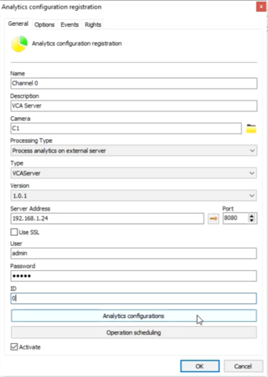

4.  Click **Analytics configurations** below. Then, you will see the rules triggered in the VCAserver.

    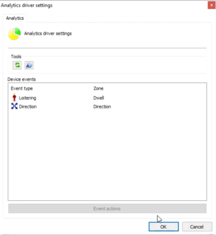

5.  Click **OK** to close the Analytics window.

### Configuring the VCA Web Interface

1.  Click **Web Pages** in the left menu.

    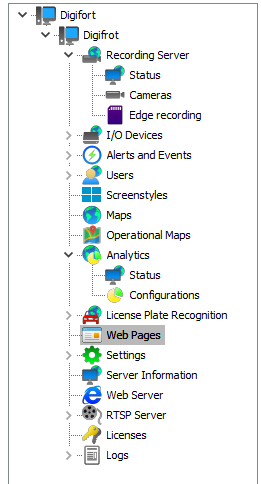

2.  Click **Add** located bottom.

3.  In the **Web Page Registration** window, configure the web page as follows:

    -   **Name:** Enter a descriptive name for the web page.
    -   **Description:** Optionally, enter a description for the web page.
    -   **URL:** Enter the web URL to access the VCAserver. Example `http://<user>:<password>@<IPaddress>:<web_port>`

        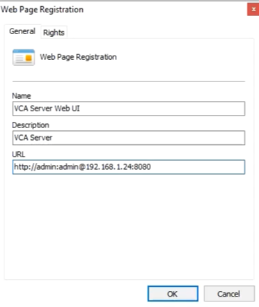

    -   Click **OK** to close the window.

### Verifying VCA Events on the Surveillance Client

From the Digifort Surveillance Client, you can verify the VCA events, the annotated stream and monitor the web
interface just dragging the camera, analytics and web page components from the right menu to the centre.

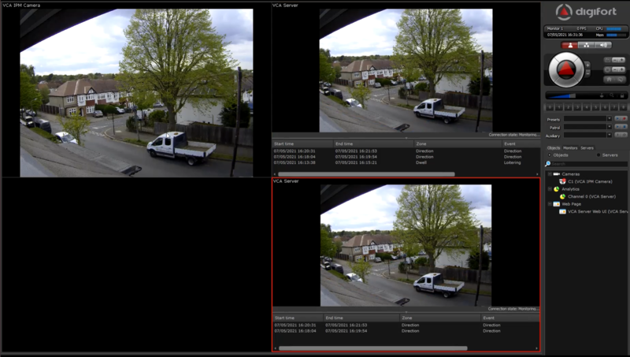
