# Introduction

## Prerequisites

-   Digifort Enterprise version 7.4.1 or greater.
-   Digifort Analytics version 7.4.1 or greater.

## Supported features

-   VCA is installed together with Digifort Enterprise and no additional installation is required.
-   VCA on-screen metadata is present in the Digifort Surveillance Client for the user to see tracked objects and
    triggered rules in live view.

-   Detection zones and lines.
-   Counting lines.
-   Object abandoned.
-   Object appear/disappear.
-   Object enter/exit.
-   On-screen counters.
-   Object direction.
-   Object dwell.
-   Object speed.
-   Object stop.
-   Object tailgating.
-   Logical rule events.
-   Filters.
-   Deep Learning.

# Digifort Enterprise Administration Client Configuration

## Adding a Camera

First, we add a new camera into the Digifort Enterprise client.

1.  Click **Recording Server** in the left menu.

2.  Then, click **Cameras** and **Find** located at the bottom.

    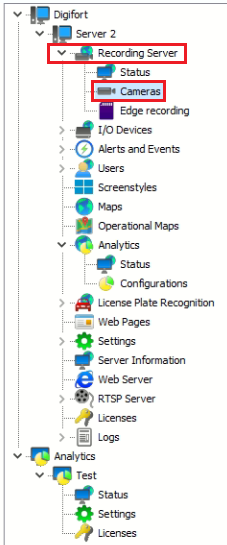

3.  In the *Media devices finder* window, click **Start** to search for any IP camera on the network.

4.  Select the camera you want to add and click **Add selected device** located bottom.

    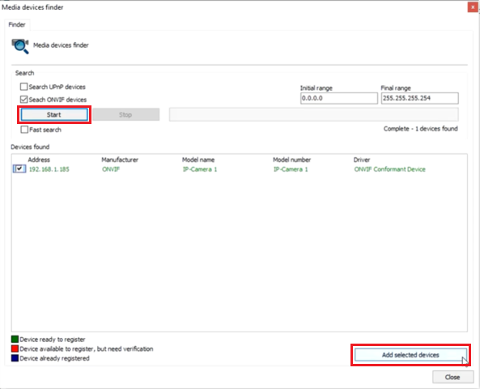

5.  In the *Camera registration* window, configure the new device as follows:

    -   **Camera Name:** Enter a descriptive name for the camera.
    -   **Camera description:** Enter a description for the camera.
    -   **User:** Enter the username to access the camera.
    -   **Password:** Enter the password to access the camera.
    -   **Recording Directory:** Configure the path for the recording.

        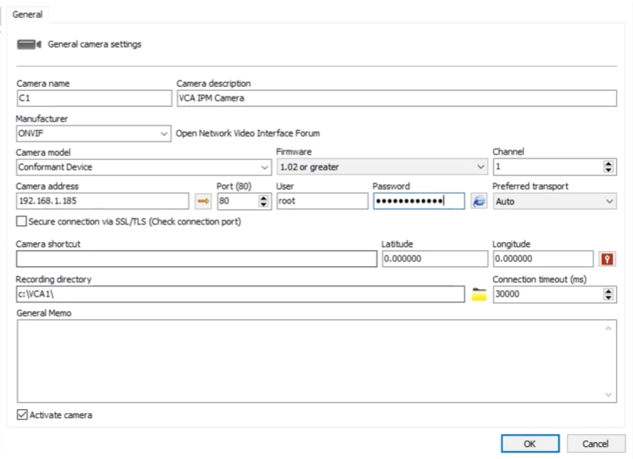

### Verifying Media Profiles

Verify that the Enterprise Administration Client is correctly receiving the live video from the camera as follows:

1.  In **Streaming**, click **Media profiles** in the left menu.

    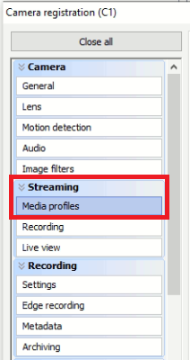

2.  Then, click **Recording** in the right side.

    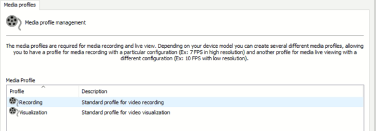

    -   Verify the **Video Settings** and click **Preview** to display a live image of the camera.

        

        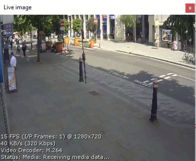

3.  Click **OK** to close the Media Profiles window.

4.  Click **Close** to close the Media device finder window.

## Analytics Configuration Registration

Next, we register a new analytics into the system. The analytics is a set of tools that intelligently processes the
cameras' images. This process includes object count, flow control, missing and foreign objects, and others.

_The Digifort analytics is considered an extra module as it is not included in the license of the Digifort cameras'_
_server. Please refer to your software distributor to obtain licenses._

1.  Click **Analytics** in the left menu. Then, click **Configurations**.

    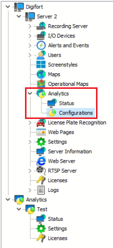

2.  Click **Add** located bottom.

3.  In the *Analytics configuration registration* window, register the analytics as follows:

    -   **Name:** Enter a descriptive name for the new element.
    -   **Description:** Enter a description for the analytics.
    -   **Camera:** Select the camera added previously.
    -   **Processing type:** Select **Use server processing** from the drop down menu.
    -   **Media Profile:** Select **Recording** from the drop down menu.
    -   **Processing Network:** Select **Digifort Analytics**.
    -   **Analytics Engine:** Select **Professional** from the available options.
    -   **Activation Type:** Select **Continuous** from the available options.
    -   Then, click **Analytics configurations** at the bottom.

    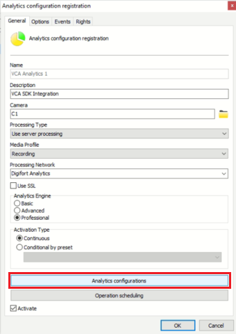

### Configuring VCA

In the *Analytics Settings* windows, you can start configuring the VCA features as follows:

1.  Click the **Zone** tab located top right to create a new zone.

    -   Click **Create Zone** located top right to create a detection zone.

        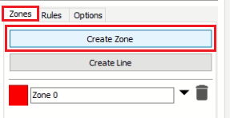

    -   Position the zone and change the shape as required. You can add/remove nodes to create complex shapes.
    -   Enter a descriptive name for the zone and apply any colour to identify it.
    -   Click **OK** to confirm the configuration.

        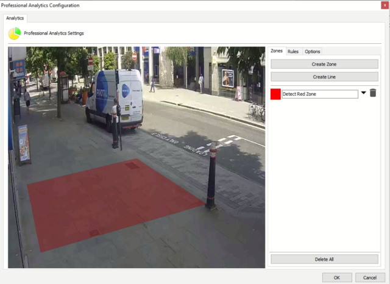

2.  Click the **Options** tab at the top right.

    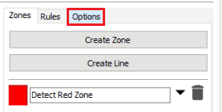

    -   Then, click **Advanced** to configure the settings relating to how the analytics engine tracks objects.
        _Note: In most installations, the default configuration will apply._

        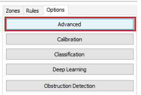

        -   In **Trackers**, select one of the  available tracking engines that will be used for analytics.

            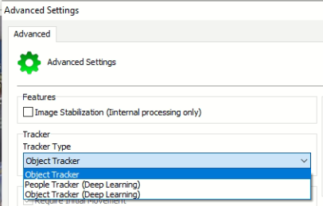

        -   Adjust the **Settings** as required.

            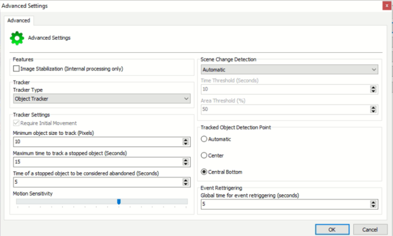

        -   Click **OK** to save the settings.

    -   Next, click **Calibration** to calibrate the video as required. _Calibration is required to allow the_
        _classification with the standard Object Tracker. If you are using DL Object/People Tracker then no_
        _calibration is required_.

        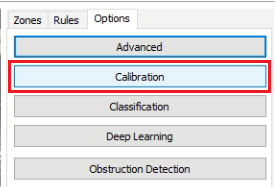

        -   Use the mimics to match up with people or objects in the scene to help calibrate. They represent a height of
            1.8 meters.

            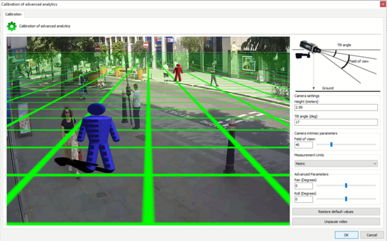

        -   Click **OK** to confirm the settings for the calibration.

    -   Now, click the **Rules** tab to create the rule(s) that will trigger the events.

        -   Click **Add New Rule** located at the top.

            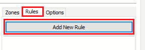

        -   Select the rule that will trigger the events.

            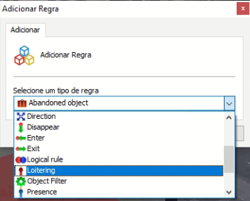

        -   Attached the zone to the rule and modify its properties as required.

            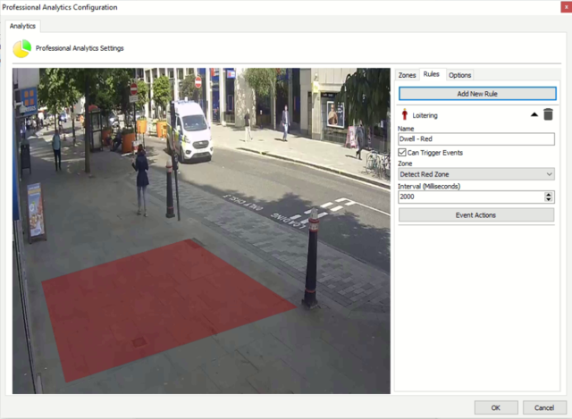

        -   Click **OK** to save the settings.

3.  Click **OK** to close the Analytics Configuration Registration windows.

4.  Verify the analytics has been created and worked correctly.

    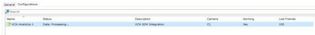

# Digifort Enterprise Surveillance Client

## Verifying VCA Events

When the rules trigger events, the notifications will be displayed in the Surveillance Client along with the annotated
video. Drag the Analytics and Camera items from the right menu to the main screen to verify the events.

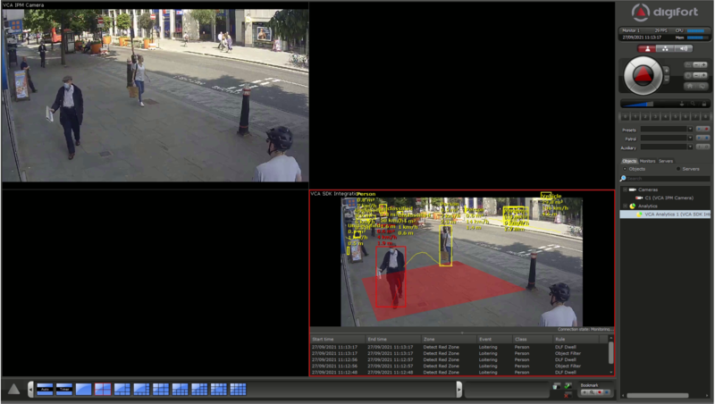

_Additionally, you can configure **Events Actions** to decide how to react to different events._
