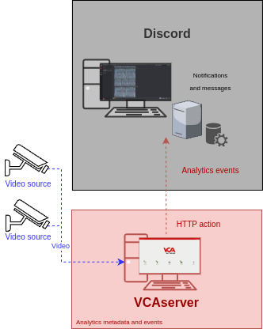
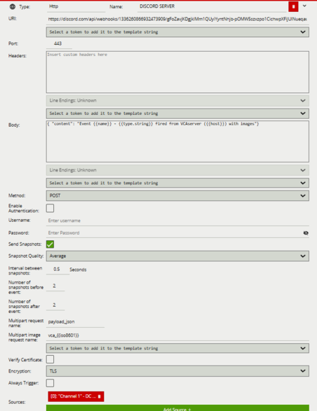
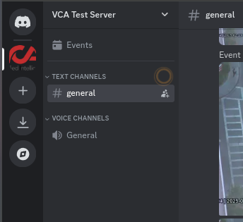
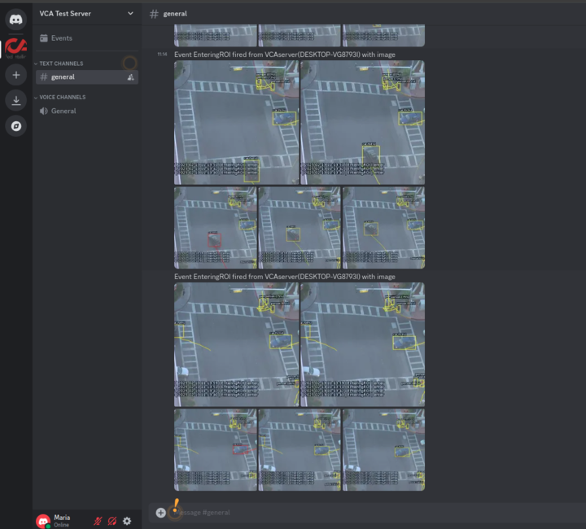
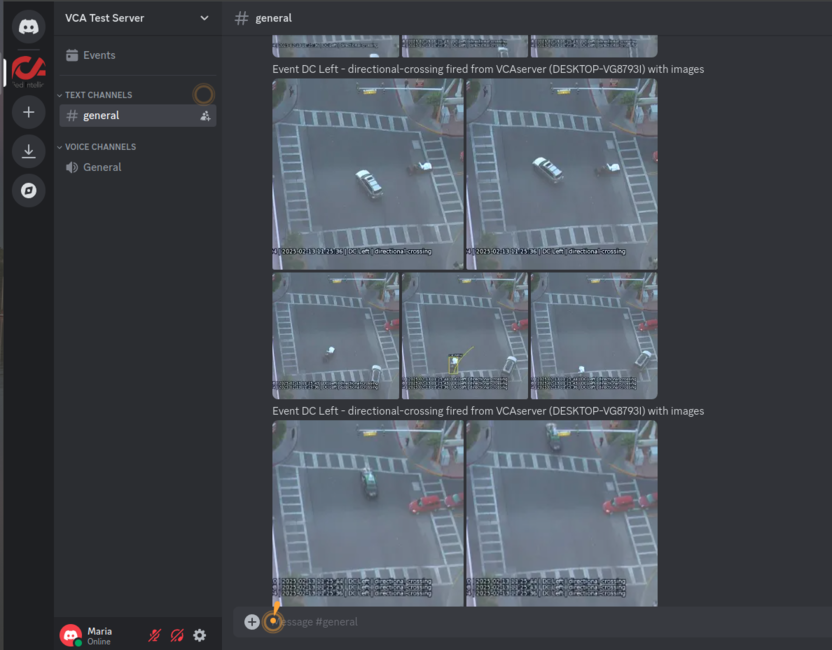

# Introduction

## Prerequisites

-   VCAserver version 2.4.2 or greater.
-   Discord server.
-   Discord's built in `Webhooks` function.

## Supported Features

-   HTTP requests with snapshots and metadata available via tokens.

## Architecture

For this web UI integration, Discord's `webhook` receives messages and notifications through the HTTP action with VCA
tokens containing details about the event.

# VCAserver Configuration

## Creating a Channel

Configure the VCAserver as required with the appropriate channel and logical rules. A basic setup is detailed below as
an example:

1.  Configure a source to connect to a camera.

    _Note: the recommended settings for the camera stream to VCA is a maximum resolution of D1 (640 x 480) with a frame_
    _rate of 15 frames per second. A lower resolution and frame rate will reduce the analytic accuracy, a higher_
    _resolution and frame rate will result in high CPU usage and can reduce analytical accuracy._

2.  Configure a **zone** for the channel.

3.  Select the **Tracking Engine** to identify objects in the scene.

4.  Configure **rules or filters** to trigger an event on object detection in the zone.

    

For more information on creating and configuring channels in VCA please refer to the
[VCA core manual 2.4](https://documentation.vcatechnology.com/).

## Creating an Action

1.  Click the **system cog** in the top right to access the Settings.

    

2.  Then, click **Edit Actions**.

    

3.  Click **Add Action** and select **HTTP** from the list of available actions.

    

4.  Enter a descriptive name for the action.

5.  Click the arrow on the right of the action to expand the HTTP configuration options.

    -   **URI:** Enter Discord's `webhook` URL for the server/channel you want to receive messages. For example:
        `https://discord.com/api/webhooks/<server_endpoint>`
    -   **Port:** Default port 443.
    -   **Body:** Add the data required by Discord's `webhook` server with the VCA tokens.
    -   **Method:** Select **POST** from the available methods.
    -   **Enable Authentication:** N/A.
    -   Tick the box against **Send Snapshots**.
    -   Enter the **Interval between snapshots**.
    -   Select the **Snapshots Quality** from the drop-down list.
    -   **Number of snapshots before the event:** 2.
    -   **Number of snapshots after the event:** 2.
    -   **Multipart request name:** Enter the parameter **`payload_json`**.
    -   **Multipart image request name:** Enter the parameter **`vca_{{iso8601}}`**.
    -   **Sources:** Select **Add Source +** to display a list of the available Sources and logical rules and select the
        logical rule created for the source you want to send to the server.

        

For this integration, the following tokens were used to send an information on the camera, zone and rule type that
triggered the event:

-   `{{name}}`: The name of the event.
-   `{{host}}`: The hostname of the device that generated the event.
-   `{{type.string}}`: The type of the event. This is usually the type of rule that triggered the event.
-   `{{iso8601}}`: The `iso8601` property is a date string in the ISO 8601 format.

# Discord Server Configuration

To send events to Discord, a '`webhook`' within your Discord server needs to be created, which acts as a custom URL that
allows external applications to send messages to a specific channel. Then, this code can be used within your application
to send data to that `webhook` URL, effectively posting the event information as a message on Discord.

1.  Create a Discord `webhook`:
    -   Go to your Discord server.
    -   Access the channel where you want events to be posted.
    -   Click on the **Edit Channel** settings.
    -   Select **Integrations** and then **Create `Webhook`**.
    -   Enter a name for your `webhook` and copy the generated URL.

        

    For more information on setting up Discord's built in `webhook`, please refer to
    [Discord's Support](https://support.discord.com/hc/en-us/articles/228383668-Intro-to-Webhooks)

2.  Configure the [HTTP action](#creating-an-action) to send data to the `webhook`.

3.  Verify the messages and snapshots.

## Verifying Messages

Every time a logical rule is triggered on the VCAserver, a new message will be displayed on Discord's channel showing
the details of the event as follows:

