# Introduction

## Prerequisites

-   VCAserver version 2.4.2 or greater.
-   ExacqVision VMS version 24.06 or greater.

## Supported features

-   TCP events with metadata available via tokens.
-   Annotated RTSP.

## Architecture

In this web UI integration, the ExacqVision VMS receives the annotated RTSP stream from the VCAserver and the alarms
are sent through the TCP action with VCA tokens containing details about the event.

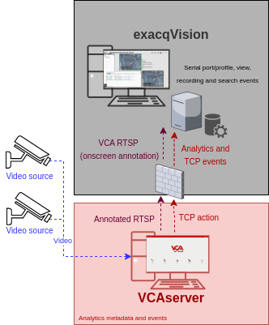

# VCAserver Configuration

## Confirming the RTSP port used for transmitting video footage

Check, and change if required, the RTSP port used by VCA for external connections to the channels within the VCA
service.

1.  From the main screen, click the **system cog** in the top right.

    

2.  Then, click on **System**.

    

3.  In **Network Settings**, you can see the RTSP port used by the VCAserver to send the RTSP stream of its channels.
    Change it if necessary and click **Save**.

    

    _Note: The syntax for connecting to these channels is:_ `rtsp://<device_ip>:<RTSP_port>/channels/<channel_id>`.

    Example: `rtsp://192.168.1.10:8554/channels/27`.

## Creating a Channel

Configure the VCAserver as required with the appropriate channel and logical rules. A basic setup is detailed below as
an example:

1.  Configure a source to connect to a camera.

    _Note: the recommended settings for the camera stream to VCA is a maximum resolution of D1 (640 x 480) with a frame_
    _rate of 15 frames per second. A lower resolution and frame rate will reduce the analytic accuracy, a higher_
    _resolution and frame rate will result in high CPU usage and can reduce analytical accuracy._

2.  Configure a **zone** for the channel.

3.  Configure **rules or filters** to trigger an event on object detection in the zone.

    

4.  Note the **Channel ID** as this will be needed when connecting to the RTSP stream from the ExacqVision server.

    _Note: The channel ID can be located at the bottom of the channels menu._

    

For more information on creating and configuring channels in VCA please refer to the
[VCA core manual 2.4](https://documentation.vcatechnology.com/).

## Creating an Action

1.  Click the **system cog** in the top right to access the settings.

    

2.  Click **Edit Actions**.

    

3.  Then, click **Add Action** and select **TCP** from the list of available actions.

    

4.  Enter a descriptive name for the action.

5.  Click the arrow on the right of the action to expand the TCP configuration options.

    -   **URI**: Enter the IP address of the ExacqVision server.
    -   **Port**: Enter the Serial Port configured in ExacqVision.
    -   **Body**: Select **Custom** from the drop-down menu and add some tokens.
    -   **Sources**: Click **Add Source +** to display a list of the available rules and filters and select the rules
        created for the source you want to send to the ExacqVision server.

        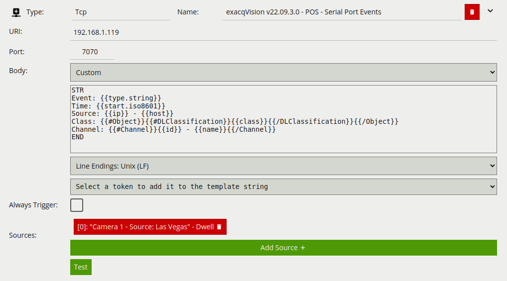

For this integration, the following Tokens were used to send an alert containing information on the camera, zone and
rule type that triggered the event and time.

Where:

-   `STR`: Represents the beginning of the transaction of the Serial Profile configured in the `exacqVision`.
-   `{{start.iso8601}}`: The start time of the event. The `iso8601` property is a date string in the ISO 8601 format.
-   `{{ip}}`: The IP address of the device that generated the event.
-   `{{host}}`: The hostname of the device that generated the event.
-   `{{#Channel}}{{id}}{{/Channel}}`: The id of the channel that the event occurred on.
-   `{{#Channel}}{{name}}{{/Channel}}`: The name of the channel that the event occurred on
-   `{{#Object}}{{#DLClassification}}{{/DLClassification}}{{/Object}}`: The classification generated by a deep learning
    model (e.g. Deep Learning Filter or Deep Learning Object Tracker). This token is a property of the
    object token. The algorithm must be enabled in order to produce this token. It has the following sub-properties:
    -   `{{class}}`: What the object has been classified as (person, vehicle).
-   `END`: Represents the end of the transaction of the Serial Profile configured in the VMS.

# ExacqVision Configuration

## Configuring the VCA RTSP Stream

First, we add a new device into the system.

1.  From the main Configuration, click **Add IP Cameras** in the left menu.

    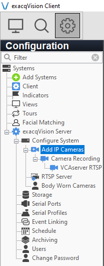

2.  In **IP Camera List**, click **New** located bottom to add a new device.

    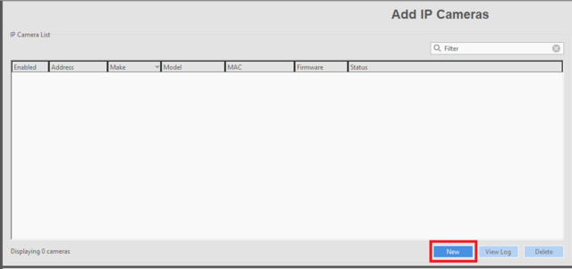

3.  In **IP Camera Information** located right side, configure the new camera as follows:

    -   **Device Type**: Select **RTSP** from the drop down list.
    -   **Hostname/IP Address**: Enter the RTSP URL to connect to the VCA channel. Default format:
        `rtsp://<device ip>:<RTSP port>/channels/<channel id>`. Example: `rtsp://192.168.1.202:8554/channels/15`

    -   **Username**: Enter the username to access the VCAserver.
    -   **Password**: Enter the password to access the VCAserver.
    -   Click **Apply** to connect to the VCA channel. _Make sure the Status indicates Connected._

        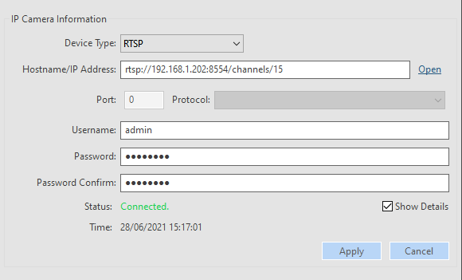

4.  Click **Apply** to confirm and save the device configuration.

### Verifying the Stream Settings

1.  Click **Stream** in the left menu.

    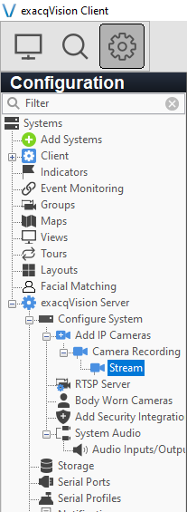

2.  Verify that the recording is enabled and the camera settings are correct by clicking the **Recording** tab.

    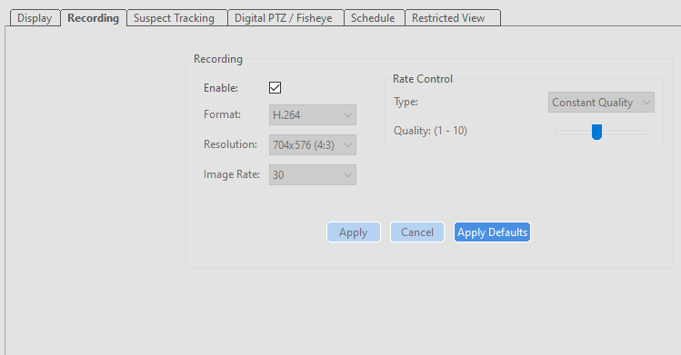

3.  Additionally, enter a descriptive name for the new device by clicking the **Display** tab.

    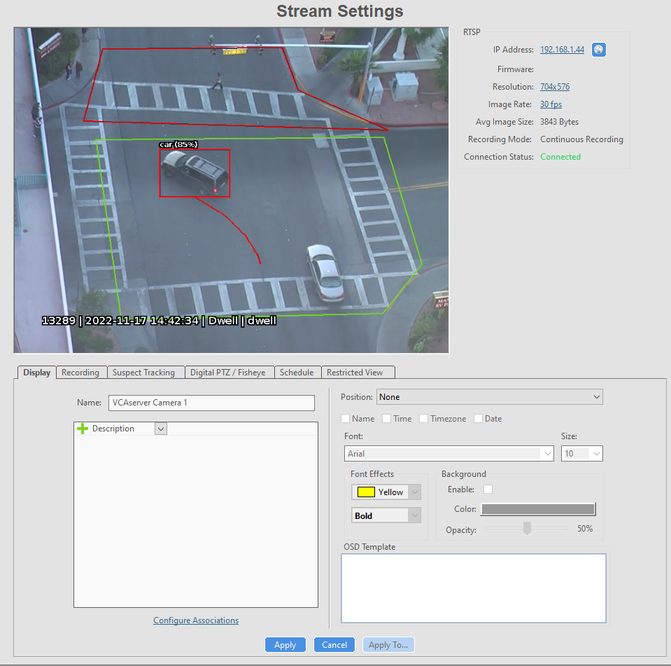

## Configuring the Serial Port

Now, we configure the serial Port that will receive the TCP events from the VCAserver.

1.  Click **Serial Ports** in the left menu.

    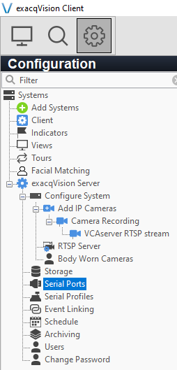

2.  Then, click **New** located bottom.

    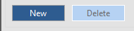

3.  In the **Serial Port** page, configure the new serial port as follows:

    -   **Name**: Enter a descriptive name for the Serial Port.
    -   **Use**: Select **POS** from the drop down list.
    -   **Profile**: Select **New...** (we will create a Serial Profile later).
    -   **Type**: Select **TCP Listener** from the drop down list.
    -   **Address**: Enter the IP address of the VCAserver.
    -   **Port**: Enter the TCP port configured in the VCA TCP action.
    -   **Max Line Length**: Set to 80.
    -   Leave the rest of the parameters as they are.
    -   Click **Apply** to save the configuration.

    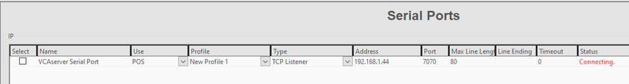

    _Every time the VCAserver sends an TCP event, the Status will change to Connected for a brief period of time_.

_Note: Make sure any active firewalls are configured to allow traffic using the port detailed above._

### Configuring the Serial Profile

Next, we configure the Serial Profile.

1.  Click **Serial Profiles** in the left menu.

    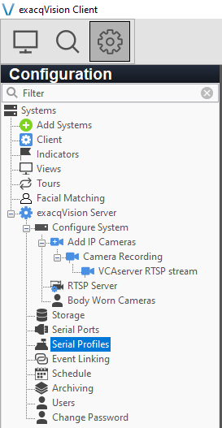

2.  In the **Serial Profiles** page, edit **Configuration** as follows:

    -   **Port Name**: Click the arrow on the right of the Port Name and select the Serial Port created previously.
    -   **Name**: Enter a descriptive name for the Profile.
    -   **Parser**: Leave it **Default**.
    -   **SOT marker**: Enter the _beginning_ of the transaction.
    -   **Marker type**: Select **Standard** (it tells ExacqVision to expect plain text characters without any special
        formatting or structure).

    -   **EOT marker:** Enter the _end_ of the transaction.
    -   Click **Apply** to save the configuration.

        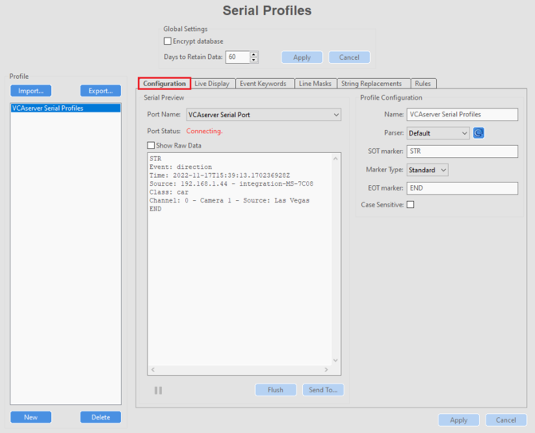

        _The beginning and end of the transaction can be found using the raw data shown in the left side._

#### Configuring the Keywords

Now, we create the **keywords** related to the alarm types. From the **Serial Profiles** page, click **Event Keywords**
located top. Then, click **New**.

-   Edit the **Keywords** as follow:
-   **Add the String**: Enter the keywords for the alarms.
-   Click **Apply** to confirm.

    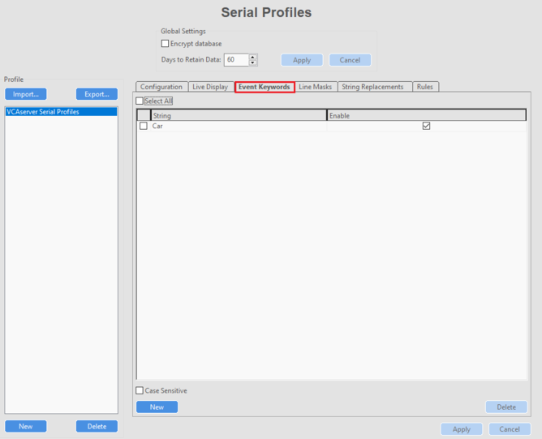

#### Configuring the Formatting of the Transactions

Then, we configure the formatting of the transactions. The TCP vents will appear as overlay on the video. From the
**Serial Profiles** page, click **Live Display** located top.

-   In **Camera**, select the VCAserver or leave it _None_ to display the events on the layout.
-   In **Font**, select the font, size and colour for text.
-   Adjust the text on the screen.
-   Click **Apply** to confirm the settings.

    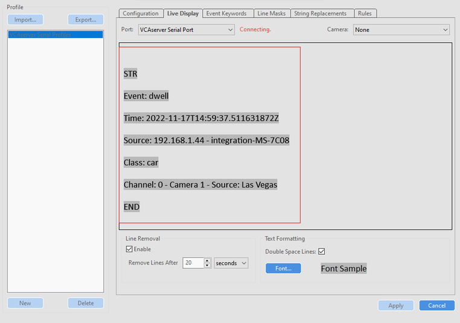

## Configuring the Event Monitoring

1.  Event monitoring allows you to see the alarm events in a list. Click **Event Monitoring** in the left menu.

    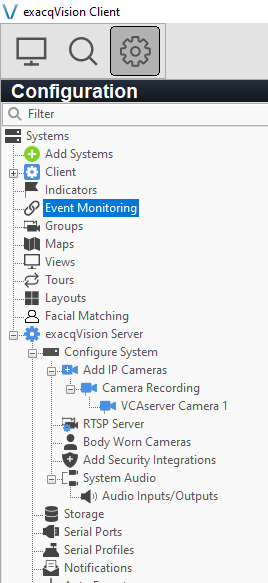

2.  In *Profiles*, click on **New** to create a new event and edit *Profile Configuration* as follows:

    -   **Name:** Enter a descriptive Profile Name.
    -   **Show Event List:** Select **Always** from the drop-down list.
    -   Check **Show Newest Event** if desired.
    -   **Type:** Select **Video Panel** from the available options.

        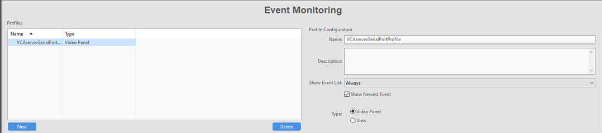

3.  In *Client Actions*, configure the *Event Type* as follows:

    -   **Event Type:** Select **Serial Profile** from the available types.
    -   **Event Source:** Select the Serial Profile key created before.
    -   **Action Type:** Select **Switch Video** from the options.
    -   **Action Target:** Select the camera configured previously.

4.  Create a second *Event Type* as follows:

    -   **Event Type:** Select **Serial Port** from the available types.
    -   **Event Source:** Select the Serial Port created before.
    -   **Action Type:** Select **Log** from the options.
    -   **Action Target:** N/A.

5.  Click **Apply** to save the configuration.

    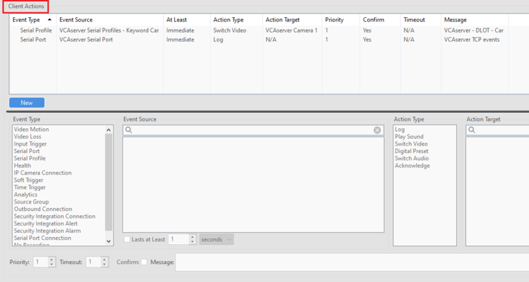

## Verifying the VCA Events

In the `exacqVision` **Live Page**, you can verify the events as overlay on the camera/layout as follows:

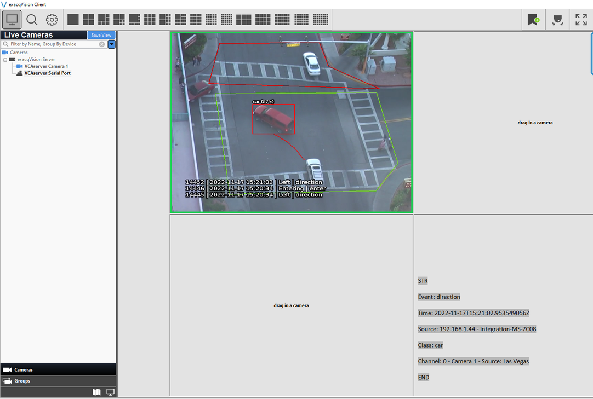

You can also search for the the Serial Profiles events listed on the VMS by right clicking on the serial profile panel
and selecting **Search > Serial**.

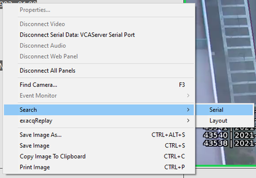

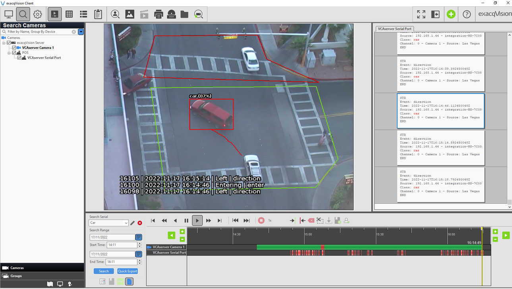

Verify the event list right clicking in a panel and selecting **Event Monitor** and the Event Monitoring Profile just
created.

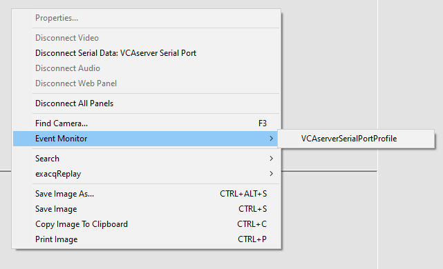

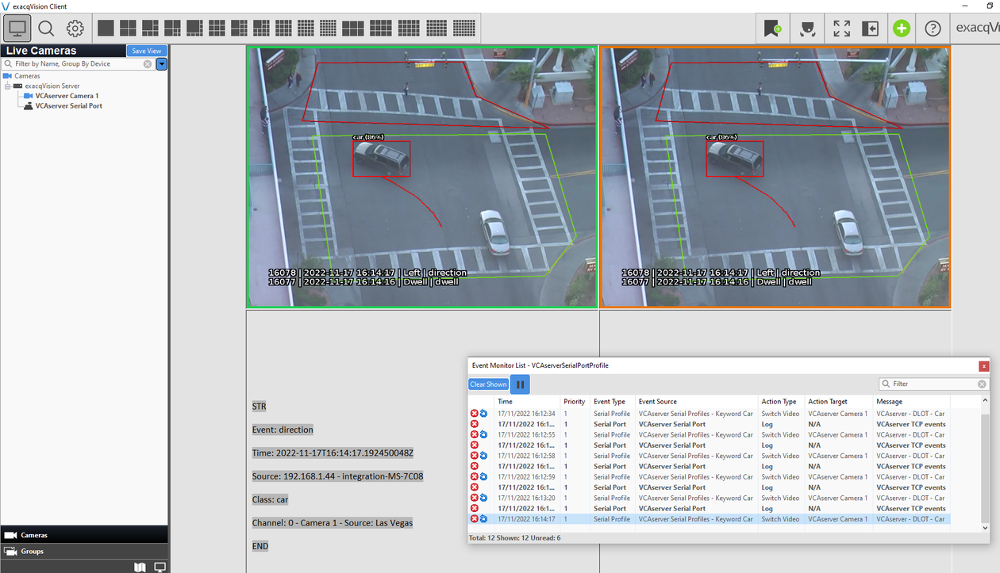
