# Introduction

## Prerequisites

-   Forensics server and client version 1.3.2 or greater.
-   VCAserver version 2.1.1 or greater.
-   Hikvision Network Video Recorder `DS-7608NI-I2`.

# Configuring the VMS Integration for Hikvision

The VMS integration is used to allow video from a supported VMS platform to be displayed through the Forensics client.

-   In the *Dashboard* page, click on **VMS** from the available dashboard items.

    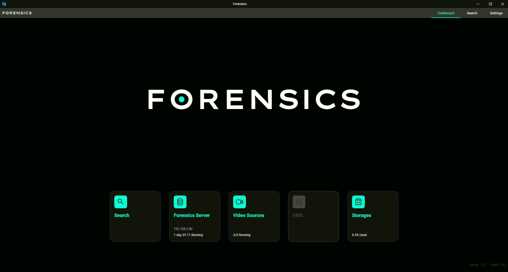

-   In the *VMS Settings* page, define the connection details to allow the Forensics server to connect to the `Hik NVR`
    as follows:

    -   **Type**, click the drop-down arrow to display the available VMS list. Then, select **Hikvision** from the
        options.

        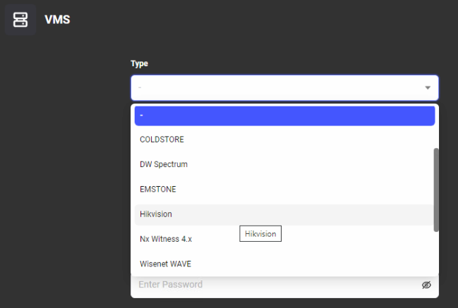

    -   **Address**: Enter the IP address of the Hikvision NVR.
    -   **HTTP Port**: Enter the web port configured in the NVR.
    -   **RTSP Port**: Enter the RTSP port configured in the NVR.
    -   **Username**: Enter the username to access the NVR.
    -   **Password**: Enter the password to access the NVR.

        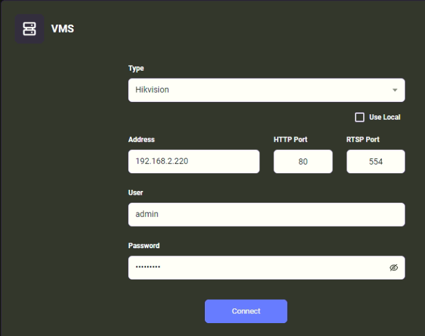

    -   Click on **Connect**.

        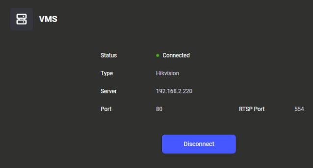

    _Please refer to the Forensics manual for more information on configuring Forensics._

# Searching

The search feature allows you to create queries against the recorded metadata and display images that match the
search criteria.

-   Navigate to the **Search** page.
-   In *Filters*, create a new query as follows:
    -   **Duration**: Define the date and time for the search.
    -   **Channels**: Click on the drop-down arrow and select the channels that will be used during the search. Then,
        click on **Select**.

        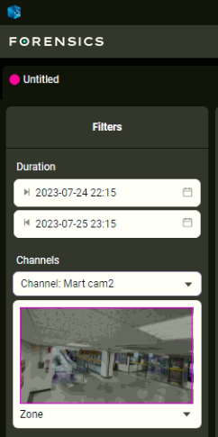

    -   Click on **Image Search**.
        -   In *Select Target*, click on the drop-down arrow and select **Image Upload** from the options. _Note:_
            _Image Search is only available with persons._

            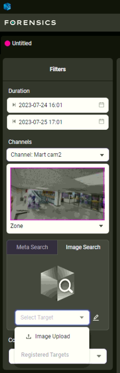

            -   In the *Image Search Targets* page, click on the plus **(+)** sign to add an image.

                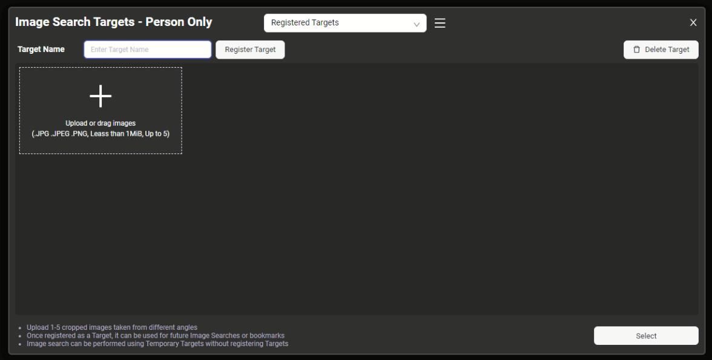

            -   In the *Open* window, select the image(s) that will be uploaded in order to begin the image search
                targets and click on **Open**. _Note: Upload between 1 and 5 cropped images taken from different_
                _angles._

            -   Enter a descriptive **Target Name** and click on **Register Target**. Then click on **Select**.

                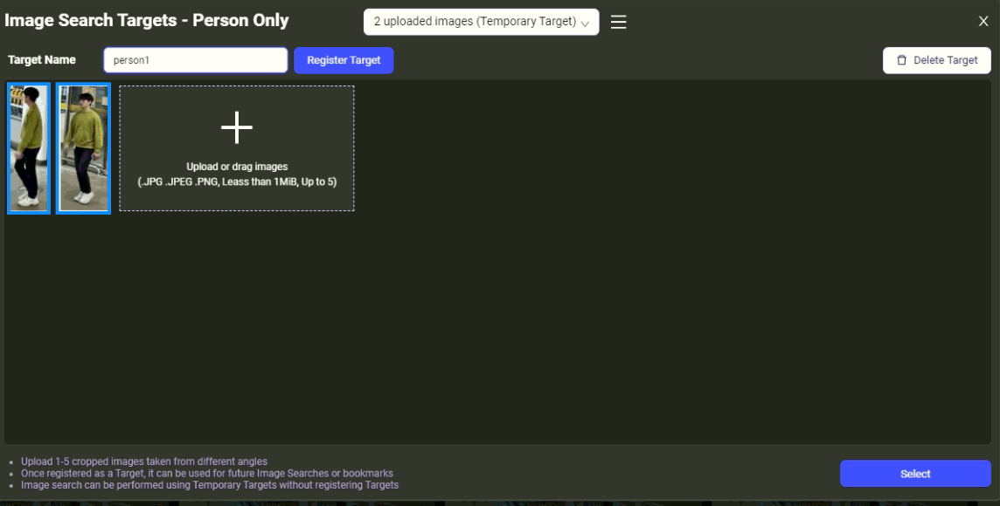

## Reviewing Results

-   Go back to the *Results Window* page and click on **Search** on the left hand side.

    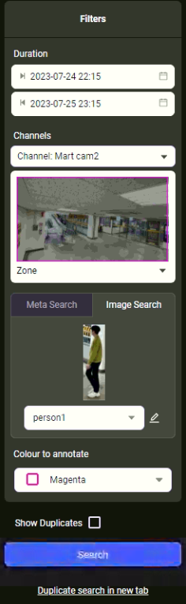

-   Wait for the results to be displayed.

    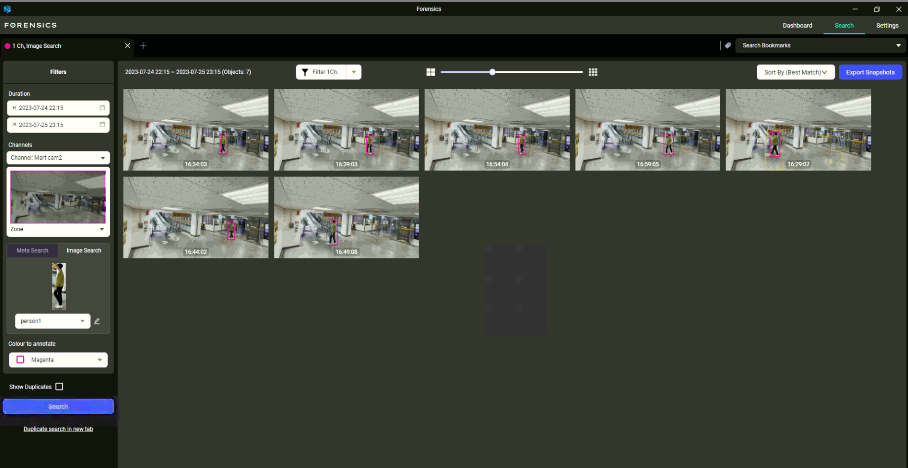

-   Double-click on one of the images to view more details about the objects identified.

    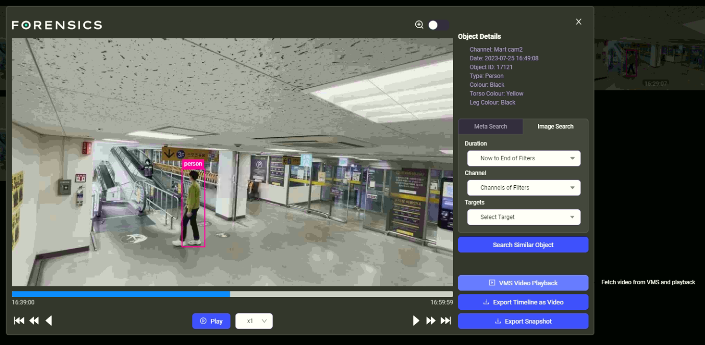

-   Then, click on **VMS Video Playback** on the right hand side to review the playback from Hikvision NVR.

    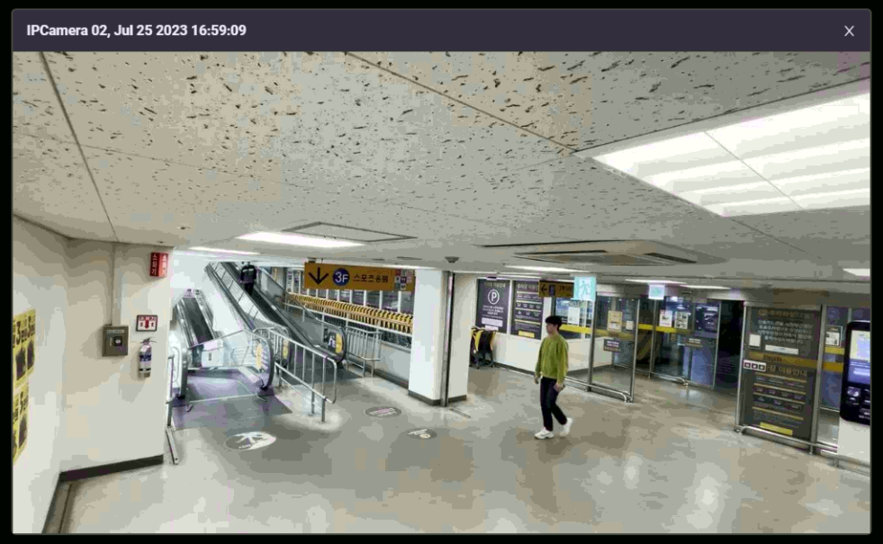
