# Introduction

## Prerequisites

-   VCAserver version 2.4,2 or greater.
-   Ganz Cortrol Premier VMS version 1.28 or greater.

## Supported features

-   VCA JSON metadata: Event ID, rule name, Camera/Source, Date..
-   Annotated RTSP.

## Architecture

Ganz Cortrol will connect to the VCA channels to consume the metadata provided. The integration does not require the
configuration of VCAserver actions to send events to the VMS. The only requirement is that VCA rules are defined.

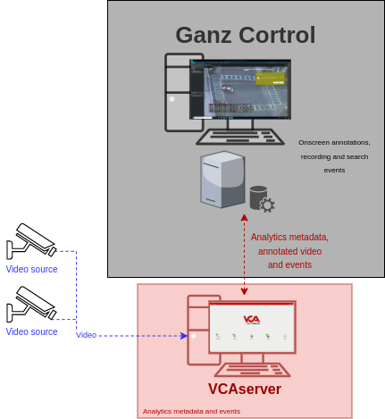

# VCA Configuration

## Confirming the RTSP port used for transmitting video footage

Check, and change if required, the RTSP port used by VCA for external connections to the channels within the VCA
service.

1.  From the main screen, click the **system cog** in the top right.

    

2.  Then, click on **System**.

    

3.  In **Network Settings**, you can see the RTSP port used by the VCAserver to send the RTSP stream of its channels.
    Change it if necessary and click **Save**.

    

    _Note: The syntax for connecting to these channels is:_ `rtsp://<device_ip>:<RTSP_port>/channels/<channel_id>`.

    Example: `rtsp://192.168.1.10:8554/channels/27`.

## Creating a Channel

Configure the VCAserver as required with the appropriate channel and logical rules. A basic setup is detailed below as
an example:

1.  Configure a source to connect to a camera.

    _Note: the recommended settings for the camera stream to VCA is a maximum resolution of D1 (640 x 480) with a frame_
    _rate of 15 frames per second. A lower resolution and frame rate will reduce the analytic accuracy, a higher_
    _resolution and frame rate will result in high CPU usage and can reduce analytical accuracy._

2.  Configure a **zone** for the channel.

3.  Configure **rules or filters** to trigger an event on object detection in the zone.

    

4.  Note the **Channel ID** as this will be needed when connecting to the RTSP stream from the Ganz server.

    _Note: The channel ID can be located at the bottom of the channels menu._

    

For more information on creating and configuring channels in VCA please refer to the
[VCA core manual 2.4](https://documentation.vcatechnology.com/).

# Ganz Cortrol Console Configuration

## Configuring a Device

1.  First we add a new device. From the left menu, click on **Devices**. Then, click **New Device** located top.

    

2.  Click **Select Model** and select **VCA Technology (`VCACore` Video Analytics)** from the available devices.

    -   Select from 1, 4, 8, 16, or 32 channels as required.

        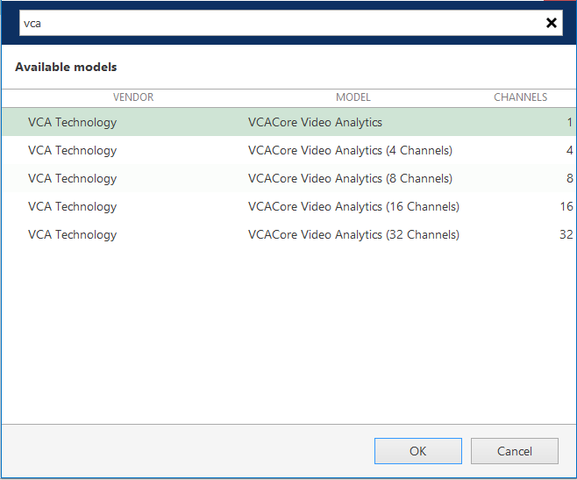

    -   Enter a descriptive name for the new device.

        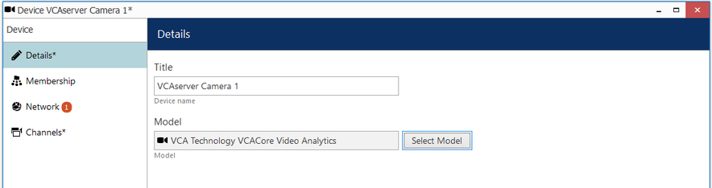

3.  In the left menu, click **Network** and configure the device as follows:

    -   **Host:** Enter IP address of the VCAserver.
    -   **Port:** Enter the web port of the VCAserver.
    -   Enter the **username** and **password** to access the VCAserver.
    -   Click **Apply**.

        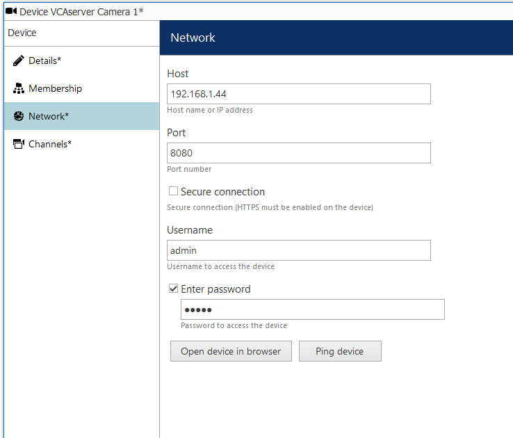

4.  Click **OK** to finish creating the new device.

_To confirm the VCA channel is configured correctly you can show a live stream. From the Channels menu, select the newly_
_created device, and click Show Video located top._

### Configuring the Recording

1.  From the left menu, click **Channels**. Then, click **Edit** located top to modify the newly created channel.

    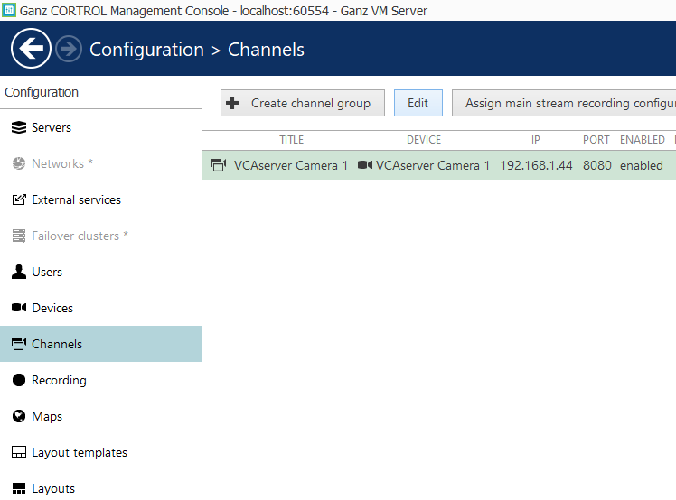

2.  In the **Details** page, configure the recording as follows:

    -   **Title:** Enter a descriptive name for the device.
    -   **Main stream recording configuration:** Click **Change** and select **continuous recording**.
        Then, click **OK** to confirm and close the window.

        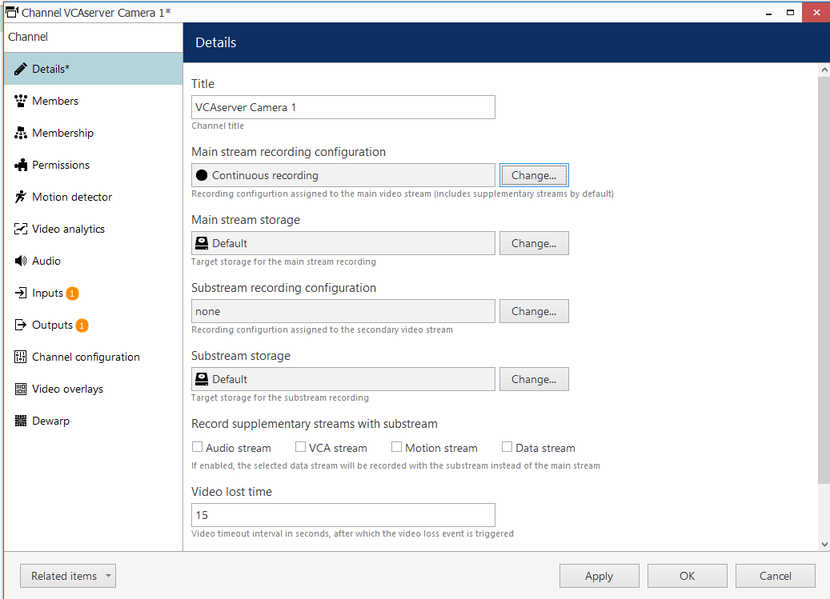

3.  Click **Apply** to save the settings.

## Creating Events, Actions, and Rules

### Creating Events

Next, we need to configure the events, actions, and rules that will be sending notifications to the Ganz Client.
First, we create an new event as follows:

1.  From the left menu, click on **Events & Action**.

2.  Then, click **Events** and **New Event** located top.

    

3.  In **Channel related (2)**, select **VCA event** from the available options.

    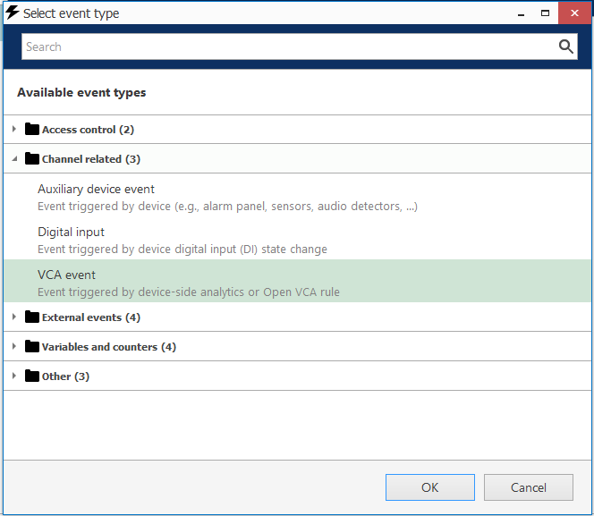

4.  Then, configure the Event as follows:

    -   **Title:** Enter the name of the VCA rule.
    -   **Source:** Click **Change** and select the VCAserver. Then, click **OK** to confirm and close window Event
        source window.

        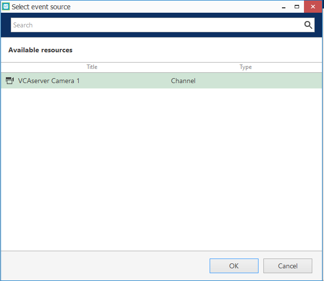

    -   **VCA Rule:** Click **Change** and select the rule configure in the VCAserver. Then, click **OK** to confirm
        and close the VCA rules window.

        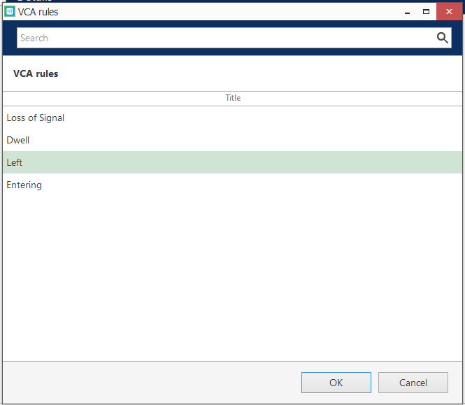

5.  Click **OK** to confirm the settings and close the Event window.

    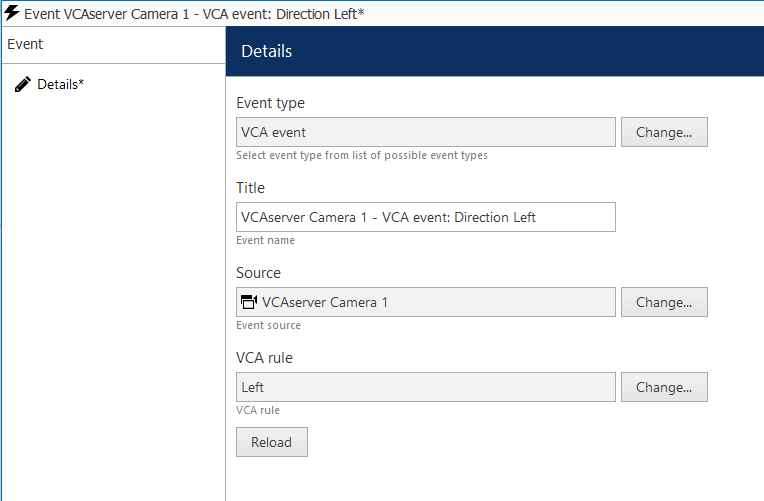

### Creating Actions

1.  The next step is to create a new action. From the left menu, click **Actions**  and **New action** located top.

    

2.  In **Notifications (4)**, select **Send event to client** from the available types.

    

3.  Then, configure the notification as follows:

    -   **Title:** Enter a descriptive name for the notification.
    -   **Message:** Click the **Insert field** button located top right to add the fields that will contain the details
        of the events in the notification.

        

    -   **Enable** Display events in alert, Display a warning message box and Display event in notification panel.

        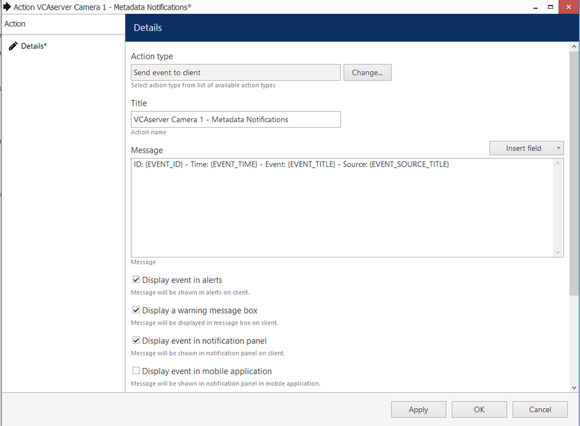

4.  Click **OK** to confirm and close the Actions window.

### Creating Rules

1.  The last step is to create a new rule. From the left menu, click **Rules** and **Open configuration** located top.

    

2.  In the Event and Actions `configurator` page, you will see three boxes associated with Events, Rules, and Actions.

3.  In **Events**, select the **VCA event** created previously. Then, click the greater than **>** button to move the
    event into the Rules box.

4.  In **Actions**, select the **Notification** created previously. Then, click the less than **<** button to move the
    action into the Rules box.

5.  In **Rules**, configure the box as follows:

    -   Click **Target channel** located bottom. In the pop-up screen, select the VCAserver and click **OK** to confirm.
    -   Then, click **Schedule** located bottom. Configure the schedule for the events, and click **OK** to confirm.

        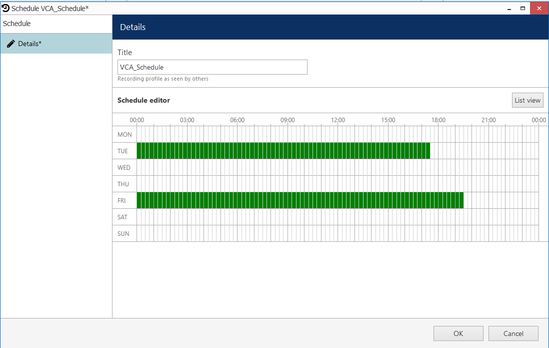

6.  Click **OK** to save the rule configuration.

    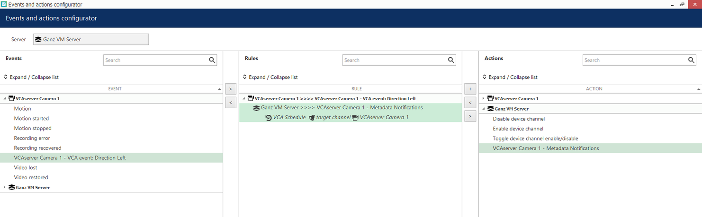

Optionally, you can test this Rule by clicking the Test button located top. The notification will appear on the Ganz
Client.

## Verifying VCA Events on the Ganz Cortrol Client

​​Launch the Ganz Cortrol Client​ to verify the VCA event notifications on the **Live** page:

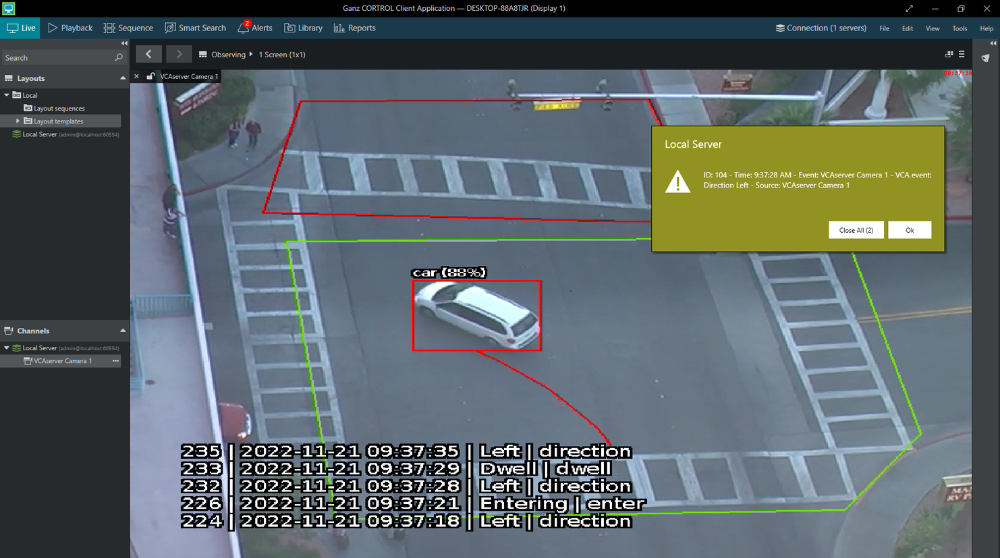

You can review the notifications on the **Alerts** tab located top.

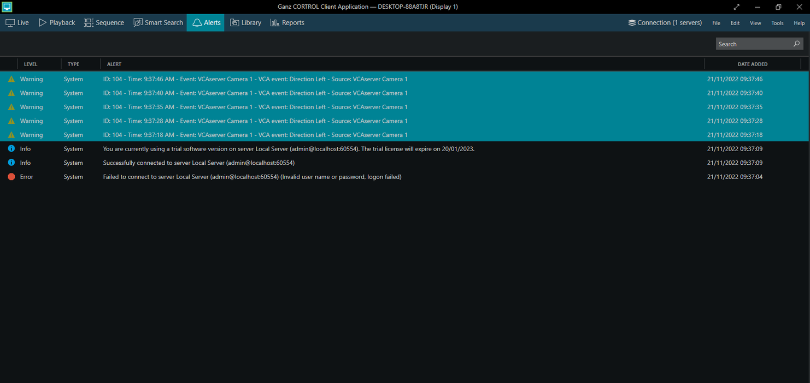
