# Introduction

## Prerequisites

-   VCAserver 2.4.2 or greater.
-   Genetec Security `Center` platform (`Config` Tool, Update Server, and Security Desk).

## Supported features

-   HTTP events.

## Architecture

In this web UI integration, live video from cameras connected to Security `Center` is streamed to the VCAserver for
analysis, and the events are sent back to Security `Center`.

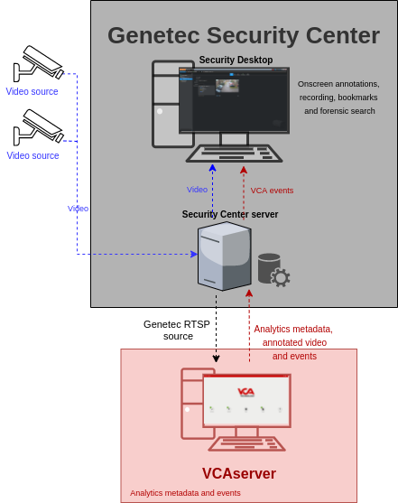

# VCAserver Configuration

## Confirming the RTSP port used for transmitting video footage

Check, and change if required, the RTSP port used by VCA for external connections to the channels within the VCA
service.

1.  From the main screen, click the **system cog** in the top right.

    

2.  Then, click on **System**.

    

3.  In **Network Settings**, you can see the RTSP port used by the VCAserver to send the RTSP stream of its channels.
    Change it if necessary and click **Save**.

    

    _Note: The syntax for connecting to these channels is:_`rtsp://<device_ip>:<RTSP_port>/channels/<channel_id>`.

    Example: `rtsp://192.168.1.10:8554/channels/27`.

## Creating a Channel

The next step is to add the RTSP stream of the Video Unit configured in the Security `Center` server into the VCAserver.

1.  In the **View Channel** page, click the plus **(+)** button to add a new video source.

    

2.  In the **Video Sources** page, click the **Add Video Source** button and select **RTSP** from the available sources.

    

3.  Configure the RTSP source as follows:

    -   **Name:** Enter a descriptive name for the new video source.
    -   **URI:** Enter the default RTSP stream URL to request live video from a Security `Center` video unit.
    -   **User ID:** Enter the username to access the Security `Center` server.
    -   **Password:** Enter the password to access the Security `Center` server.
    -   **License:** Attach a valid license for the channel to start working.
    -   Click **Apply Changes** to save the new RTSP source.

        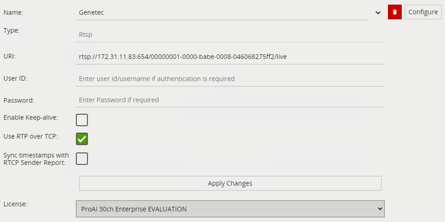

    _Note: the recommended settings for the camera stream to VCA is a maximum resolution of D1 (640 x 480) with a frame_
    _rate of 15 frames per second. A lower resolution and frame rate will reduce the analytic accuracy, a higher_
    _resolution and frame rate will result in high CPU usage and can reduce analytical accuracy._

    The syntax used to connect to a camera from Security `Center` is is: `rtsp://<authority>/<cameraId>/<playMode>`

    Where:

    -   `<authority>`: Is the IP address and listening port of the Media Gateway server. _The default RTSP port is 654._
    -   `<cameraId>`: Is the GUID of the camera.
    -   `<playMode>`: Is either "live" or "playback".

    Example: `rtsp://172.31.11.83:654/00000001-0000-babe-0008-d6df73c1010e/live`

## Configuring a Channel

Now, we calibrate the video and configure the zone and the rules that will trigger the events in the channel.

1.  From the **View Channels** page, click the previously added source.

    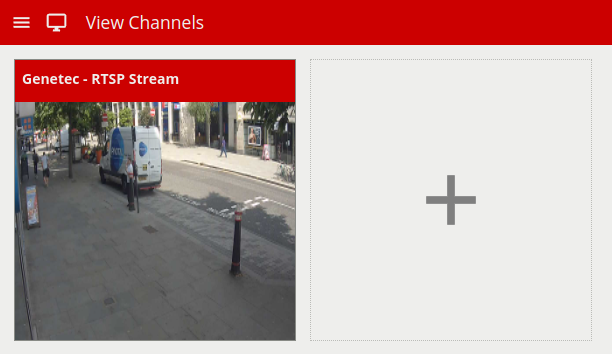

2.  On the channel settings page, click **Tracking**.

    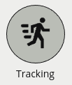

    -   Then, select **DL Object Tracker** from the available Tracking Engines.

        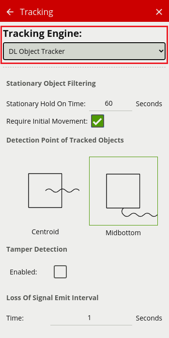

3.  Return to the channel settings page and click **Zones** in the right menu.

    

    -   Click **Create Zone +** located top right to create a detection zone.
    -   Position the zone and change the shape as required. You can add/remove nodes to create complex shapes.
    -   Enter a descriptive name for the zone and apply any colour to identify it.

        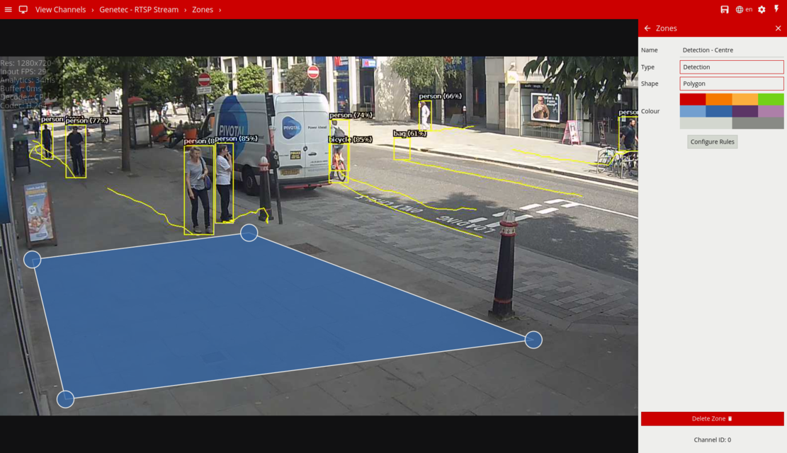

    -   Then, click the **Configure Rules** button below to go to the rules settings page.

        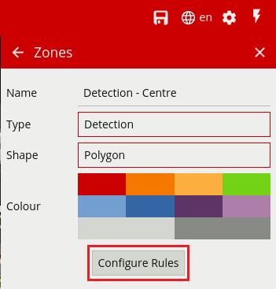

4.  In the **Rules** page, click **Add Rule +** located top right.

    -   Select the rule that will trigger the events.
    -   Attached the zone to the rule.
    -   Modify its properties as required.

        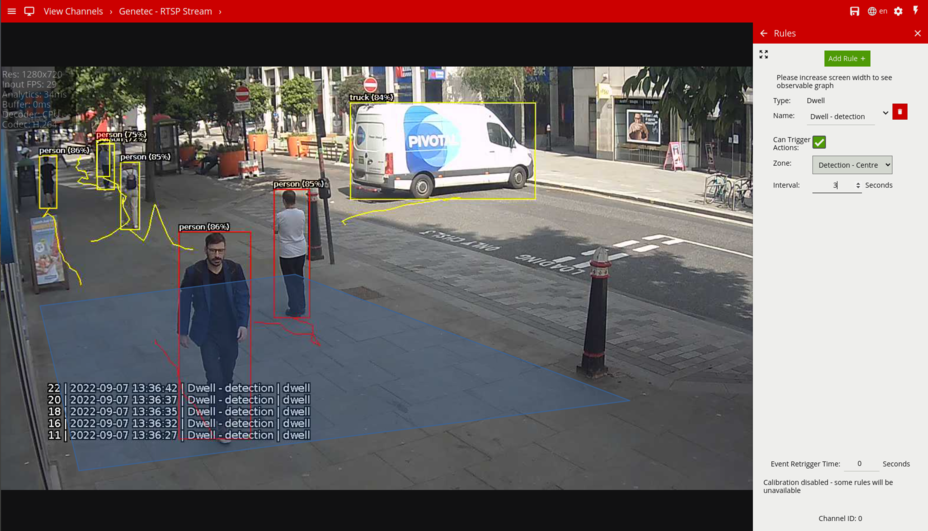

5.  **Note** the Channel ID as this will be needed when creating the alarms in the `Config` Tool. _Note: The channel ID_
    _can be located at the bottom of the channels menu._

    

## Creating an Action

1.  Click the **system cog** in the top right to access the Settings.

    

2.  Then, click **Edit Actions**.

    

3.  Click **Add Action** and select **HTTP** from the list of available actions.

    

4.  Enter a descriptive name for the action.

5.  Click the arrow on the right of the action to expand the HTTP configuration options.

    -   **URI:** Enter the Base URI configured for the Web-based SDK role. The default endpoint is as follows:
        `http://<IP_address>:<web_sdk_port>/WebSdk`
    -   **Port:** Enter the port to connect to the Web-based SDK role. The default port is 4590.
    -   **Headers:** N/A.
    -   **Body:** N/A
    -   **Method:** Select **GET** from the available methods.
    -   **Enable Authentication:** Check to enable authentication.
    -   **Username:** Enter the username to access the Security `Center` Server.
    -   **Password:** Enter the password to access the Security `Center` Server.
    -   **Sources:** Select **Add Source +** to display a list of the available Sources and logical rules and select the
        logical rule created for the source you want to send to the Security `Center` Server server.

        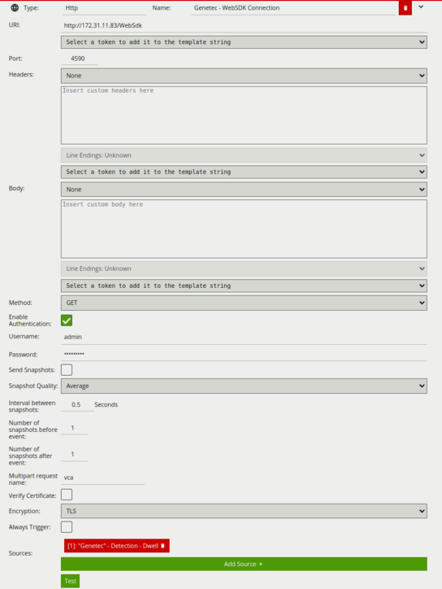

# Genetec Security `Config` Tool

## Adding a Camera

1.  First, we add a new camera into the system. From the *`Config` Tool Home page*, click on the **Video** task.

    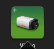

2.  In the *Video* page, click on **Video unit** located bottom left.

    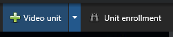

3.  In the *Add Manual* pop-up window, select the **Manufacture** you want to add and configure it as required.
    _For this example, we configured a Generic RTSP unit._

    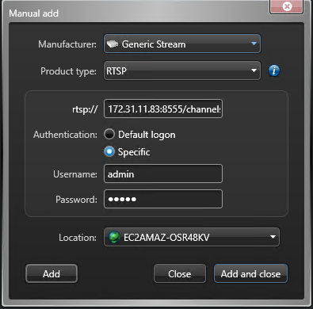

4.  Click **Add and close** to save the configuration. _Make sure the Video unit has been added successfully._

    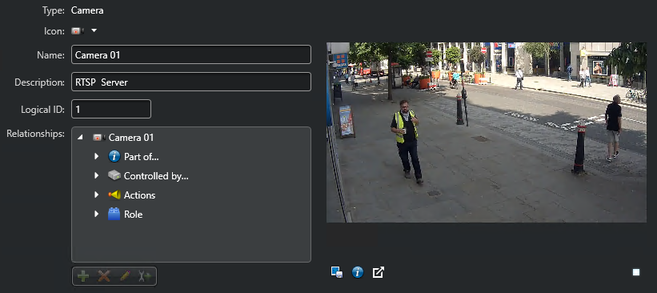

### Finding the Camera RTSP URL

1.  In the *Video* page, click **Media Gateway** from the left menu.

    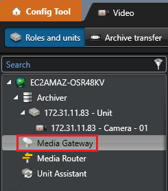

2.  In the *Media Gateway* page, click on **Properties** located top.

    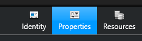

3.  In **RTSP**, toggle to enable the feature. Then, take note of the **Listening port** and **Sample URL** that
    contains the camera RTSP stream URL to be configured within the VCAserver.

    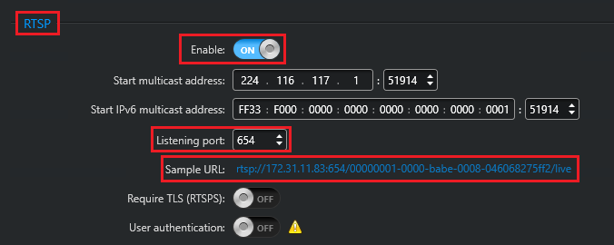

## Creating the Web SDK Connection

1.  From the *`Config` Tool Home page*, click the **System** task.

    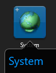

2.  Then, select the **Roles** view from the available options.

    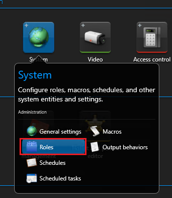

3.  In the *System* page, click **Add an entity** located bottom left. Then, select **Web-based SDK** from the
    available roles.

    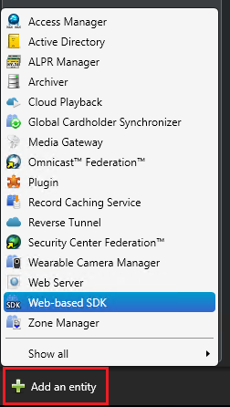

4.  Configure the new Web SDK role as follows:

    -   In **Basic Information**, enter a descriptive name for the role. Then, click **Next**.

        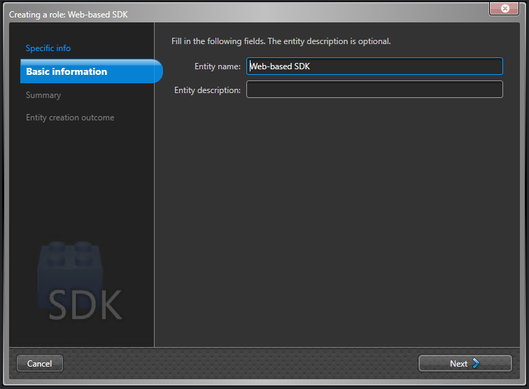

    -   In **Summary**, verify that the role has been created successfully. Then, click **Create**.

        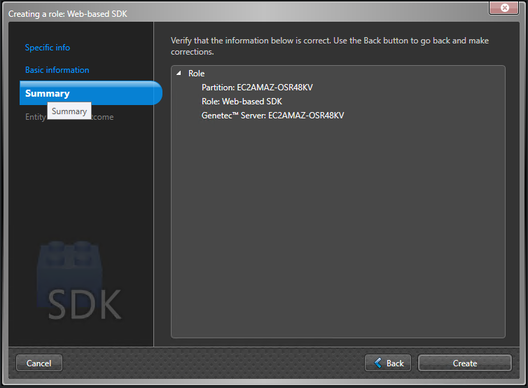

    -   **Close** the *Creating a role* window.

5.  In the *Web-based SDK* page, click on **Properties** located top.

    

6.  Take note of the **Port** and **Base URI** since this parameters will be configured within the VCA HTTP action to
    send the events.

    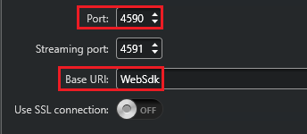

    _Optionally, you can enable the SSL connections if required._

7.  Then, click on **Identity** located top.

    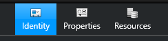

    -   In **Relationships**, highlight **Actions** and then, click **Add a new item** to decide how the Web SDK role
        will react to the alarms.

        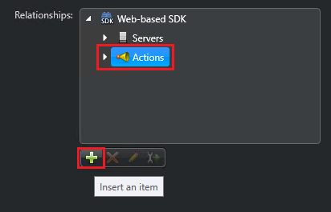

    -   Configure the **Event-to-action** as follows:

        -   In **When**, select **Application connected** from the drop-down list.
        -   In **Action**, select **Trigger alarm** from the drop-down list.
        -   In **Alarm**, select the alarms.
        -   Click **Save** to confirm configuring the action.

            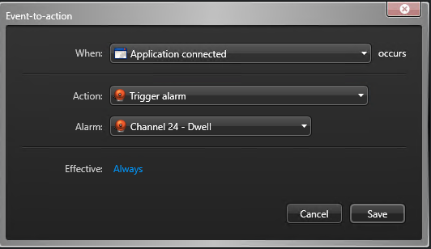

## Creating the Alarm

1.  From the *`Config` Tool Home page*, click the **Alarms** task.

    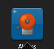

2.  In the *Alarms* page, click on **Alarm** located bottom left to create a new alarm.

    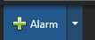

3.  Then, click on **Identity** located top to identify the new alarm as follows:

    -   **Name:** Enter the ID of the VCA channel and the name of the VCA rule that will trigger this alarm.
    -   **Description:** Enter a description for the alarm (for example the classification of the object person,
        vehicle, truck, etc.).

        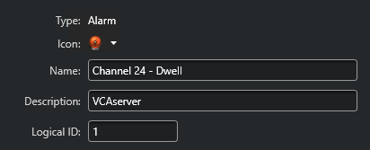

    -   In **Relationships**, highlight **Actions** and then, click **Add a new item** to decide how the system will
        react to the alarms.

        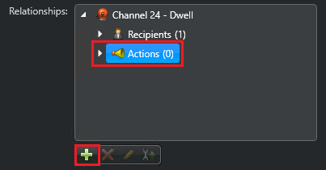

    -   Configure the **Event-to-action** as follows:

        -   In **When**, select **Alarm triggered** from the drop-down list.
        -   In **Action**, select **Add bookmark** from the drop-down list.
        -   In **Camera**, select the camera related to the alarm.
        -   In **Message**, enter a message to identify the bookmark.
        -   Click **Save** to confirm configuring the action.

            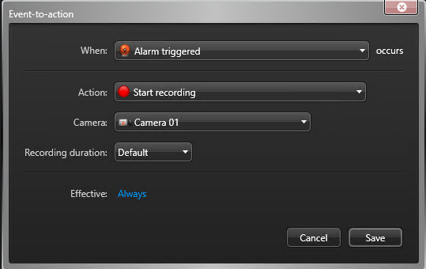

4.  Click on **Properties** located top to modify the properties of the new alarm as follows:

    

    -   In **Priority**, configure the priority for the alarm. Then, click **Apply** located bottom right.

        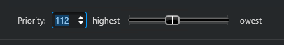

    -   In **Recipients**, click **Add a new item** to add a new recipient. Then, click **Apply**.

        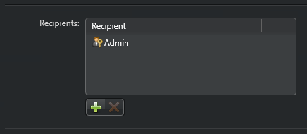

    -   In **Attached entities**, click **Add a new item** to add the camera related to the alarm. Then, click
        **Apply**.

    -   In **Video display option**, select **Live and playback** from the drop-down list. Click **Apply**.

        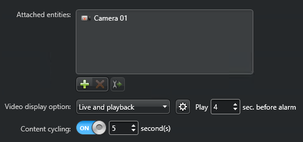

5.  Click on **Advanced** to modify the advanced settings of the alarm.

    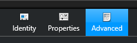

    -   Configure the **Schedule** and select a **Colour** to identify the new alarm. Then, click **Apply**.

        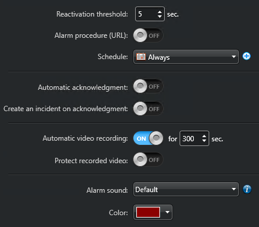

# Security Desk Configuration

Open the **Security Desk** to verify the alarms received from the VCAserver. From the *Security Desk Home page*,
click the **Alarm monitoring** task.

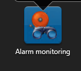

When the VCAserver sends an event, the new alarm will be listed at the top while the bookmarks, live and playback will
be displayed in layouts at the bottom.

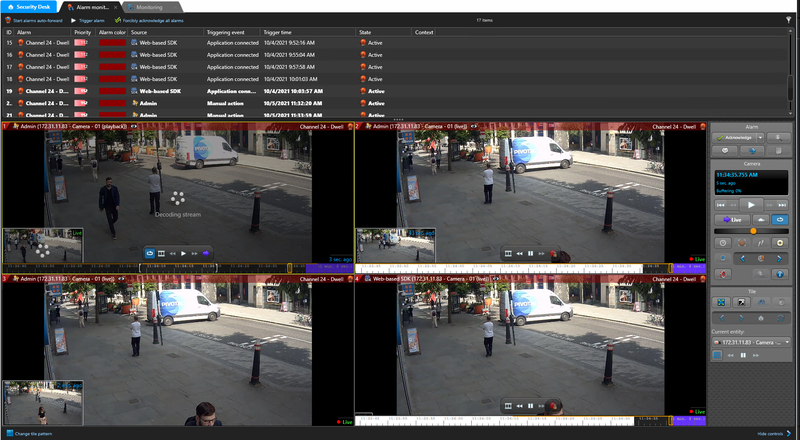
