# Introduction

## Prerequisites

-   VCAserver version 2.4.2.
-   HikCentral Professional platform version 1.7 or greater.
-   Hikvision embedded NVR.

## Supported features

-   TCP events with metadata available via tokens.
-   Annotated RTSP.

## Architecture

In this web UI integration, the HikCentral Professional platform receives the annotated RTSP stream from the VCAserver.
The generic events are sent using the TCP action with VCA tokens containing details about the event.

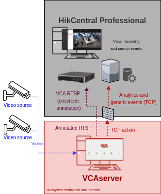

# VCAserver Configuration

## Confirming the RTSP port used for transmitting video footage

Check, and change if required, the RTSP port used by VCA for external connections to the channels within the VCA
service.

1.  From the main screen, click the **system cog** in the top right.

    

2.  Then, click on **System**.

    

3.  In **Network Settings**, you can see the RTSP port used by the VCAserver to send the RTSP stream of its channels.
    Change it if necessary and click **Save**.

    

    _Note: The syntax for connecting to these channels is:_`rtsp://<device_ip>:<RTSP_port>/channels/<channel_id>`.

    Example: `rtsp://192.168.1.10:8554/channels/27`.

## Creating a Channel

Configure the VCAserver as required with the appropriate channel and logical rules. A basic setup is detailed below as
an example:

1.  Configure a source to connect to a camera.

    _Note: the recommended settings for the camera stream to VCA is a maximum resolution of D1 (640 x 480) with a frame_
    _rate of 15 frames per second. A lower resolution and frame rate will reduce the analytic accuracy, a higher_
    _resolution and frame rate will result in high CPU usage and can reduce analytical accuracy._

2.  Configure a **zone** for the channel.

3.  Configure **rules or filters** to trigger an event on object detection in the zone.

    

4.  Note the **Channel ID** as this will be needed when connecting to the RTSP stream from the Hikvision embedded NVR.

    _Note: The channel ID can be located at the bottom of the channels menu._

    

For more information on creating and configuring channels in VCA please refer to the
[VCA core manual 2.4](https://documentation.vcatechnology.com/).

## Creating an Action

1.  Click the **system cog** in the top right to access the settings.

    

2.  Click **Edit Actions**.

    

3.  Then, click **Add Action** and select **TCP** from the list of available actions.

    

4.  Enter a descriptive name for the action.

5.  Click the arrow on the right of the action to expand the TCP configuration options.

    -   **URI**: Enter the IP address of the HikCentral Professional server.
    -   **Port**: Enter the TCP port configured for the Generic Events (port number 15300 by default).
    -   **Body**: Select **Custom** from the drop-down menu and add some tokens.
    -   Configure the **Line endings** feature.
    -   **Sources**: Click **Add Source +** to display a list of the available rules and filters and select the rules
        created for the source you want to send to the HikCentral Professional Control Client.

        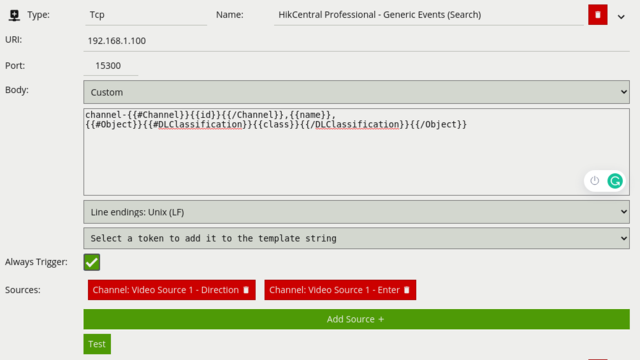

For this integration, the following Tokens were used to send an alert containing information on the camera, zone and
rule type that triggered the event and time.

Where:

-   `{{#Channel}}{{id}}{{/Channel}}`: The id of the channel that the event occurred on.
-   `{{name}}`: The name of the event.
-   `{{#Object}}{{#DLClassification}}{{class}}{{/DLClassification}}{{/Object}}`: The Deep-Learning classification name
    of the object.

# Hikvision NVR Configuration

## Adding the VCA RTSP Stream

The Hikvision embedded NVR provides a web interface to allow the management of different types of cameras or video
sources. The page is available through port 80 from a web browser as follows: `http://<NVR_ip_address>:80`. _The page_
_is protected and requires you to sign in to access._

1.  First, we add the VCA RTSP stream into Hikvision NVR using the **Custom Protocol** feature. From the main screen,
click **Configuration** located top.

2.  Click **System** from the left side to expand the options.

3.  Then, click **Camera Management** from the menu.

    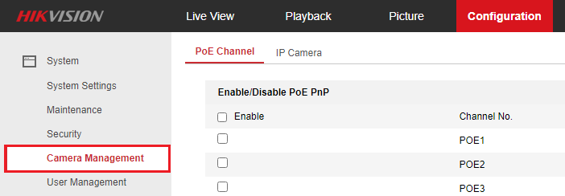

4.  In the **IP Camera** page, click **Custom Protocol**.

    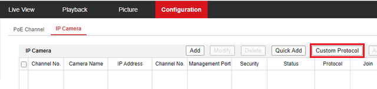

5.  Configure the Protocol as follows:

    -   **Protocol Name:** Enter a descriptive name for the Protocol.
    -   **Protocol:** Select **RTSP** from the available options.
    -   **Transfer Protocol:** Select **Auto** from the available options.
    -   **Port:** Enter the **RTSP** port configured in the VCAserver.
    -   **Stream Path:** Enter the RTSP URL for the VCA channel. Default format:`/channels/<channel id>`. Example:
        `/channels/24`

    -   Click **OK** to save the configuration.

        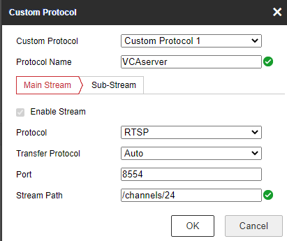

6.  Then, click **Add** located top to add a new camera.

    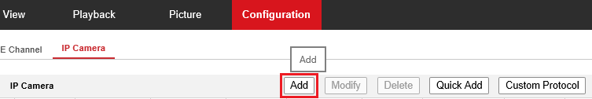

7.  **Edit** the IP Camera as follows:

    -   **IP Camera Address:** Enter the IP address of the VCAserver.
    -   **Protocol:** Select the **Custom Protocol** created previously.
    -   **User Name:** Enter the username to access the VCAserver.
    -   **Password:** Enter the password to access the VCAserver.
    -   **Confirm:** Confirm the password to access the VCAserver.
    -   Click **OK** to save the configuration.

        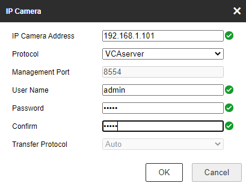

8.  Make sure the new camera is **Online** by clicking the **Activation** button at the top.

    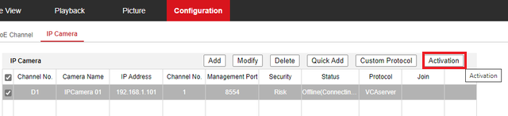

    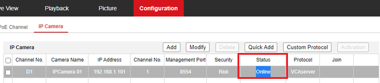

# HikCentral Professional Web Client Configuration

## Configuring Alarms and Events

The HikCentral Professional web client can generate TCP generic alarms when receiving an event from an external system
or source.

### Configuring Generic Events

1.  Open the HikCentral Professional web client. Then, click the **Event & Alarm** button from the main menu.

    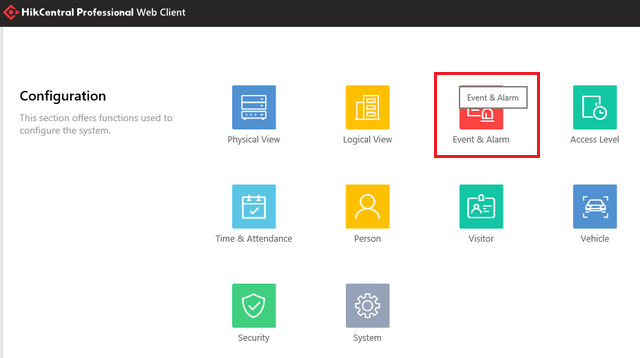

2.  Click **Generic Event** from the left menu.

    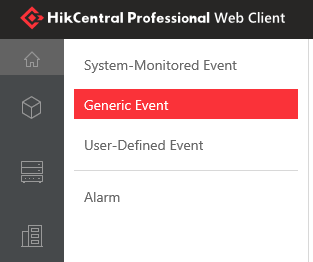

3.  Then, click **Add** located top to create a new event.

    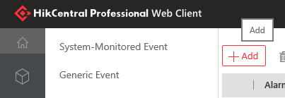

4.  In the Add Generic Event page, configure the new event as follows:

    -   **Event Name:** Enter a descriptive name for the event.
    -   **Transport Type**: Select **TCP** from the options.
    -   **Mach Type:** Select **Search** from the options. The possible options are *Search* and *Match*.

        _Search: The received data package must contain the text specified in the Expression field, but may also have_
        _more content._
        _Match: The received data package must contain exactly the text specified in the Expression field, and nothing_
        _else._

    -   **Expression:** Enter the words that will trigger the generic events. _The words/string should match the_
        _message configured by using the VCA tokens in the body of the VCA TCP action._

    -   Click **ADD** to add the expression into the main box.
    -   Use **AND** and **OR** to define the expression.
    -   Click **Add** located bottom to save the configuration.

        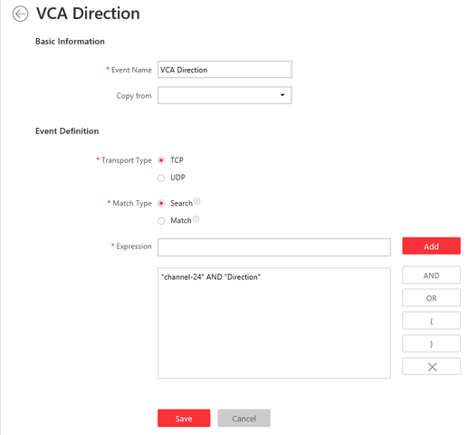

### Configuring Alarms

1.  Next, we configure the alarm. Click **Alarm** from the left menu.

    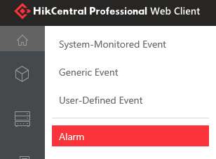

2.  Then, click **Add** located top to create a new alarm.

    

3.  Configure the **Alarm Definition** as follows:

    -   In **Source Type**, select **Generic Event** from the drop-down menu.

        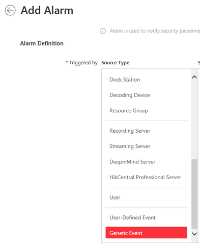

    -   In **Source**, select the Generic Event(s) created previously.

        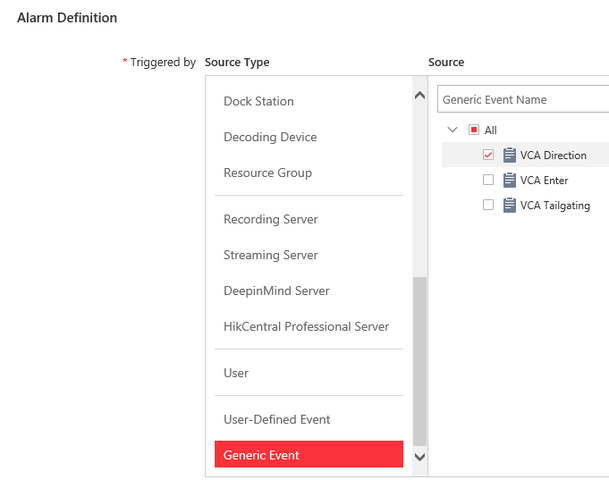

    -   **Description:** Enter a description for the new alarm.

        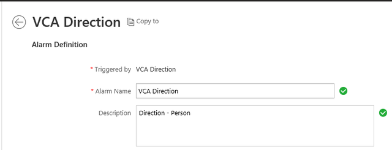

4.  Configure the **Alarm Properties** as follows:

    -   Select the *Schedule Template* and the *Priority* for the alarm.

        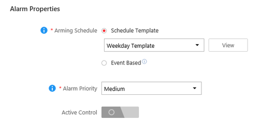

5.  Leave the **Alarm Recipients** configuration as it is.

    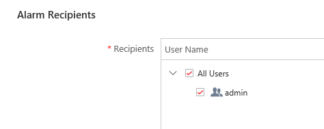

6.  Configure the **Additional Settings** as follows:

    -   Toggle to enable the **Related Camera** option.
    -   Click **Add** to add the camera.
    -   Then, select the camera(s) related to the VCAserver RTSP stream.
    -   Configure the time for the **Pre-Alarm video** and **Port-record**.
    -   Optionally, toggle to enable the **Capture Picture** feature, and select the camera.

        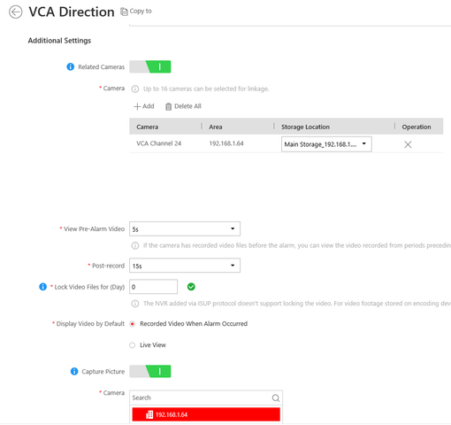

    -   Tick the box against the **Trigger Pop-up Window** to display all the alarm related cameras' live videos and
        playback when alarm occurs.

        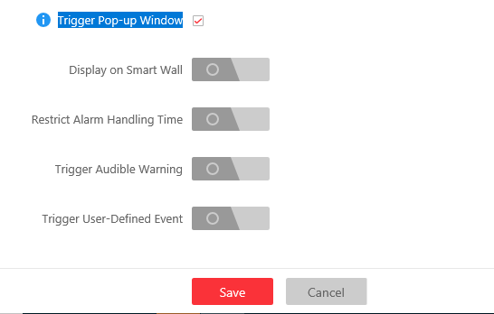

    -   Then, click **Add** at the bottom to save the alarm.

# HikCentral Professional Control Client

## Verifying Alarms

From the HikCentral Professional Control Client main screen, click on **Alarm Centre** listed within the
**Surveillance** menu.

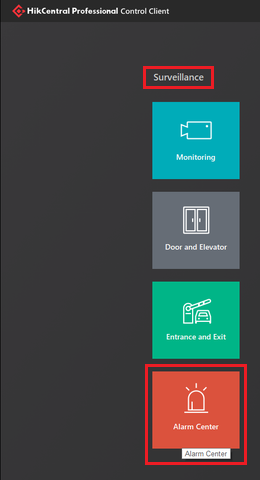

The notifications will appear on the **Alarm Centre** page when a event is triggered in the VCAserver as follows:

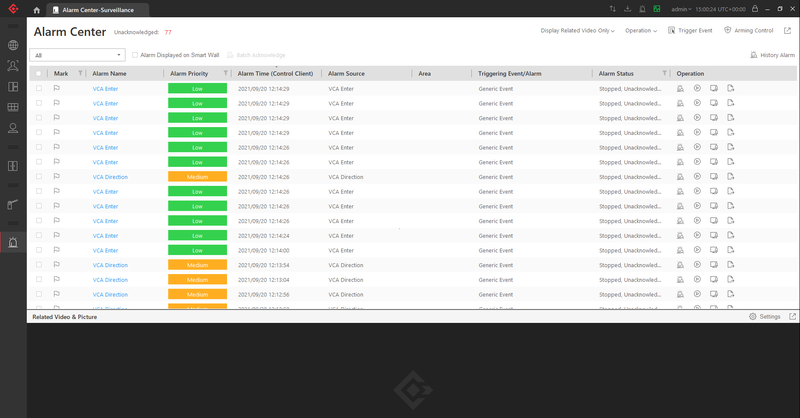

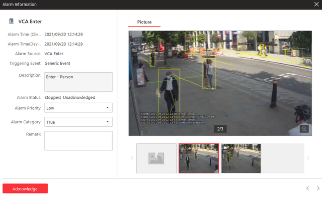
