# Introduction

## Prerequisites

-   VCAserver version 2.4.2 or greater.
-   SureView: Immix Monitor

## Supported features

-   SMTP events with metadata available via tokens.
-   Annotated RTSP stream.
-   Alarms: Presence, Enter, Exit, Appear, Disappear, Stopped, Dwell, Direction, Speed, Tailgating, Tamper.

## Architecture

In this web UI integration, Immix receives the annotated RTSP stream from the VCAserver and the alarms are sent
through the Email action with XML format and VCA tokens containing details about the event.

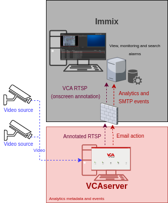

# VCA Configuration

## Confirming the RTSP port used for transmitting video footage

Check, and change if required, the RTSP port used by VCA for external connections to the channels within the VCA
service.

1.  From the main screen, click the **system cog** in the top right.

    

2.  Then, click on **System**.

    

3.  In **Network Settings**, you can see the RTSP port used by the VCAserver to send the RTSP stream of its channels.
    Change it if necessary and click **Save**.

    

    _Note: The syntax for connecting to these channels is:_

    `rtsp://<device_ip>:<RTSP_port>/channels/<channel_id>`.

    Example: `rtsp://192.168.1.10:8554/channels/27`.

## Creating a Channel

Configure the VCAserver as required with the appropriate channel and logical rules. A basic setup is detailed below as
an example:

1.  Configure a source to connect to a camera.

    _Note: the recommended settings for the camera stream to VCA is a maximum resolution of D1 (640 x 480) with a frame_
    _rate of 15 frames per second. A lower resolution and frame rate will reduce the analytic accuracy, a higher_
    _resolution and frame rate will result in high CPU usage and can reduce analytical accuracy._

2.  Configure a **zone** for the channel.

3.  Configure **rules or filters** to trigger an event on object detection in the zone.

    

4.  Note the **Channel ID** as this will be needed when connecting to the RTSP stream from the Immix server.

    _Note: The channel ID can be located at the bottom of the channels menu._

    

For more information on creating and configuring channels in VCA please refer to the
[VCA core manual 2.4](https://documentation.vcatechnology.com/).

## Creating an Action

1.  Click the **system cog** in the top right to access the settings.

    

2.  Click **Edit Actions**.

    

3.  Click **Add Action** and select **Email** from the list of available actions.

    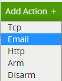

4.  Enter a descriptive name for the action.
5.  Click the arrow on the right of the action to expand the Email configuration options.
6.  Configure the options accordingly.

    -   **Server:** Enter the IP address or hostname of the Immix server.
    -   **Port:** Enter the SMTP port of the Immix server (default 25).
    -   **From:** Enter the email address generated in the Immix summary report. Here `S23375@ImmixAlarms.com`

    corresponds to Immix Input 20 (which is VCA channel Id 19).

    -   **From:** Enter the email address generated in the Immix summary report.
    -   **To:** Enter the email address generated in the Immix summary report.
    -   **Subject:** Select **SureView** from the available options.
    -   **Body:** Select **SureView** from the available options.
    -   **Enable** Send Snapshots.
    -   **The interval between snapshots:** 500.
    -   **Snapshots Quality:** Average.
    -   **Number of snapshots before the event:** 3 or 2.
    -   **Number of snapshots after the event:** 3 or 4.
    -   **Sources:** Click **Add Source +** to display a list of the available Sources and rules and select the logical

        rule created for the source you want to send to Immix.

    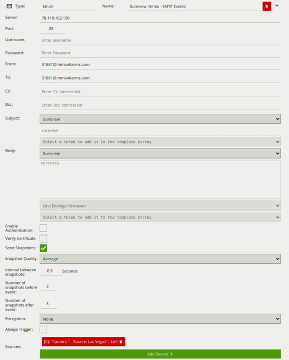

# Immix Configuration

## Configuring a VCA Device

1.  Add the VCA device. Click **Manage Devices and Alarms** an select **Add Device**.

2.  In the **Add Device** page, configure the following options:

    -   **Device Type Filter:** Select **Video Devices** from the available options.
    -   **Device Type:** Select `VCA Bridge` from the available devices.

    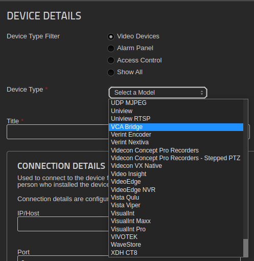

    -   **Title:** Enter a descriptive name for the device.
    -   **IP/Host:** Enter the IP address or hostname of the VCA device.
    -   **Port:** Enter the **RTSP** port of the VCA device.

    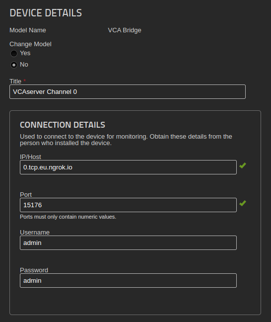

    -   Leave the rest of the values empty.

Once the device has been added, channels from the VCA device can be added. Immix currently supports only one VCA
channel per device. To support more channels, simply add more devices.

### Configuring a Channel

1.  To add a new channel, click **Cameras**. Then, click **Add a Camera**.

    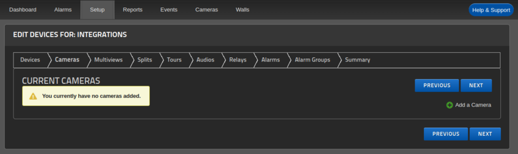

2.  Edit the camera as follows:

    -   **Input:** Enter the VCA channel Id + 1.
    -   **Camera Name:** Enter a suitable name for the channel.
    -   Leave the other settings with default values.

    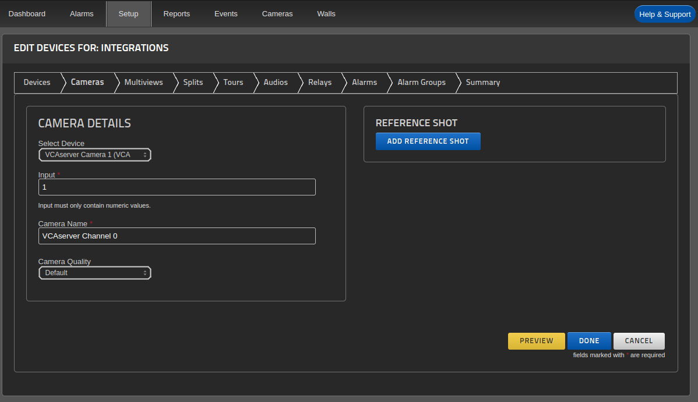

    -   Click **Done**.

In order to set the Input value correctly in Immix, the following steps should be followed:

1.  Find the channel Id in VCA.

2.  Set the value of the Input field in Immix to the channel Id in VCA +  1. The reason that the Immix Input is 1 higher
    than the VCA channel Id is that Immix uses `1-based` inputs but VCA uses `0-based` channel Ids.

|**Channel ID in VCA**|**Input in Immix** |
|:-------------------:|:-----------------:|
|0                    |1                  |
|3                    |4                  |
|12                   |13                 |

_Optionally, verify that the stream is being correctly received from the `VCA device`. Click on the video symbol._

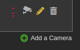

#### Generating the Summary

The Summary provides a single document with all of the details necessary to configure the VCAserver. Click the
**Summary tab** and a **PDF** report will be created.

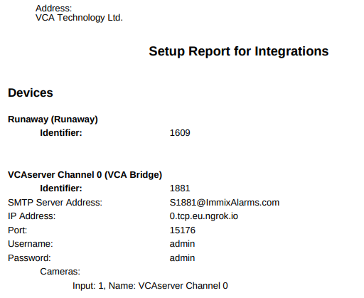

The SMTP Server Address needs to be entered in the VCA device configuration. Once a device and camera are configured in
Immix, the email addresses generated as part of the summary need to be added to the VCA device configuration.

## Verifying VCA Alarms on the Monitor

Every time the VCAserver sends an alarm to the Immix server, it will be reflected in the **Alarm** tab.

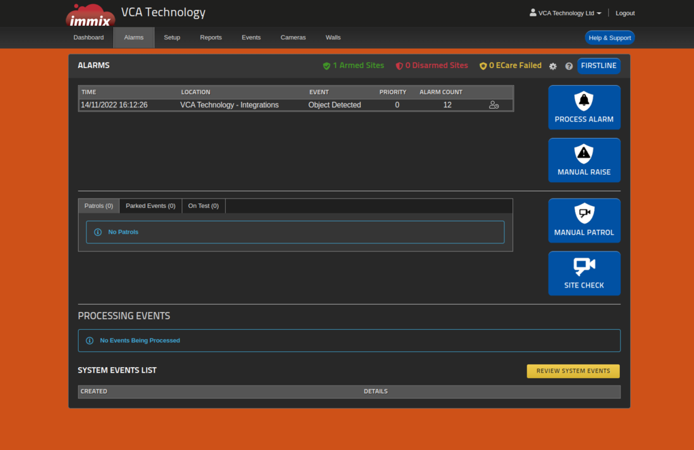

Click on the red alarm **Object Detected** to verify the details of the event.

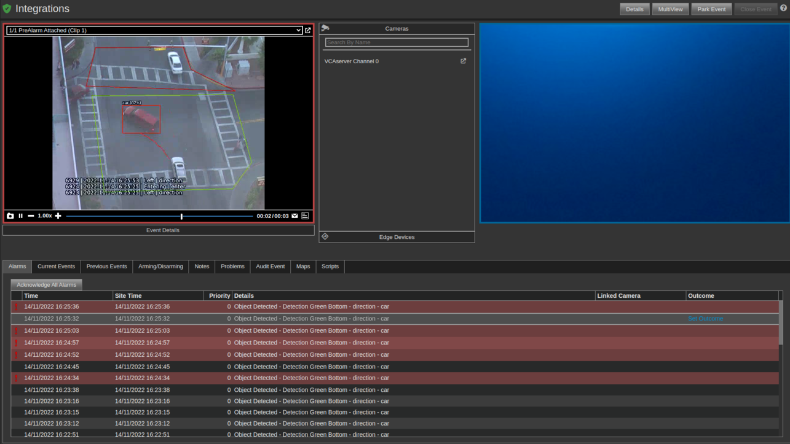

## Required Ports and XML Structure

The following table shows the **ports required** for integration with Immix:

|**From**     |**To**      |**Port**|**Use**                          |
|:------------|:-----------|:------:|:--------------------------------|
|Immix Server |VCA Device  |554 TCP |For receiving live video (RSTP)  |
|VCA Device   |Immix Server|25 TCP  |For alarms from the device (SMTP)|

The **XML format** required for sending alarms is as shown below:

```XML
<Alarm>
<VersionInfo> </VersionInfo>
<Input1> </Input1>
<EventType> </EventType>
<ExtraText> </ExtraText>
<DateTime> </DateTime>
<Location> </Location>
<URL> </URL>
</Alarm>
```

Where:

-   `VersionInfo`: This must be set as 1.
-   `Input1`: This is the number of the alarm. It can be any integer.
-   `EventType`: The SureView predefined events types.
-   `ExtraText`: Additional information about the event.
-   `DateTime`: The date-time of the alarm. The date-time format used in the email needs to be the same used on the
    Immix server, otherwise it will not be decoded.

-   `Location`: A physical location.
-   `URL`: A web link here that the operator can see and click on.

Additionally, the `VCAserver` sends alarms with the following XML format:

```XML
<Alarm>
<VersionInfo>1</VersionInfo>
<Input1>21</Input1>
<EventType>ObjectDetected</EventType>
<ExtraText>Zone 21 - Presence</ExtraText>
<DateTime>2019-07-10T14:58:26.557000000Z</DateTime>
</Alarm>
```
