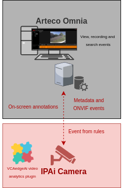
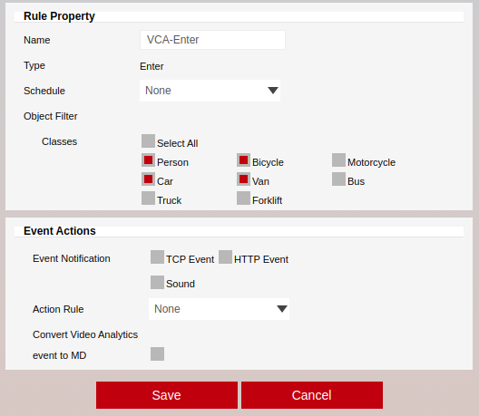
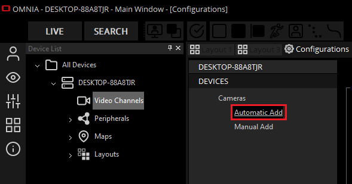
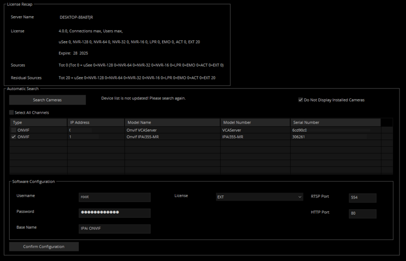
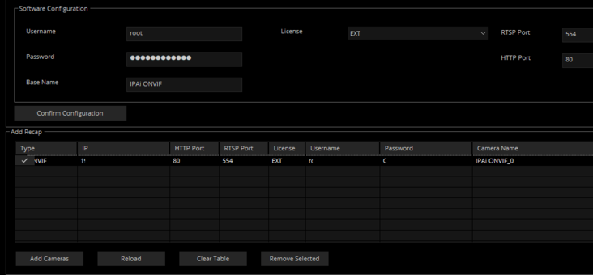
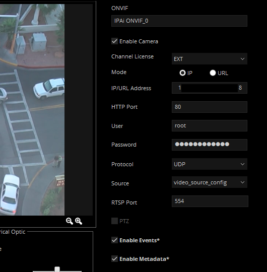
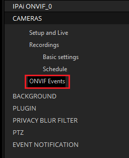
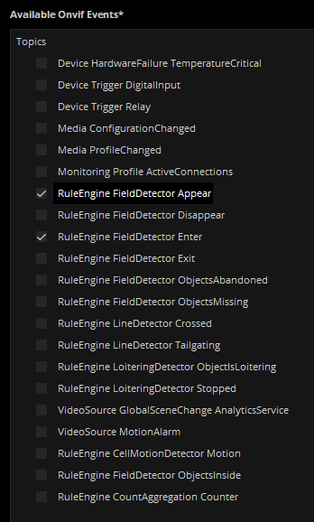
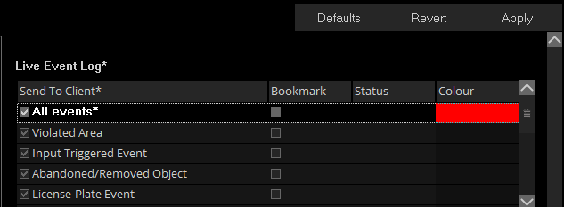
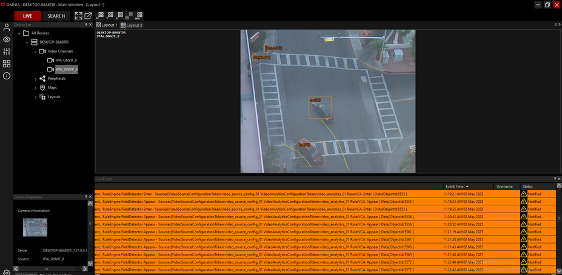

# Introduction

## Prerequisites

-   `IPAi` series camera.
-   `VCAedgeAi` video analytics plug-in version 1.1.147 or greater.
-   Arteco Omnia Suite 24.5.0 or greater.

## Supported Features

-   On-screen annotations.
-   ONVIF Events (appear, disappear, enter, exit, abandoned, crossed, tailgating, loitering, stopped, presence,
    counter, motion alarms).

## Architecture

For this integration, Arteco Omnia will connect to the camera and consume the ONVIF Metadata (object annotation) and
Events from the rules configured in the analytics plug-in.

# `IPAi` Camera Configuration

## Network Settings

1.  From the **Setup** menu, click on **NETWORK** and then, click on **NETWORK SETTINGS**.

    

2.  Note the **IP Setup** and **Port Setup** as these will be needed when connecting to the stream from the
    Arteco server.

    

## Configuring The VCAedge Plug-in

The `VCAedgeAi` plug-in is a set of analytical tools that can be loaded onto supported cameras. It provides the means to
perform advanced analytics and reduce false alerts when events occur. _Make sure you have a valid license that will_
_enable the `VCAedgeAi` engine and all the features available._

Configure the `VCAedgeAi` plug-in as required with the appropriate tracker, rules and a notification. A basic setup is
detailed below as an example.

### Enabling VCA

1.  From the **Setup** menu, click on **VCA** in the left side. Then, click on **ENABLE**.

    

2.  In *General Settings*, turn on the video analytics features. Then, select the *Tracker Engine* from the available
    options.

    _Note: The available classifiers are different depending on the hardware platform and the installed license._

3.  click **Apply** located at the bottom to save the configuration.

    

### Creating Rules

1.  From the **VCAedge** menu, click on **RULES** in the left side.

    

2.  Click **Add** located at the bottom to display a list of available rules.

    

3.  Select a single rule to trigger an event and modify the **Rule property** as follows:

    -   Position the rule on the scene and change the shape as required. You can add/remove nodes to create complex
        shapes.
    -   In **Object Filter**, tick the box against the **Classes** that the rule should trigger events only.

        

        _Note: The available classifiers are different depending on the hardware platform and the installed license._

4.  Click **Save** located at the bottom to save the configuration.

5.  Click **OK** to confirm the settings.

# Arteco Omnia Configuration

## Configuring a New Camera

1.  First, we add a new camera into the system. Click on the **cog icon** at the bottom to switch to the
    *Configurations* environment.

    

2.  In the *Device List* configuration tree, select the server you want to add the camera on.

    

3.  Click **Video Channels** on the left menu.

4.  In *DEVICES*, click on **Automatic Add** from the available options.

    

5.  If required, click the **Search Cameras** button​ to enable ​the Arteco ​server to find the camera on your network.

6.  Tick the box against the `IPAi` camera and configure the *Software Configuration* table as follows:

    -   Enter the **Username** and **Password** to access the camera.
    -   **Base Name:** Type a descriptive name for the camera.

        

    -   Then, click **Confirm Configuration** to save the configuration.

7.  In *Add Recap*, click on **Add Cameras** and **OK** to confirm adding the camera.

    

    

8.  Click **OK** to close the window.

    

## Enabling ONVIF Metadata and Events

1.  In the *Setup and Live* page, navigate to the ONVIF properties on the right side.

2.  Then, tick the box against **Enable Events** and **Enable Metadata**.

    

3.  Click **Apply** to save the configuration.

### Adding ONVIF Events

1.  Click **ONVIF Events** on the left menu.

    

2.  In the *Available `Onvif` Events* page, tick the box against the available list of events you want to get
    notifications from.

    

3.  Click **Apply** to save the configuration.

## Configuring Event Notification

1.  The next step is to configure the event notification. From the *CAMERAS* menu, click on **EVENT NOTIFICATION**.
    Then, click on **Channel Events**.

2.  In *Live Event Log*, modify the notification as illustrated below:

    -   **Send To Client:** Tick the box against **All events**.
    -   **Bookmark:** Tick the box against **All events**.
    -   **Status:** Select the status you want to assign to the notifications from the drop-down list.
    -   **Colour:** Select the colour to identify the notifications and click **OK**.
    -   Click **Apply** to save the configuration.

        

## Verifying the `VCAedgeAi` ONVIF Events

From the **LIVE** page, review the **Live Event** panel located at the bottom where the bookmarks will appear when the
`VCAedgeAi` plug-in generates a new event. The bookmarks contain a description about each event (device that generates
the notification, event type, source, the rule engine that triggers the event, object ID).

You can also verify the **Event Properties** that shows the analytics plug-in metadata with recording by selecting each
event.
