# Introduction

## Prerequisites

-   `IPAi` series camera.
-   `VCAedgeAi` video analytics plug-in version 1.1.147 or greater.
-   Avigilon ACC7.

## Supported Features

-   `VCAedgeAi` events from rules (appear, disappear, enter, exit, tailgating, loitering).

## Architecture

Avigilon ACC will connect to the `IPAi` camera to consume the events provided. The integration does not require the
configuration of VCA notifications to send events to the VMS. The only requirement is that VCA rules are defined.

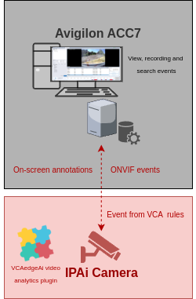

# `IPAi` Camera Configuration

## Network Settings

1.  From the **Setup** menu, click on **NETWORK** and then, click on **NETWORK SETTINGS**.

    

2.  Note the **IP Setup** and **Port Setup** as these will be needed when connecting to the stream from the Avigilon
    server.

    

## Configuring the `VCAedgeAi` plug-in

The `VCAedgeAi` plug-in is a set of analytical tools that can be loaded onto supported cameras. It provides the means to
perform advanced analytics and reduce false alerts when events occur. _Make sure you have a valid license that will_
_enable the `VCAedgeAi` engine and all the features available._

Configure the `VCAedgeAi` plug-in as required with the appropriate tracker, rules and a notification. A basic setup is
detailed below as an example.

### Enabling VCA

1.  From the Setup menu, click on **VCA** in the left side. Then, click on **ENABLE**.

    

2.  In *General Settings*, turn on the video analytics features. Then, select the *Tracker Engine* from the available
    options.

3.  click **Apply** to save the configuration.

    

### Creating Rules

1.  From the **VCA** menu, click on **RULES** in the left side.

    

2.  Click **Add** located at the bottom to display a list of available rules.

    

3.  Select a single rule to trigger an event and modify the **Rule property** as follows:

    -   Position the rule on the scene and change the shape as required. You can add/remove nodes to create complex
        shapes.

    -   In *Object Filter*, tick the box against the **Classes** that the rule should trigger events only.

        

4.  Click **Save** located at the bottom to save the configuration.

5.  Click **OK** to confirm the settings.

# Avigilon ACC Configuration

## Adding a Camera Manually

1.  From the *Setup* menu, click on **Connect/Disconnect Devices**.

    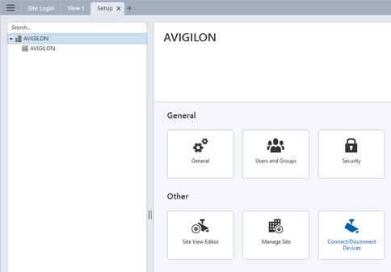

2.  Click **Find Device..** on the top left to add a new device manually.

    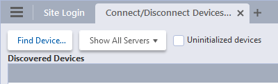

3.  In *Find Device*, adjust the table as illustrated below:

    -   **Device Type**: Select **ONVIF** from the drop-down list.
    -   **IP Address/Hostname**: Enter the IP Address or hostname to connect to the camera.
    -   **Control Port**: Enter the web port configured for the camera (default port is 80).
    -   **User Name**: Enter the username to access the camera.
    -   **Password**: Enter the password to access the camera.
    -   Click **OK** to confirm the connection.

        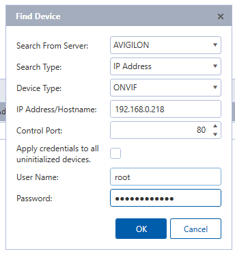

4.  In the *Discovered Devices* pop-up window, click **Connect** to connect to the automatically discovered `IP-Camera`.

    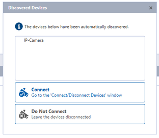

5.  In the *Connected Devices* table, click **Connect** to confirm connecting to the camera.

    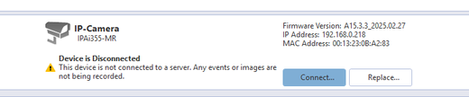

6.  In the *Connect Device* pop-up window, verify that all properties are configured correctly and then click **OK**.

    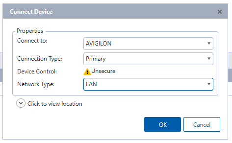

7.  Verify that the connection status in the table indicates 'Connected'.

## Subscribing to ONVIF Events

1.  Click on the **New Task** icon on top left to enable the side menu.

    

2.  Navigate to the *Manage* section and click **Site Setup**.

    

3.  Select the camera you want to get the ONVIF events from and click **ONVIF Event Subscription**.

    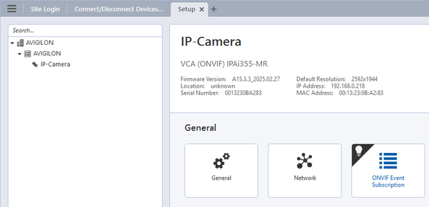

4.  Click **Add** to subscribe to a new event as a rule trigger or motion event. Then, check the available events that
    the camera supports in ACC and select the corresponding rule from the drop-down list and click **OK** to confirm.

    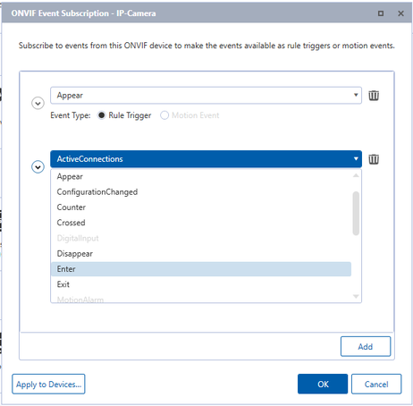

    _Note: You can hover over each event to verify the required ONVIF event type._

## Creating Alarms

​Alarms are custom rules for cameras and devices and can be monitored in the Alarms tab. A basic setup is detailed below
as an example:

1.  From the *Setup* view, click on the Avigilon server name to display the main menu.

    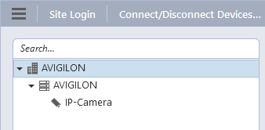

2.  Click **Alarms**.

    

3.  In the pop-up window, click **Add** to create a new alarm.

    

    -   **Select Alarm Trigger Source**: Select **External Software Event** from the drop-down list. Then, click
        **Next**.

        

    -   **Select Linked Devices**: Tick the box against the camera and click **Next**.

        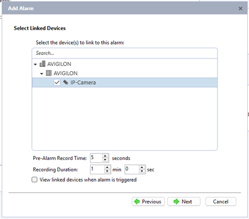

    -   **Select Alarm Recipients** and click **Next**.

        

    -   **Select Alarm Acknowledgement Action** if required and click **Next**.

    -   Enter a descriptive **Name** and click **Finish** to confirm creating the alarm. Then click **Close** to close
        the window.

        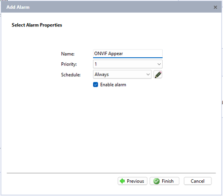

## Creating Rules

Rules tell the system what to do when an event occurs and can be monitored in the Event tab. A basic setup is detailed
below as an example:

1.  From the *Setup* view, click on the Avigilon server name to display the main menu.

    

2.  Click **Rules**.

    

3.  In the pop-up window, click **Add** to create a new rule.

    

4.  In *Rule Setup*, select the event(s) that will trigger the rule action. Navigate to **Device Events** and select
    **ONVIF event started** from the available list.

5.  Adjust the rule as follows:

    -   **When any ONVIF event**: Select the ONVIF event you want to get alarms from and click **OK**. _You can select_
        _any ONVIF event or tick the box against a specific rule._

        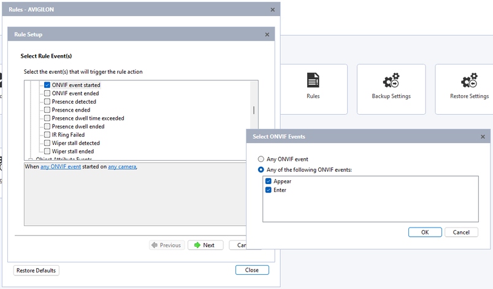

    -   **started on any camera**: Select the cameras and click **OK** to confirm. _You can select any camera on tick_
        _the box against a specific device._

        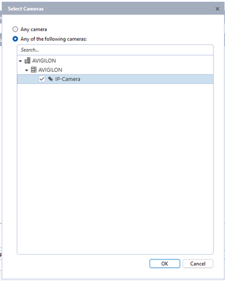

    -   Click **Next**.

    -   Select the Rule Action(s). Navigate to *Alarm Actions* and tick the box against **Trigger an alarm**.

        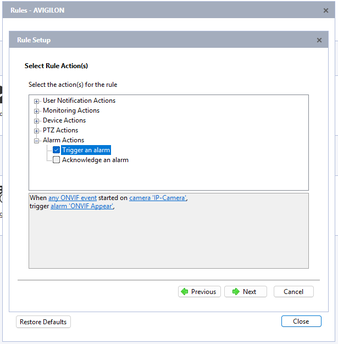

    -   Adjust the alarm as follows:
        -   **trigger an alarm**: Select the alarm created previously and click **OK**.

            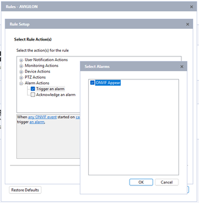

    -   Click **Next**.

    -   Add **Rule Condition(s)** if required and click **Next**.

    -   Enter a descriptive **Name** and click **Finish** to confirm creating the alarm. Then click **Close** to close
        the window.

        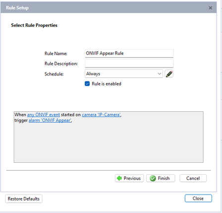

    _Note: for more information on subscribing to ONVIF events, creating alarms and rules please visit_
    [Avigilon ACC online documentation](https://docs.avigilon.com/bundle/acc-client-7-14/page/ACCClient/acc-client.htm)

## Reviewing Alarms and ONVIF Events

### Alarms

1.  Click on the **New Task** icon at top left to enable the side menu.

2.  Navigate to the *Search* section and click **Alarms**.

    

3.  Select the *Alarms to Search* and *Date Range* to display the results.

    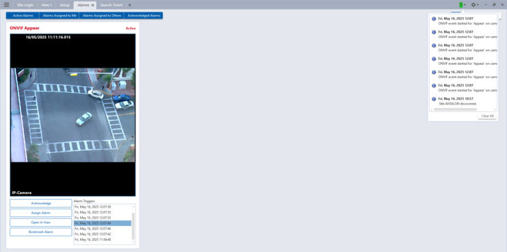

### ONVIF Events

1.  Click on the **New Task** icon at top left to enable the side menu.

2.  Navigate to the *Search* section and click **Events**.

    

3.  Tick the box against the *Camera(s) to Search*, select the *Date Range* and tick the box against **ONVIF** from the
    *Events to Search for* list to display the results.

    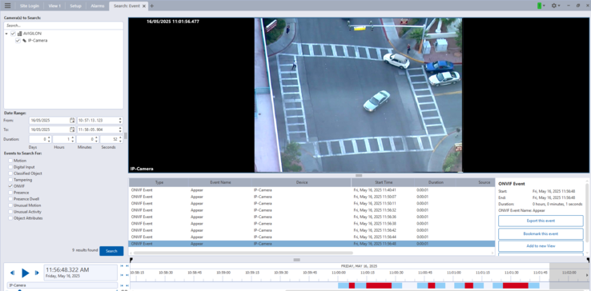
