# Introduction

## Prerequisites

-   `IPAi` series camera.
-   `VCAedgeAi` video analytics plug-in version 1.1.124 or greater.
-   Luxriot EVO S 1.28 or greater.

## Supported Features

-   All `VCAedgeAi` event methods are available.

## Architecture

Luxriot EVO S will connect to the `IPAi` camera to consume the events provided. The integration does not require the
configuration of VCA notifications to send events to the VMS. The only requirement is that VCA rules are defined.

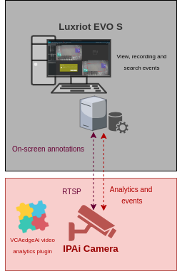

# `IPAi` Camera Configuration

## Video & Audio Settings

### Confirming the RTSP stream used for transmitting video footage

Check and change if required, the RTSP stream settings used by the IP camera for external connections to the channels.

1.  From the **Setup** menu, click on **VIDEO & AUDIO** and then, click on **VIDEO**.

    

2.  Note the *Live Video Channel* settings as these will be needed when connecting to the RTSP stream from the VMS
    server.

    

## Network Settings

### Confirming the RTSP port used for transmitting video footage

Check and change if required, the RTSP port used by the IP camera for external connections to the channels.

1.  From the Setup menu, click on **NETWORK** and then, click on **NETWORK SETTINGS**.

    

2.  Note the **IP Setup** and **Port Setup** as these will be needed when connecting to the RTSP stream from the VMS
    server.

    

## Configuring the `VCAedgeAi` plug-in

The `VCAedgeAi` plug-in is a set of analytical tools that can be loaded onto supported cameras. It provides the means to
perform advanced analytics and reduce false alerts when events occur. _Make sure you have a valid license that will_
_enable the `VCAedgeAi` engine and all the features available._

Configure the `VCAedgeAi` plug-in as required with the appropriate tracker, rules and a notification. A basic setup is
detailed below as an example.

### Enabling VCA

1.  From the Setup menu, click on **VCA** in the left side. Then, click on **ENABLE**.

    

2.  In *General Settings*, turn on the video analytics features. Then, select the *Tracker Engine* from the available
    options.

3.  click **Apply** to save the configuration.

    

### Creating Rules

1.  From the **VCA** menu, click on **RULES** in the left side.

    

2.  Click **Add** located at the bottom to display a list of available rules.

    

3.  Select a single rule to trigger an event and modify the **Rule property** as follows:

    -   Position the rule on the scene and change the shape as required. You can add/remove nodes to create complex
        shapes.

    -   In *Object Filter*, tick the box against the **Classes** that the rule should trigger events only.

        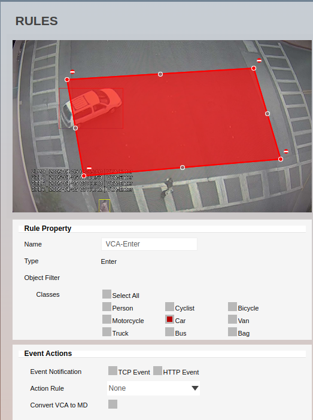

4.  Click **Save** located at the bottom to save the configuration.

5.  Click **OK** to confirm the settings.

# Luxriot EVO S Configuration

## Configuring a Device

1.  First we add a new device. From the left menu, click on **Devices**. Then, click **New Device** located top.

    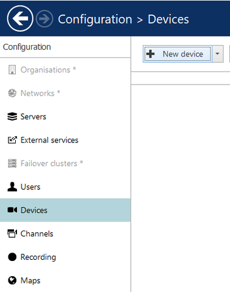

2.  Click **Select Model** and type _ONVIF_ in the search bar.

3.  Select **(Generic) ONVIF Compatible** from the available options and click **OK**.

    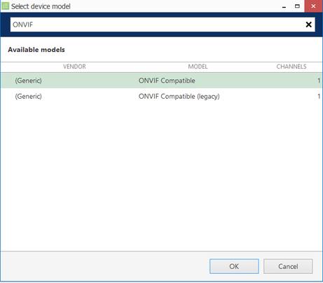

4.  Enter a descriptive **Title** for the new device.

    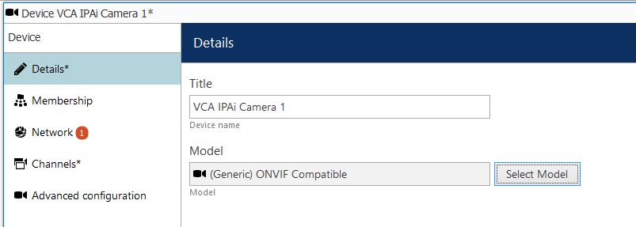

5.  Switch to **Network** and configure the connection as follows:

    -   **Host:** Enter IP address of the camera.
    -   **Port:** Enter the web port of the camera.
    -   Enter the **username** and **password** to access the device.
    -   Click **Apply**.

        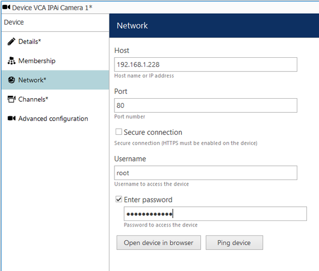

6.  Click **OK** to finish creating the new device.

​   _Verify that the camera has been configured successfully, select the newly created device and click View Channel at_
   _the top. Then, click on Show Video​ to display the live stream._

## Creating Events, Actions, and Rules

### Creating Events

Next, we need to configure the events, actions, and rules that will be sending notifications to the Luxriot Monitor.
First, we create an new event as follows:

1.  From the left menu, click on **Events & Actions**.

2.  Then, click **Events** and **New Event** at top.

    

3.  In *Channel related (3)*, select **VCA event** from the available options and click **OK**.

    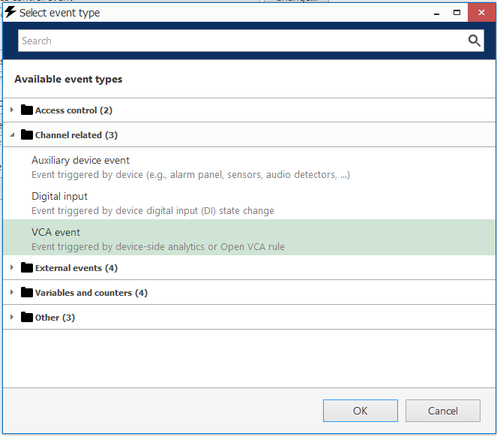

4.  Then, configure the details of Event as follows:

    -   **Title:** Enter the name of the VCA rule.
    -   **Source:** Click **Change** and select the `IPAi` camera. Then, click **OK** to confirm and close the window.

        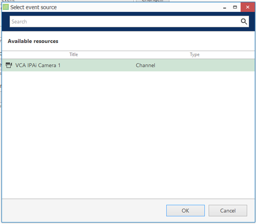

    -   **VCA Rule:** Click **Change** and select the VCA rule from the available list (the [rule](#creating-rules)
        configured in the `VCAedgeAi` plug-in). Then, click **OK** to confirm and close the *VCA rules* window.

        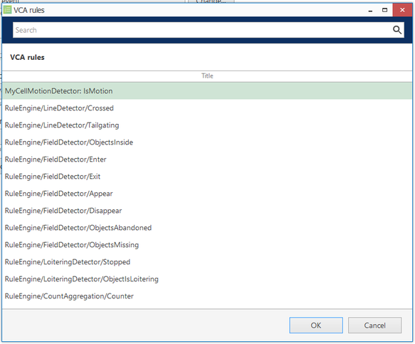

5.  Click **OK** to confirm the settings and close the Event window.

    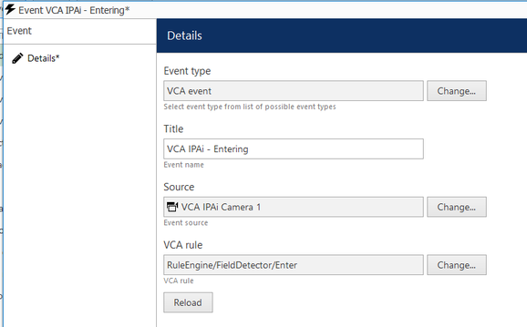

### Creating Actions

1.  The next step is to create a new action. From the left menu, click **Actions**  and **New action**.

    

2.  In *Notifications (6)*, select **Send event to client** from the available types.

    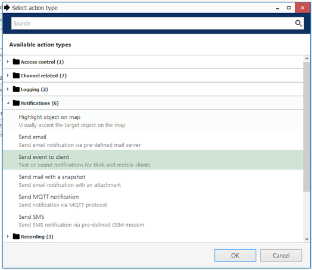

3.  Then, configure the notification as follows:

    -   **Title:** Enter a descriptive name for the notification.
    -   **Message:** Click the **Insert field** button located top right to add the fields that will contain the details
        of the events in the notification.

        

    -   **Enable** Display events in alerts, Display a warning message box and Display event in notification panel.

        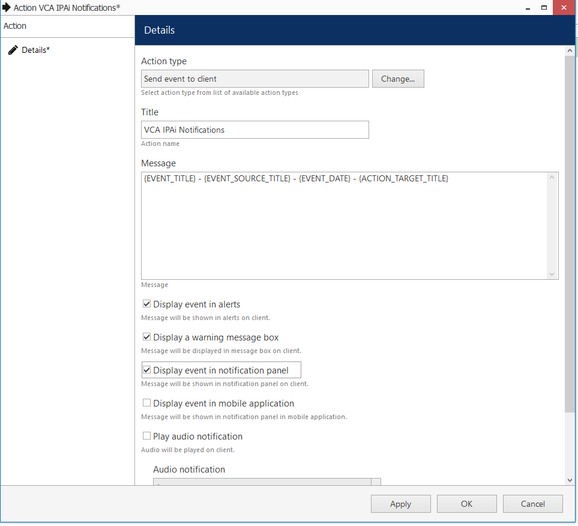

4.  Click **OK** to confirm and close the Actions window.

### Creating Rules

1.  The last step is to create a new rule. From the left menu, click **Rules** and `Open configurator`.

    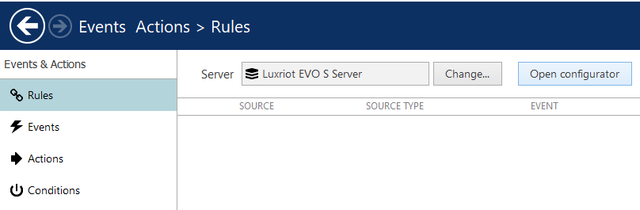

2.  In the _Events and Actions_ `configurator` page, you will see three boxes associated with Events, Rules, and
    Actions.

3.  In *Events*, select the **VCA event** created previously and move it into the Rules box by clicking the greater
    than button **>**.

4.  In *Actions*, select the **Notification** created previously and move it into the Rules box by clicking the less
    than button **<**.

5.  Then, configure the *Rules* as follows:

    -   Click **Target channel** at the bottom. In the pop-up window, select the camera and click **OK** to confirm.
    -   Click **Schedule** at the bottom to configure the schedule for the events, and click **OK** to confirm.

6.  Click **OK** to save the rule configuration.

    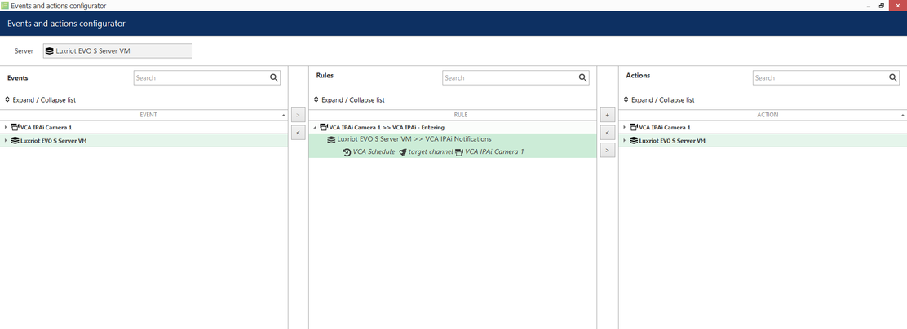

_Optionally, you can test this Rule by clicking the Test button located top. The notification will appear on the_
_Luxriot Monitor interface._

## Verifying VCA Events on the Luxriot Monitor

From the Luxriot EVO S Monitor interface, you can verify the events. Every time the​ `VCAedgeAi` plug-in​ triggers a rule,
a new notification will pop-up on the **Live** page:

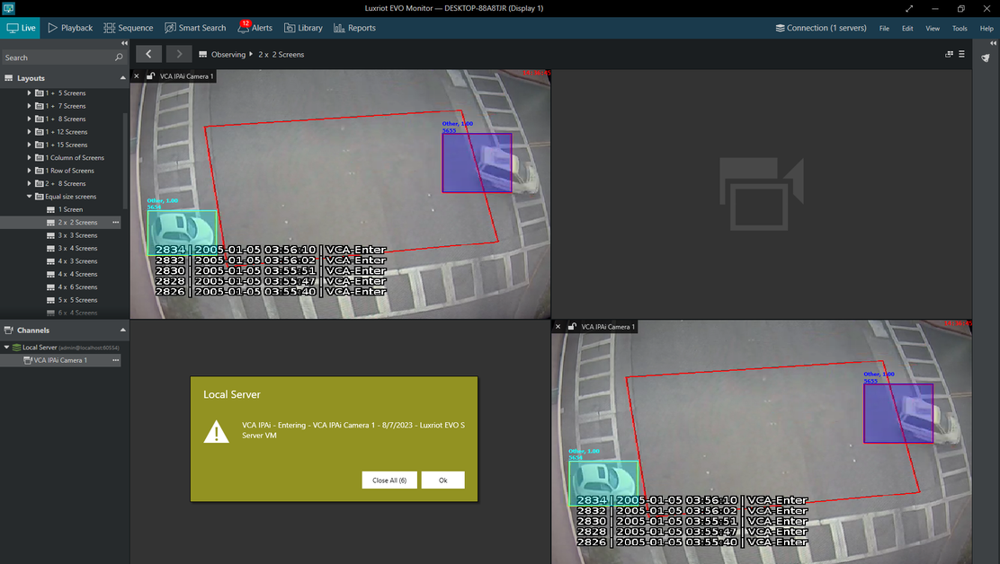

The notifications will be listed on the **Alerts** page:

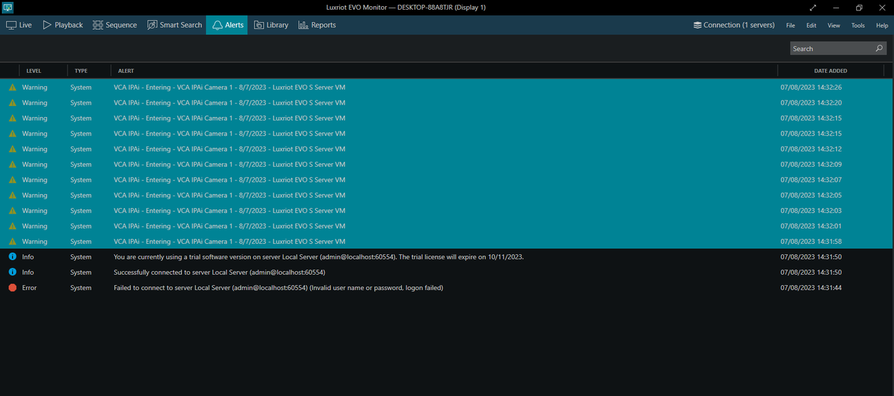
