# Introduction

## Prerequisites

-   `IPAi` series camera.
-   `VCAedgeAi` video analytics plug-in version 1.1.147 or greater.
-   Milestone XProtect Professional+ 2025 R1 or greater.

## Supported features

-   ONVIF Metadata Search (People and Vehicle type).
-   ONVIF Events (appear, disappear, enter, exit, tailgating, loitering).

## Architecture

Milestone Professional+ will connect to the camera and consume the ONVIF Metadata (object annotation and class) and
Events from the rules configured in the plug-in.

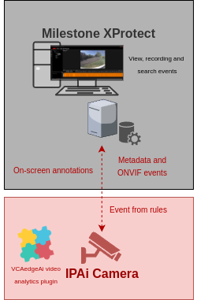

# `IPAi` Camera Configuration

## Video & Audio Settings

### Confirming the RTSP stream used for transmitting video footage

Check and change if required, the RTSP stream settings used by the IP camera for external connections to the channels.

1.  From the **Setup** menu, click on **VIDEO & AUDIO** and then, click on **VIDEO**.

    

2.  Note the *Live Video Channel* settings as these will be needed when connecting to the RTSP stream from the Obseron
    server.

    

## Network Settings

### Confirming the RTSP port used for transmitting video footage

Check and change if required, the RTSP port used by the IP camera for external connections to the channels.

1.  From the **Setup** menu, click on **NETWORK** and then, click on **NETWORK SETTINGS**.

    

2.  Note the **IP Setup** and **Port Setup** as these will be needed when connecting to the RTSP stream from the Obseron
    server.

    

## Configuring the `VCAedgeAi` plug-in

The `VCAedgeAi` plug-in is a set of analytical tools that can be loaded onto supported cameras. It provides the means to
perform advanced analytics and reduce false alerts when events occur. _Make sure you have a valid license that will_
_enable the `VCAedgeAi` engine and all the features available._

Configure the `VCAedgeAi` plug-in as required with the appropriate tracker, rules and a notification. A basic setup is
detailed below as an example.

### Enabling VCA

1.  From the Setup menu, click on **VCA** in the left side. Then, click on **ENABLE**.

    

2.  In *General Settings*, turn on the video analytics features. Then, select the *Tracker Engine* from the available
    options.

3.  click **Apply** to save the configuration.

    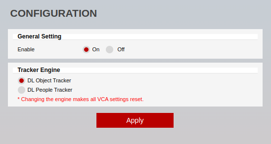

### Creating Rules

1.  From the **VCA** menu, click on **RULES** in the left side.

    

2.  Click **Add** located at the bottom to display a list of available rules.

    

3.  Select a single rule to trigger an event and modify the **Rule property** as follows:

    -   Position the rule on the scene and change the shape as required. You can add/remove nodes to create complex
        shapes.

    -   In *Object Filter*, tick the box against the **Classes** that the rule should trigger events only.

        

4.  Click **Save** located at the bottom to save the configuration.

5.  Click **OK** to confirm the settings.

For more information on configuring the camera or `VCAedgeAi` video analytics plug-in, please refer to the
[`IPAi` Cameras Documentation](https://drive.google.com/drive/folders/1Iw_kIu9toqDVsxjK4zg0M_rqR-ddL3V8).

# Milestone Management Client Configuration

## Adding a New Hardware

1.  Click **Recording Server** in the left menu. Then, right clicking on the Server and select **Add Hardware**.

    

2.  In the pop-up screen, select **Manual** from the options and click **Next**.

    

3.  Specify the **credentials** to connect to the camera.

    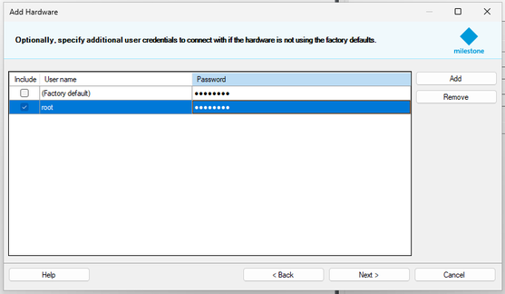

4.  Select which drivers to use when scanning the hardware. Expand **Other** and tick the box against **ONVIF**
    **`Conformant` Device**. Then, click **Next**.

    

5.  Enter the network address and web port of the camera you want to add. Optionally, you can select the hardware
    model to speed up detection. Click **Next**.

    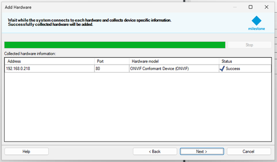

6.  Wait while the camera is being detected. Once detection has been completed successfully, tick the box against
    the hardware and click **Next**.

    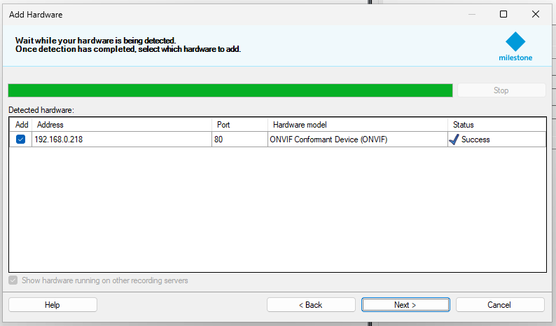

7.  Tick the box against **Metadata Port:** to add the feature and click **Next**.

    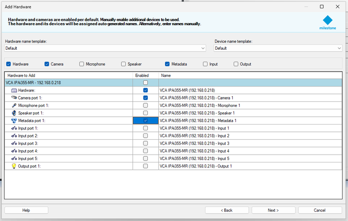

8.  Select default or individual *Group* for the device.

    _If no groups exist then you can create a new group for your device by selecting the create new group icon on the_
    _left._

    

9.  Click **Finish** to confirm the process.

## Enabling Metadata Search

1.  Expand the *Metadata Use* menu on the left and click **Metadata Search** to enable the search filter in `XProctect`
    Smart Client.

    

2.  Tick the corresponding box against **People** or **Vehicles** as follows:

    -   **Vehicles**: Enable **Vehicle type** and click the **save** button on the top left.

        

    -   Enable **People** and click the **save** button on the top left.

        

## Adding ONVIF Events

1.  Expand the *Devices* menu on the left and click **Cameras**.

    

2.  In *Properties*, click **Events** to star adding the ONVIF events.

3.  In the *Configured events* page, click **Add...** to display the list of available events.
    *The ONVIF events start with*`(Dynamic/RuleEngine/...)`.

    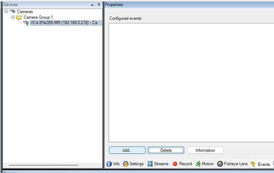

4.  Select the *Driver Event* that matches the rule configured within the `VCAedgeAi` plug-in and click **OK**.

    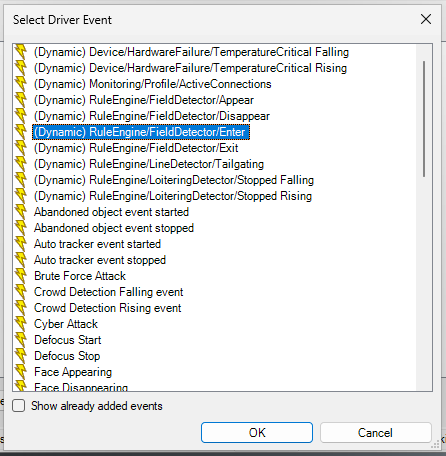

5.  Click the **save** button on the top left to confirm.

## Creating Alarm Definitions

Creating the alarm definition is required to link the event type created in the previous step to the channel which
will receive the events.

1.  Expand the *Alarms* menu on the left and click **Alarm Definitions**.

    

2.  Right click on *Alarm Definitions* and select **Add New...** to create a new alarm.

    

3.  Configure the new alarm as illustrated below:

    -   **Name**: Enter a descriptive **name** for the alarm.
    -   **Triggering event**: Select **Device events**. In the drop-down list below, select the specific ONVIF event
        added to the camera previously.
    -   **Sources**: Select the camera that this alarm will be link to.
    -   **Related sources**: Select the camera that this alarm will be link to.

        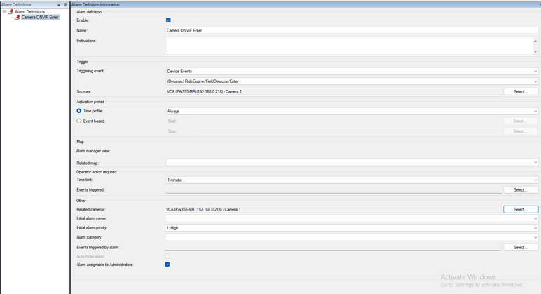

    -   **Save** the configuration.

## Verifying the Events in the Smart Client

In the XProtect Smart Client, the ONVIF events will be listed in the  **Alarm Manager** page as well as the metadata of
each object as follows:

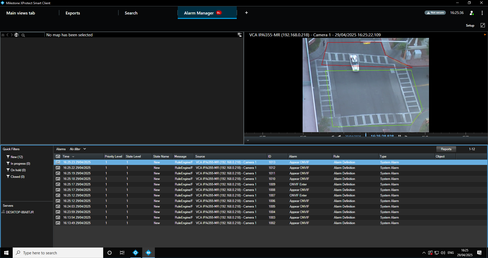

Navigate to the **Search** page to review the ONVIF metadata. You can filter by camera, object type and review
recordings:

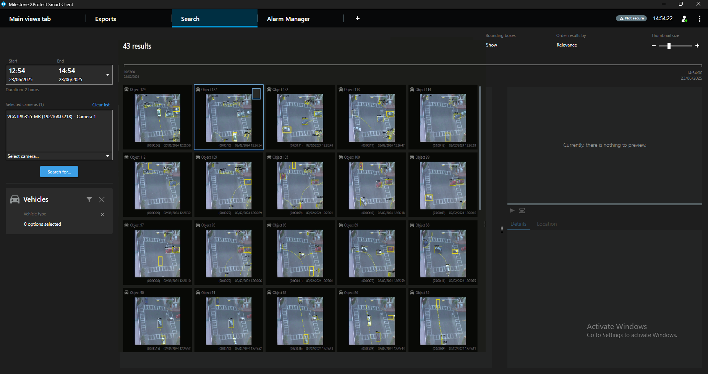
