# Introduction

## Prerequisites

-   `IPAi` series camera.
-   `VCAedgeAi` video analytics plug-in version 1.1.147 or greater.
-   Nx Witness VMS version 6.0 or greater.

## Supported features

-   All VCAedge event notification methods are available.

## Architecture

In this integration, the Nx Witness VMS receives the annotated RTSP stream from the IP camera and the Generic Events
are sent using the HTTP notification with tokens containing details about the event.

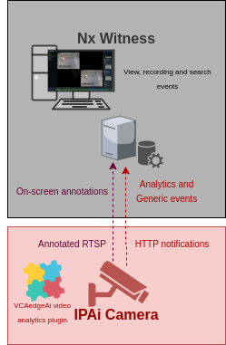

# `IPAi` Camera Configuration

## Video & Audio Settings

### Confirming the RTSP stream used for transmitting video footage

Check and change if required, the RTSP stream settings used by the IP camera for external connections to the channels.

1.  From the **Setup** menu, click on **VIDEO & AUDIO** and then, click on **VIDEO**.

    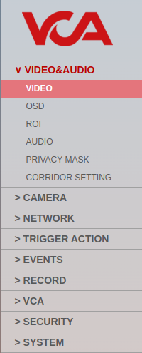

2.  Note the *Live Video Channel* settings as these will be needed when connecting to the RTSP stream from the Nx
    Witness server.

    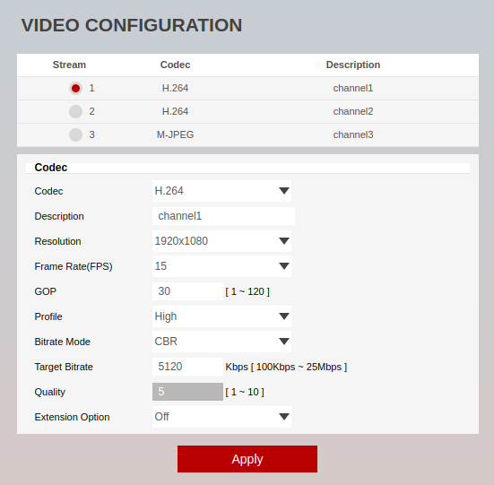

## Network Settings

### Confirming the RTSP port used for transmitting video footage

Check and change if required, the RTSP port used by the IP camera for external connections to the channels.

1.  From the **Setup** menu, click on **NETWORK** and then, click on **NETWORK SETTINGS**.

    

2.  Note the **IP Setup** and **Port Setup** as these will be needed when connecting to the RTSP stream from the Nx
    Witness server.

    

## Configuring The VCAedge Plug-in

The VCAedge plug-in is a set of analytical tools that can be loaded onto supported cameras. It provides the means to
perform advanced analytics and reduce false alerts when events occur. _Make sure you have a valid license that will_
_enable the VCAedge engine and all the features available._

Configure the VCAedge plug-in as required with the appropriate tracker, rules and a notification. A basic setup is
detailed below as an example.

### Enabling VCA

1.  From the **Setup** menu, click on **VCA** in the left side. Then, click on **ENABLE**.

    

2.  In *General Settings*, turn on the video analytics features. Then, select the *Tracker Engine* from the available
    options.

    _Note: The available classifiers are different depending on the hardware platform and the installed license._

3.  click **Apply** located at the bottom to save the configuration.

    

### Creating Rules

1.  From the **VCAedge** menu, click on **RULES** in the left side.

    

2.  Click **Add** located at the bottom to display a list of available rules.

    

3.  Select a single rule to trigger an event and modify the **Rule property** as follows:

    -   Position the rule on the scene and change the shape as required. You can add/remove nodes to create complex
        shapes.
    -   In **Object Filter**, tick the box against the **Classes** that the rule should trigger events only.

        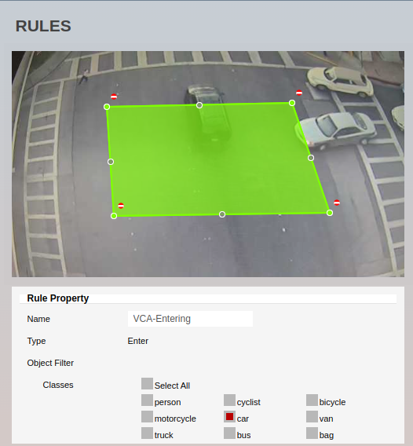

        _Note: The available classifiers are different depending on the hardware platform and the installed license._

4.  Then, define the action that will occur when the rule triggers an event in **Event Actions** as follows:

    -   In **Event Notification**, tick the box against the **HTTP Event** to enable HTTP notifications when a
        event occurs.
    -   In **Triggered By**, define when the notification will be sent. The available options are:
        -   **Object:** Send notification for each object triggering the rule.
        -   **Rule:** Send a notification every time the rule is triggered.
    -   In **Triggered At**, select one of the following options:
        -   **Object:** Choose between the **begin** of the object triggering the rule as it enters the zones or
             the **end** of the object triggering the rule as it leaves the zone. _A notification will be sent for each_
             _object triggering the rule._
        -   **Rule:** From the **begin** point of the first object to trigger the rule to the **end** point of the last
            object to trigger the rule. _A notification will be sent for each triggering of the rule._

        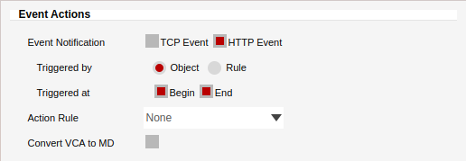

5.  Click **Save** located at the bottom to save the configuration.

6.  Click **OK** to confirm the settings.

### Creating HTTP Notifications

The HTTP notification sends a HTTP request to a remote endpoint when triggered. The URL, HTTP header and message body
are all configurable with a mixture of plain text and tokens. Tokens are used to represent the event metadata that
will be included when a rule is triggered.

1.  From the **VCAedge** menu, click on **HTTP NOTIFICATION** in the left side.

    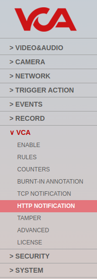

2.  In **General Settings**, turn on the notification feature.

3.  In **HTTP Settings**, configure the HTTP request as follows:

    -   In **Send To**, select **Custom** from the available options.
    -   In **URL**, enter the `CreateEvent` API call required by the Nx server. Example:
        `https://<IP_address:7001/api/createEvent`.
    -   In **Method**, select **POST** from the available options.
    -   Select the **raw** format for the data to be sent.
    -   In **User ID**, enter the username to access the Nx Witness server.
    -   In **Password**, enter the password to access the Nx Witness server.

4.  Edit the **Body** of the HTTP notification as follow:

    -   **Content-Type**: Select **`application/json`** from the drop-down list.
    -   **Rule**: Add the [required JSON object message](#generating-the-createevent-api-call) with some VCA tokens.

         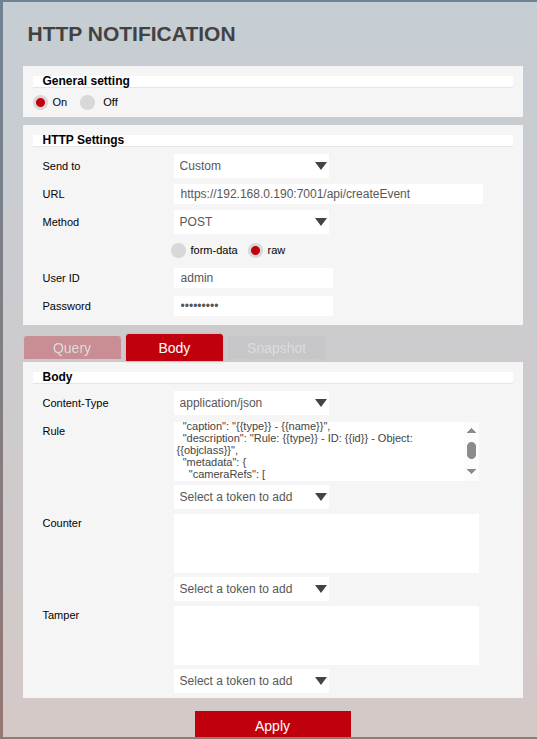

5.  Click **Apply** located at the bottom to save the configuration.

6.  Click **OK** to confirm configuring the notification.

For this integration, the following tokens were used to send an information on the camera, zone, rule type and
classification that triggered the event:

-   `{{id}}`: The unique id of the event.
-   `{{datetime}}`: The event time in the format `DD MM D HH:MM:SS YYYY Tue Jan 1 12:00:00 2019`.
-   `{{name}}`: The name of the event.
-   `{{type}}`: The type of the event. This is usually the type of rule that triggered the event.
-   `{{objclass}}`: The DL classification of the object triggering the rule.

For more information on creating and configuring VCA in `IPAi` cameras, please refer to the `VCAedgeAi` Plug-in Manual.

# Nx Witness Configuration

## Configuring the `IPAi` RTSP Stream

1.  First, we add a new device into the system. From the left menu, right-click on the server you want to add the RTSP
    stream to. Then, select **Add Device** from the list.

    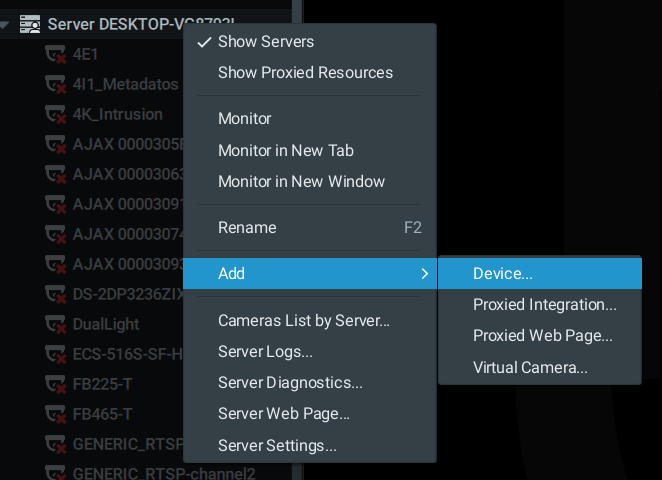

2.  In the **Add Devices** window, configure the VCA RTSP stream as follows:

    -   **Address:** Enter the RTSP URL of the VCA channel. The default format is:

        `rtsp://<IP_address>:<RTSP_port>/<description>`.

    -   **Port:** Unchecked the default option and enter the RTSP port configured in the `IPAi` camera.
    -   **Login:** Enter the username to access the camera
    -   **Password:** Enter the password to access the camera.
    -   Then, click **Search** and wait until the generic RTSP is listed in the window.
    -   Select the new device and Click **Add all devices**.

        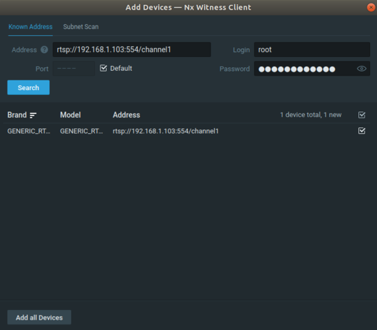

    _Note: You can rename the device by right clicking and selecting Rename._

### Getting the Camera ID

1.  Right-click on the camera view and select **Camera Settings...** from the menu.

    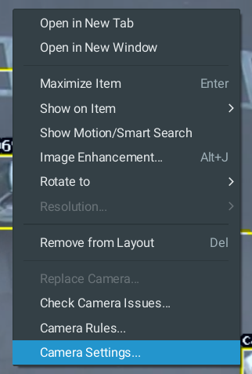

2.  In *General*, expand **More Info** to display the camera ID.

3.  **Copy** the string and **close** the window.

    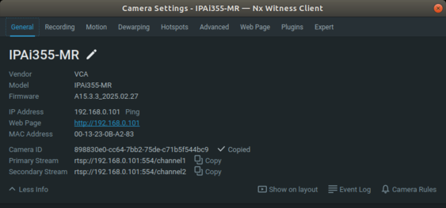

### Configuring the Recording

Optionally, we can record the generic events generated by the VCAedge plug-in. Right-click on the camera screen and
select​ **Camera Settings​** from the options.

1.  In the *Camera settings* pop-screen, click on **Recording** and **toggle** to enable the option.

    _If required, we can schedule the recording of the events. To do this, select the type of recording (Always or_
    _Motion Only) for the days._

    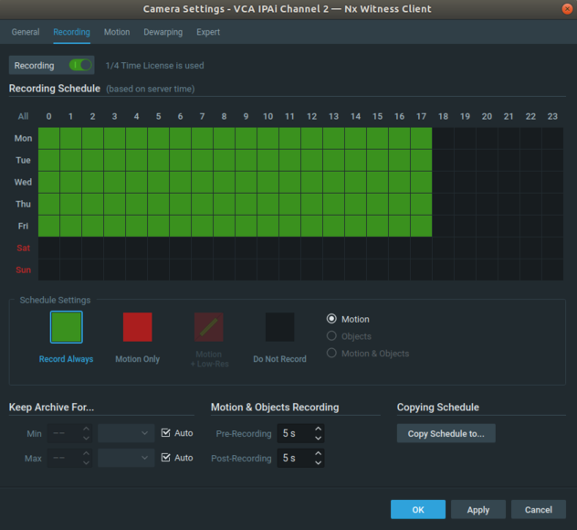

2.  Click **Apply** to save the configuration.

3.  Click **OK** to close the Camera Settings window.

## ​Enabling Digest Authentication for Third-Party Applications

1.  Right-click on the *Local User* from left menu. Then, click on **User Settings...**

    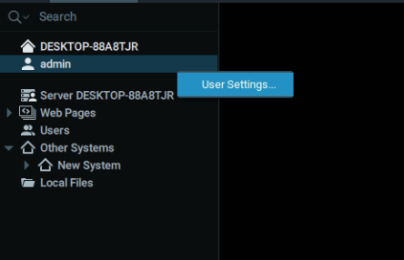

2.  In *User Information*, click on the three vertical dots and select **Allow digest authentication for this user**.

    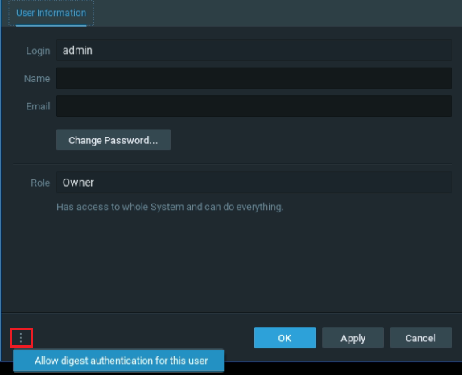

3.  Reset the password to enable the digest authentication feature and click **OK**.

    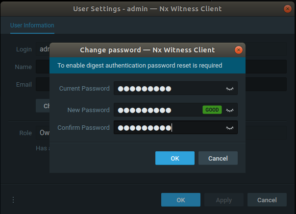

4.  Click **Apply** and **OK** to confirm changing the settings.

    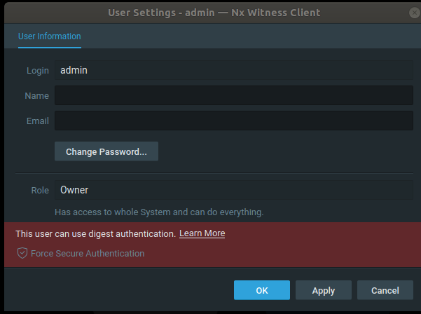

## Disabling Forcing Secure Connections

1.  Right click on the Nx Witness server Main Menu and select **System Administration...**.

    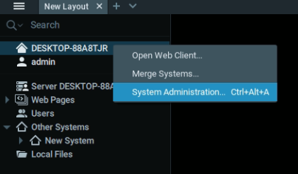

2.  Click on the **Security** tab and disable the **Force servers to accept only encrypted connections** feature.

    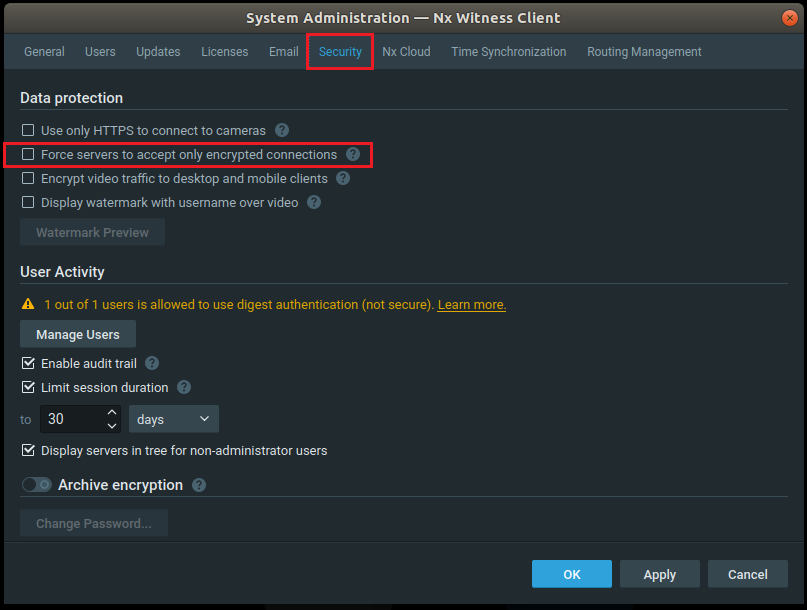

3.  Click **Apply** and **OK** to confirm changing the settings.

## Generating the `CreateEvent` API call

The `CreateEvent` API call allows 3rd party systems to send Generic Events to the Nx Witness Server for use in the Rules
Engine. A Generic Event occurs when the server receives an HTTP request from an external device. The `CreateEvent` API
calls must comply with the following format: `https://<address>:<port>/api/createEvent`.

-   **Address**: Indicates the IP address of the Nx Witness server.
-   **Port**: Indicates port of the Nx Witness server.
-   `/api/createEvent`: Endpoint to send the HTTP events.

### Example of the POST `/api/CreateEvent` Method with VCA Tokens

With this method it is possible to trigger an event of the "Generic Event" type in the System from a 3rd party System.
Such event will be handled and logged according to current Event Rules. Parameters of the generated Event, such as
"source", "caption" and "description", are intended to be analysed by these Rules.

Parameters should be passed as a JSON object in POST message body with content type `application/json`. An example can
be found below:

```json
{
    "timestamp": "{{datetime}}",
    "source": "IPAi355-MR",
    "caption": "{{type}} - {{name}}",
    "description": "Rule: {{type}} - ID: {{id}} - Object: {{objclass}}",
    "metadata": {
        "cameraRefs": [
            "898830e0-cc64-7bb2-75de-c71b5f544bc9"
        ]
    }
}
```

Where:

-   **Timestamp:** Event date and time.

-   **Source:** Name of the Device which has triggered the Event. It can be used in a filter in Event Rules to assign
    different actions to different Devices.

-   **Caption:** Short Event description. It can be used in a filter in Event Rules to assign actions depending on this
    text.

-   **Description:** Long Event description. It can be used as a filter in Event Rules to assign actions depending on
    this text.

-   **Metadata:**: Additional information associated with the Event.

-   **`cameraRefs`:** Camera ID registered in Nx Witness server. Specifies the list of Devices which are linked to the
    Event.

For more details about the Server API and third-party integrations please refer to Nx Witness API Documentation -
[Authentication](https://meta.nxvms.com/doc/developers/api-tool/authentication?type=1&system=21)

## Configuring the Camera Rules in the Event Rules

We can decide how the system reacts to the HTTP requests generated by the VCAedge plug-in. Below is an example of how
to configure the Nx Camera Rules to create a bookmark for the events being received:

1.  Right clicking on the camera screen and select **Camera Rules** from the available options.

    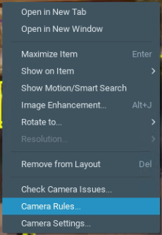

2.  Click the **+Add** button located top right.

    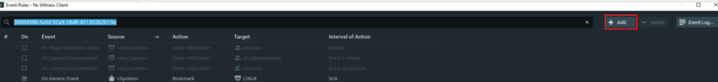

3.  Configure **Event** as follows:

    -   Click on the drop down menu for **When** and select **Generic Event** from the available events.

        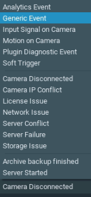

    -   **Source Contains:** Leave it blank.
    -   **Caption Contains:** Leave it blank.
    -   **Description Contains:** Leave it blank.

        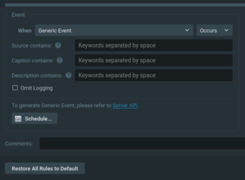

4.  Configure **Action** as follows:

    -   Click on the drop down menu for **Do** and select **Bookmark** from the available actions.

        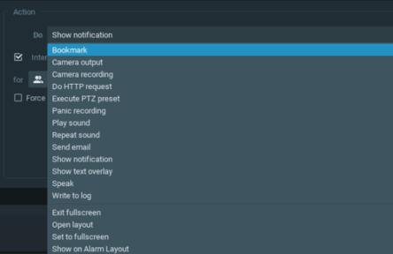

    -   **At:** Select one or more cameras. Then, click **OK** to close the window.

        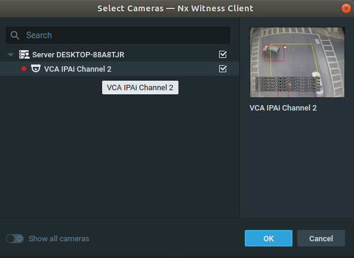

    -   **Configure the duration** for pre-recording and post-recording.
    -   **Tags and Comments:** Enter any tags to identify the bookmarks (optionally).

        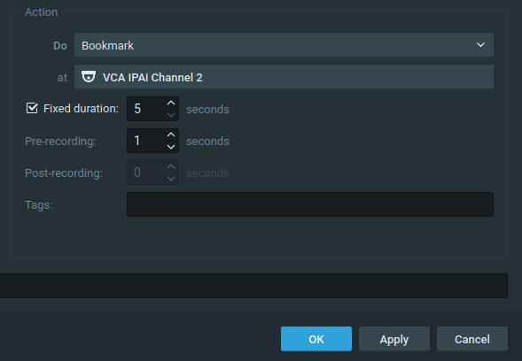

5.  Click **Apply** and **OK** to save the configuration.

## Verifying VCA Events

The generic events will appear in the **Bookmarks** tab located in the right side as follows:

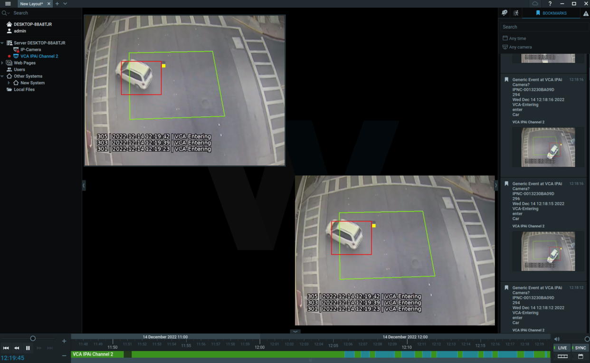
