# Introduction

## Prerequisites

-   `IPAi` series camera.
-   `VCAedgeAi` video analytics plug-in version 1.1.147 or greater.
-   Obseron 3 or greater.

## Supported Features

-   `VCAedgeAi` events from rules (motion detection, line detection, entering, exiting, presence, dwell, tampering).

## Architecture

Obseron will connect to the `IPAi` camera to consume the events provided. The integration does not require the
configuration of VCA notifications to send events to the VMS. The only requirement is that VCA rules are defined.

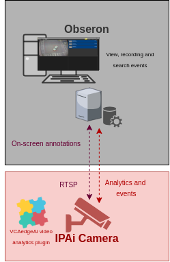

# `IPAi` Camera Configuration

## Network Settings

1.  From the **Setup** menu, click on **NETWORK** and then, click on **NETWORK SETTINGS**.

    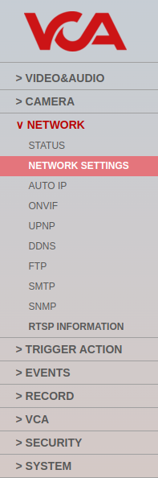

2.  Note the **IP Setup** and **Port Setup** as these will be needed when connecting to the stream from the Obseron
    server.

    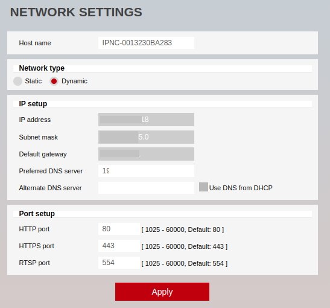

## Configuring the `VCAedgeAi` plug-in

The `VCAedgeAi` plug-in is a set of analytical tools that can be loaded onto supported cameras. It provides the means to
perform advanced analytics and reduce false alerts when events occur. _Make sure you have a valid license that will_
_enable the `VCAedgeAi` engine and all the features available._

Configure the `VCAedgeAi` plug-in as required with the appropriate tracker, rules and a notification. A basic setup is
detailed below as an example.

### Enabling VCA

1.  From the Setup menu, click on **VCA** in the left side. Then, click on **ENABLE**.

    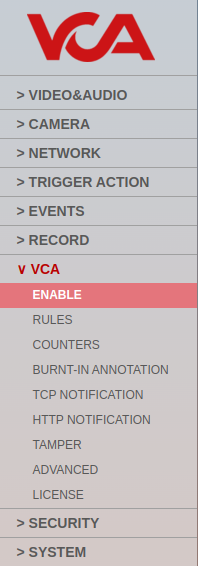

2.  In *General Settings*, turn on the video analytics features. Then, select the *Tracker Engine* from the available
    options.

3.  click **Apply** to save the configuration.

    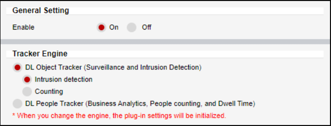

### Creating Rules

1.  From the **VCA** menu, click on **RULES** in the left side.

    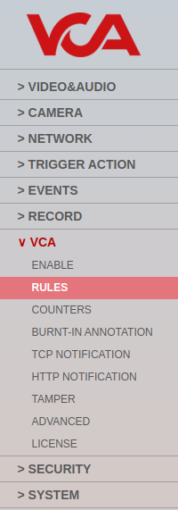

2.  Click **Add** located at the bottom to display a list of available rules.

    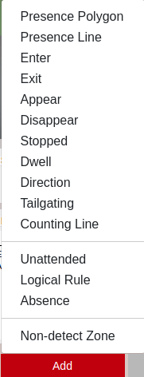

3.  Select a single rule to trigger an event and modify the **Rule property** as follows:

    -   Position the rule on the scene and change the shape as required. You can add/remove nodes to create complex
        shapes.

    -   In *Object Filter*, tick the box against the **Classes** that the rule should trigger events only.

        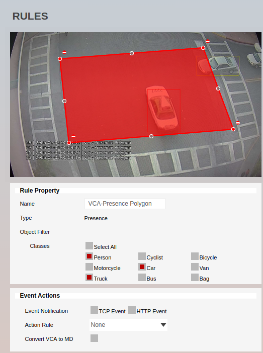

4.  Click **Save** located at the bottom to save the configuration.

5.  Click **OK** to confirm the settings.

# Obseron Configuration

## Discovering an IP Camera

1.  From the Obseron GUI, click on **Main Menu** located top and select **Settings...** from the drop-down options.

    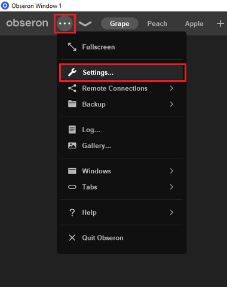

2.  In the Settings pop-up window, click on **Cameras** in the left menu.

    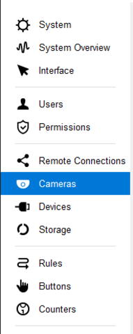

3.  In *Discovered cameras*, highlight the `IPAi` camera and click **Add selected** located at the bottom.

    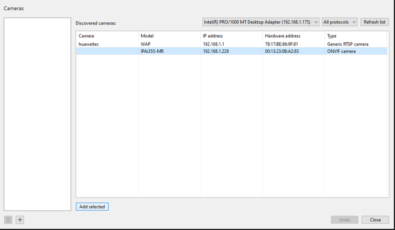

4.  Then, click the **ONVIF camera 1** listed on the left side to access the settings.

5.  In the **General** tab, configure the **Connection** to the camera as follows:

    -   Enter the **username** and **password** to access the device.
    -   Click **Connect**.
    -   The **Status** will change to **OK** and the preview window will display a live camera image.

        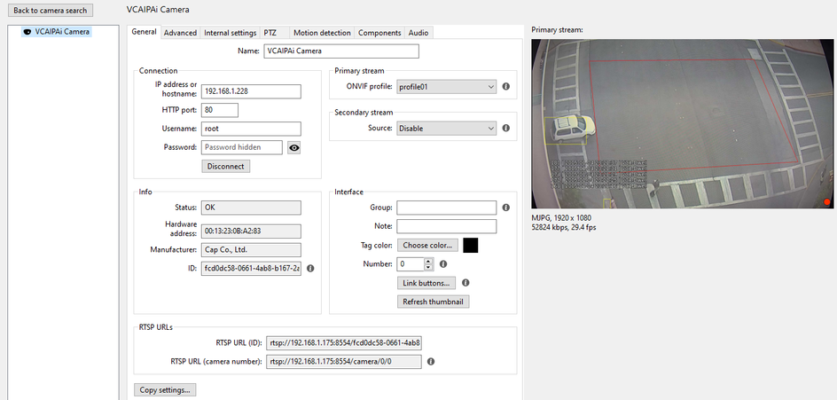

        _You can rename the camera by entering a  descriptive name for the device._

_Note: If the camera is not accessible, it will not be discovered automatically._ In this case, you will need to add it
manually as follows:

1.  From the *Cameras* menu, click the plus **+** button located at the bottom to add a new camera into the system.

    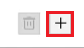

2.  Enter the number of cameras to add and click **OK** to confirm.

    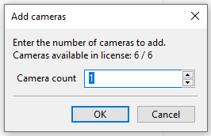

3.  In the *General* tab, configure the **Connection** to the IP device as follows:

    -   **IP address or hostname:** Enter the IP address or hostname of the `IPAi` camera.
    -   **HTTP Port:** Enter the HTTP port configured in the camera.
    -   Enter the **username** and **password** to access the camera.
    -   Then, click **Connect**.

        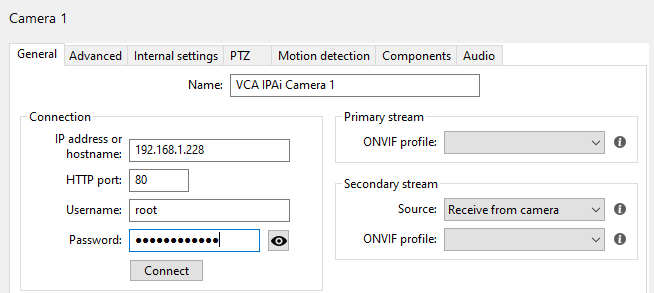

    For more information on configuring the camera/`VCAedgeAi` plug-in please refer to the `IPAi`
    [Documentation](https://drive.google.com/drive/folders/1Iw_kIu9toqDVsxjK4zg0M_rqR-ddL3V8).

## Configuring the ONVIF Component

Obseron provides external sources called *components* which offer data such as video analytics or sensor readings that
allow to trigger rules.

1.  The next step is to connect to the camera to consume the events provided. click the **Components** tab from
    the top menu.

2.  Configure the `Component1` as follows:

    -   In *Component*, select **ONVIF events** from the drop-down list. Then, click on **Add** to add the new
        component.

        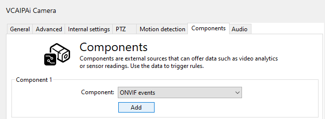

    -   The VMS will automatically connect to the camera and the ONVIF events will be displayed on the **Received**
        **events** box in the **Info** section.

        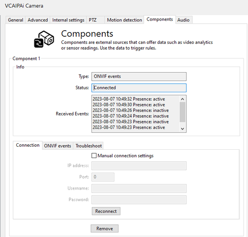

        _​If the connection fails, verify the configuration or tick the box against Manual connection settings to​_
        _connect to the camera manually.​_

## Configuring Camera Rules and Actions

### Configuring Rules

1.  Now, we configure the rule that will trigger a specific action when a condition is met. From the left menu, click on
    **Rules**.

    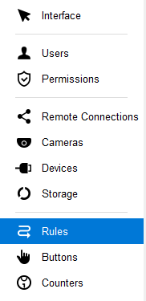

2.  Then, click the plus **+** button located bottom to create a new rule.

    

3.  Enter a descriptive **Name** for the rule and click on **Add condition** below.

4.  Then, configure the `Condition1` as follows:

    -   **Condition type:** Select **Camera event** from the drop-down list.
    -   **Camera:** Select the `IPAi` camera.
    -   **Event type:** Select the detection rule configured in VCA from the drop-down list.
    -   **Hold for (sec):** ​Enter the time for the notification to remain on the screen.

        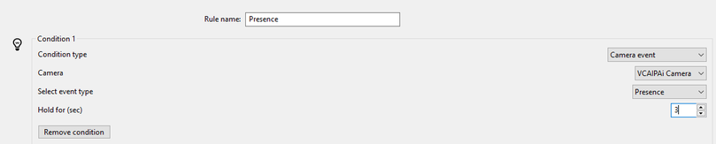

### Configuring Actions

Next, we decide how the system will react to the rules. ​Below is an example of how to configure the Obseron action to
create a Notification/Alarm for the events being received:

1.  Click on **Add action** located at the bottom.

    

2.  Then, configure the `Action1` as follows:

    -   `Action1:` Select **Notification/Alarm** from the drop-down list of actions.
    -   **Bind a camera to the notification:** Select the `IPAi` camera.
    -   **Notification Colour:** Select a colour to identify the notification.
    -   **Text to show in the notification:** Enter a description for the notification to appear on the screen when the
        event occurs.

        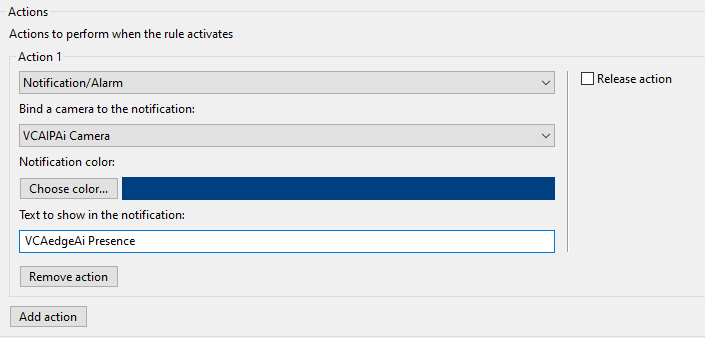

    _Note: You can add the rules you need and configure different type of actions if required._

## Verifying the ONVIF Events

Every time the `VCAedgeAi` plug-in triggers a rule, a new notification will be listed on the *Live* page as follows:

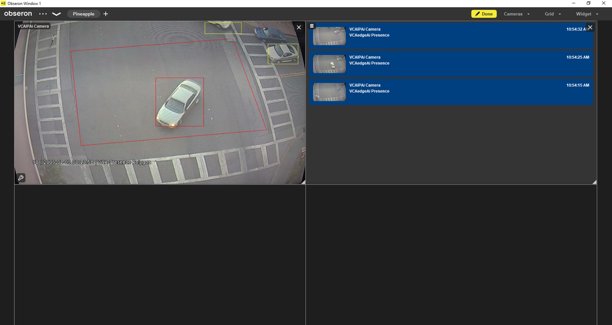
