# Introduction

## Prerequisites

-   `IPAi` series camera.
-   `VCAedgeAi` video analytics plug-in version 1.1.124 or greater.
-   Vivotek VAST2 or VSS.

## Supported Features

-   All `VCAedgeAi` event notification methods are available.

## Architecture

For this web UI integration, VSS receives the annotated stream from the `IPAi` camera and the analytics data is
sent through HTTP notifications with JSON format and VCA tokens containing details about the event.

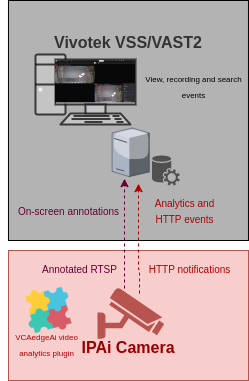

# `IPAi` Camera Configuration

## Video & Audio Settings

### Confirming the RTSP stream used for transmitting video footage

Check and change if required, the RTSP stream settings used by the IP camera for external connections to the channels.

1.  From the **Setup** menu, click on **VIDEO & AUDIO** and then, click on **VIDEO**.

    

2.  Note the *Live Video Channel* settings as these will be needed when connecting to the RTSP stream from the Vivotek
    server.

    

## Network Settings

### Confirming the RTSP port used for transmitting video footage

Check and change if required, the RTSP port used by the IP camera for external connections to the channels.

1.  From the **Setup** menu, click on **NETWORK** and then, click on **NETWORK SETTINGS**.

    

2.  Note the **IP Setup** and **Port Setup** as these will be needed when connecting to the RTSP stream from the Vivotek
    server.

    

## Configuring The VCAedge Plug-in

The `VCAedgeAi` plug-in is a set of analytical tools that can be loaded onto supported cameras. It provides the means to
perform advanced analytics and reduce false alerts when events occur. _Make sure you have a valid license that will_
_enable the `VCAedgeAi` engine and all the features available._

Configure the `VCAedgeAi` plug-in as required with the appropriate tracker, rules and a notification. A basic setup is
detailed below as an example.

### Enabling VCA

1.  From the **Setup** menu, click on **VCA** in the left side. Then, click on **ENABLE**.

    

2.  In *General Settings*, turn on the video analytics features. Then, select the *Tracker Engine* from the available
    options.

3.  click **Apply** to save the configuration.

    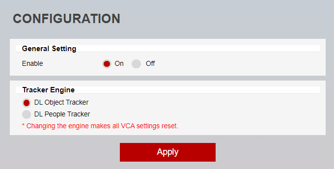

### Creating Rules

1.  From the **VCA** menu, click on **RULES** in the left side.

    

2.  Click **Add** located at the bottom to display a list of available rules.

    

3.  Select a single rule to trigger an event and modify the **Rule property** as follows:

    -   Position the rule on the scene and change the shape as required. You can add/remove nodes to create complex
        shapes.

        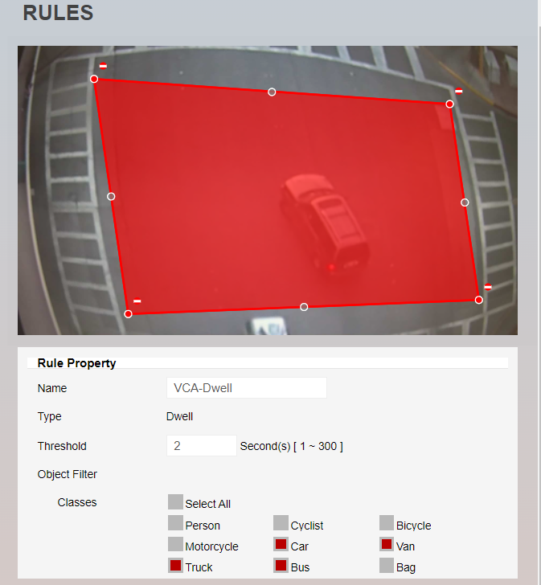

4.  Then, define the action that will occur when the rule triggers an event in **Event Actions** as follows:

    -   In *Event Notification*, tick the box against the **HTTP Event** to enable HTTP notifications when a
        event occurs.
    -   In *Triggered By*, define when the notification will be sent. The available options are:
        -   **Object:** Send notification for each object triggering the rule.
            -   In **Triggered At*, select one of the following options:
                -   Choose between the **begin** of the object triggering the rule as it enters the zones or
                    the **end** of the object triggering the rule as it leaves the zone. _A notification will be sent_
                    _for each object triggering the rule._

        -   **Rule:** Send a notification every time the rule is triggered.

            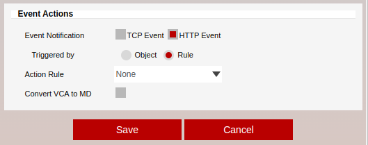

5.  Click **Save** located at the bottom to save the configuration.

6.  Click **OK** to confirm the settings.

### Creating HTTP Notifications

The HTTP notification sends a HTTP request to a remote endpoint when triggered. The URL, HTTP header and message body
are all configurable with a mixture of plain text and tokens. Tokens are used to represent the event metadata that
will be included when a rule is triggered.

1.  From the **VCA** menu, click on **HTTP NOTIFICATION** in the left side.

    

2.  In *General Settings*, turn on the feature.

3.  In *HTTP Settings*, configure the notification as follows:

    -   In *Send To*, select **Custom** from the available options.
    -   In *URL*, Enter the URI required by Data Magnet to integrate any external data into VAST2. Default endpoint:
        `http://<serverIP>:<serverPort>/api/udi`.
    -   In *Method*, select **POST** from the available options.
    -   Select **raw** for the body of the request.
    -   In *User ID*, enter the username to access the VSS server.
    -   In *Password*, enter the password to access the VSS server.

4.  Click on **Body** and configure the notification as follows:

    -   **Content-Type**: Select **Application/JSON** from the drop-down menu.
    -   **Rule**: Add the JSON data required by Data Magnet and the VSS server with the VCA tokens.

    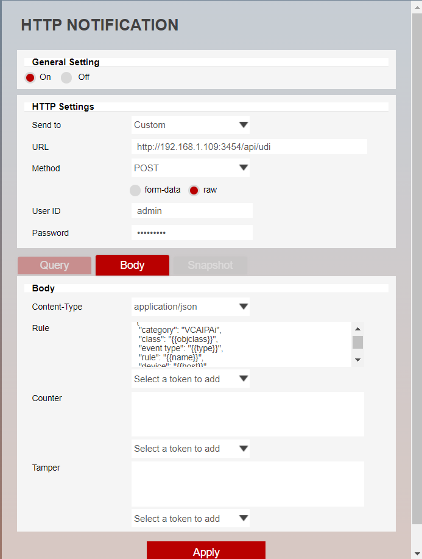

5.  Click **Apply** located at the bottom to save the configuration.

6.  Click **OK** to confirm configuring the notification.

For this integration, the following tokens were used to send an information on the camera, zone, rule type and
classification that triggered the event:

-   `{{objclass}}`: The DL classification of the object triggering the rule.
-   `{{type}}`: The type of the event. This is usually the type of rule that triggered the event.
-   `{{name}}`: The name of the event.
-   `{{host}}`: The hostname of the device that generated the event.

_Note: The message is an example. You can adjust the data and add more tokens as needed._

For more information on creating and configuring VCA in `IPAi` cameras, please refer to the `VCAedgeAi` Plug-in Manual.

# Vivotek VSS Configuration

## Discovering a New Camera

1.  From the main screen, click on the **cog** icon at the top right and select **Settings**.

    

2.  Click on **Cameras** on the left hand side. Then, click on the **+** button at the top to add a new camera.

    

3.  Vivotek VSS automatically performs camera discovery in the network. Once an IP camera is discovered, its
    parameters will be displayed in the *Cameras* page from the *Add device* menu.

4.  ​Select the newly discovered device and click on **Authorize...** at the top.

    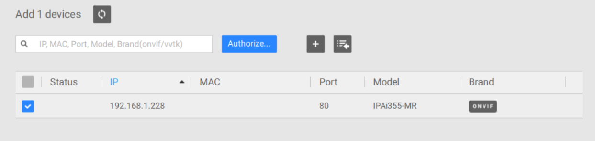

5.  Enter the credentials to access the camera and click **Authorize**.

    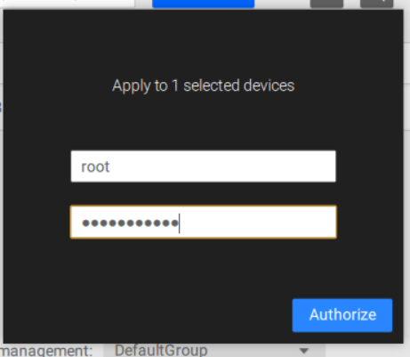

6.  Click on **Add** to add the new device to the system.

    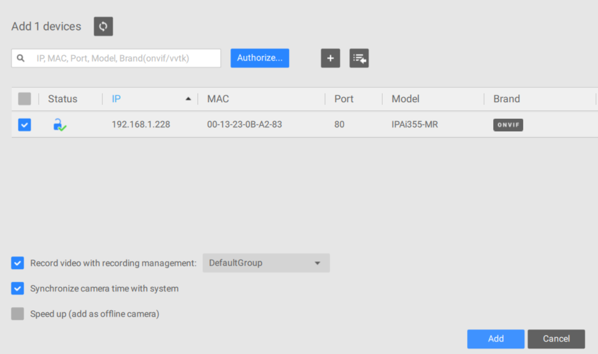

7.  Wait for the camera to synchronize with the server.

8.  A live image of the camera will be displayed in the preview window.

    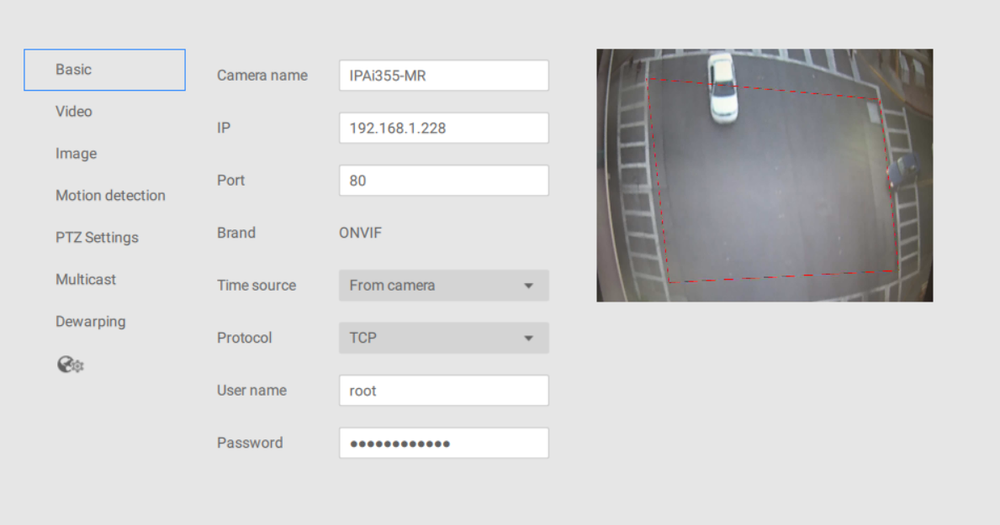

    _Optionally, you can enter a descriptive name for the camera._

## Configuring Data Magnet

Data Magnet is an open platform for system integrators to integrate any external data into VSS or VAST2.

1.  To configure a new Data Magnet, click on **Data magnet** on the left hand side menu. Then, click on the **+**
    button at the top to create a new data source.

    

2.  In the *Add a data source* pop-up window, select **Third party data source** from the available options.

    

3.  Configure the data source as illustrated bellow:

    -   **Source**: Select **Single source** from the drop-down list. _You can add Multiple sources if multiple_
        _channels sends data to the same port._

    -   **Name**: Enter a descriptive name for the new data source.
    -   **Port**: Enable **Use default port** to send data to port 3454.
    -   Enable **Data source authorization**.
    -   **Related camera**: Select the camera(s) that will send data to the VSS server.

        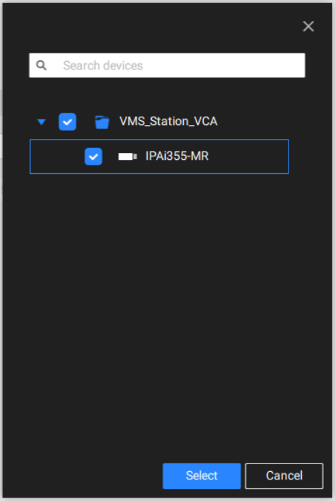

    -   Click on **Add** to add the new data source.

    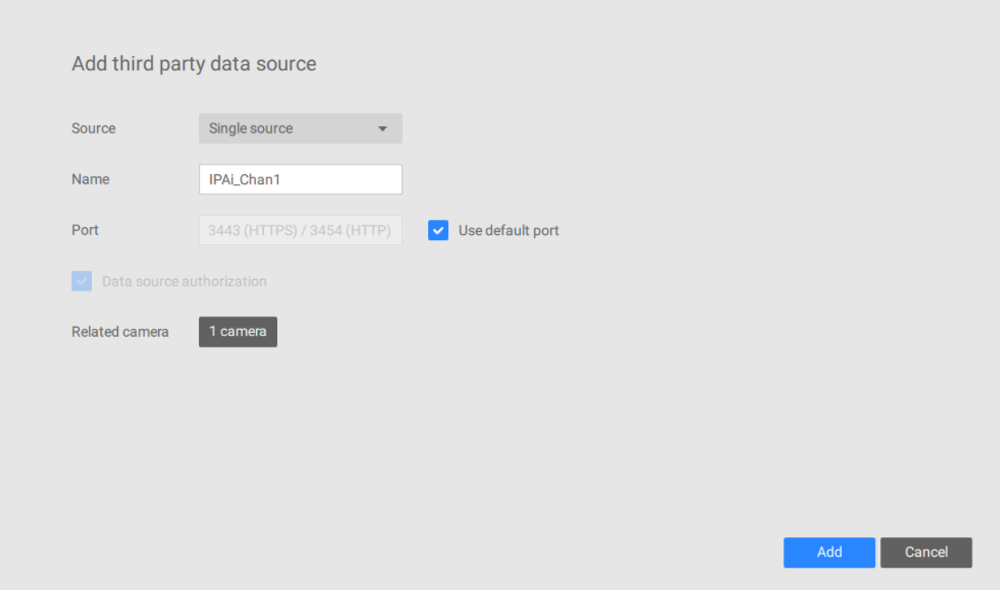

### Data Format

All data sent to VAST2 Data Magnet server is in JSON format and using UTF-8 encoding. The JSON should be in key-
value-pair, where all keys are strings and values are strings or arrays.

-   `category`: User defined category (required).
-   `class`: Classification of the object.
-   `event type`: The type of rule that triggered the event.
-   `rule`: The name of the rule that triggered the event.
-   `device`: The device that generated the event.
-   `data source`: The name of the data source (required).

#### Template of the JSON Message With VCA Tokens

```json
{
  "category": "VCAIPAi",
  "class": "{{objclass}}",
  "event type": "{{type}}",
  "rule": "{{name}}",
  "device": "{{host}}",
  "data source": "IPAi_Chan1"
}
```

_For more information on configuring data sources or Data Magnet, please refer to the Vivotek Data Magnet document._

## Data Magnet Overlay Events

1.  Navigate to the VSS **Live** page and right-click on the camera. Then, select **Show data** from the *Data magnet*
    menu.

    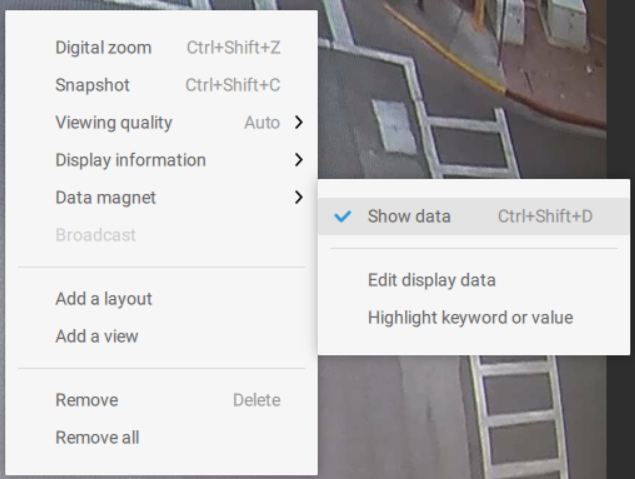

2.  Every time the `VCAedgeAi` plug-in triggers a rule, an event will be overlaid on the selected camera as
    follows:

    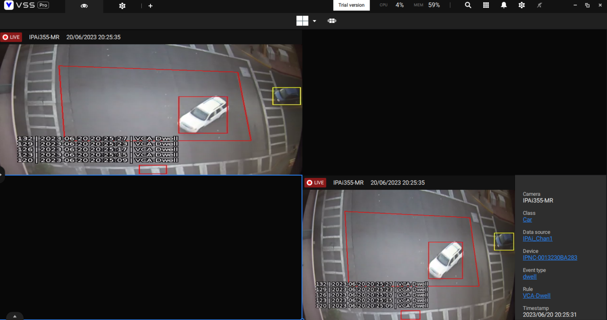

    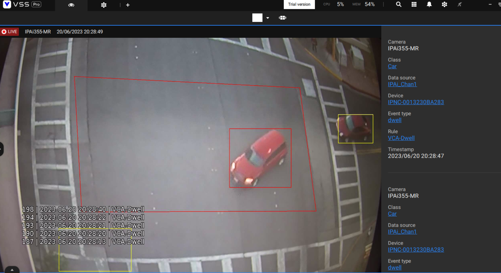

### Data Magnet Search

1.  From the main screen, click on **Applications** on the top menu.

    

2.  Select **Data magnet** from the available options.

    

3.  ​You can review specific events on the *Data Magnet* page.​ Select the data source, camera, time frame and search
    criteria.

    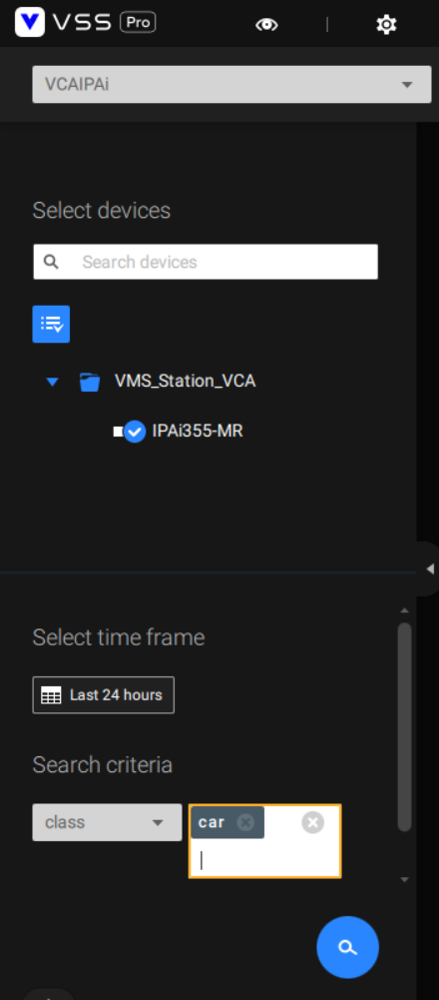

4.  The results will be listed on the right-hand side (events with annotated recordings).

    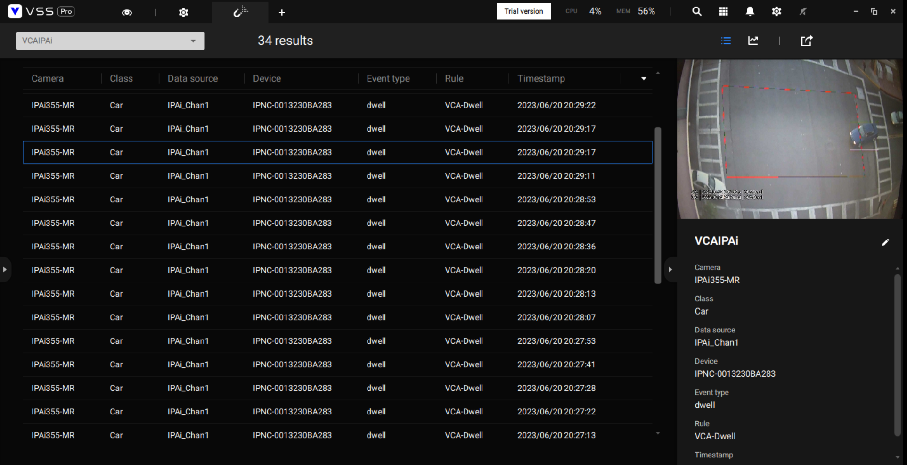
