# Introduction

## Prerequisites

-   IPM series camera.
-   VCAedge video analytics plug-in version 1.0.41 or greater.
-   Net Professional service application version 3.4.0 or greater.
-   CMS 4 Professional Client application version.

## Supported Features

-   All VCAedge event notification methods are available.

## Architecture

The Alnet Systems application will connect to the IPM camera to get the events provided. The integration does not
require the configuration of VCA notifications to send events to the VMS. The only requirement is that VCA detection
rules are defined.

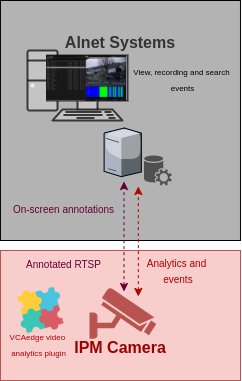

# IPM Camera Configuration

## Video & Audio Settings

### Confirming the RTSP stream used for transmitting video footage

Check and change if required, the RTSP stream settings used by the IP camera for external connections to the channels.

1.  From the **Setup** menu, click on **VIDEO & AUDIO** and then, click on **VIDEO**.

    

2.  Note the *Live Video Channel* settings as these will be needed when connecting to the RTSP stream from the
    Net Professional server.

    

## Network Settings

### Confirming the RTSP port used for transmitting video footage

Check and change if required, the RTSP port used by the IP camera for external connections to the channels.

1.  From the **Setup** menu, click on **NETWORK** and then, click on **NETWORK SETTINGS**.

    

2.  Note the **IP Setup** and **Port Setup** as these will be needed when connecting to the RTSP stream from the
    Net Professional server.

    

## Configuring The VCAedge Plug-in

The VCAedge plug-in is a set of analytical tools that can be loaded onto supported cameras. It provides the means to
perform advanced analytics and reduce false alerts when events occur. _Make sure you have a valid license that will_
_enable the VCAedge engine and all the features available._

Configure the VCAedge plug-in as required with the appropriate tracker, rules and a notification. A basic setup is
detailed below as an example.

### Enabling VCA

1.  From the **Setup** menu, click on **VCA** in the left side. Then, click on **ENABLE**.

    

2.  Turn on the video analytics features and click **Apply** located at the bottom to save the configuration.

    

### Creating Rules

1.  From the **VCAedge** menu, click on **RULES** in the left side.

    

2.  Click **Add** located at the bottom to display a list of available rules.

    

3.  Select a single rule to trigger an event and modify the **Rule property** as follows:

    -   Position the rule on the scene and change the shape as required. You can add/remove nodes to create complex
        shapes.

    -   In **Object Filter**, tick the box against the **Classes** that the rule should trigger events only.

        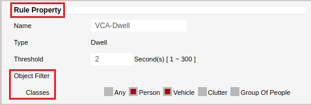

        _Note: The available classifiers are different depending on the hardware platform and the installed license._

4.  Click **Save** located at the bottom to save the configuration.

    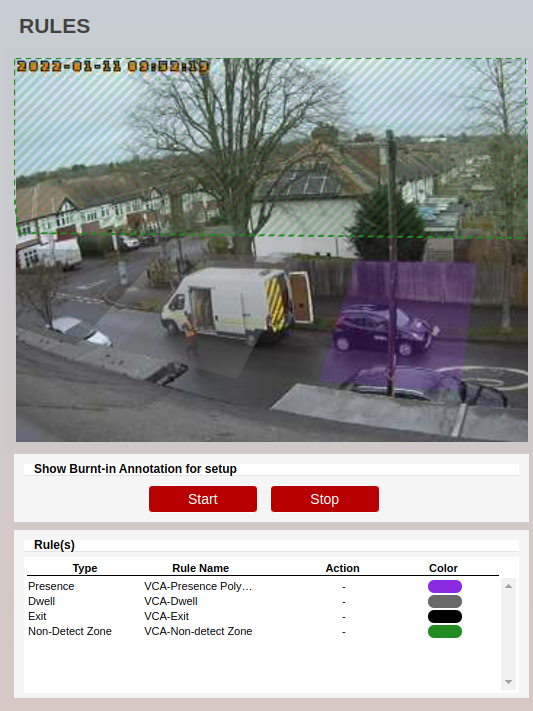

5.  Click **OK** to confirm the settings.

    

### Configuring the Calibration

Camera calibration is required in order for object identification and classification to occur. _The calibration is only_
_required when using the motion Object Tracker, the IPM AI series will have the option to select the DL Object or_
_People Tracker and will not need any calibration for classification to occur._

1.  From the **VCAedge** menu, click on **CALIBRATION** in the left side.

    

2.  In **Enable Calibration**, turn on the calibration feature.

3.  Use the mimics to match up with people or objects in the scene to help calibrate. They represent a height of 1.8
    meters.

    

4.  Click **Apply** located at the bottom to save the configuration.

# NET Professional Configuration

## Adding a Network Camera

1.  ​​​First, we need to add a network camera to the system. Run the Net Professional wizard to configure the ONVIF device
    manually.

2.  In **Network camera**, click **Add** and select **ONVIF** from the available manufacturers.

    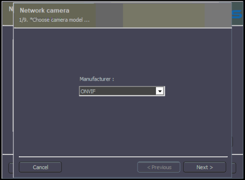

3.  Then, click **Next**.

4.  Click **Search** to discover the camera on the network. When the search is complete, select the IP camera you want
    to add and click **Next**.

    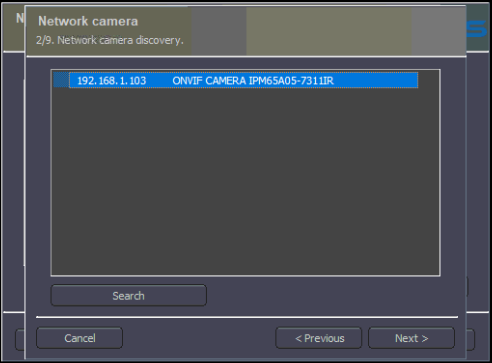

5.  Confirm the camera model and click **Next**.

    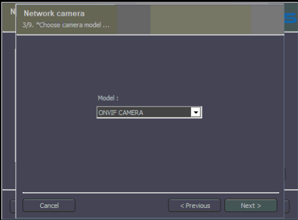

6.  Enter the **login** and **password** to access the camera and click **Next**.

    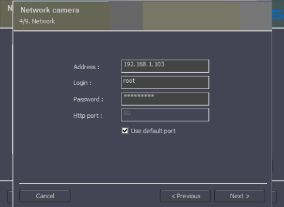

7.  Make sure the camera properties have been detected correctly and click **Next**.

    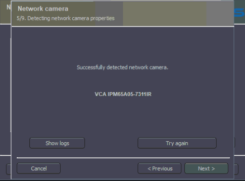

8.  Configure the **Video stream** and **Audio** as required. Then, click **Next**.

    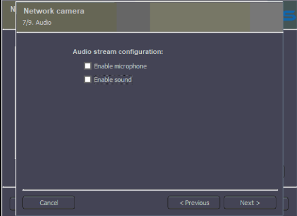

9.  Enable the **Advance** settings as required and click **Next**.

    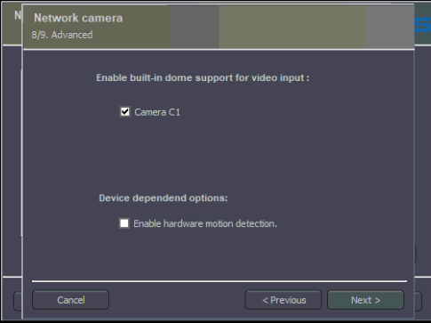

10.  Click **OK** to confirm the configuration and close the wizard.

     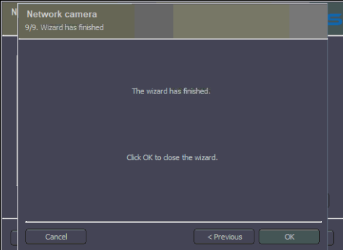

## Enabling Device Events

​After configuring the IP camera in the system, we need to make sure that the device events are enabled.​

1.  In the Net Professional main screen, click on **Configuration** in the top menu and select **Cameras ...** from the
    drop down options.

    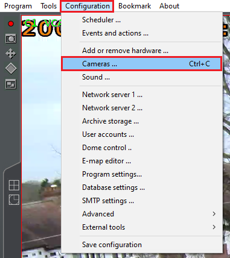

2.  In the *Camera Settings* windows, click on the **Device** tab located top. In **Advanced**, make sure that
    **Events** are set to **Yes**.

    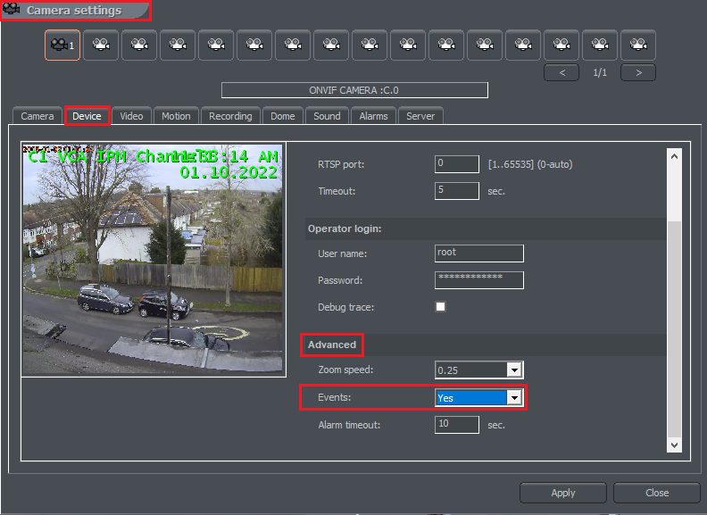

3.  Click **Apply** located at the bottom to confirm.

4.  **Close** the Camera Settings windows.

# CMS 4 Client Configuration

## Verifying the Events

In the CMS 4 Client main screen, click on **Select visible tabs** located top. Then, select **VCA** from the available
tabs and click the **green check** button located at the bottom to confirm and add the new tab.

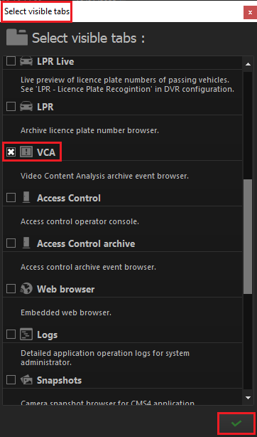

Every time an event is triggered on the IPM camera, the notification will appear in the **VCA** tab showing the details
of the event such as type, rule, source, start time and end time.

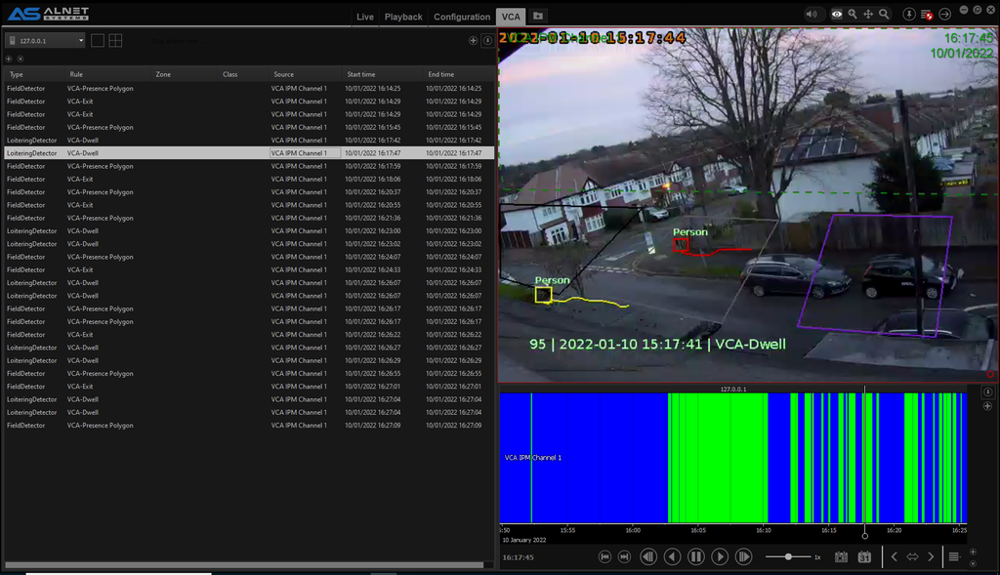

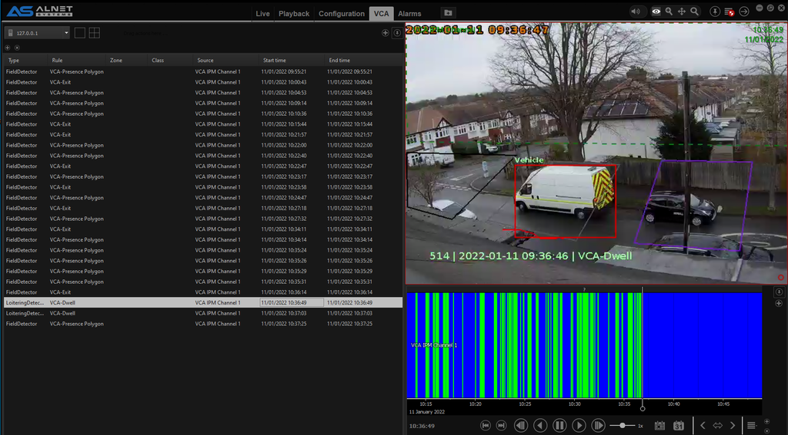

Optionally, you can decide how the system reacts to the events generated by the VCAedge plug-in by creating VCA Events
and Actions such as a bookmark, notifications to the CSM HUB, show messages, play sounds and more. _For more_
_information, please refer to the NET Professional user manual._
