# Introduction

## Prerequisites

-   IPM series camera.
-   VCAedge video analytics plug-in version 1.0.41 or greater.
-   Arteco Omnia Suite 22.2 or greater.

## Supported Features

-   All VCAedge event notification methods are available.

## Architecture

For this integration, Arteco Omnia receives the annotated RTSP stream from the IPM camera and the alarms are sent
through HTTP notifications with XML format and VCA tokens containing details about the event.

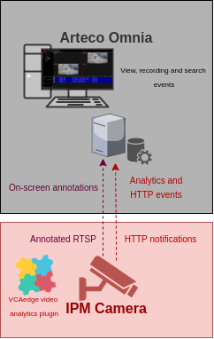

# IPM Camera Configuration

## Video & Audio Settings

### Confirming the RTSP stream used for transmitting video footage

Check and change if required, the RTSP stream settings used by the IP camera for external connections to the channels.

1.  From the **Setup** menu, click on **VIDEO & AUDIO** and then, click on **VIDEO**.

    

2.  Note the *Live Video Channel* settings as these will be needed when connecting to the RTSP stream from the Arteco
    Next server.

    

## Network Settings

### Confirming the RTSP port used for transmitting video footage

Check and change if required, the RTSP port used by the IP camera for external connections to the channels.

1.  From the **Setup** menu, click on **NETWORK** and then, click on **NETWORK SETTINGS**.

    

2.  Note the **IP Setup** and **Port Setup** as these will be needed when connecting to the RTSP stream from the Arteco
    Next server.

    

## Configuring The VCAedge Plug-in

The VCAedge plug-in is a set of analytical tools that can be loaded onto supported cameras. It provides the means to
perform advanced analytics and reduce false alerts when events occur. _Make sure you have a valid license that will_
_enable the VCAedge engine and all the features available._

Configure the VCAedge plug-in as required with the appropriate tracker, rules and a notification. A basic setup is
detailed below as an example.

### Enabling VCA

1.  From the **Setup** menu, click on **VCA** in the left side. Then, click on **ENABLE**.

    

2.  Turn on the video analytics features and click **Apply** located at the bottom to save the configuration.

    

### Creating Rules

1.  From the **VCAedge** menu, click on **RULES** in the left side.

    

2.  Click **Add** located at the bottom to display a list of available rules.

    

3.  Select a single rule to trigger an event and modify the **Rule property** as follows:

    -   Position the rule on the scene and change the shape as required. You can add/remove nodes to create complex
        shapes.

    -   In **Object Filter**, tick the box against the **Classes** that the rule should trigger events only. _Note:_
        _The available classifiers are different depending on the hardware platform and the installed license._

    -   Optionally, you can enable **Colour Filter** to filter out objects.

        

4.  Then, define the action that will occur when the rule triggers an event in **Event Actions** as follows:

    -   In **Event Notification**, tick the box against the **HTTP Event** to enable HTTP notifications when a
        event occurs.
    -   In **Triggered By**, define when the notification will be sent. The available options are:
        -   **Object:** Send notification for each object triggering the rule.
        -   **Rule:** Send a notification every time the rule is triggered.
    -   In **Triggered At**, select one of the following options:
        -   **Object:** Choose between the **begin** of the object triggering the rule as it enters the zones or
             the **end** of the object triggering the rule as it leaves the zone. _A notification will be sent for each_
             _object triggering the rule._

        -   **Rule:** From the **begin** point of the first object to trigger the rule to the **end** point of the last
            object to trigger the rule. _A notification will be sent for each triggering of the rule._

        

5.  Click **Save** located at the bottom to save the configuration.

    

6.  Click **OK** to confirm the settings.

    

### Configuring the Calibration

Camera calibration is required in order for object identification and classification to occur. _The calibration is only_
_required when using the motion Object Tracker, the IPM AI series will have the option to select the DL Object or_
_People Tracker and will not need any calibration for classification to occur._

1.  From the **VCAedge** menu, click on **CALIBRATION** in the left side.

    

2.  In **Enable Calibration**, turn on the calibration feature.

3.  Use the mimics to match up with people or objects in the scene to help calibrate. They represent a height of 1.8
    meters.

    

4.  Click **Apply** located at the bottom to save the configuration.

### Creating HTTP Notifications

The HTTP notification sends a HTTP request to a remote endpoint when triggered. The URL, HTTP header and message body
are all configurable with a mixture of plain text and tokens. Tokens are used to represent the event metadata that
will be included when a rule is triggered.

1.  From the **VCAedge** menu, click on **HTTP NOTIFICATION** in the left side.

    

2.  In **General Settings**, **turn On** the notification feature.

3.  In **HTTP Settings**, configure the HTTP request as follows:

    -   In **Send To**, select **Arteco** from the available options.
    -   In **URL**, enter the endpoint required by the Arteco server to receive third party events. Default URL:
        `http://<ipaddress>:<port>/arteco-mobile/event.fcg`.

    -   In **User ID**, enter the username to access the Arteco Omnia suite.
    -   In **Password**, enter the password to access the Arteco Omnia suite.
    -   In **Connector ID**, enter the ID of the Connector configured inside the Arteco Omnia suite.
    -   In **Camera ID**, enter the ID of the IPM camera configured in the the Arteco Omnia suite.

4.  Click **Apply** to save the configuration.

    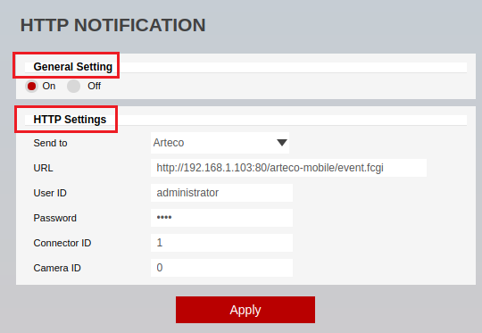

# Arteco Omnia Configuration

## Configuring a New Camera

1.  First, we add a new camera into the system. Click on the **cog icon** at the bottom to switch to the configurations
    environment.

    

2.  In the *Device List* configuration tree, select the server you want to add the camera on.

    

3.  Click on **Video Channels** from the left menu.

    

4.  In *DEVICES*, click on **Automatic Add** from the available options.

    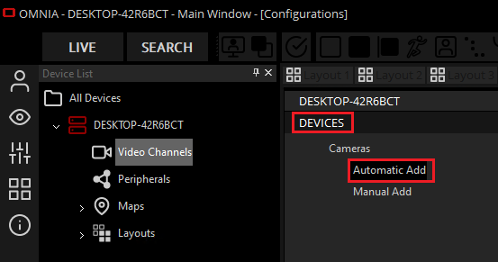

5.  In *Automatic Search*, click on **Search Cameras** to discover the device on the network.

    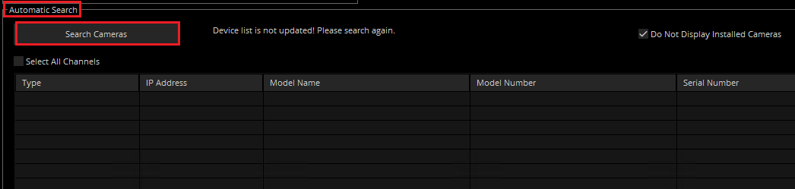

6.  ​When the list of available devices appears, tick the box against the IPM camera.

    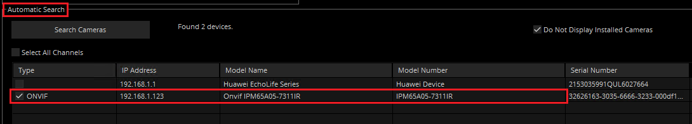

7.  Then in *Software Configuration*, enter the credentials to access the camera:

    -   **Username:** Enter the username to access the camera.
    -   **Password:** Enter the password to access the camera.
    -   **Base Name:** Type a descriptive name for the IPM camera or its channels.
    -   Click **Confirm Configuration** to save the settings.

        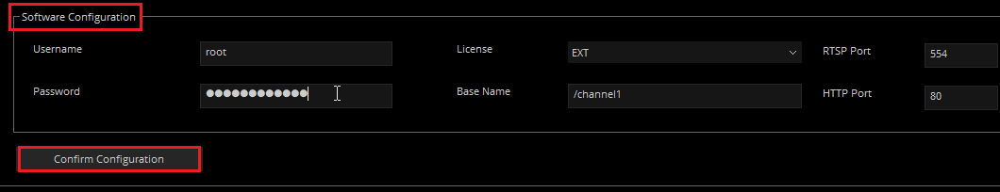

8.  In *Add Recap*, click on **Add Cameras** and **OK** to confirm adding the new camera.

    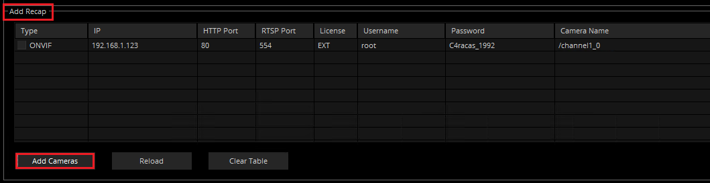

    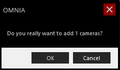

9.  ​Click **OK** after adding the camera successfully.

    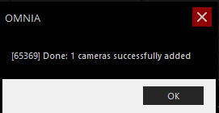

10.  From the *Video Channels* menu, click on the new channel to see a live image of the camera and its settings.

     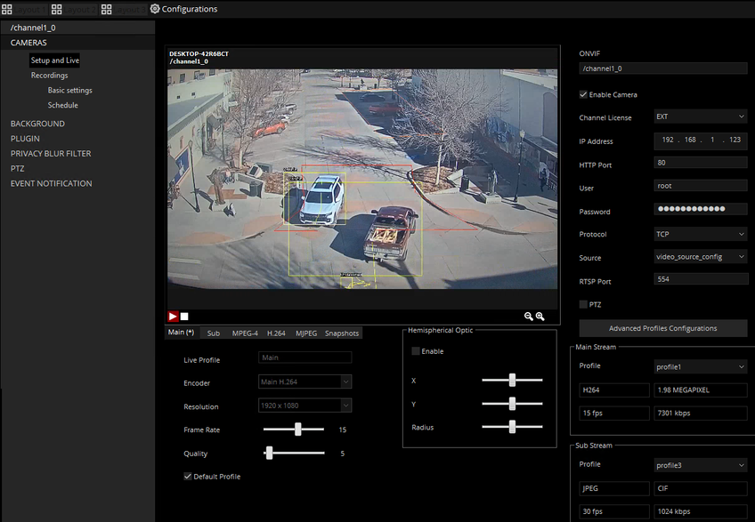

3.  The annotated live image of the camera is displayed in the preview window:

    -   The VCA annotations are displayed in the OMNIA client:
        -   Zones.
        -   Objects with bounding box.
        -   Event Log: event ID, event date and time, rule name.

### Configuring Event Notification

1.  The next step is to configure the event notification. From the *CAMERAS* menu, click on **EVENT NOTIFICATION**.
    Then, click on **Channel Events**.

    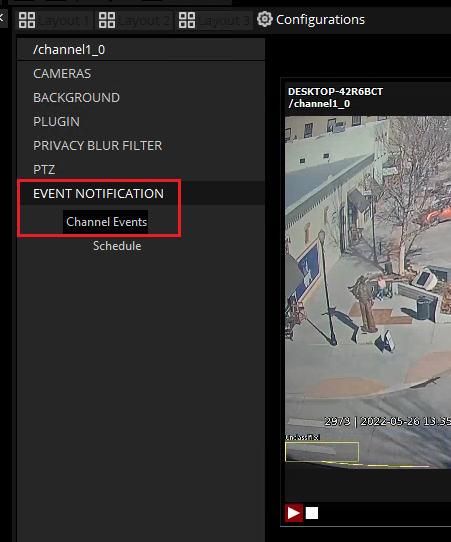

2.  In *Live Event Log*, modify the notification as illustrated below:

    -   **Send To Client:** Tick the box against **All events**.
    -   **Bookmark:** Tick the box against **All events**.
    -   **Status:** Select the status you want to assign to the notifications from the drop-down list.
    -   **Colour:** Select the colour to identify the notifications and click **OK**.
    -   Click **Apply** to save the configuration.

        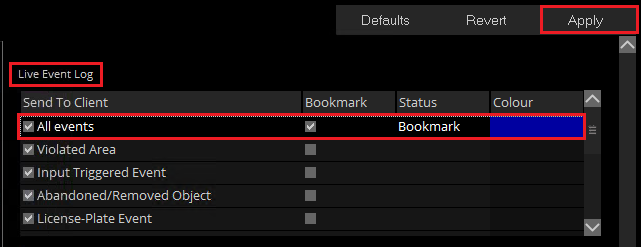

## Getting the Camera ID

1.  Click on the **cog icon** at the left bottom to switch to the configurations environment. From the configuration
    tree, click the greater than icon **>** next to **Video Channels** to expand the components.

2.  Select the channel you want to get the ID from.

    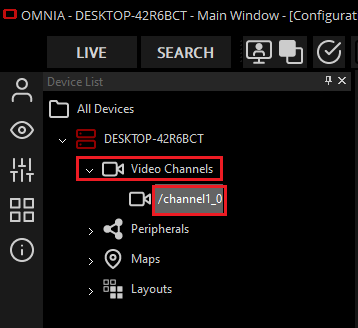

3.  In the **Device Properties** panel, take note of the **Channel ID** since it will be required when configuring the
    HTTP notification for the VCAedge plug-in.

    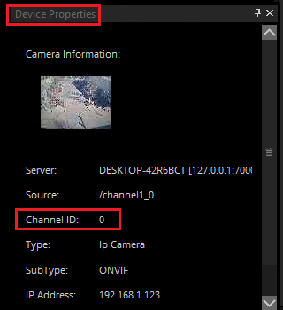

## Getting the Connector ID

1.  Click on the **cog icon** at the left bottom to switch to the configurations environment. From the configuration
    tree, click the greater than icon **>** next to **Peripherals** to expand the components.

2.  Select the connector you want to get the ID from.

    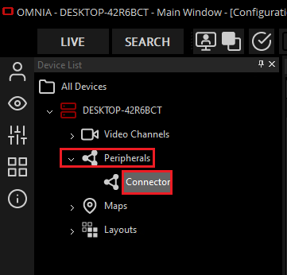

3.  In the **Device Properties** panel, take note of the **ID** since it will be required when configuring the HTTP
    notification in the VCAedge plug-in.

    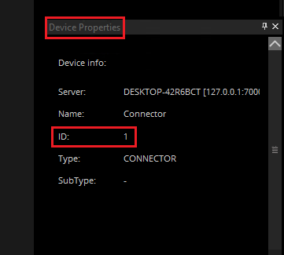

## Verifying the VCAedge Plug-in Events

From the **LIVE** page, review the **Live Event** panel located at the bottom where the bookmarks will appear when the
VCAedge plug-in generates a new event. The bookmarks contain a description about each event (device that generates the
notification, the zone where the event occurs, the rule that triggers the event, classification of the object and
time).

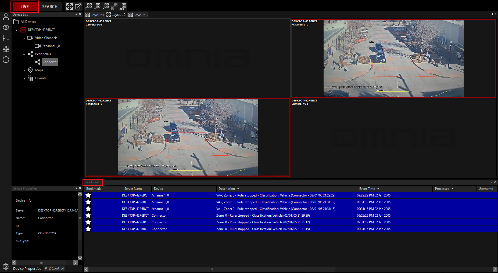

You can also verify the **Event Properties** that shows the VCAedge plug-in metadata with recording by selecting each
event.

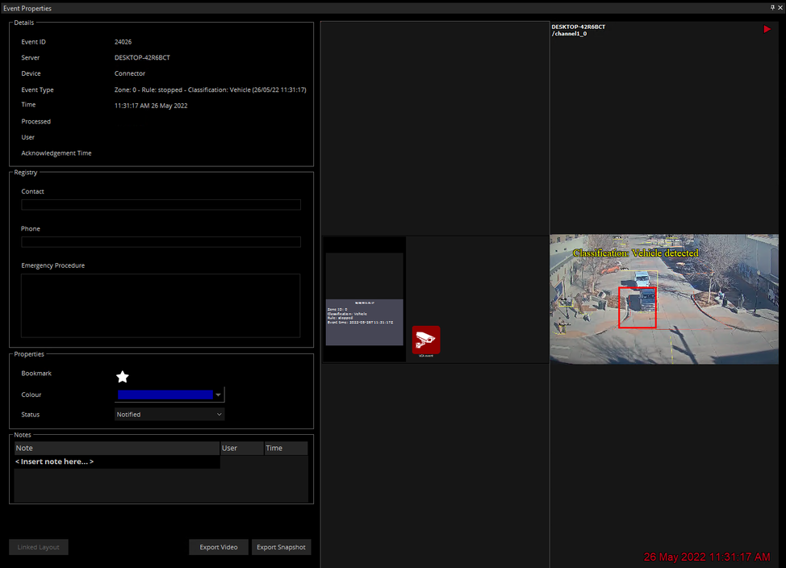

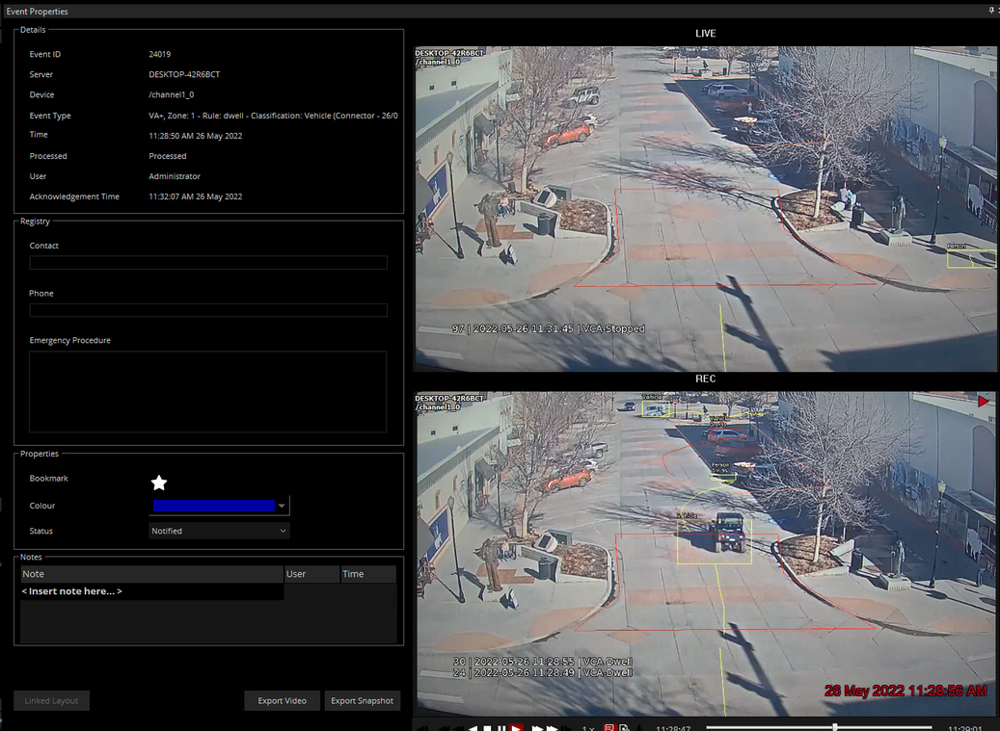
