# Introduction

## Prerequisites

-   IPM series camera.
-   VCAedge video analytics plug-in version 1.0.41 or greater.
-   Axxon Next VMS version 4.5 or greater.

## Supported features

-   All VCAedge event notification methods are available.

## Architecture

In this integration, the Axxon Next VMS receives the annotated video from the IPM camera and the Event Source alarms
are sent through the TCP notifications with VCA tokens containing details about the event.

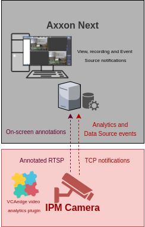

# IPM Camera Configuration

## Video & Audio Settings

### Confirming the RTSP stream used for transmitting video footage

Check and change if required, the RTSP stream settings used by the IP camera for external connections to the channels.

1.  From the **Setup** menu, click on **VIDEO & AUDIO** and then, click on **VIDEO**.

    

2.  Note the *Live Video Channel* settings as these will be needed when connecting to the RTSP stream from the
    Axxon Next server.

    

## Network Settings

### Confirming the RTSP port used for transmitting video footage

Check and change if required, the RTSP port used by the IP camera for external connections to the channels.

1.  From the **Setup** menu, click on **NETWORK** and then, click on **NETWORK SETTINGS**.

    

2.  Note the **IP Setup** and **Port Setup** as these will be needed when connecting to the RTSP stream from the
    Axxon Next server.

    

## Configuring The VCAedge Plug-in

The VCAedge plug-in is a set of analytical tools that can be loaded onto supported cameras. It provides the means to
perform advanced analytics and reduce false alerts when events occur. _Make sure you have a valid license that will_
_enable the VCAedge engine and all the features available._

Configure the VCAedge plug-in as required with the appropriate tracker, rules and a notification. A basic setup is
detailed below as an example.

### Enabling VCA

1.  From the **Setup** menu, click on **VCA** in the left side. Then, click on **ENABLE**.

    

2.  Turn on the video analytics features and click **Apply** located at the bottom to save the configuration.

    

### Creating Rules

1.  From the **VCAedge** menu, click on **RULES** in the left side.

    

2.  Click **Add** located at the bottom to display a list of available rules.

    

3.  Select a single rule to trigger an event and modify the **Rule property** as follows:

    -   Position the rule on the scene and change the shape as required. You can add/remove nodes to create complex
        shapes.

    -   In **Object Filter**, tick the box against the **Classes** that the rule should trigger events only.

        

        _Note: The available classifiers are different depending on the hardware platform and the installed license._

4.  Then, define the action that will occur when the rule triggers an event in **Event Actions** as follows:

    -   In **Event Notification**, tick the box against the **TCP Event** to enable TCP notifications when a
        event occurs.

    -   In **Triggered By**, define when the notification will be sent. The available options are:
        -   **Object:** Send notification for each object triggering the rule.
        -   **Rule:** Send a notification every time the rule is triggered.
    -   In **Triggered At**, select one of the following options:
        -   **Object:** Choose between the **begin** of the object triggering the rule as it enters the zones or
             the **end** of the object triggering the rule as it leaves the zone. _A notification will be sent for each_
             _object triggering the rule._

        -   **Rule:** From the **begin** point of the first object to trigger the rule to the **end** point of the last
            object to trigger the rule. _A notification will be sent for each triggering of the rule._

        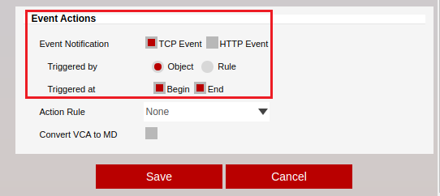

5.  Click **Save** located at the bottom to save the configuration.

    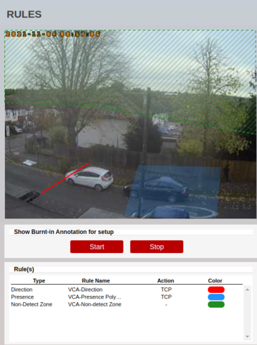

6.  Click **OK** to confirm the settings.

    

### Configuring the Calibration

Camera calibration is required in order for object identification and classification to occur. _The calibration is only_
_required when using the motion Object Tracker, the IPM AI series will have the option to select the DL Object or_
_People Tracker and will not need any calibration for classification to occur._

1.  From the **VCAedge** menu, click on **CALIBRATION** in the left side.

    

2.  In **Enable Calibration**, turn on the calibration feature.

3.  Use the mimics to match up with people or objects in the scene to help calibrate. They represent a height of 1.8
    meters.

    

4.  Click **Apply** located at the bottom to save the configuration.

### Creating TCP Notifications

The TCP notification sends data to a remote TCP server when triggered. The format is configurable with a mixture of
plain text and tokens. Tokens are used to represent the event metadata that will be included when a rule is triggered.

1.  From the **VCAedge** menu, click on **TCP NOTIFICATION** in the left side.

    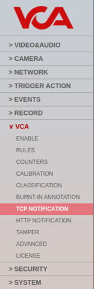

2.  In **General Settings**, turn on the notification feature.

3.  In **TCP Settings**, configure the TCP request as follows:

    -   In **Host `url`**, enter the IP address of the Axxon Next server.
    -   In **Port**, enter the TCP port configured for the Event Source of the Axxon Next server.

        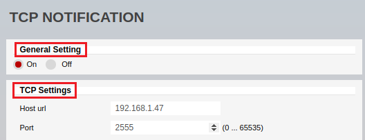

4.  In **Message**, select **Rule** and define the body of the notification that will be sent when the rule is
    triggered.

    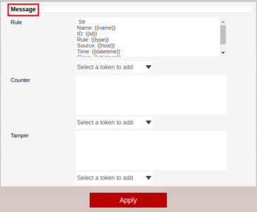

5.  Click **Apply** located at the bottom to save the configuration.

    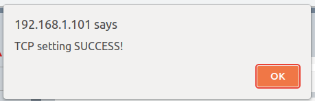

For this integration, the following tokens were used to send an information on the camera, zone, rule type and
classification that triggered the event:

-   `Str`: Represents the beginning of the message.
-   `{{name}}`: The name of the event.
-   `{{id}}`: The unique id of the event.
-   `{{type}}`: The type of the event. This is usually the type of rule that triggered the event.
-   `{{host}}`: The hostname of the device that generated the event.
-   `{{datetime}}`: The event time in the format `DD MM D HH:MM:SS YYYY Tue Jan 1 12:00:00 2019`.
-   `{{objclass}}`: The object class of the object triggering the rule.
-   `End`: Represents the end of the message.

_For more information on creating and configuring VCA in IPM cameras, please refer to the VCAedge IPM Plug-in Manual._

# Axxon Next Configuration

## Discovering IP Cameras

As soon as Axxon Next is started and connected to the server, it automatically performs camera discovery in the network.
Once an IP camera is discovered, its parameters will be displayed in the *Add device..* page from the **Devices** menu.

-   Enter the **Username** and **Password** to access the IPM camera.
-   Enter an **ID** for the IP camera.
-   Enter a descriptive **Name** for the device.
-   Click the green plus **+** button on the right side to add the new device.
-   Click **Apply** located bottom to confirm the settings.

    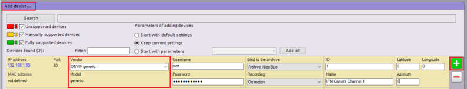

_Note: If the camera is not accessible, it will not be discovered automatically._ In this case, you will need to add it
manually as follows:

-   **Device Type:** Select **IP device** from the drop down menu.
-   **Vendor:** Select **ONVIF generic** from the drop down list.
-   **IP Address:** Enter the IP address of the IP camera.
-   **Port:** Enter the web listen port determined on the IP camera.
-   Enter the **Username** and **Password** to access the IP camera.
-   Enter an **ID** to identify the IP camera.
-   Enter a descriptive **Name** for the IP camera.
-   Click the green plus **+** button on the right side to add the new device.
-   Click **Apply** located bottom to confirm the settings.

    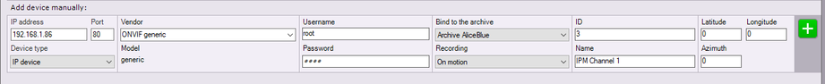

### Verifying the Stream

1.  Highlight the IP camera in the left menu.

    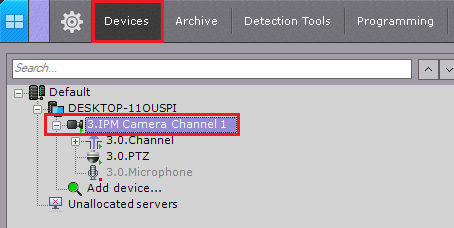

2.  ​In the *Camera settings* page, the preview window will display a live camera image.

    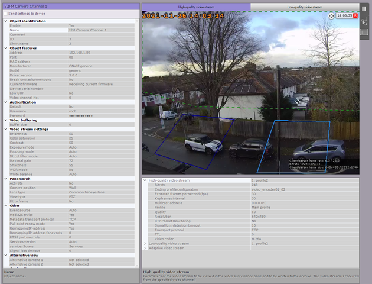

## Configuring the Event Source

Next, we add the Event Source device that will receive the TCP notifications from the IPM camera when the events occur.

1.  From the *Devices* page, click on **Add device...** in the left menu.

    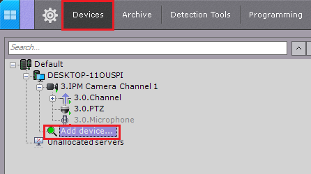

2.  In **Add device manually**, configure the new device as follows:

    -   **Device Type:** Select **Event Source** from the drop down menu.
    -   **Vendor:** Select `POSLegacy` from the drop down list.
    -   **IP Address:** Enter the IP address of the Axxon server.
    -   **Port:** Enter the TCP listen port determined on the VCAedge’s TCP notification._Port 2555 by default._
    -   **ID:** Enter an ID to identify the Event Source.
    -   **Name:** Enter a descriptive name for the device.
    -   Click the green plus **+** button on the right side to add the new device.

        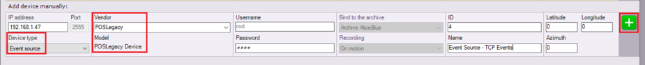

3.  Click **Apply** located bottom to confirm the settings.

### Configuring the Event Source Formatting

1.  Highlight the new Event Source device in the left menu.

    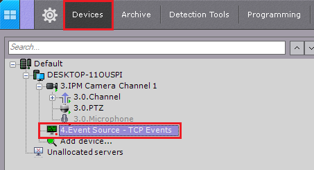

2.  In the *Event Source configuration* page, expand **Other** from the left side and adjust the properties as follows:

    -   **Transport Protocol:** Select **TCP** from the available options.
    -   **Port** Enter the listening port configured for the TCP events in the Event Source device.
    -   Configure the **Font** and select a **Colour** for the text as required. Then, click **OK** to save the
        settings.

        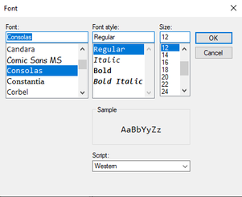

    -   **Message handling method:** Select **By event** from the drop down list.

        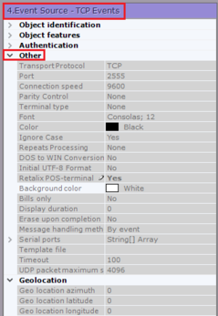

    -   In **Video sources**, select the **IPM camera** and click the **+** button located at the bottom to add the
        device into the video source box.

    -   In **Beginning words**, click the **+** button located at the bottom to create a new message. Then, enter the
        word that represents the **beginning** of the events.

    -   In **End words**, click the **+** button located at the bottom to create a new message. Then, enter the
        word that represents the **end** of the events.

        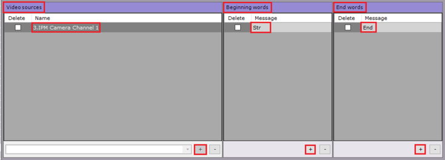

    -   In **Adjust text area**, position the red box on the image and configure the opacity accordingly. _The red box_
        _will display the events as an overlay on the video._

        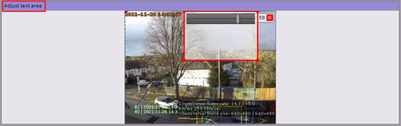

    -   In **Word highlighting**, click the **+** button located at the bottom to add a new entry. Then, enter the words
        you want to highlight when the events occur and select any background to identify them.

        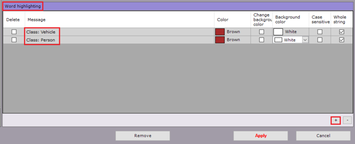

3.  Click **Apply** located bottom to confirm and save the settings.

_Make sure the port is opened on all intermediate firewalls and not used by any other software on the server machine._

## Verifying VCA Events

1.  From the main screen, click the **Live page** button located top left.

2.  Then, turn on the Event Source notifications by clicking the arrow next to the camera's name and select **Event**
    **sources** from the list.

    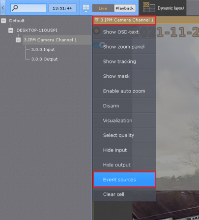

3.  The VCAedge events will be displayed as an overlay on the channel:

    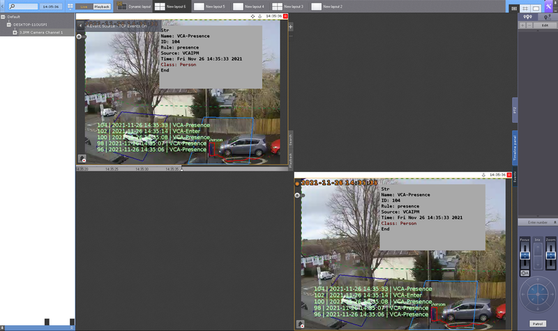
