# Introduction

## Prerequisites

-   IPM series camera.
-   VCAedge video analytics plug-in version 1.0.41 or greater.
-   ExacqVision VMS version 21.03 or greater.

## Supported features

-   All VCAedge event notification methods are available.

## Architecture

In this integration, the ExacqVision VMS receives the annotated RTSP stream from the IPM camera and the Serial Profile
alarms are sent through the TCP notifications with VCA tokens containing details about the event.

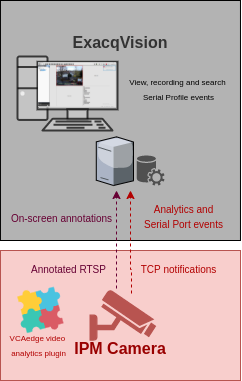

# IPM Camera Configuration

## Video & Audio Settings

### Confirming the RTSP stream used for transmitting video footage

Check and change if required, the RTSP stream settings used by the IP camera for external connections to the channels.

1.  From the **Setup** menu, click on **VIDEO & AUDIO** and then, click on **VIDEO**.

    

2.  Note the *Live Video Channel* settings as these will be needed when connecting to the RTSP stream from the
    ExacqVision server.

    

## Network Settings

### Confirming the RTSP port used for transmitting video footage

Check and change if required, the RTSP port used by the IP camera for external connections to the channels.

1.  From the **Setup** menu, click on **NETWORK** and then, click on **NETWORK SETTINGS**.

    

2.  Note the **IP Setup** and **Port Setup** as these will be needed when connecting to the RTSP stream from the
    ExacqVision server.

    

## Configuring The VCAedge Plug-in

The VCAedge plug-in is a set of analytical tools that can be loaded onto supported cameras. It provides the means to
perform advanced analytics and reduce false alerts when events occur. _Make sure you have a valid license that will_
_enable the VCAedge engine and all the features available._

Configure the VCAedge plug-in as required with the appropriate tracker, rules and a notification. A basic setup is
detailed below as an example.

### Enabling VCA

1.  From the **Setup** menu, click on **VCA** in the left side. Then, click on **ENABLE**.

    

2.  Turn on the video analytics features and click **Apply** located at the bottom to save the configuration.

    

### Creating Rules

1.  From the **VCAedge** menu, click on **RULES** in the left side.

    

2.  Click **Add** located at the bottom to display a list of available rules.

    

3.  Select a single rule to trigger an event and modify the **Rule property** as follows:

    -   Position the rule on the scene and change the shape as required. You can add/remove nodes to create complex
        shapes.

    -   In **Object Filter**, tick the box against the **Classes** that the rule should trigger events only.

        

        _Note: The available classifiers are different depending on the hardware platform and the installed license._

4.  Then, define the action that will occur when the rule triggers an event in **Event Actions** as follows:

    -   In **Event Notification**, tick the box against the **TCP Event** to enable TCP notifications when a
        event occurs.

    -   In **Triggered By**, define when the notification will be sent. The available options are:
        -   **Object:** Send notification for each object triggering the rule.
        -   **Rule:** Send a notification every time the rule is triggered.
    -   In **Triggered At**, select one of the following options:
        -   **Object:** Choose between the **begin** of the object triggering the rule as it enters the zones or
             the **end** of the object triggering the rule as it leaves the zone. _A notification will be sent for each_
             _object triggering the rule._

        -   **Rule:** From the **begin** point of the first object to trigger the rule to the **end** point of the last
            object to trigger the rule. _A notification will be sent for each triggering of the rule._

        

5.  Click **Save** located at the bottom to save the configuration.

    

6.  Click **OK** to confirm the settings.

    

### Configuring the Calibration

Camera calibration is required in order for object identification and classification to occur. _The calibration is only_
_required when using the motion Object Tracker, the IPM AI series will have the option to select the DL Object or_
_People Tracker and will not need any calibration for classification to occur._

1.  From the **VCAedge** menu, click on **CALIBRATION** in the left side.

    

2.  In **Enable Calibration**, turn on the calibration feature.

3.  Use the mimics to match up with people or objects in the scene to help calibrate. They represent a height of 1.8
    meters.

    

4.  Click **Apply** located at the bottom to save the configuration.

### Creating TCP Notifications

The TCP notification sends data to a remote TCP server when triggered. The format is configurable with a mixture of
plain text and tokens. Tokens are used to represent the event metadata that will be included when a rule is triggered.

1.  From the **VCAedge** menu, click on **TCP NOTIFICATION** in the left side.

    

2.  In **General Settings**, turn on the notification feature.

3.  In **TCP Settings**, configure the TCP request as follows:

    -   In **Host `url`**, enter the IP address of the ExacqVision server.
    -   In **Port**, enter the TCP port configured for the Serial Port of the ExacqVision server.

        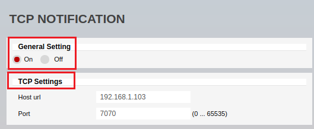

4.  In **Message**, select **Rule** and define the body of the notification that will be sent when the rule is
    triggered.

    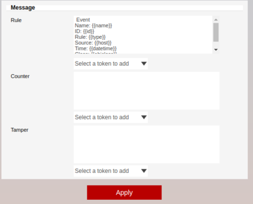

5.  Click **Apply** located at the bottom to save the configuration.

6.  Click **OK** to confirm configuring the notification.

    

For this integration, the following tokens were used to send an information on the camera, zone, rule type and
classification that triggered the event:

-   `Event`: Represents the beginning of the message.
-   `{{name}}`: The name of the event.
-   `{{id}}`: The unique id of the event.
-   `{{type}}`: The type of the event. This is usually the type of rule that triggered the event.
-   `{{host}}`: The hostname of the device that generated the event.
-   `{{datetime}}`: The event time in the format `DD MM D HH:MM:SS YYYY Tue Jan 1 12:00:00 2019`.
-   `{{objclass}}`: The object class of the object triggering the rule.
-   `End`: Represents the end of the message.

_For more information on creating and configuring VCA in IPM cameras, please refer to the VCAedge IPM Plug-in Manual._

# ExacqVision Client Configuration

## Adding an IP Camera

1.  First, we add a new camera into the system. From the *Configuration (Setup)* page, click on **Add IP Cameras** in
    the left menu.

    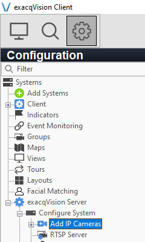

2.  In **IP Camera List**, click **New** located at the bottom to add a new device.

    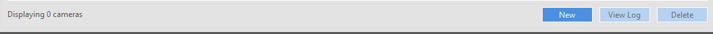

3.  In **IP Camera Information** located right side, configure the new camera as follows:

    -   **Device Type:** Select **RTSP** from the drop down list.

        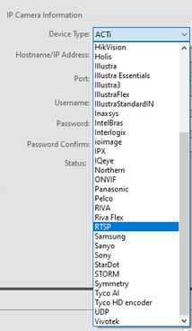

    -   **Hostname/IP Address:** Enter the RTSP URL to connect to the channel. Default format:
        `rtsp://<IP_address>:<RTSP_port>/<description>`. Example: `rtsp://192.168.1.202:554/channel2`

    -   **Username**: Enter the username to access the IPM camera.
    -   **Password**: Enter the password to access the IPM camera.
    -   Click **Apply** to connect to the IPM channel. _Make sure the Status indicates Connected._

        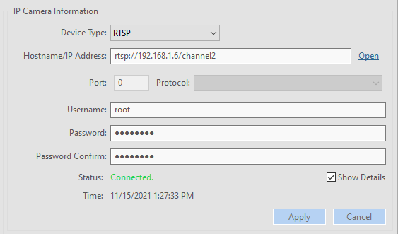

4.  Click **Apply** located at the bottom to confirm and save the device configuration.

### Verifying Camera Recording and Live Stream

1.  From the left menu, click the plus **(+)** button next to **Camera Recording** to expand the cameras.

2.  **Highlight** the IPM camera newly created to access the settings.

    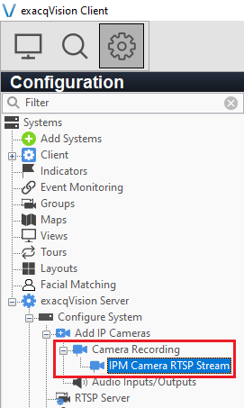

3.  Click the **Display** tab located at the bottom and enter a descriptive **Name** for the new camera.

    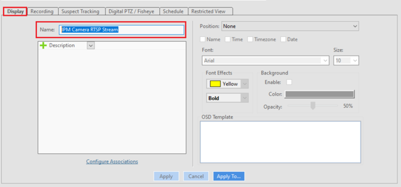

4.  Then, click the **Recording** tab located at the bottom and verify that the recording is **Enabled**.

    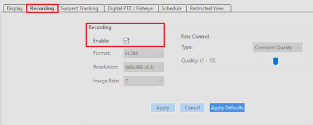

5.  Click **Apply** located at the bottom to save the configuration.

    _The preview window will display a live image of the camera alongside with the RTSP stream settings._

    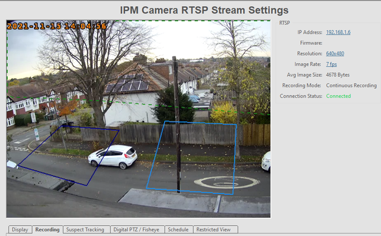

## Configuring the Serial Port

1.  Now, we configure the serial Port that will receive the TCP events generated by the VCAedge plug-in. Click on
    **Serial Ports** in the left menu.

    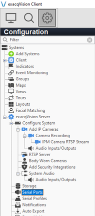

2.  Then, click **New** located at the bottom.

    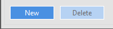

3.  In the *Serial Port* page, configure the new serial port as follows:

    -   **Name:** Enter a descriptive name for the Serial Port.
    -   **Use:** Select **Access Ctrl** from the drop down list.
    -   **Profile:** Select **New...** _(we will create a Serial Profile later)_.
    -   **Type:** Select **TCP Listener** from the drop down list.
    -   **Address:** Enter the IP address of the IPM camera.
    -   **Port:** Enter the TCP listen port determined on the VCAedge’s TCP notification.
    -   **Max Line Length:** Set to 120.

        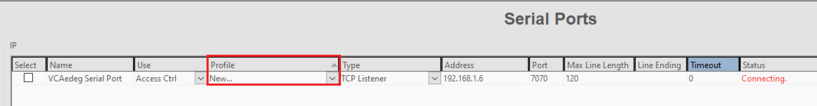

4.  Click **Apply** located at the bottom to save the configuration.

_Every time the VCAedge plug-in sends an TCP event, the Status will change to Connected for a brief period of time_.
_Make sure any active firewalls are configured to allow traffic using the port detailed above._

## Configuring the Serial Profile

1.  Next, we configure the Serial Profile. From the *Serial Profiles* page, click the **Configuration** tab located top
    left.

2.  In **Serial Preview**, click the arrow on the right of the **Port Name** and select the **Serial Port** created
    previously.

3.  Edit **Profile Configuration** as follows:

    -   **Name:** Enter a descriptive name for the new Profile.
    -   **Parser:** Select **Default** from the available options.
    -   **SOT marker:** Enter the Start Of the Transaction.
    -   **Marker Type** Select **Standard** from the available options _(it tells ExacqVision to expect plain text_
        _characters without any special formatting or structure)._

    -   **EOT marker:** Enter the End Of the Transaction.

        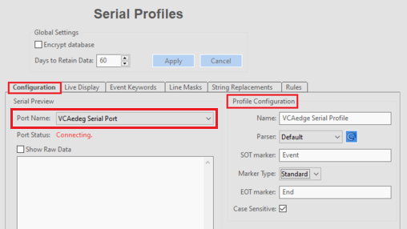

        _The beginning and end of the transaction can be found using the raw data shown in the left side._

        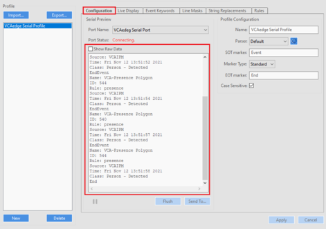

4.  Click **Apply** located at the bottom to save the Serial Profile configuration.

### Configuring the Event Keywords

1.  Now, we have to create the keywords related to the different alarm types we have. From the *Serial Profiles* page,
    click on the **Event Keywords** tab located top. Then, click **New** for every word.

    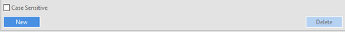

    -   Add the **String** for each alarm and click **Apply** located at the bottom to confirm.

        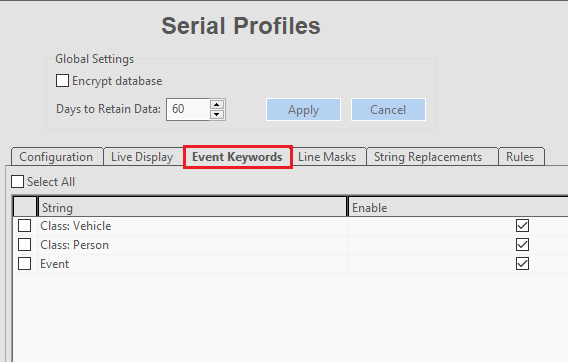

#### Configuring the Formatting of the Serial Profile

1.  The TCP events generated by the VCAedge plug-in will appear as overlay on the video. From the *Serial Profiles*
    page, click on the **Live Display** tab located top.

    -   In **Camera**, select the IPM camera.
    -   Click on **Font** located at the bottom. Then, select the font, size, effects and the background as required.

        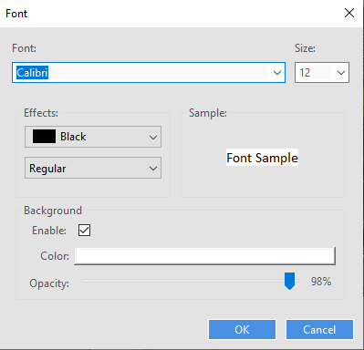

        -   Click **OK** to save the configuration.

    -   Position the text on the live view and click **Apply** to confirm the settings.

        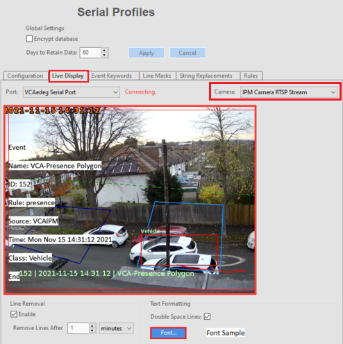

## Configuring the Event Monitoring Profile

1.  The Event Monitoring allows you to see the alarm events in a list. From the left menu, click on **Event**
    **Monitoring**.

    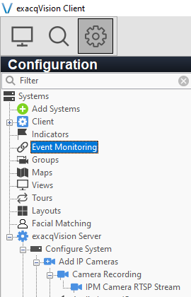

2.  In **Profiles**, click **New** to create a new Event Monitoring Profile.

    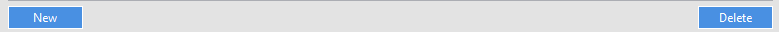

3.  In **Profile Configuration**, edit the new profile as follows:

    -   **Name:** Enter a descriptive name for the new profile.
    -   **Show Event List:** Select **Always** from the drop down list.
    -   Tick the box against **Show Newest Event**.
    -   **Type:** Select **Video Panel**.

        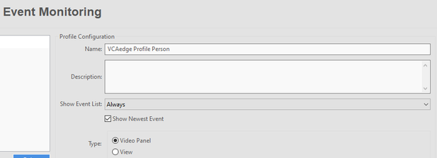

4.  In **Event Type** located at the bottom, select **Serial Profile** from the available events.

5.  In **Event Source**, select the key word created previously.

6.  In **Action Type**, select **Log** from the available actions.

    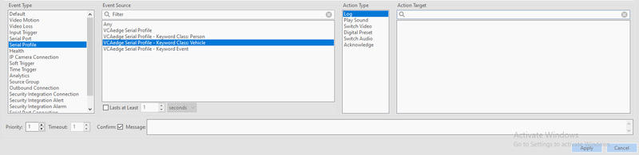

7.  Click **Apply** located at the bottom to save the Client Actions.

    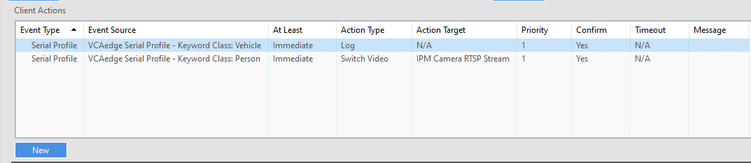

## Verifying the Events

### Verifying the Event Monitoring Profile Events

In ExacqVision **Live Page** we can see the event list right clicking in a panel and selecting **Event Monitor** and
the **Event Monitoring Profile** just created.

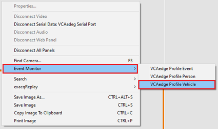

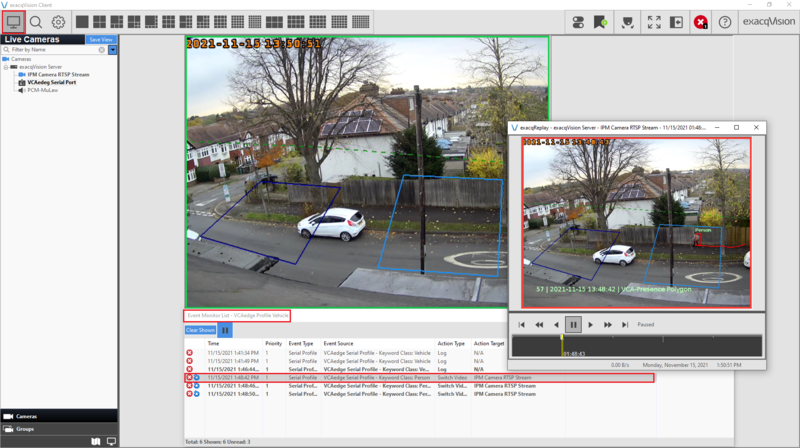

#### Verifying the VCAedge Overlay Events

The TCP events generated by the VCAedge plug-in will appear as a overlay on the video

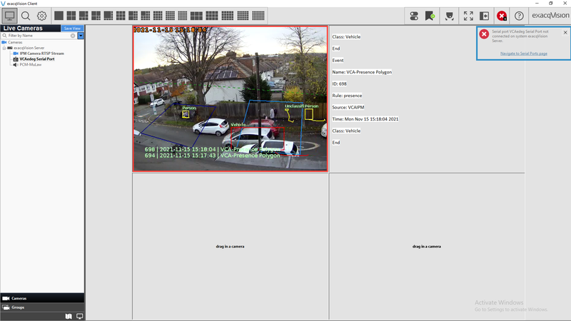

##### Searching Events

From the **Search Page**, select the Serial Profile you want to verify and click **Search** located a the bottom.

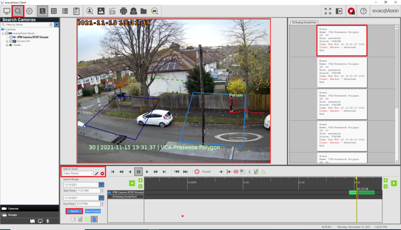

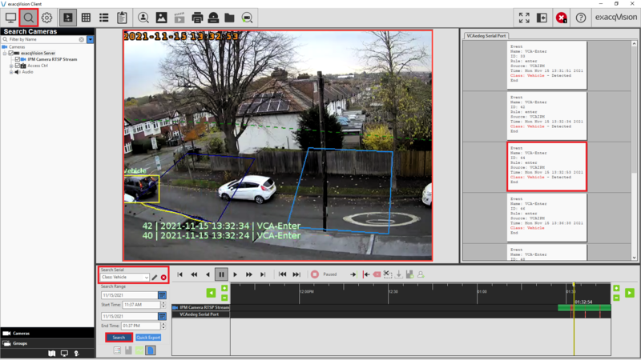
