# Introduction

## Prerequisites

-   IPM series camera.
-   VCAedge video analytics plug-in version 1.0.41 or greater.
-   SureView Immix CS.

## Supported features

-   Live video.
-   SMTP alarms.
-   Post Alarm Recording.

## Architecture

In this integration, the SureView server receives the annotated video from the IPM camera and the alarms are sent
through the SMTP notifications with the detail of the event.

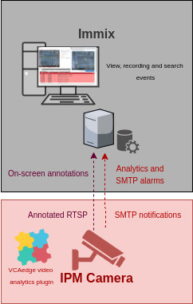

# IPM Camera Configuration

## Video & Audio Settings

### Confirming the RTSP stream used for transmitting video footage

Check and change if required, the RTSP stream settings used by the IP camera for external connections to the channels.

1.  From the **Setup** menu, click on **VIDEO & AUDIO** and then, click on **VIDEO**.

    

2.  Note the *Live Video Channel* settings as these will be needed when connecting to the RTSP stream from the
    SureView server.

    

## Network Settings

### Confirming the RTSP port used for transmitting video footage

Check and change if required, the RTSP port used by the IP camera for external connections to the channels.

1.  From the **Setup** menu, click on **NETWORK** and then, click on **NETWORK SETTINGS**.

    

2.  Note the **IP Setup** and **Port Setup** as these will be needed when connecting to the RTSP stream from the
    SureView server.

    

### Configuring SMTP Notifications

1.  From the **NETWORK** menu, click on **SMTP** in the left side.

    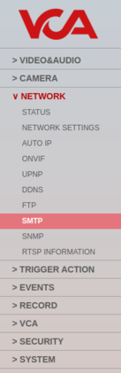

2.  In **General Setting**, turn on the SMTP feature.

3.  In **Account information**, configure the SMTP notification as follows:

    -   **Mode:** Select **PLAIN** from the available options.
    -   **SMTP Server Address:** Enter the IP address or hostname of the server running the SureView SMTP receiver.
    -   **PORT:** Enter the SMTP listen port of the SureView server. _Default port 25._
    -   **User ID:** Enter the username to access the SureView server.
    -   **Password:** Enter the password to access the SureView server.
    -   **E-mail Sender:** Enter the device’s `S` number email address given in the Immix Setup Report (Summary).
    -   **E-mail Receiver:** Enter the device’s `S` number email address given in the Immix Setup Report (Summary).

        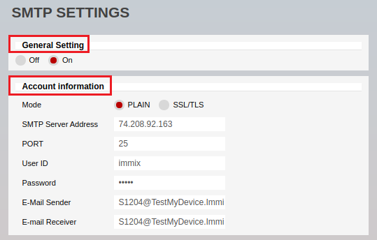

4.  In **Mail Contents**, configure the body of the SMTP notification as follows:

    -   **Title:** Enter a descriptive name for the alarms.
    -   **Message:** Leave it blank.
    -   Tick the box against **Contains detailed event information**.

        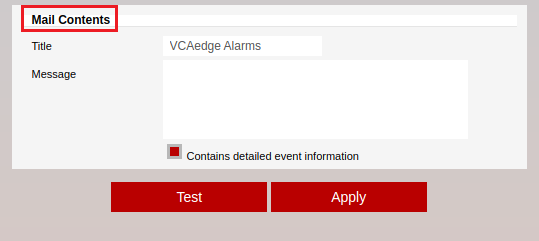

5.  Click **Apply** located at the bottom to save the configuration.

6.  Click **OK** to confirm creating the SMTP notification.

_Optionally, you can test the SMTP notification by clicking on Test located at the bottom._

## Trigger Action

### Configuring Action Rules

1.  From the **TRIGGER ACTION** menu, click on **ACTION RULES** in the left side.

    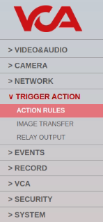

2.  Then, click **Add** to create a new action rule.

3.  In the *ACTION RULES CONFIGURATION* page, configure the **General Setting** as follows:

    -   **Name:** Enter a descriptive name for the action.
    -   **Operation Interval:** Leave it blank.  
    -   In `Action1`, select `SMTP_RECIPIENT` from the drop down list.

        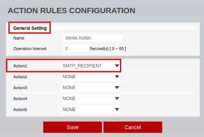

4.  Click **Save** located at the bottom to save the configuration.

5.  Click **OK** to confirm creating the action.

#### Configuring Image Transfer

1.  From the **TRIGGER ACTION** menu, click on **IMAGE TRANSFER** in the left side.

    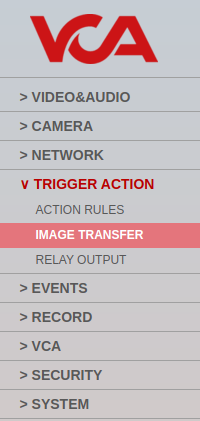

2.  In **Pre/Post Alarm Image**, configure the image transfer speed and the duration of image transfer after and before
    an event as required.

    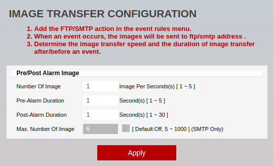

3.  Click **Apply** to save the configuration.

4.  Click **OK** to confirm configuring the image transfer.

## Configuring The VCAedge Plug-in

The VCAedge plug-in is a set of analytical tools that can be loaded onto supported cameras. It provides the means to
perform advanced analytics and reduce false alerts when events occur. _Make sure you have a valid license that will_
_enable the VCAedge engine and all the features available._

Configure the VCAedge plug-in as required with the appropriate tracker, rules and a notification. A basic setup is
detailed below as an example.

### Enabling VCA

1.  From the **Setup** menu, click on **VCA** in the left side. Then, click on **ENABLE**.

    

2.  Turn on the video analytics features and click **Apply** located at the bottom to save the configuration.

    

### Creating Rules

1.  From the **VCAedge** menu, click on **RULES** in the left side.

    

2.  Click **Add** located at the bottom to display a list of available rules.

    

3.  Select a single rule to trigger an event and modify the **Rule property** as follows:

    -   Position the rule on the scene and change the shape as required. You can add/remove nodes to create complex
        shapes.

    -   In **Object Filter**, tick the box against the **Classes** that the rule should trigger events only.

        

        _Note: The available classifiers are different depending on the hardware platform and the installed license._

4.  Then, define the action that will occur when the rule triggers an event in **Event Actions** as follows:

    -   In **Action Rule**, select the action rule created previously.

        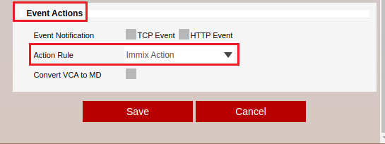

5.  Click **Save** located at the bottom to save the configuration.

6.  Click **OK** to confirm the settings.

    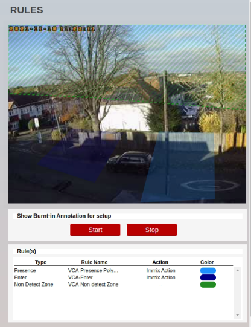

### Configuring the Calibration

Camera calibration is required in order for object identification and classification to occur. _The calibration is only_
_required when using the motion Object Tracker, the IPM AI series will have the option to select the DL Object or_
_People Tracker and will not need any calibration for classification to occur._

1.  From the **VCAedge** menu, click on **CALIBRATION** in the left side.

    

2.  In **Enable Calibration**, turn on the calibration feature.

3.  Use the mimics to match up with people or objects in the scene to help calibrate. They represent a height of 1.8
    meters.

    

4.  Click **Apply** located at the bottom to save the configuration.

_For more information on creating and configuring VCA in IPM cameras, please refer to the VCAedge IPM Plug-in Manual._

## Verifying Event Rules

1.  From the **EVENTS** menu, click on **EVENT RULES** in the left side.

    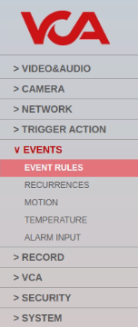

2.  ​Make sure that the ​Event ​Rule contains the VCA detection rules along with​ the schedule and the SMTP action created​
    previously.

    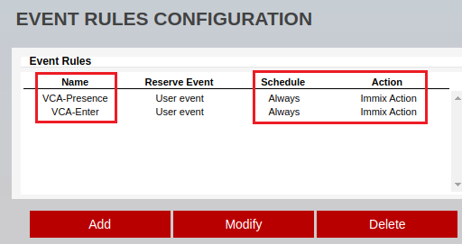

# Immix Configuration

## Required Ports

|**From**     |**To**       |**Port**|**Use**                                 |
|:-----------:|:-----------:|:------:|:--------------------------------------:|
|UDP Device   |Immix Server |25 TCP  |For receiving alarms                    |
|Immix Server |UDP Device   |554 TCP |For connecting to the UDP Device stream |
|Immix Server |UDP Device   |80 TCP  |For connecting to the UDP Device        |

## Adding a New Device

1.  First, we add a new device into the system. From the main screen, click on **Setup** located top. Then, click
    **Manage Devices and Alarms** from the right menu.

    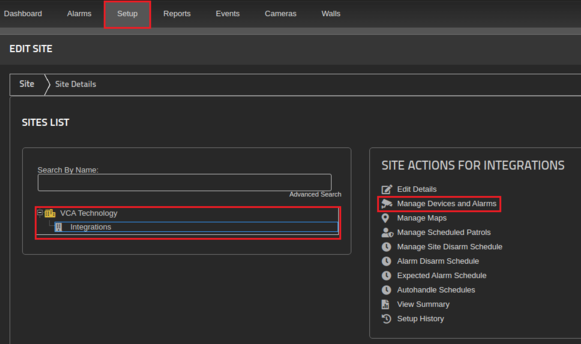

2.  In the *Device* page, click on **Add Device** located a the bottom.

    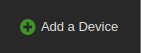

3.  In **DEVICE DETAILS**, configure the IP camera as follows:

    -   **Device Type Filter:** Select **Video Devices** from the available options.
    -   **Device Type:** Select **UDP** from the available devices.
    -   **Title:** Enter a descriptive name for the new device.

        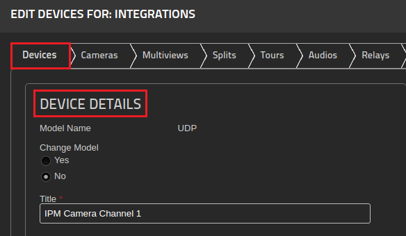

4.  Then, in **CONNECTION DETAILS**, configure the connection as follows:

    -   **IP/Host:** Enter the IP address or hostname of the IPM camera.
    -   **Port:** Enter the web port of the IPM camera.
    -   **Username:** Enter the username to access the IPM camera.
    -   **Password:** Enter the password to access the IPM camera.
    -   **RTSP Port:** Enter the RTSP port of the IPM camera.

        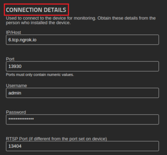

5.  Click **DONE** on the right side to confirm adding the new device.

    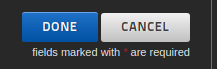

6.  From the *Device* page, click on **NEXT**.

    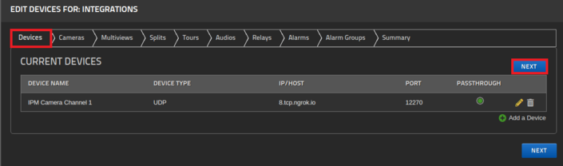

## Configuring the Camera

1.  From the *Cameras* page, click **Add a Camera** located at the bottom.

    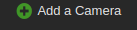

2.  In **CAMERA DETAILS**, edit the camera as follows:

    -   **Select Device:** Select the UDP device created previously.
    -   **Input:** Enter the number of the stream you want to connect._Note: The Stream number will default to 1 if_
        _not included._

    -   **Camera Name:** Enter a descriptive name for the new camera.

        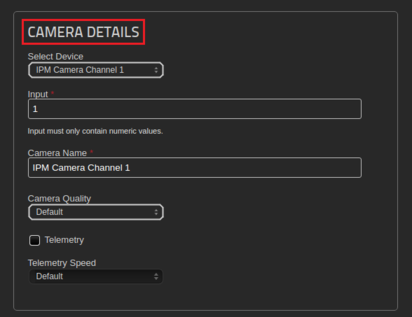

3.  Click **DONE** on the right side to confirm creating the camera.

    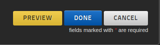

4.  Then, from the *Cameras* page, click the **Preview camera** button located at the bottom.

    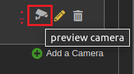

    _The preview window will display a live image of the camera._

    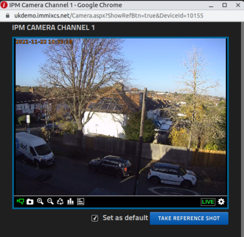

## Generating the Summary

1.  From the **Setup** menu, click the **Summary** tab located top.

    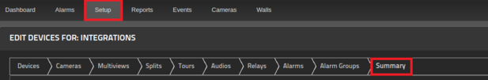

2.  The Summary provides a single document with all of the details to configure the device. Note the **SMTP Server**
    **Address** provided since you will need it to configure the SMTP notification of the IPM camera.

    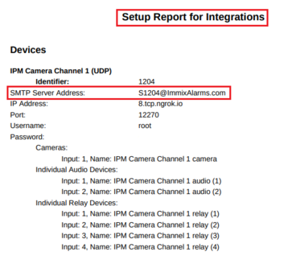

## Verifying the SMTP Alarms

​The **Alarms** page will display a list of SMTP alarms generated by the VCAedge plug-in along with the annotated
recording of the events.

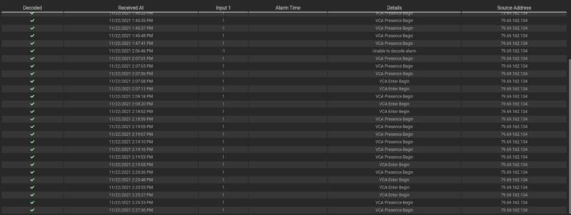

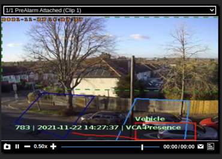

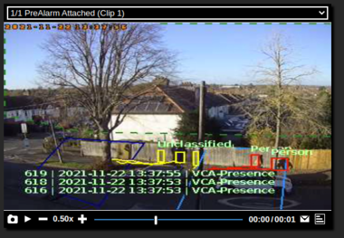
