# Introduction

## Prerequisites

-   IPM series camera.
-   VCAedge video analytics plug-in version 1.0.41 or greater.
-   Luxriot EVO S VMS version 1.19 or greater.

## Supported features

-   All VCAedge event notification methods are available.

## Architecture

In this integration, the Luxriot EVO S VMS receives the annotated RTSP stream from the IPM camera and the Data
Source alarms are sent through the TCP notifications with VCA tokens containing details about the event.

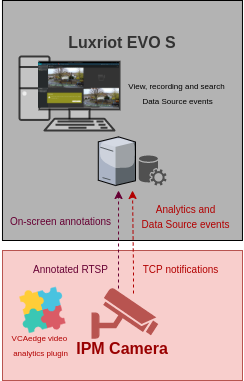

# IPM Camera Configuration

## Video & Audio Settings

### Confirming the RTSP stream used for transmitting video footage

Check and change if required, the RTSP stream settings used by the IP camera for external connections to the channels.

1.  From the **Setup** menu, click on **VIDEO & AUDIO** and then, click on **VIDEO**.

    

2.  Note the *Live Video Channel* settings as these will be needed when connecting to the RTSP stream from the Luxriot
    EVO server.

    

## Network Settings

### Confirming the RTSP port used for transmitting video footage

Check and change if required, the RTSP port used by the IP camera for external connections to the channels.

1.  From the **Setup** menu, click on **NETWORK** and then, click on **NETWORK SETTINGS**.

    

2.  Note the **IP Setup** and **Port Setup** as these will be needed when connecting to the RTSP stream from the Luxriot
    EVO server.

    

## Configuring The VCAedge Plug-in

The VCAedge plug-in is a set of analytical tools that can be loaded onto supported cameras. It provides the means to
perform advanced analytics and reduce false alerts when events occur. _Make sure you have a valid license that will_
_enable the VCAedge engine and all the features available._

Configure the VCAedge plug-in as required with the appropriate tracker, rules and a notification. A basic setup is
detailed below as an example.

### Enabling VCA

1.  From the **Setup** menu, click on **VCA** in the left side. Then, click on **ENABLE**.

    

2.  Turn on the video analytics features and click **Apply** located at the bottom to save the configuration.

    

### Creating Rules

1.  From the **VCAedge** menu, click on **RULES** in the left side.

    

2.  Click **Add** located at the bottom to display a list of available rules.

    

3.  Select a single rule to trigger an event and modify the **Rule property** as follows:

    -   Position the rule on the scene and change the shape as required. You can add/remove nodes to create complex
        shapes.
    -   In **Object Filter**, tick the box a    inst the **Classes** that the rule should trigger events only.

        

        _Note: The available classifiers are different depending on the hardware platform and the installed license._

4.  Then, define the action that will occur when the rule triggers an event in **Event Actions** as follows:

    -   In **Event Notification**, tick the box against the **TCP Event** to enable TCP notifications when a
        event occurs.
    -   In **Triggered By**, define when the notification will be sent. The available options are:
        -   **Object:** Send notification for each object triggering the rule.
        -   **Rule:** Send a notification every time the rule is triggered.
    -   In **Triggered At**, select one of the following options:
        -   **Object:** Choose between the **begin** of the object triggering the rule as it enters the zones or
             the **end** of the object triggering the rule as it leaves the zone. _A notification will be sent for each_
             _object triggering the rule._
        -   **Rule:** From the **begin** point of the first object to trigger the rule to the **end** point of the last
            object to trigger the rule. _A notification will be sent for each triggering of the rule._

        

5.  Click **Save** located at the bottom to save the configuration.

    

6.  Click **OK** to confirm the settings.

    

### Configuring the Calibration

Camera calibration is required in order for object identification and classification to occur. _The calibration is only_
_required when using the motion Object Tracker, the IPM AI series will have the option to select the DL Object or_
_People Tracker and will not need any calibration for classification to occur._

1.  From the **VCAedge** menu, click on **CALIBRATION** in the left side.

    

2.  In **Enable Calibration**, turn on the calibration feature.

3.  Use the mimics to match up with people or objects in the scene to help calibrate. They represent a height of 1.8
    meters.

    

4.  Click **Apply** located at the bottom to save the configuration.

### Creating TCP Notifications

The TCP notification sends data to a remote TCP server when triggered. The format is configurable with a mixture of
plain text and tokens. Tokens are used to represent the event metadata that will be included when a rule is triggered.

1.  From the **VCAedge** menu, click on **TCP NOTIFICATION** in the left side.

    

2.  In **General Settings**, turn on the notification feature.

3.  In **TCP Settings**, configure the TCP request as follows:

    -   In **Host `url`**, enter the IP address of the Luxriot EVO S server.
    -   In **Port**, enter the TCP port configured for the Data Source of the Luxriot EVO server.

        

4.  In **Message**, select **Rule** and define the body of the notification that will be sent when the rule is
    triggered.

    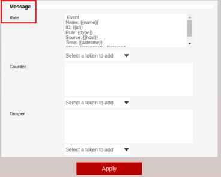

5.  Click **Apply** located at the bottom to save the configuration.

6.  Click **OK** to confirm configuring the notification.

    

For this integration, the following tokens were used to send an information on the camera, zone, rule type and
classification that triggered the event:

-   `Event`: Represents the beginning of the message.
-   `{{name}}`: The name of the event.
-   `{{id}}`: The unique id of the event.
-   `{{type}}`: The type of the event. This is usually the type of rule that triggered the event.
-   `{{host}}`: The hostname of the device that generated the event.
-   `{{datetime}}`: The event time in the format `DD MM D HH:MM:SS YYYY Tue Jan 1 12:00:00 2019`.
-   `{{objclass}}`: The object class of the object triggering the rule.
-   `End`: Represents the end of the message.

_For more information on creating and configuring VCA in IPM cameras, please refer to the VCAedge IPM Plug-in Manual._

# Luxriot EVO Management Console Configuration

## Adding a New Device

1.  First we add a new device into the system. From the left menu, click on **Devices**. Then, click **New Device**
    located top.

    

2.  In the *Details* pop-up window, click on **Select Model** and select **(Generic) ONVIF Compatible** from the
    available models and click **OK**.

    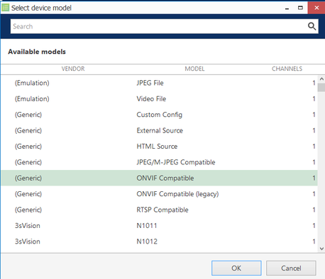

3.  In **Title**, enter a descriptive **name** for the device.

4.  Then, click on **Network** in the left menu and configure the new device as follows:

    -   **Host:** Enter the IP address of the IPM camera.
    -   **Port:** Enter the web port of the IPM camera.
    -   **Username:** Enter the username to access the IPM camera.
    -   **Password:** Enter the password to access the IPM camera.
    -   Click **Apply** to save the configuration.
    -   Click **OK** to finish creating the new device.

        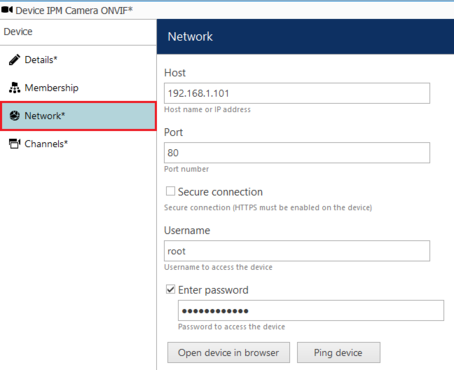

## Configuring Channels

### Configuring the Recording

1.  From the left menu, click on **Channels**. Then, click **Edit** located top to modify the newly created channel.

    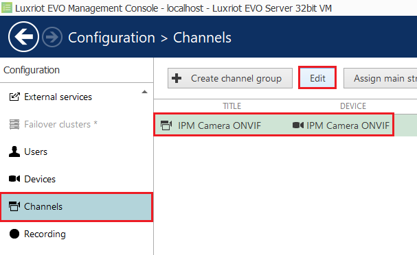

2.  In the *Details* page, configure the recording as follows:

    -   **Main stream recording configuration:** Click **Change** and select **Continuous recording**.
        Then, click **OK** to confirm and close the window.

    -   **Sub stream recording configuration:** Click **Change** and select **Continuous recording**.
        Then, click **OK** to confirm and close the window.

        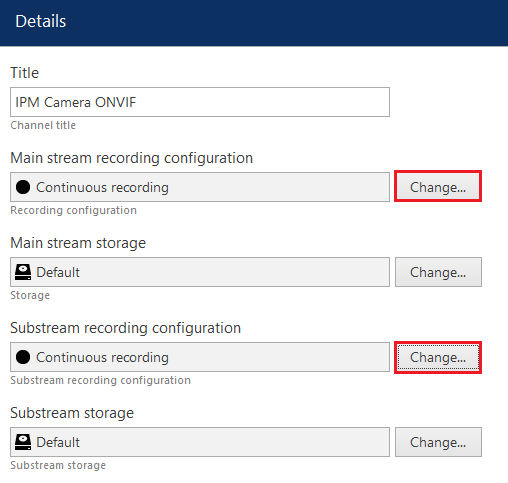

3.  Click **Apply** and **OK** to save the settings.

_Note: To confirm the IPM channel is configured correctly you can show a live stream. From the Channels page, select_
_the newly created device and click on Show Video located top._

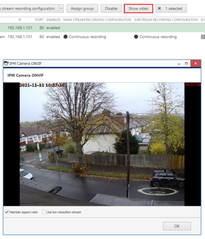

## Configuring Data Source

Next, we need to create a new Data Source to receive the TCP notifications from the VCAedge plug-in. Data is stored
and displayed embedded with the video stream from the channel(s) you choose to associate with it.

1.  In the left menu, click on **Data Source**. Then, click **New data source** located top.

    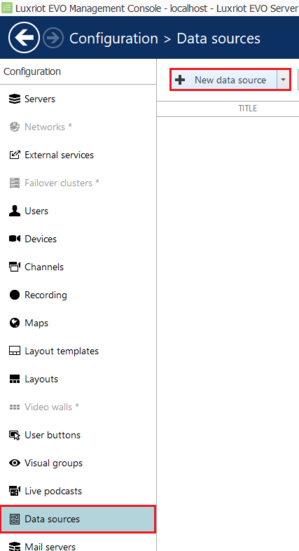

2.  In the *Details* pop-up window, configure the new Data Source as follows:

    -   **Title:** Enter a descriptive **name** for the Data Source.
    -   **Server:** Click **Change** and choose **Luxriot EVO Server** from the available options.
    -   **Data source profile:** Leave none *(it will be created later)*.
    -   **Data source type:** Select **TCP** from the drop down list.
    -   **Mode:** Select **Server** _(The program will be listening to the specified port)_.
    -   **Port:** Enter the TCP port for the Data Source to listen for events (this port matches the port configured
        in the VCAedge TCP Notification).

    -   Click **OK** to confirm and close the window.

        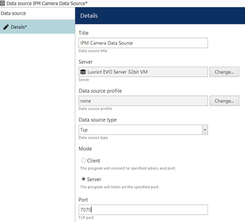

        _Make sure any active firewalls are configured to allow traffic using the port detailed above._

### Configuring Data Source Profile

1.  Now, we configure the Data Source Profile. From the left menu, click on **Data Sources**. Then, click
    **+ New data source profile** located top.

    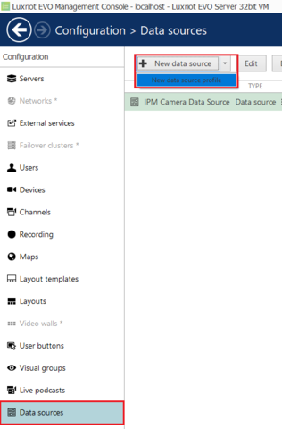

2.  In the *Details* page, enter a descriptive **name** for the Profile. Then, click on **Configuration** in the left
    menu.

3.  Configure the new profile as follows:

    -   **Encoding:** Select **Western European (Windows)** from the available options.
    -   **Line Ending:** Select **CR + FL** from the drop down list.
    -   **Remove non-printable characters:** leave it checked.

        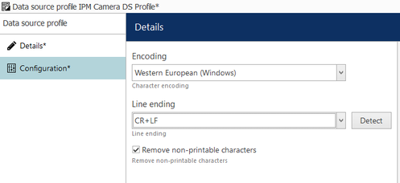

#### Defining Data Source Profile Format

1.  In the *Details* page, click on **load from data source...** located top right.

    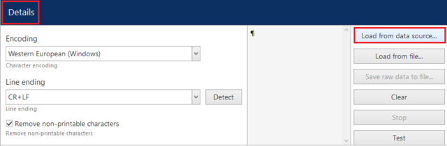

2.  Select the **Data Source** created previously and click **OK**.

    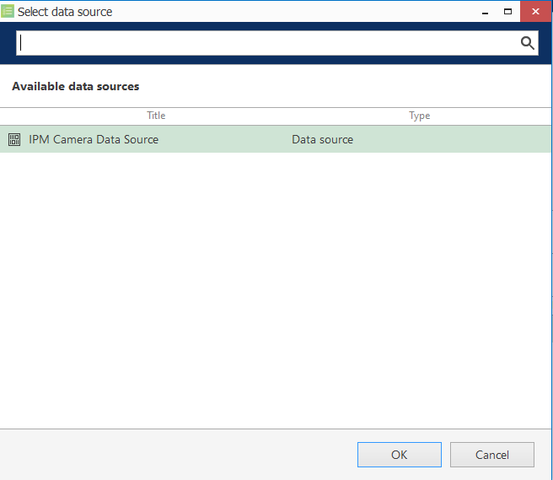

    _Note: Make sure that the IPM camera is sending events to the Luxriot EVO S server so that it can be viewed._

    The events are displayed in the trace window. If no events are being received then review the device configuration
    and ensure that your VCAedge plug-in is producing events.

    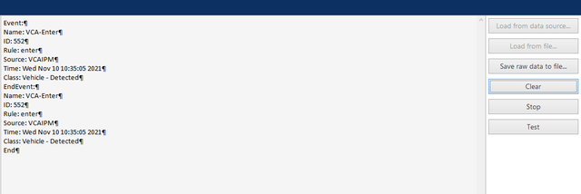

3.  Next, we need to define the **beginning** of an event from the data being received.

    -   Locate the text that identifies the beginning of an event.
    -   In **Mappings**, click on the `BeginTransaction` entry that will show the settings for `BeginTransaction` on
        the left.

    -   In **Text**, enter the word for the beginning of the transaction.
    -   Click **Apply changes**.

        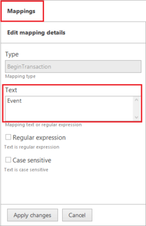

4.  Now, we need to define the **end** of an event from the data being received.

    -   Locate the text that identifies the end of an event.
    -   In **Mappings**, click on the `EndTransaction` entry that will show the settings for `EndTransaction` on
        the left.

    -   In **Text**, enter the word for the end of the transaction.
    -   Click **Apply changes**.

        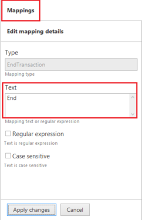

5.  Click **Apply** and **OK** to confirm and close the window.

##### Linking the Data Source Profile to the Data Source

1.  In the *Data Source configuration* page, select the data source created before and click **Edit** located top.

    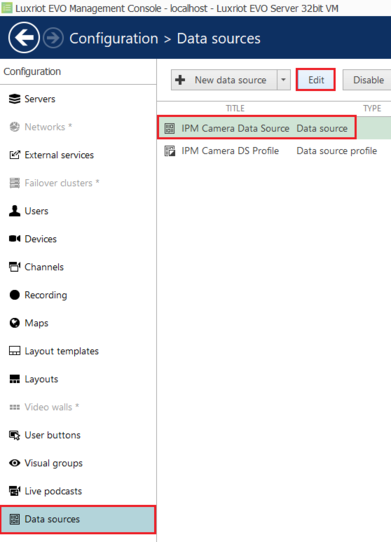

2.  Click **Change** next to the **Data Source profile**. Then, select the new Data Source Profile and click **OK** to
    confirm.

    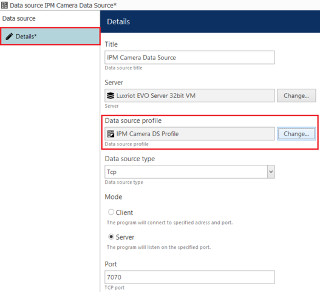

3.  Click **OK** to confirm and close the window.

    _To confirm the data source settings, select Test to start receiving events using the data source profile._

## Creating Events, Actions, and Rules

Now, we decide how the system will react to the events generated by the VCAedge Plug-in. To do this, we configure
events, actions, and rules that will be sending the Data Sources notifications to the Luxriot EVO S server.

### Creating Events

1.  First, we create a new Data Source Event. Click on **Events & Action** in the left menu.

2.  Then, click **Events** and **New Event** located top.

    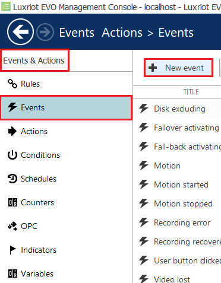

3.  In **Variables and Counter (4)**, select **Data Source** from the available types.

    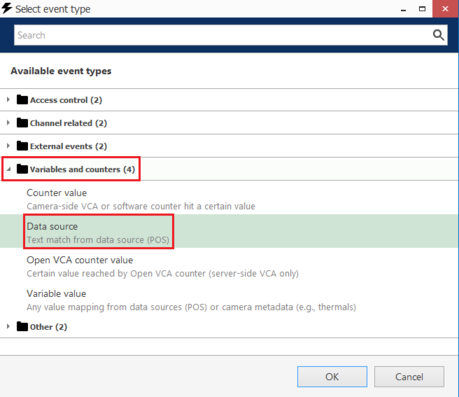

4.  In the *Details* pop-up window, configure the new event as follows:

    -   **Title:** Enter a descriptive **name** for the event.
    -   **Source:** Click **Change** and select **Data Source**. Then, click **OK** to confirm and close the Event
        source window.

    -   **Text:** Enter the text that will be triggering events.
    -   Click **OK** to confirm and close the Event window.

        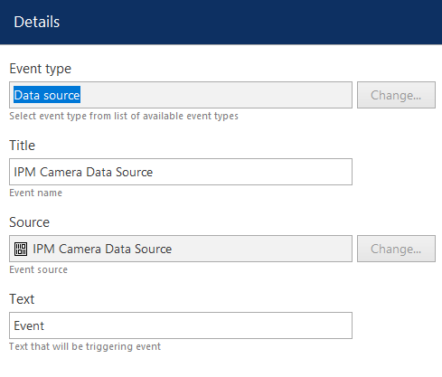

### Creating Actions

1.  Next, we create a new Action. From the left menu, click on **Actions** and **New action** located top.

    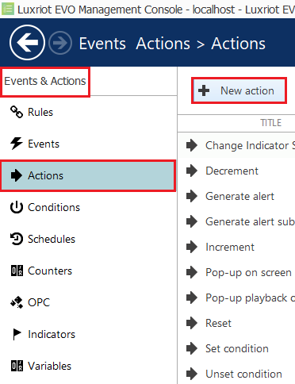

2.  In **Notifications (4)**, select **Send event to client** from the available actions.

    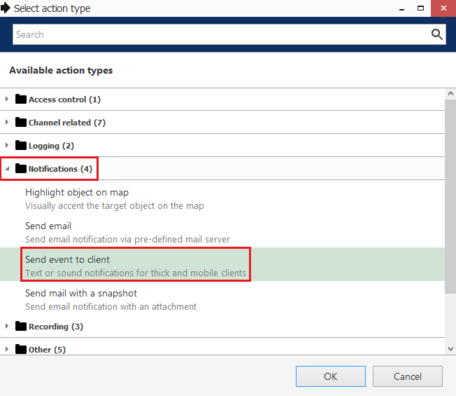

3.  Then, configure the notification as follows:

    -   **Title:** Enter a descriptive **name** for the notification.
    -   **Message:** Click the **Insert field** button located top right to add the fields that will contain the details
        of the events in the notification.

        

    -   **Enable** Display events in alert, Display a warning message box and Display event in notification panel.

        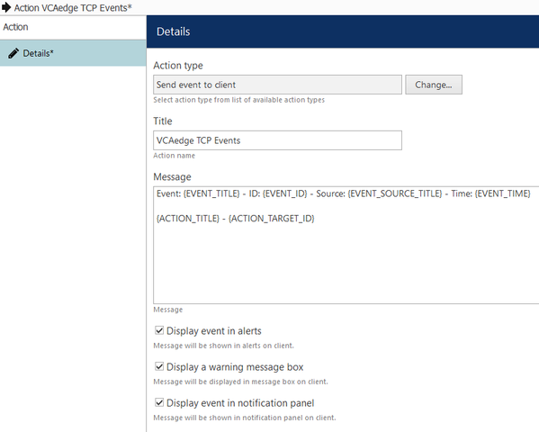

4.  Click **OK** to confirm and close the Actions window.

### Creating Rules

1.  The last step is to create a new Rule. From the left menu, click **Rules** and **Open configuration** located top.

    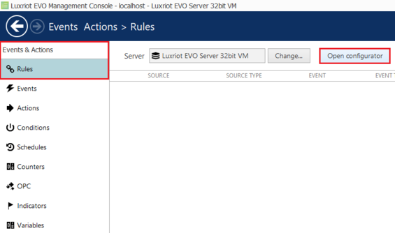

2.  In the *Event and Actions `configurator`* page, you will see three boxes associated with Events, Rules, and Actions.

3.  In **Events**, select the **Data Source Event** created previously. Then, click the greater than **>** button to
    move the event into the Rules box.

4.  In **Actions**, select the **Luxriot EVO S Server Notification** created previously. Then, click the less than **<**
    button to move the action into the Rules box.

5.  In **Rules**, complete the new rule as follows:

    -   Click **Target channel** located bottom. In the pop-up window, select the **IPM camera** and click **OK** to
        confirm.

    -   Then, click **Schedule** located bottom. Configure the schedule for the events, and click **OK** to confirm.

        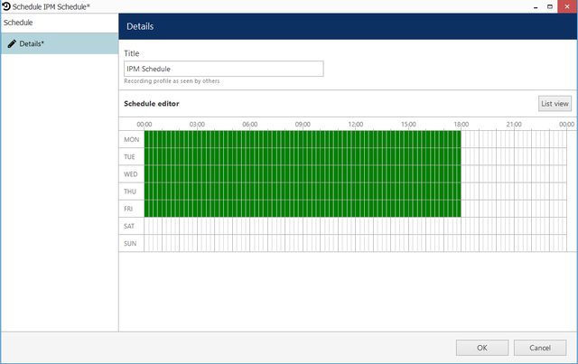

6.  Click **Apply** and **OK** to confirm and close the Rules window.

    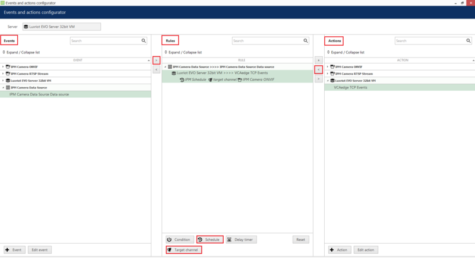

    _Optionally, you can test this Rule by clicking the Test button located top. The notification will appear on the_
    _Luxriot EVO S Monitor._

## Verifying the VCAedge Plug-in Events on the Luxriot EVO S Monitor

From the Luxriot EVO S Monitor, we can verify the Data Source events. Every time the VCAedge plug-in generates a new
events, a pop-up notification will appear on the **Live** page.

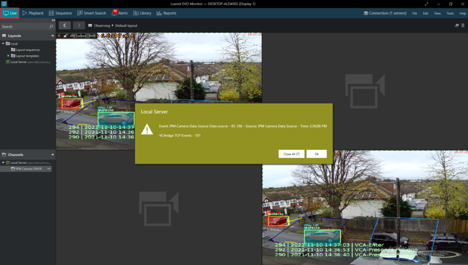

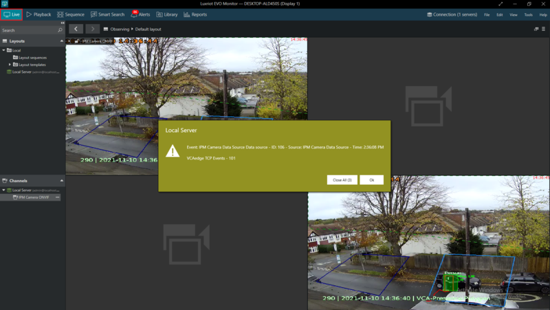

The details of the Data Source notifications can be verified on the **Alerts** tab located top.

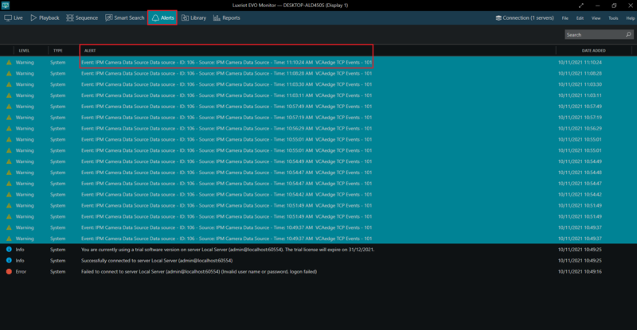
