# Introduction

## Prerequisites

-   IPM series camera.
-   VCAedge video analytics plug-in version 1.0.41 or greater.
-   Milestone XProtect Professional+ 2021 R1 or greater.

## Supported features

-   All VCAedge event notification methods are available.

## Architecture

For this integration, Milestone XProtect Professional+ receives the live video from the IPM camera and the Analytics
Events are sent through HTTP notifications with VCA tokens containing details about the event.

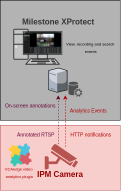

# IPM Camera Configuration

## Video & Audio Settings

### Confirming the RTSP stream used for transmitting video footage

Check and change if required, the RTSP stream settings used by the IP camera for external connections to the channels.

1.  From the **Setup** menu, click on **VIDEO & AUDIO** and then, click on **VIDEO**.

    

2.  Note the *Live Video Channel* settings as these will be needed when connecting to the RTSP stream from the Milestone
    server.

    

## Network Settings

### Confirming the RTSP port used for transmitting video footage

Check and change if required, the RTSP port used by the IP camera for external connections to the channels.

1.  From the **Setup** menu, click on **NETWORK** and then, click on **NETWORK SETTINGS**.

    

2.  Note the **IP Setup** and **Port Setup** as these will be needed when connecting to the RTSP stream from the
    Milestone server.

    

## Configuring The VCAedge Plug-in

The VCAedge plug-in is a set of analytical tools that can be loaded onto supported cameras. It provides the means to
perform advanced analytics and reduce false alerts when events occur. _Make sure you have a valid license that will_
_enable the VCAedge engine and all the features available._

Configure the VCAedge plug-in as required with the appropriate tracker, rules and a notification. A basic setup is
detailed below as an example.

### Enabling VCA

1.  From the **Setup** menu, click on **VCA** in the left side. Then, click on **ENABLE**.

    

2.  Turn on the video analytics features and click **Apply** located at the bottom to save the configuration.

    

### Creating Rules

1.  From the **VCAedge** menu, click on **RULES** in the left side.

    

2.  Click **Add** located at the bottom to display a list of available rules.

    

3.  Select a single rule to trigger an event and modify the **Rule property** as follows:

    -   Position the rule on the scene and change the shape as required. You can add/remove nodes to create complex
        shapes.

    -   In **Object Filter**, tick the box against the **Classes** that the rule should trigger events only.

        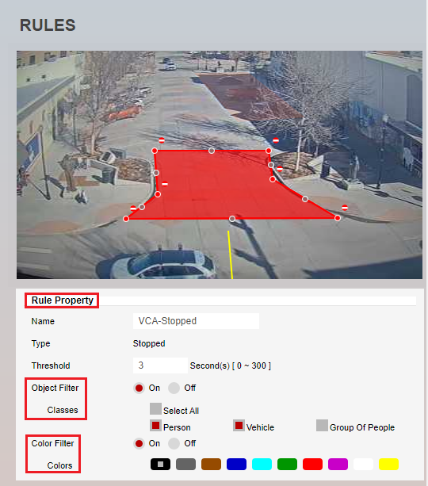

        _Note: The available classifiers are different depending on the hardware platform and the installed license._

4.  Then, define the action that will occur when the rule triggers an event in **Event Actions** as follows:

    -   In **Event Notification**, tick the box against the **HTTP Event** to enable HTTP notifications when a
        event occurs.
    -   In **Triggered By**, define when the notification will be sent. The available options are:
        -   **Object:** Send notification for each object triggering the rule.
        -   **Rule:** Send a notification every time the rule is triggered.
    -   In **Triggered At**, select one of the following options:
        -   **Object:** Choose between the **begin** of the object triggering the rule as it enters the zones or
             the **end** of the object triggering the rule as it leaves the zone. _A notification will be sent for each_
             _object triggering the rule._

        -   **Rule:** From the **begin** point of the first object to trigger the rule to the **end** point of the last
            object to trigger the rule. _A notification will be sent for each triggering of the rule._

            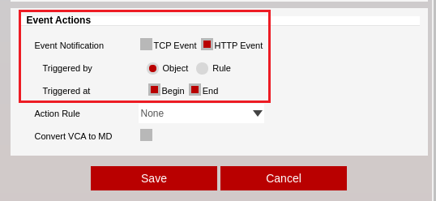

5.  Click **Save** located at the bottom to save the configuration.

    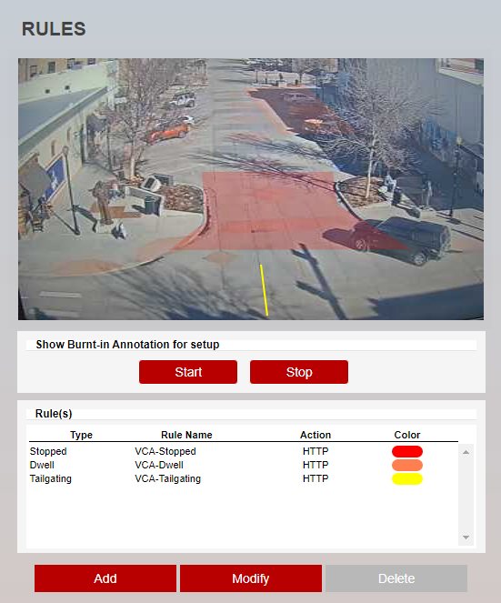

6.  Click **OK** to confirm the settings.

    

### Configuring the Calibration

Camera calibration is required in order for object identification and classification to occur. _The calibration is only_
_required when using the motion Object Tracker, the IPM AI series will have the option to select the DL Object or_
_People Tracker and will not need any calibration for classification to occur._

1.  From the **VCAedge** menu, click on **CALIBRATION** in the left side.

    

2.  In **Enable Calibration**, turn on the calibration feature.

3.  Use the mimics to match up with people or objects in the scene to help calibrate. They represent a height of 1.8
    meters.

    

4.  Click **Apply** located at the bottom to save the configuration.

### Creating HTTP Notifications

The HTTP notification sends a HTTP request to a remote endpoint when triggered. The URL, HTTP header and message body
are all configurable with a mixture of plain text and tokens. Tokens are used to represent the event metadata that
will be included when a rule is triggered.

1.  From the **VCAedge** menu, click on **HTTP NOTIFICATION** in the left side.

    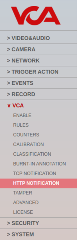

2.  In **General Settings**, **turn on** the notification feature.

3.  In **HTTP Settings**, configure the HTTP request as follows:

    -   In **Send To**, select **Milestone** from the available options.
    -   In **URL**, enter the endpoint to connect to the Milestone Event server. Default format
        `http://<milestone_ip_address>:<analytics_event_port>`.

    -   In **User ID**, enter the username to access the Milestone server.
    -   In **Password**, enter the password to access the Milestone server.
    -   In **Server ID**, enter the ID of the Milestone server.
    -   In **Device ID**, enter the ID of the IPM camera configured in the Milestone server.

        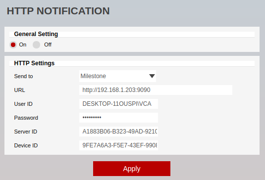

4.  Click **Apply** to save the configuration.

# Milestone Management Client Configuration

## Adding a New Hardware

1.  First, we add a new hardware into the XProtect system. Click on **Server** in the left side and select **Recording**
    **Server** from the configuration tree.

    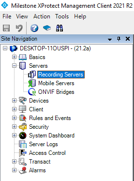

2.  Then, right clicking on the server and select **Add Hardware**.

    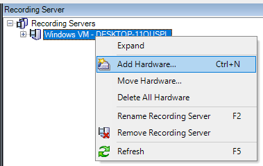

3.  In the *Add Hardware* pop-up window, select **Express (recommended)** from the detection methods and click **Next**.

    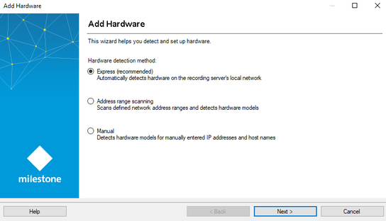

4.  Select the **Network Protocol** used to connect to the camera. Click **Add** on the right side to create a new entry
    and enter the credentials to access the IPM camera. Then, click **Next**.

    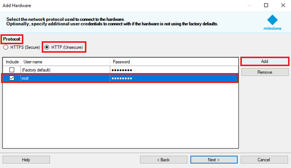

5.  Wait for the wizard to discover the device successfully and click **Next** to continue configuring the camera.
    _If the connection fails, recheck the setup and try again._

6.  Enable any additional devices to be used with the camera if required and click **Next**.

    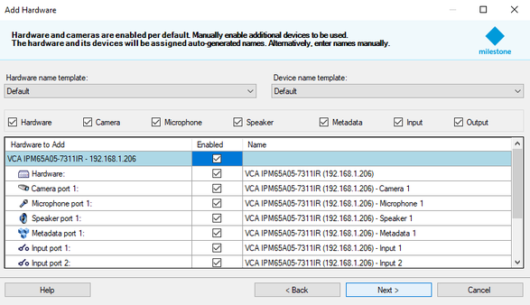

7.  Then, click the **Select Group** button on the left side to assign all the devices to a group.

     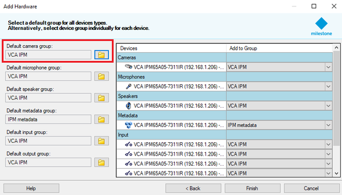

    _If no groups exist then you can create a new group for your device by selecting the create new group icon in the_
    _bottom left._

    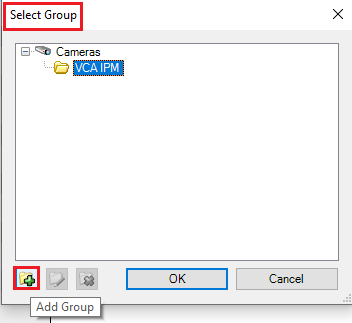

8.  Click **Finish** located to close the wizard.

9.  Click the **floppy disk** icon from the top menu to save the configuration.

10.  After completing the wizard, you should see a live image of the IPM camera in Milestone XProtect. In **Device**
     **Information**, enter descriptive **Name** for the new camera.

    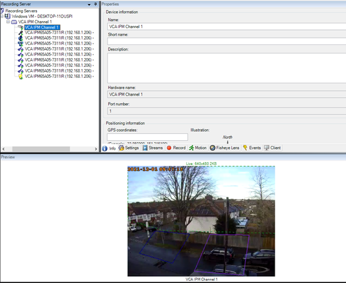

### Finding the ID (Identifier) within XProtect

#### Server ID

1.  From the XProtect Management main screen, locate the **Recording Server**. Then, press and hold `CTRL` and click on
    **Info**. The Server ID is displayed at the bottom of the right-hand panel.

    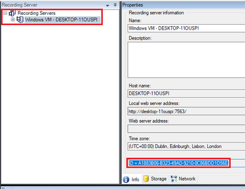

    _Note that if `CTRL` is not held down when selecting the server, the ID is not displayed._

#### Camera ID

1.  From the XProtect Management main screen, locate the **Camera** (and specific stream in the case of multi-stream
    cameras). Then, press and hold `CTRL` and click **Info**. The camera ID is displayed at the bottom of the right-hand
    panel.

    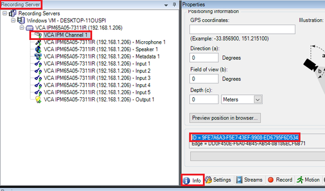

    _Note that if `CTRL` is not held down when selecting the stream, the ID is not displayed._

## Configuring the Event Outputs

1.  From the XProtect Management main screen, click on **Tools** in the top menu and select **Options**.

    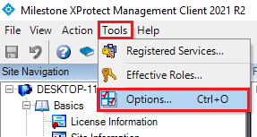

2.  In the *Options* pop-up window, click the **Analytics Events** tab and configure the output as follows:

    -   In **Analytics event**, tick the box against **Enabled** to turn on the feature.
    -   Then, enter the listening​ **Port** for analytics events from external systems or devices. _Note: 9090 is the_
        _default port used by the Event server service and is used when creating the HTTP notification in the VCAedge_
        _plug-in. If you change this to a different port then update the notification in VCA to match._

    -   In **Security** and **Events allowed from**, select **All networks addresses** from the available options.

        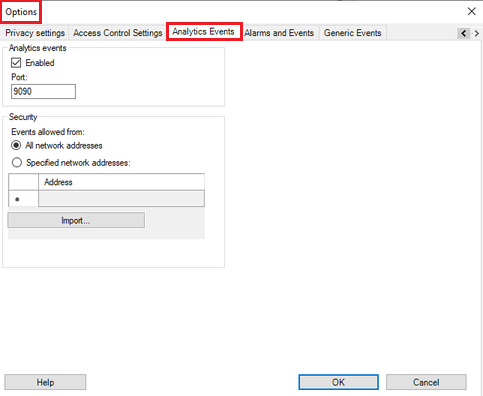

3.  Then, click **OK** to save the configuration.

    _Make sure any active firewalls are configured to allow traffic using the port detailed above._

## Configuring Rules and Events

### Configuring Analytics Events

1.  Click **Rules and Events** in the left side. Then, click on **Analytics Events** from the configuration tree.

    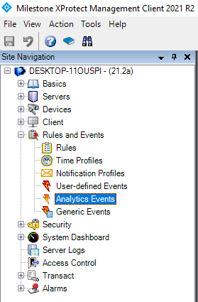

2.  Right clicking on **Analytics Events** and select **Add New ...** to create a new event.

3.  In **Name**, enter the name of the detection rule configured in VCA. _Note: If the event name does not exactly_
    _match the name of the VCA rule, events will not be received by the Event server._

    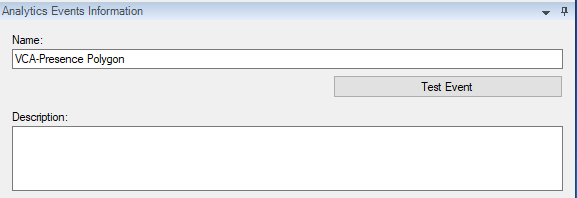

4.  Click the **floppy disk** icon to save the configuration.

#### Testing the Analytics Event Configuration

1.  From the *Analytics Events* page, select the analytics events created previously and click the **Test Event** button
    on the right side.

    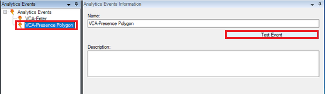

2.  Then, select the IPM camera from the configuration tree and click **OK** to confirm.

    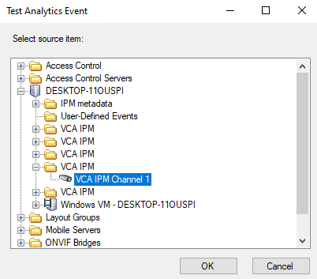

3.  Make sure the test shows success in all tasks and click **OK**. _Note: If the test fails, repeat the steps above_
    _and check the event._

    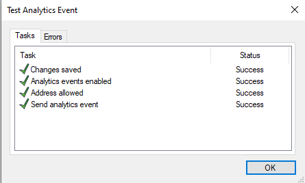

## Creating the Alarm Definitions

Creating the alarm definition is required to link the event type created in the previous step to the channel which
will receive the events.

1.  Click on **Alarms** in the left side and select **Alarm Definitions** from the configuration tree.

    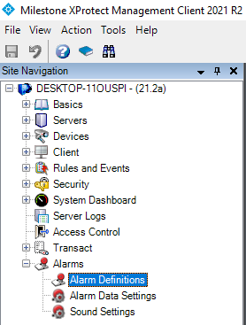

2.  Right clicking on **Alarm Definitions** and select **Add New ...** to create a new alarm.

3.  In the *Alarm Definition Information* page, configure the new alarm as illustrated below:

    -   In **Alarm definition**, enter a descriptive **Name** for the new alarm.
    -   In **Trigger**, set **Triggering Event** to **Analytics Events** and then, select the specific analytics event
        type created previously.

    -   In **Sources**, click **Select...** on the right side and select the IPM camera.

        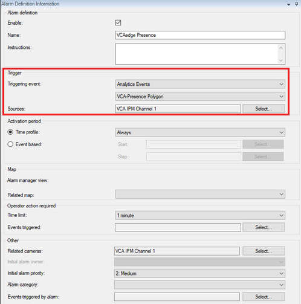

4.  Click the **floppy disk** icon to save the configuration.

### Defining the Fields to Display in the Smart Client

Each analytic event is transmitted to the XProtect Event Server with a range of properties. To enable the event
properties to be displayed in the Smart Client, it may be necessary to enable them in the Management Client.

1.  Click on **Alarms** in the left side and select **Alarm Data Settings** from the configuration tree.

    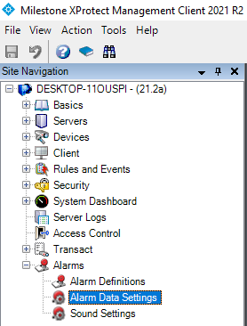

2.  In the *Configuration* page, click the **Alarm List Configuration** tab. Then, select the desired event properties
    and move them from the left to the right panel.

    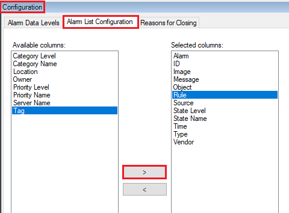

    _To display the event properties in the Smart Client, right clicking on the event header and select the fields_
    _to display._

    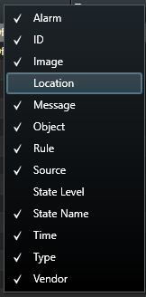

## Verifying the Analytics Events in the XProtect Smart Client

The **Live** page of the XProtect Smart Client will display a list of the analytics events generated by the VCAedge
plug-in along with the annotated video and recording of each alarm.

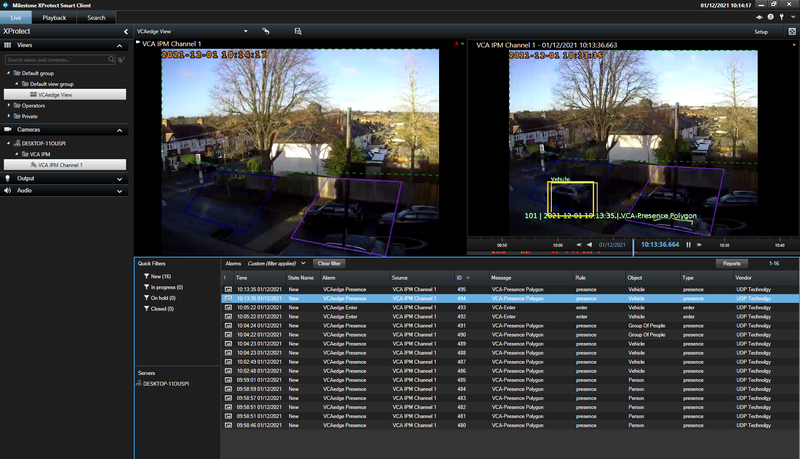
