# Introduction

## Prerequisites

-   IPM series camera.
-   VCAedge video analytics plug-in version 1.0.41 or greater.
-   Wavestore Server and `WaveView` Client version 6.30 or greater.

## Supported features

-   Motion detection via ONVIF `PullPoint`.

## Architecture

Wavestore will connect to the IPM camera to get the motion events provided. The integration does not require the
configuration of VCA notifications to send events to the VMS. The only requirement is that VCA detection rules are
defined.

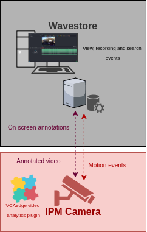

# IPM Camera Configuration

## Video & Audio Settings

### Confirming the stream used for transmitting video footage

Check and change if required, the stream settings used by the IP camera for external connections to the channels.

1.  From the **Setup** menu, click on **VIDEO & AUDIO** and then, click on **VIDEO**.

    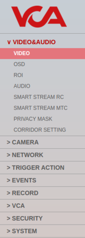

2.  Note the *Live Video Channel* settings as these will be needed when connecting to the stream from the Wavestore
    server.

    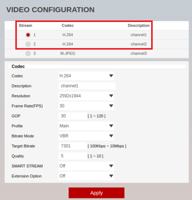

## Network Settings

### Confirming the ports used for transmitting video footage

Check and change if required, the ports used by the IP camera for external connections to the channels.

1.  From the **Setup** menu, click on **NETWORK** and then, click on **NETWORK SETTINGS**.

    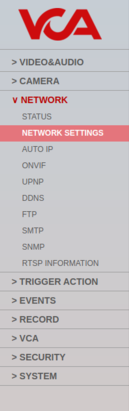

2.  Note the **IP Setup** and **Port Setup** as these will be needed when connecting to the stream from the
    Wavestore server.

    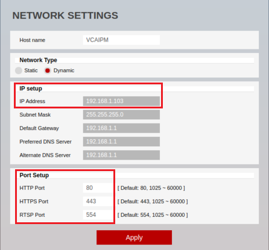

## Configuring The VCAedge Plug-in

The VCAedge plug-in is a set of analytical tools that can be loaded onto supported cameras. It provides the means to
perform advanced analytics and reduce false alerts when events occur. _Make sure you have a valid license that will_
_enable the VCAedge engine and all the features available._

Configure the VCAedge plug-in as required with the appropriate tracker, rules and a notification. A basic setup is
detailed below as an example.

### Enabling VCA

1.  From the **Setup** menu, click on **VCA** in the left side. Then, click on **ENABLE**.

    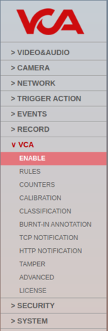

2.  Turn on the video analytics features and click **Apply** located at the bottom to save the configuration.

    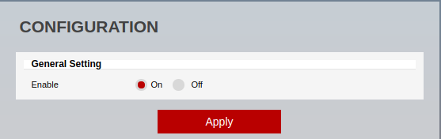

### Creating Rules

1.  From the **VCAedge** menu, click on **RULES** in the left side.

    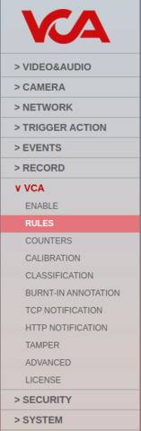

2.  Click **Add** located at the bottom to display a list of available rules.

    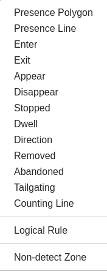

3.  Select a single rule to trigger an event and modify the **Rule property** as follows:

    -   Position the rule on the scene and change the shape as required. You can add/remove nodes to create complex
        shapes.

    -   In **Object Filter**, tick the box against the **Classes** that the rule should trigger events only.

        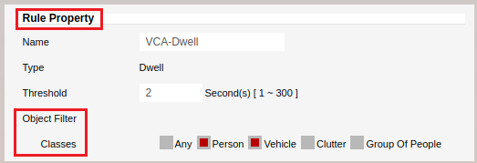

        _Note: The available classifiers are different depending on the hardware platform and the installed license._

    -   In **Event Actions**, enable the **Convert VCA to MD** feature for each detection rule configured.

        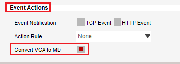

4.  Click **Save** located at the bottom to save the configuration.

    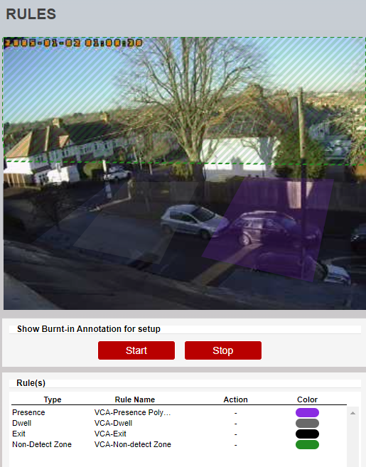

5.  Click **OK** to confirm the settings.

    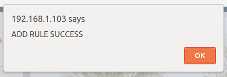

### Configuring the Calibration

Camera calibration is required in order for object identification and classification to occur. _The calibration is only_
_required when using the motion Object Tracker, the IPM AI series will have the option to select the DL Object or_
_People Tracker and will not need any calibration for classification to occur._

1.  From the **VCAedge** menu, click on **CALIBRATION** in the left side.

    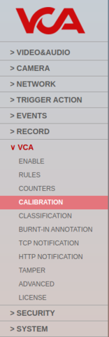

2.  In **Enable Calibration**, turn on the calibration feature.

3.  Use the mimics to match up with people or objects in the scene to help calibrate. They represent a height of 1.8
    meters.

    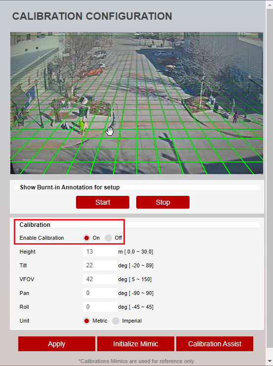

4.  Click **Apply** located at the bottom to save the configuration.

# Wavestore Configuration

## Discovering IP Cameras

As soon as Wavestore is started and connected to the server, it automatically performs camera discovery in the network.
Once an IP camera is discovered, its parameters will be displayed in the *Cameras* page from the **Setup** menu.

1.  From the `WaveView` click on **View** in the top menu and select **Setup** from the drop down options.

    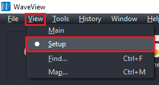

2.  Then, click on **Cameras** from the top menu.

    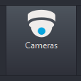

3.  In the *Cameras* page, click on the **Cameras** tab located top left.

4.  Then, select the IPM camera listed in the **Discovered Cameras** tab in the right side and click on the less than
    button **<** to move the IP camera into the Cameras tab.

    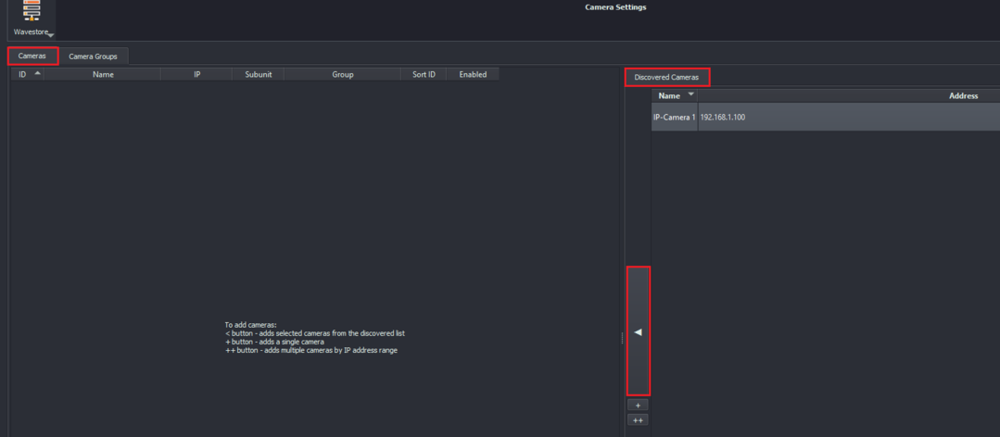

    _Note: If the IPM camera does not appear in the discovered list, click the Refresh button located at the bottom._

5.  Enter a descriptive **name** for the new camera and click the **floppy disk** icon located top right to save the
    configuration.

## Creating an ONVIF Camera Group Type

1.  From the *Cameras* page, click on the **Camera Groups** tab located top left.

2.  Click on **Add** located at the bottom to create a new group.

3.  Enter a descriptive **name** for the group and configure it as illustrated below:

    -   In **Type**, select **ONVIF** from the drop down list.
        -   In **General**, enter the **Username** and **Password** to access the IPM camera.

            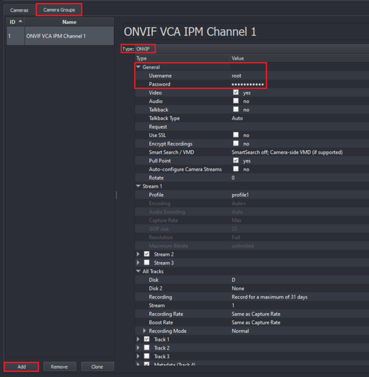

4.  Click the **floppy disk** icon located top right to save the configuration.

    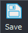

    _Note: If you configure a single camera and one group, the ONVIF group will be assigned to the camera_
    _automatically. Otherwise, if you add more cameras or groups, you will need to assign them manually in the Cameras_
    _tab._

    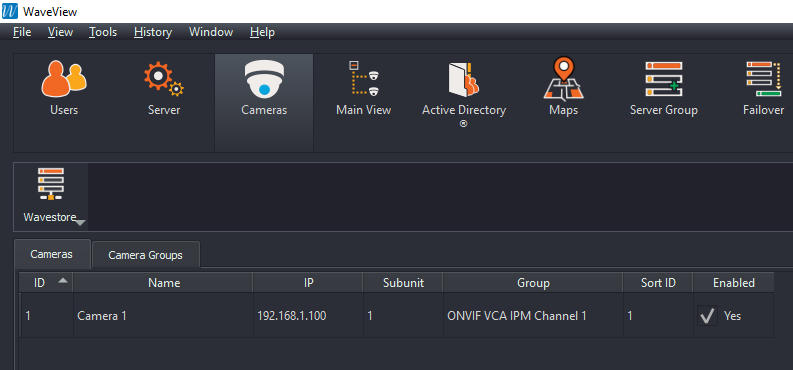

5.  From the *Cameras* page, click on the **Cameras** tab. The preview window will display a live camera image in the
    right side.

    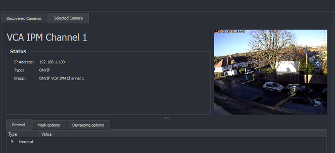

### Enabling Motion Detection within the camera via ONVIF `PullPoint`

Wavestore can receive motion events from ONVIF Profile S compliant cameras and trigger recording or other actions based
on that.

1.  In the *Cameras* page, click on the **Camera Groups** tab located top left.

2.  In **General**, make sure that the **Pull Point** feature is set to **Yes**.

    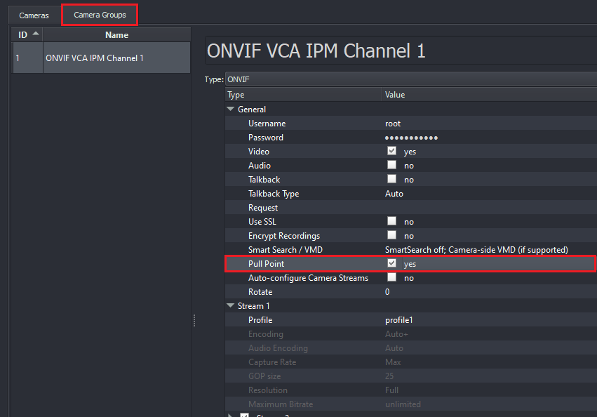

3.  Then, click the **floppy disk** icon located top right to save the configuration.

## Live View Screen

### Verifying Motion Events

1.  From the `WaveView` click on **View** in the top menu and select **Main** from the drop down options.

    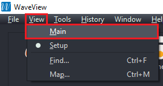

2.  When the VCAedge plug-in triggers a​ motion event, ​the Live View Screen​ will list the incoming event under the Live
    Event Stream.

    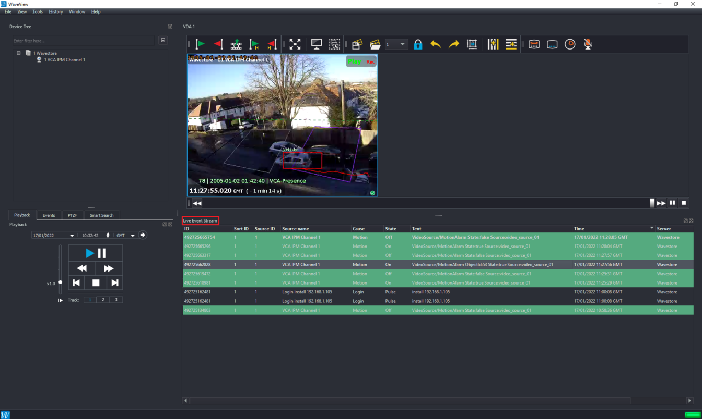

    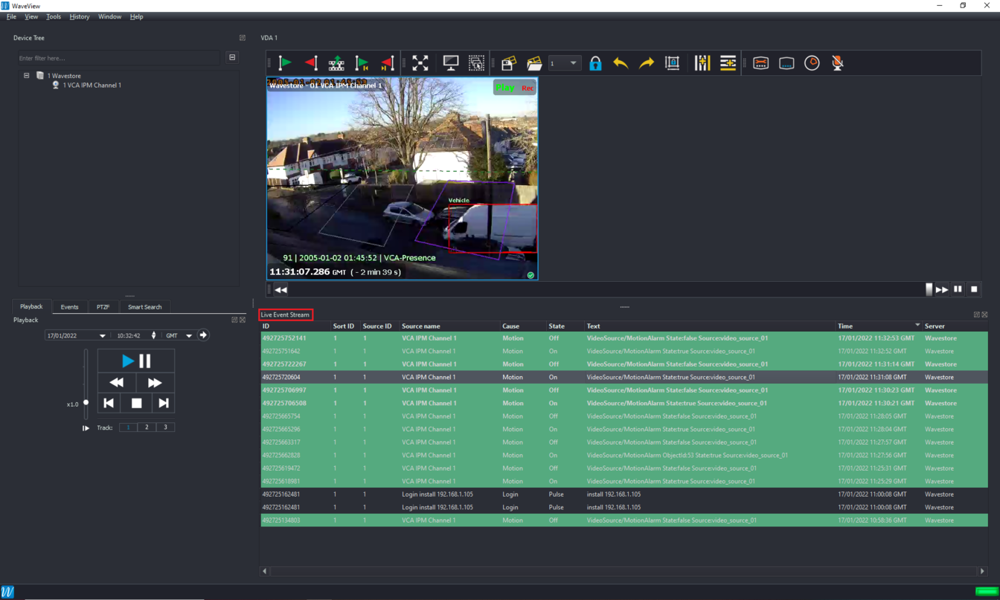

    _Optionally, you can decide how the system reacts to the events generated by the VCAedge plug-in by configuring_
    _Event causes with a required Event action. For more information, please refer to the Wavestore Video Management_
    _Software User Manual Version 6.24._
