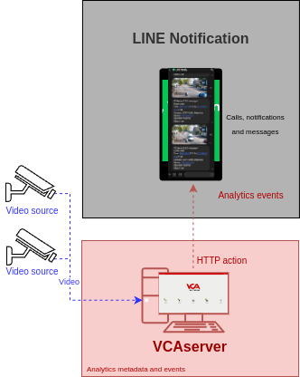
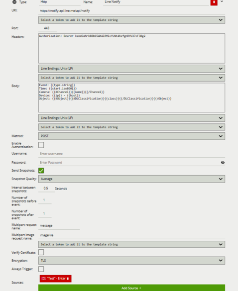
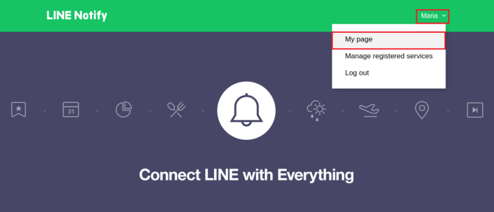
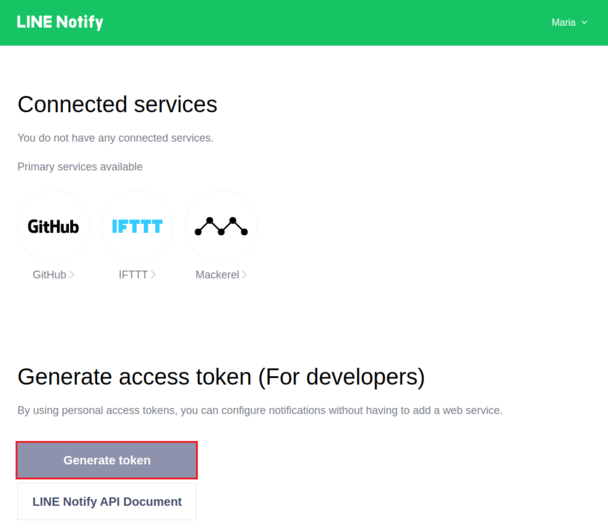
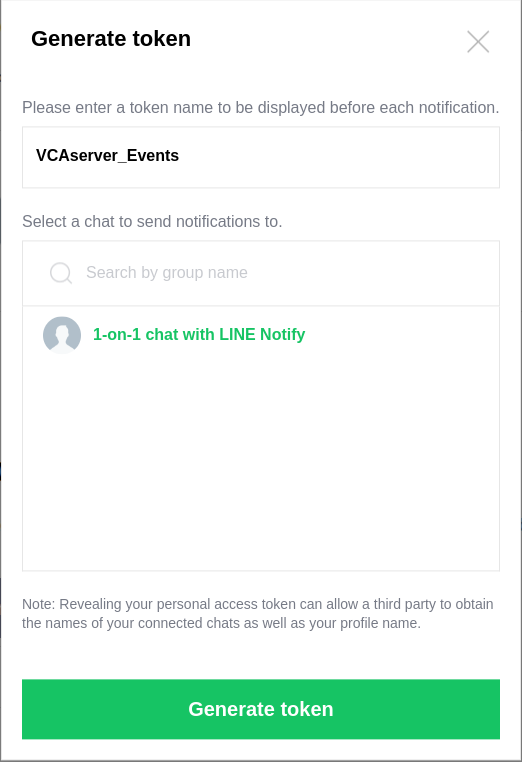
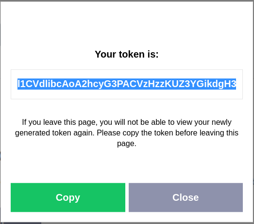
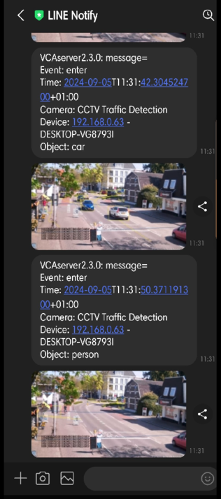
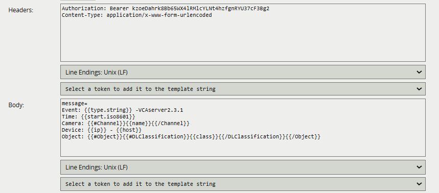

# Introduction

## Prerequisites

-   VCAserver version 2.4.2 or greater.
-   A LINE Account.
-   LINE: Call and Messages application.
-   LINE Notify service and an Access Token.

## Supported Features

-   HTTP requests with snapshots and metadata available via tokens.

## Architecture

For this web UI integration, LINE receives notifications through the HTTP action with VCA tokens containing details
about the event.



# VCAserver Configuration

## Creating a Channel

Configure the VCAserver as required with the appropriate channel and logical rules. A basic setup is detailed below as
an example:

1.  Configure a source to connect to a camera.

    _Note: the recommended settings for the camera stream to VCA is a maximum resolution of D1 (640 x 480) with a frame_
    _rate of 15 frames per second. A lower resolution and frame rate will reduce the analytic accuracy, a higher_
    _resolution and frame rate will result in high CPU usage and can reduce analytical accuracy._

2.  Configure a **zone** for the channel.

3.  Select the **Tracking Engine** to identify objects in the scene.

4.  Configure **rules or filters** to trigger an event on object detection in the zone.

    

For more information on creating and configuring channels in VCA please refer to the
[VCA core manual 2.4](https://documentation.vcatechnology.com/).

## Creating an Action

1.  Click the **system cog** in the top right to access the Settings.

    

2.  Then, click **Edit Actions**.

    

3.  Click **Add Action** and select **HTTP** from the list of available actions.

    

4.  Enter a descriptive name for the action.

5.  Click the arrow on the right of the action to expand the HTTP configuration options.

    -   **URI:** Enter the URL the LINE Notify service requires to send notifications to users or groups related to an
        access token. Default endpoint: `https://notify-api.line.me/api/notify`

    -   **Port:** Default port 443.
    -   **Headers:** Include ```Authorization: Bearer  <access_token_provided>```.
    -   **Body:** Add the data required by the LINE Notify service with the VCA tokens.
    -   **Method:** Select **POST** from the available methods.
    -   **Enable Authentication:** N/A.
    -   Tick the box against **Send Snapshots**.
    -   Enter the **Interval between snapshots**.
    -   Select the **Snapshots Quality** from the drop-down list.
    -   **Number of snapshots before the event:** 1.
    -   **Number of snapshots after the event:** 1.
    -   **Multipart request name:** Enter **`message`**.
    -   **Multipart image request name:** Enter **`imageFile`**.
    -   **Sources:** Select **Add Source +** to display a list of the available Sources and logical rules and select the
        logical rule created for the source you want to send to the server.

        

For this integration, the following tokens were used to send an information on the camera, zone and rule type that
triggered the event:

-   `{{type.string}}`: The type of the event. This is usually the type of rule that triggered the event.
-   `{{start.iso8601}}`: The start time of the event. The `iso8601` property is a date string in the ISO 8601 format.
-   `{{#Channel}}{{name}}{{/Channel}}`: The name of the channel that the event occurred on.
-   `{{ip}}`: The IP address of the device that generated the event.
-   `{{host}}`: The hostname of the device that generated the event.
-   `{{#Object}}{{#DLClassification}}{{class}}{{/DLClassification}}{{/Object}}`: The Deep-Learning classification name
    of the object.

_Note: The settings have been updated from version 2.3.1 onwards. Please see [Appendix A](#appendix-a) for more_
_information._

# Configuring LINE Notification

## Creating a LINE Account

The first step is to create a LINE account. You need a device that can receive text messages or phone calls. _Note:_
_Make sure you register a LINE account using an email address._

1.  Download **LINE** on your phone.
2.  **Open** LINE and tap **Sign up**.
3.  **Follow** the instructions to create and set up your account.
4.  Access the application.

_This document will not detail the steps for creating a LINE account. For more information, please refer to LINE Help_
`Center` [Creating a new account](https://help.line.me/line/ios/?contentId=20001192)

## Configuring LINE Notify

LINE Notify is a notification service that allows users to link to a web service and receive notifications from the
official account LINE Notify that is provided by LINE.

1.  Sign into **LINE Notify** with your LINE account.

2.  In the *LINE Notify* page, click on the arrow next to your name and select **My page** from the drop-down list.

    

### Generating an Access Token

1.  After entering 'your page', scroll down and click on **Generate token**.

    

2.  In the *Generate token* pop-up window:

    -   Enter a **token name** that will be used for displaying notifications.
    -   **Select** a chat to send notifications to.
  
    _If you select a group to receive alert messages instead of selecting `1-on-1 with LINE Notify`, make sure you_
    _have added LINE Notify as a friend to the group first._

    -   Then, click on **Generate token**.

        

    -   You will receive an access token. Click on **Copy**.

        

    -   Then click on **Close** to close the window.

3.  Paste the new access token into the Header of the [HTTP action](#vcaserver-configuration) created in VCAserver.

_For more information on configuring the LINE Notify service, please refer to the_
[LINE Notify API Document](https://notify-bot.line.me/doc/en/)

### Verifying Notifications

Every time a logical rule is triggered on the VCAserver, a new notification will pop-up on your phone showing the
details of the event as follows:



# Appendix A

## Sending A Message Without Snapshots

If you intend to send a message to the Line Notify service without snapshots, then disable **Send Snapshots** and
include ```Content-Type: application/x-www-form-urlencoded``` in the 'Headers' of your HTTP action alongside the
parameter `message=` in the 'Body'.


