# Introduction

## Prerequisites

-   Luxriot EVO Console 32-bit edition or VCA configuration tool for configuration and calibration.
-   Microsoft Windows 7, 8, 8.1, 10.
-   DirectX 8.0 or newer.
-   MS XML 4.0 or greater.

_VCA is installed together with Luxriot EVO and no additional installation is required._

## Supported features

-   Detection zones and lines.
-   Tamper detection.
-   Surveillance tracker.
-   Presence filter.
-   Enter/Exit/Appear/Disappear + Stopped filters.
-   Class and Speed filters + Calibration.
-   Direction and Dwell filters.
-   Tailgating filters.
-   Abandoned object filter.
-   On-screen counters.
-   Object Metadata.
-   Counting Line.
-   Metadata search.
-   On-screen metadata for the user to see tracked objects and triggered rules in live view.
-   Event rules.

# Luxriot EVO Management Console Configuration

## Adding a New Device

1.  First we add a new device into the system. From the left menu, click on **Devices**. Then, click **New device**
    located top.

    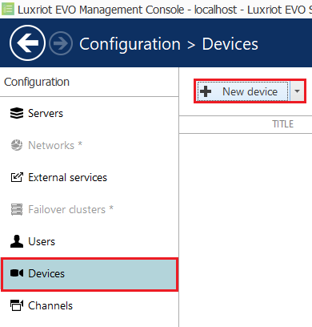

2.  In the *Details* pop-up window, click on **Select Model** and select **(Generic) ONVIF Compatible** from the
    available models and click **OK**.

    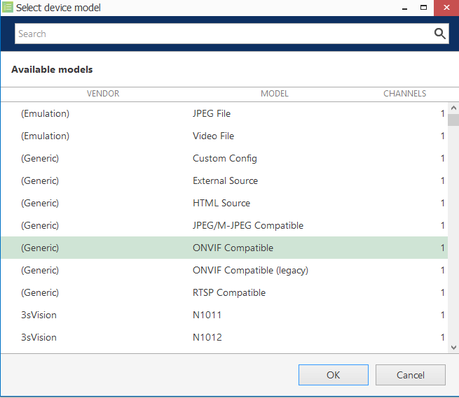

3.  In **Title**, enter a descriptive **name** for the device.

4.  Then, click on **Network** in the left menu and configure the new device as follows:

    -   **Host:** Enter the IP address or hostname of the device.
    -   **Port:** Enter the web port of the device.
    -   **Username:** Enter the username to access the device.
    -   **Password:** Enter the password to access the device.
    -   Click **Apply** to save the configuration.
    -   Click **OK** to finish creating the new device.

        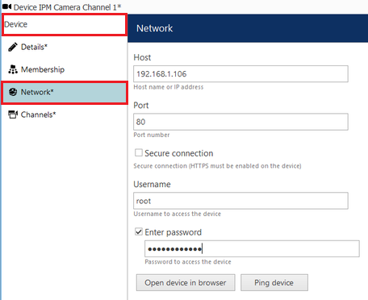

## Configuring the Channel

### Configuring the Recording

1.  From the left menu, click on **Channels**. Then, click **Edit** located top to modify the newly created channel.

    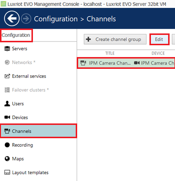

2.  In the *Details* page, configure the recording as follows:

    -   **Main stream recording configuration:** Click on **Change** and select **Continuous recording**.
        Then, click **OK** to confirm and close the window.

    -   **Sub stream recording configuration:** Click on **Change** and select **Continuous recording**.
        Then, click **OK** to confirm and close the window.

        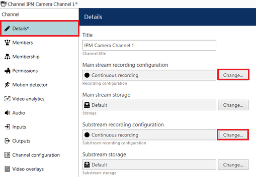

3.  Click **Apply** and **OK** to save the settings.

    _Note: To confirm the channel is configured correctly you can show a live stream. From the Channels page, select_
    _the newly created device and click on Show video located top._

    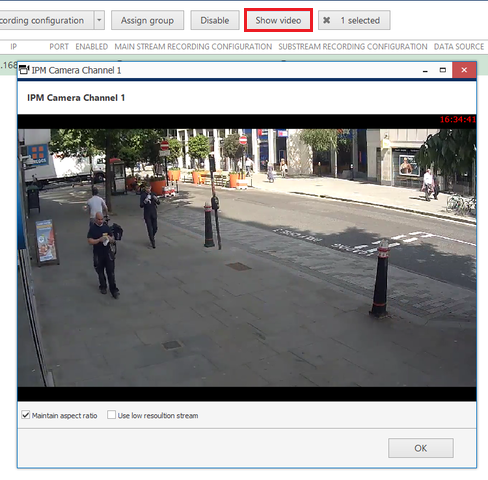

## Configuring the Video Analytics

Luxriot VCA is a real-time video analytics engine that utilises advanced image processing algorithms to turn video
into actionable intelligence. To get started, you will need to add a valid license, after which you can enable the VCA
engine and start using the features. _Please refer to your software distributor to obtain licenses._

A basic setup is detailed below as an example:

1.  From the left menu, click on **Channels**. Then, click **Edit** located top to modify the newly created channel.

    

2.  In the *Channel* pop-up window, click on **Channel configuration**. Then, click **Open VCA properties** on the right
    side.

    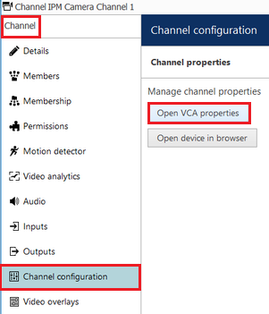

3.  In the *Video Analytics Properties* pop-up window, select **Open VCA Video Analytics** from the available options.
    Then, click on **Properties...** located at the bottom.

    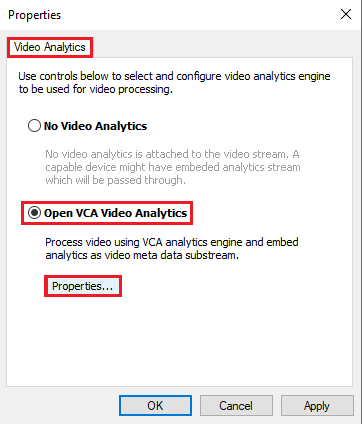

### Calibrating the Camera

Camera calibration is required in order for the VCA engine to classify objects into different object classes.
_Calibration is required to allow the classification with the standard Object Tracker._

1.  From the *Properties* page, click the **Calibration** tab located top.

2.  Use the mimics to match up with people or objects in the scene to help calibrate. They represent a height of
    1.8 meters.

    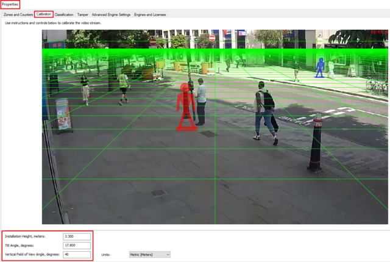

3.  Click **Apply** located at the bottom to confirm the settings for the calibration.

### Creating Detection Zones and Lines

1.  From the *Properties* page, click the **Zones and Counters** tab located top. Then, click on **Add** located at the
    bottom and select **Add Zone** to create a new detection zone.

    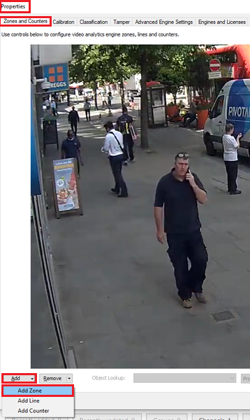

2.  Position the zone and change the shape as required. _You can add/remove nodes to create complex shapes._

3.  Then, click on **Properties...** located at the bottom to access the settings.

    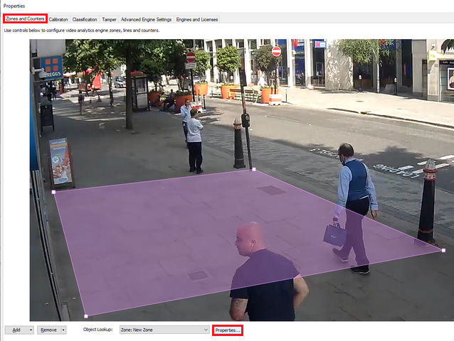

#### Editing Zones and Lines

1.  In the *Properties* pop-up window, click the **General** tab located top.

2.  Enter a descriptive **Name** for the zone and apply any colour to identify it.

3.  Make sure the **Type** of the zone indicates **Alarm (Detection) Area**. Otherwise, no objects will be detected.

    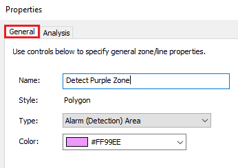

4.  Then, click **Apply** located at the bottom to save the settings.

##### Configuring Detection Rules

Once the detection zone and/or line have been configured, we can now define a detection rule that will trigger the
events.

1.  From the *Properties* window, click the **Analysis** tab located top.

2.  Then, tick the box against the rule that will trigger the events.

    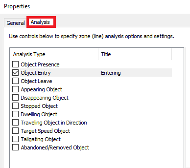

3.  On the right side, modify the properties of the rule as required:

    -   Enter a descriptive **Name** for the rule.
    -   Click **Track** or **Do Not Track** on the right side to decide which object class should or not should be
        tracked. _By default, all object types are tracked._

        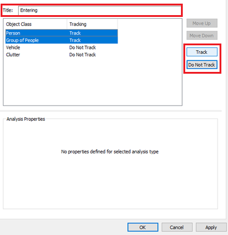

    _In all cases, the rules are configured with sensible default values, which, however, can be customised to suit a_
    _specific detection scenario._

4.  Lastly, click **Apply** and **OK** to confirm the VCA configuration and to close all the windows.

_For more information on creating and configuring VCA in Luxriot, please refer to the Luxriot EVO Video Analytics_
_Administration Guide._

## Creating Events, Actions, and Rules

Now, we decide how the system will react to the events generated by VCA detection rules. To do this, we configure
events, actions, and rules that will be sending the Data Sources notifications to the Luxriot EVO S server.

### Creating Events

1.  First, we create a new Event. Click on **Events & Action** in the left menu.

2.  Then, click **Events** and **New Event** located top.

    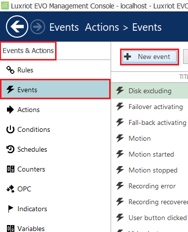

3.  In **Channel related (2)**, select **VCA event** from the available options.

    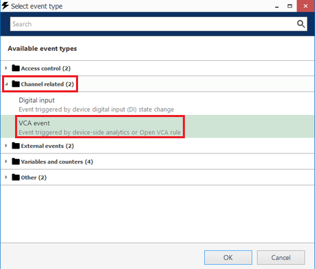

4.  Then, configure the Event as follows:

    -   **Title:** Enter the name of the VCA detection rule.
    -   **Source:** Click on **Change** and select the IP camera. Then, click **OK** to confirm and close window Event
        source window.

    -   **VCA Rule:** Click on **Change** and select the detection rule configured for the camera. Then, click **OK** to
        confirm and close the *VCA rules* window.

        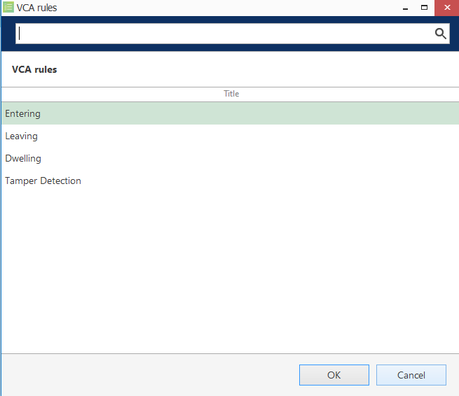

5.  Click **OK** to confirm the settings and close the Event window.

    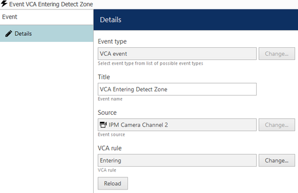

### Creating Actions

1.  Next, we create a new Action. From the left menu, click on **Actions** and **New action** located top.

    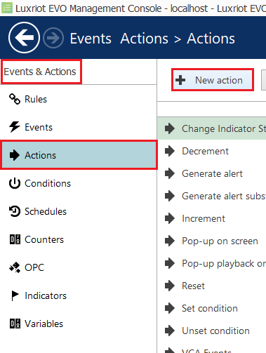

2.  In **Notifications (4)**, select **Send event to client** from the available actions.

    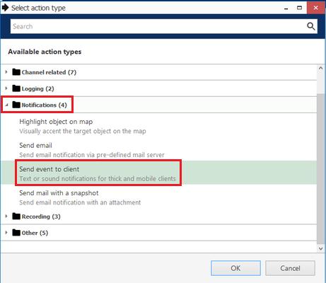

3.  Then, configure the notification as follows:

    -   **Title:** Enter a descriptive **name** for the notification.
    -   **Message:** Click the **Insert field** button located top right to add the fields that will contain the details
        of the events in the notification.

        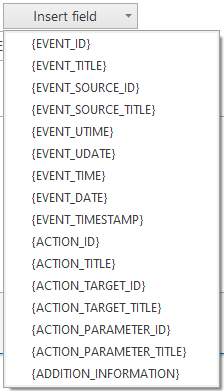

    -   **Enable** Display events in alert, Display a warning message box and Display event in notification panel.

        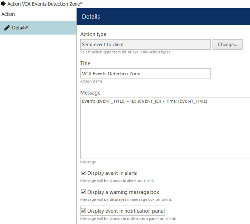

4.  Click **OK** to confirm and close the Actions window.

### Creating Rules

1.  The last step is to create a new rule. From the left menu, click **Rules** and **Open `configurator`** located top.

    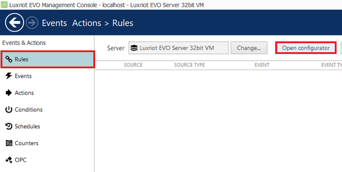

2.  In the Event and Actions `configurator` page, you will see three boxes associated with Events, Rules, and Actions.

3.  In **Events**, select the **VCA event** created previously. Then, click the greater than **>** button to move the
    event into the Rules box.

4.  In **Actions**, select the **Luxriot EVO Server Notification** created previously. Then, click the less than **<**
    button to move the action into the Rules box.

5.  In **Rules**, complete the new rule as follows:

    -   Click **Target channel** located at the bottom. In the pop-up window, select the IP camera and click **OK** to
        confirm.

    -   Then, click **Schedule** located at the bottom. Configure the schedule for the events, and click **OK** to
        confirm.

        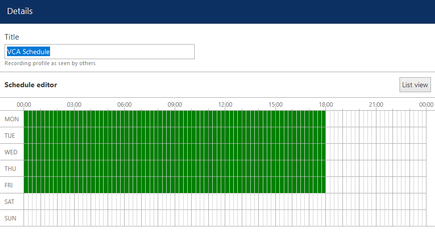

6.  Click **Apply** and **OK** to confirm and close the Rules window.

    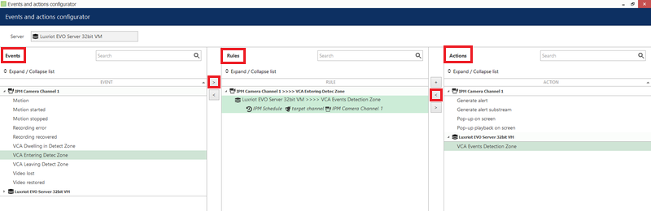

    _Optionally, you can test this Rule by clicking the Test button located top. The notification will appear on the_
    _Luxriot EVO Monitor._

## Verifying Events in the Luxriot Monitor

### VCA Metadata Overlays

VCA metadata overlay is present in Luxriot EVO Monitor for the user to see tracked objects and triggered rules both in
**Live** view and in **Playback**.

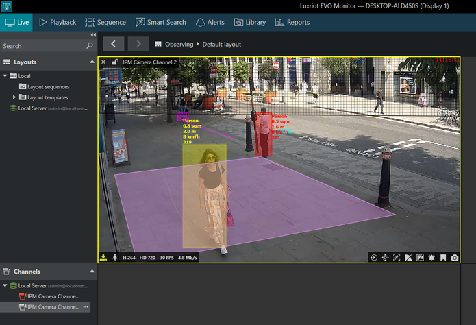

#### VCA Metadata Search

Click the **Playback** tab at the top. Then, click on **VCA** located top right. In the search panel, enter search
criteria for the metadata (source, interval, metadata type, event type, rule, zone, object, class name) and click on
**Search**.

-   VCA Event Search

    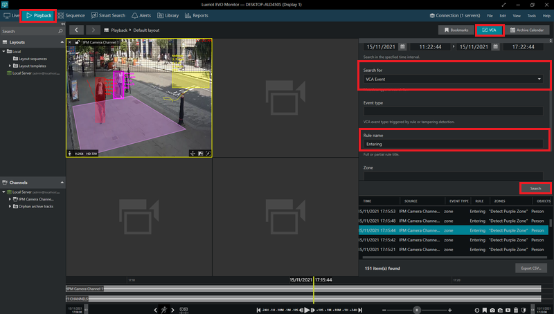

-   VCA Object Search**

    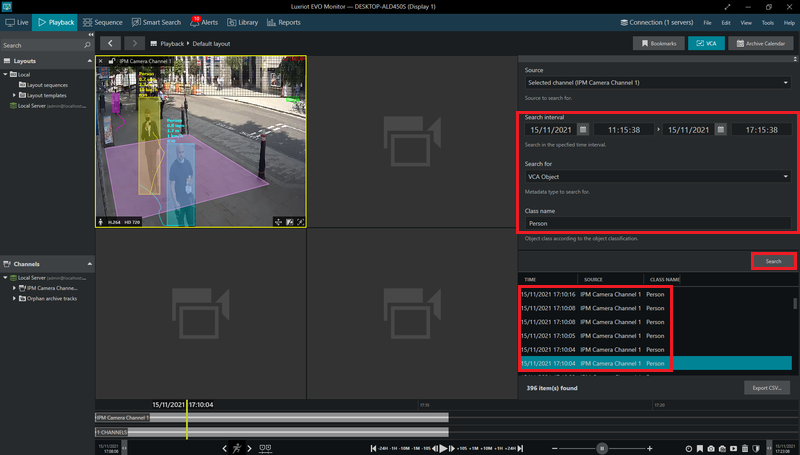

##### Warning Message Box

In the **Live** tab, a pop-up notification will appear every time a detection rule triggers a new event.

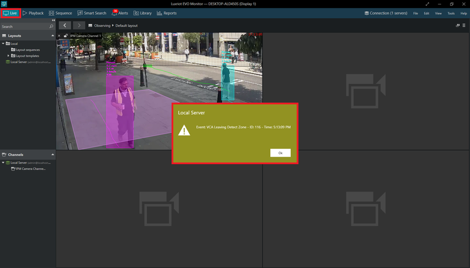

Additionally, the **Alert** tab will display a list of alarms detailing each event.

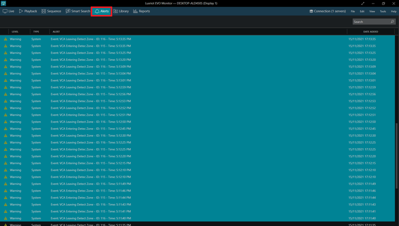
