# Introduction

## Prerequisites

-   VCAserver version 2.4.2 or greater.
-   Luxriot EVO S VMS version 1.31.0 or greater.

## Supported features

-   TCP and HTTP events with metadata available via tokens.
-   Annotated RTSP.

## Architecture

In this web UI integration, the Luxriot VMS receives the annotated RTSP stream from the VCAserver and the Data
Source alarms are sent through the TCP action with VCA tokens containing details about the event.

Additionally, alarms can be sent via HTTP to trigger an External Channel Event in Luxriot EVO S.

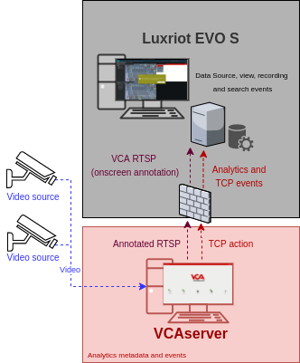

# VCAserver Configuration

## Confirming the RTSP port used for transmitting video footage

Check, and change if required, the RTSP port used by VCA for external connections to the channels within the VCA
service.

1.  From the main screen, click the **system cog** in the top right.

    

2.  Then, click on **System**.

    

3.  In **Network Settings**, you can see the RTSP port used by the VCAserver to send the RTSP stream of its channels.
    Change it if necessary and click **Save**.

    

    _Note: The syntax for connecting to these channels is:_

    `rtsp://<device_ip>:<RTSP_port>/channels/<channel_id>`.

    Example: `rtsp://192.168.1.10:8554/channels/27`

## Creating a Channel

Configure the VCAserver as required with the appropriate channel and logical rules. A basic setup is detailed below as
an example:

1.  Configure a source to connect to a camera.

    _Note: the recommended settings for the camera stream to VCA is a maximum resolution of D1 (640 x 480) with a frame_
    _rate of 15 frames per second. A lower resolution and frame rate will reduce the analytic accuracy, a higher_
    _resolution and frame rate will result in high CPU usage and can reduce analytical accuracy._

2.  Configure a **zone** for the channel.

3.  Configure **rules or filters** to trigger an event on object detection in the zone.

    

4.  Note the **Channel ID** as this will be needed when connecting to the RTSP stream from the Luxriot EVO S server.

    _Note: The channel ID can be located at the bottom of the channels menu._

    

For more information on creating and configuring channels in VCA please refer to the
[VCA core manual 2.4](https://documentation.vcatechnology.com/).

## Creating an Action

### TCP

1.  Click the **system cog** in the top right to access the settings.

    

2.  Click **Edit Actions**.

    

3.  Then, click **Add Action** and select **TCP** from the list of available actions.

    

4.  Enter a descriptive name for the action.

5.  Click the arrow on the right of the action to expand the TCP configuration options.

    -   **URI**: Enter the IP address of the Luxriot EVO S server.
    -   **Port**: Enter the TCP port configured for the Data Source of Luxriot EVO S.
    -   **Body**: Select **Custom** from the drop-down menu and add some tokens.
    -   **Sources**: Click **Add Source +** to display a list of the available rules and filters and select the rules
        created for the source you want to send to the Luxriot EVO S server.

        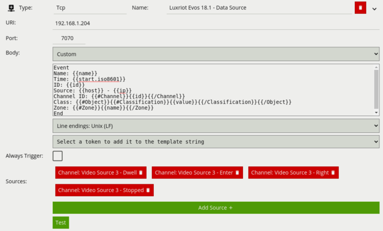

For this integration, the following Tokens were used to send an alert containing information on the camera, zone and
rule type that triggered the event and time.

Where:

-   Event: Represents the beginning of the message configured for the Data Source Profile in Luxriot EVO S.
-   `{{name}}`: The name of the event.
-   `{{start.iso8601}}`: The start time of the event. The `iso8601` property is a date string in the ISO 8601 format.
-   `{{id}}`: The unique id of the event.
-   `{{ip}}`: The IP address of the device that generated the event.
-   `{{host}}`: The hostname of the device that generated the event.
-   `{{#Channel}}{{id}}{{/Channel}}`: The id of the channel that the event occurred on.
-   `{{#Object}}{{/Object}}`: An array of the objects that triggered the event.
    -   `{{#Classification}}{{value}}{{/Classification}}`: The classification of the object (it is only produced if
        calibration is enabled).
-   End: Represents the end of the message configured for the Data Source Profile in Luxriot EVO S.

### HTTP

1.  Click the **system cog** in the top right to access the Settings.

    

2.  Then, click **Edit Actions**.

    

3.  Click **Add Action** and select **HTTP** from the list of available actions.

    

4.  Enter a descriptive name for the action.

5.  Click the arrow on the right of the action to expand the HTTP configuration options.

    -   **URI:** Enter the API URL required by the [External Channel Event](#configuring-extenal-channel-events)
        feature. Example: `http://<server_ip>/event/<resource_id>/external1/activate`.
    -   **Port:** Enter the HTTP port used by the Luxriot EVO S server (by default 8080).
    -   **Headers:** N/A.
    -   **Body:** N/A.
    -   **Method:** Select **GET** from the available methods.
    -   **Enable Authentication:** Check to enable authentication.
    -   **Username:** Enter the username to access the Luxriot EVO S server.
    -   **Password:** Enter the password to access the Luxriot EVO S server.
    -   **Sources:** Click **Add Source +** to display a list of the available Sources, rules and filters. Select the
        rule created for the source you want to send to the Luxriot EVO S server.

        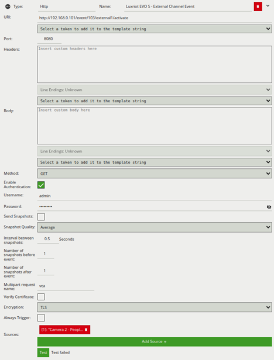

# Luxriot EVO S Console Configuration

## Configuring a New Device

1.  First we add a new device. From the left menu, click on **Devices**. Then, click **New Device** located top.

    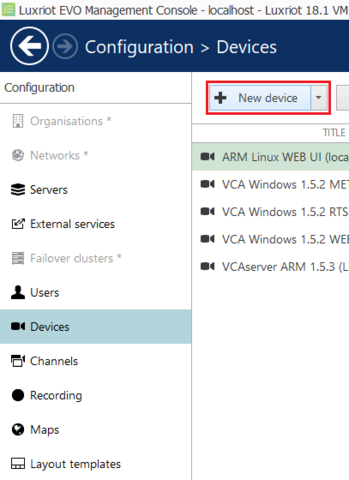

2.  Click **Select Model** and select **RTSP Compatible** from the available devices.

3.  Enter a descriptive name for the device.

    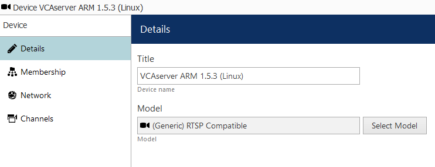

4.  Then, click **Network** in the left side and configure the new device as follows:

    -   **Host:** Enter the IP address of the VCAserver.
    -   **Port:** Enter the web port configured in the VCAserver.
    -   **Username:** Enter the username to access the VCAserver.
    -   **Password:** Enter the password to access VCAserver.
    -   Click **Apply** to save the configuration.
    -   Click **OK** to finish creating the new device.

        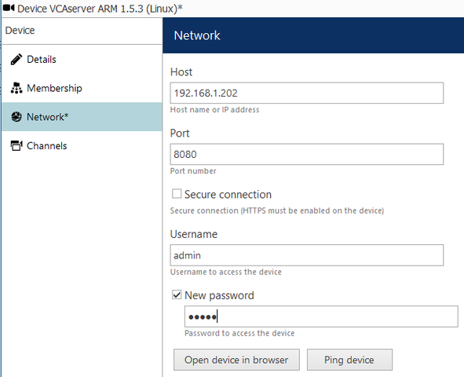

### Configuring Recording

1.  From the left menu, click **Channels**. Then, click **Edit** located top to modify the newly created channel.

    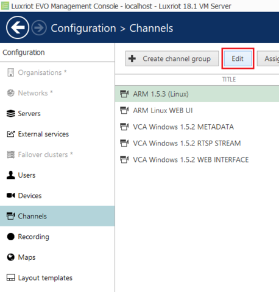

2.  In the **Details** page, configure the recording as follows:

    -   **Title:** Enter a descriptive name for the device.
    -   **Main stream recording configuration:** Click **Change** and select **continuous recording**.
        Then, click **OK** to confirm and close the window.

    -   **Sub stream recording configuration:** Click **Change** and select **continuous recording**.
        Then, click **OK** to confirm and close the window.

        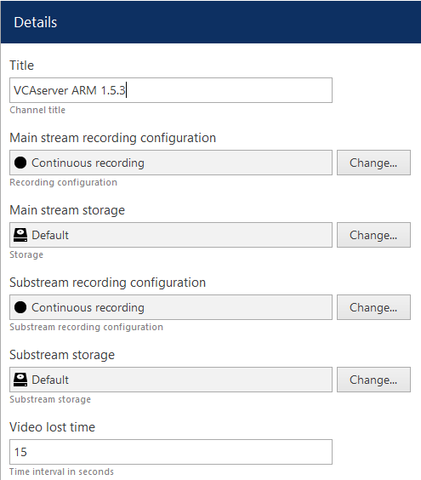

3.  Click **Apply** to save the settings.

### Configuring VCA RTSP Stream

1.  In the **Channel** page, click **Channel configuration**. Then, click **Open channel properties**.

    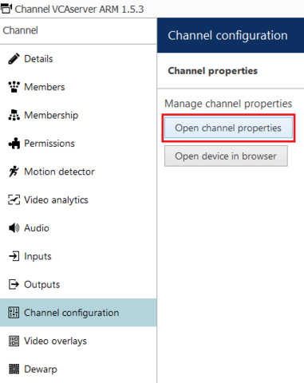

2.  In the pop-up screen, click **RTSP** and configure as follows:

    -   **Confirm RTSP Port:** 8554 (override if required).
    -   Select **RTP over TCP** (default settings is recommended).
    -   **High:** Enter the RTSP URL for the VCA channel. Default format:
        `/channels/<channel id>`. Example: `/channels/15`

    -   **Low:** Enter the RTSP URL for the VCA channel. Default format:
        `/channels/<channel id>`. Example: `/channels/15`

3.  Click **Apply** to save the settings.

4.  Click **OK** to close all windows.

    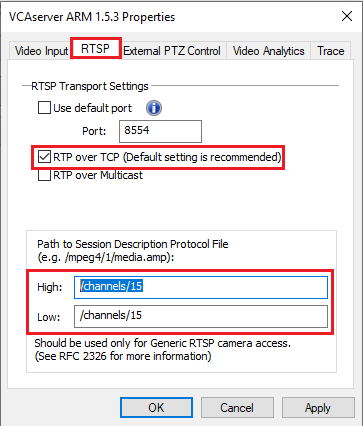

    _Note: To confirm the VCA channel is configured correctly you can show a live stream. From the Channels tab, select_
    _the newly created device and click Show Video located top._

    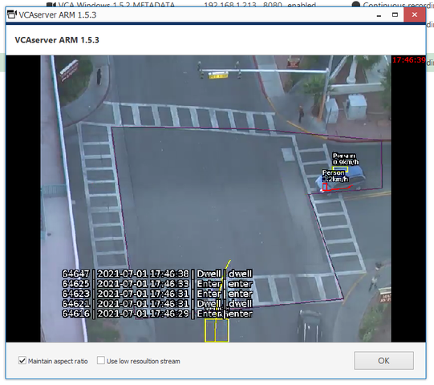

## Configuring Data Source

Next, we need to create a new Data Source to receive the TCP events from the VCAserver. Data is stored and displayed
embedded with the video stream from the channel(s) you choose to associate with it.

1.  In the Panel on the left, click **Data Source**. Then, select **New data source** located top.

    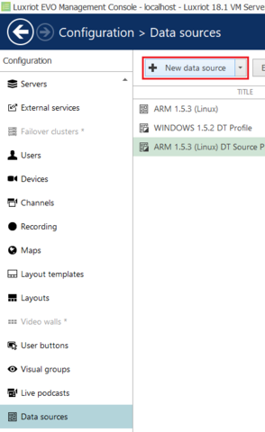

2.  In the pop-up screen, configure the new Data Source as follows:

    -   **Data source title:** Enter a descriptive name for the Data Source.
    -   **Server:** Click **Change** and choose the **Luxriot EVO S Server**.
    -   **Data source profile:** Leave none _(it will be created later)_.
    -   **Data source type:** Select **TCP** from the drop down list.
    -   **Mode:** Select **Server** _(the program will be listening to the specified port)_.
    -   **Port:** Enter the TCP port for the Data Source to listen for events (this port must match the port configured
        in the VCA TCP action).

    -   Click **OK** to close the window.

        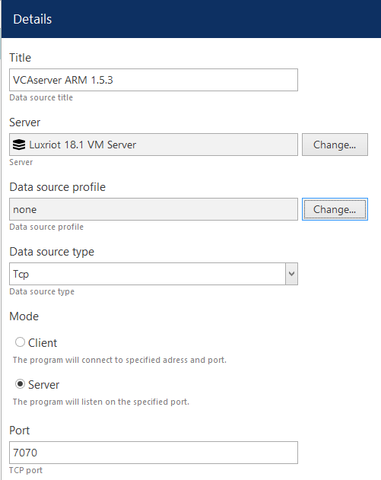

    _Make sure any active firewalls are configured to allow traffic using the port detailed above._

### Configuring Data Source Profile

1.  Now, we configure the Data Source Profile. From the left menu, click **Data Sources**. Then, click
    **+ New data source profile** located top.

    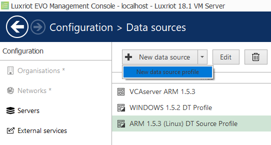

2.  In the **Details** page, enter a descriptive name for the Profile. Then, click **Configuration** in the left side.

    -   **Encoding:** Select Western European Windows from the available options.
    -   **Line Ending:** Select **CR + FL** from the list.
    -   **Remove non-printable characters:** leave it checked.

        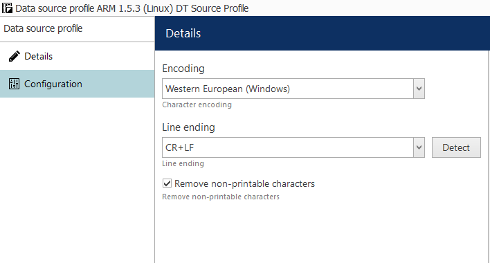

#### Defining Data Source Profile Format

1.  In the **Details** page, click **load from data source...** located top right.

    -   Select the **Data Source** created previously and click **OK**.

    _Note: Make sure that the VCA device is sending events to the Luxriot EVO S Server so that it can be viewed._

    The events are displayed in the trace window. If no events are being received then review the device configuration
    and ensure that your VCA device is producing events.

    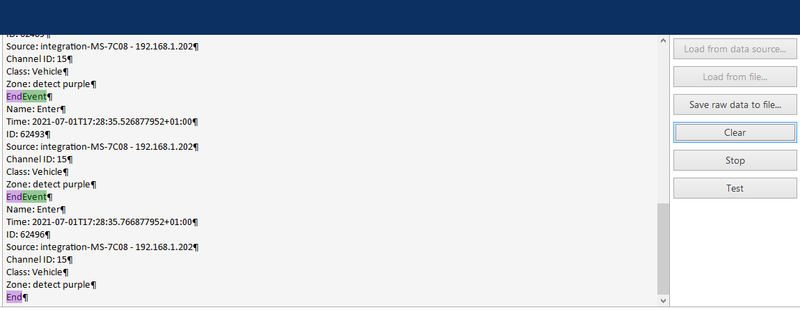

2.  Next, we need to define the _beginning_ of an event from the data being received.

    -   Locate the text that identifies the beginning of an event (in this case it is the word _Event_).
    -   In **Mappings**, click on the `BeginTransaction` entry that will show the settings for `BeginTransaction` on
        the left.
    -   In **Text**, enter the word for the beginning of the transaction.
    -   Click **Apply changes**.

        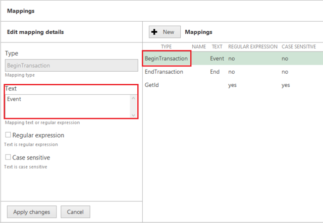

3.  Now, we need to define the _end_ of an event from the data being received.

    -   Locate the text that identifies the end of an event (in this case it is the word _End_).
    -   In **Mappings**, click on the `EndTransaction` entry that will show the settings for `EndTransaction` on
        the left.
    -   In **Text**, enter the word for the end of the transaction.
    -   Click **Apply changes**.

        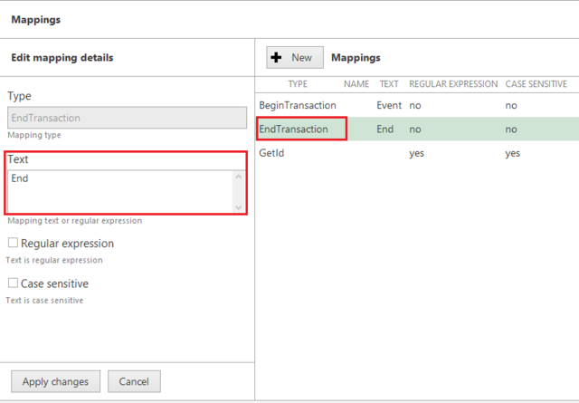

4.  Click **OK** to close the window and save the configuration.

#### Linking the Data Source Profile to the Data Source

1.  In the **Data Source configuration** page, select the data source created before and click **Edit** located top.

    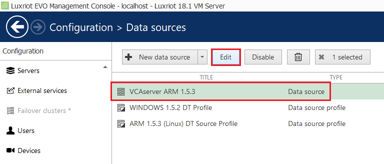

2.  Click **Change** next to the Data Source profile. Then, select the new Data Source Profile and click **OK** to
    confirm.

    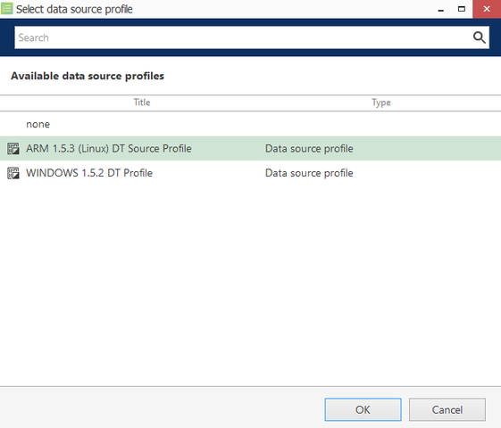

3.  Click **OK** to save the settings.

    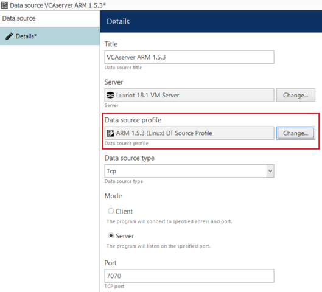

    _To confirm the data source settings, select Test to start receiving events using the data source profile._

#### Linking Data Source to Channels

The Data Source must now be attached to the Channel to link the event messages coming into the server to the video
channel.

1.  From the **Channels configuration** page, select the newly created channel and click **Edit** located top
    right.

    

2.  Click **Video overlays**. Then, click on **Configure video overlays**.

    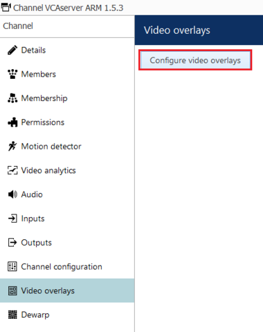

3.  Click **Change** next to the data source option.

4.  In the new screen, select the Data Source. Then, click **OK** to confirm and close the window.

    _The events will appear within the pink box shown on the right side of the video._

    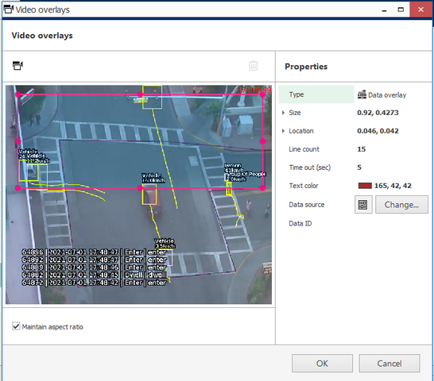

    _On this screen, you can configure the colour, type, and size of the text that will reflect the events on the video_
    _as overlays._

5.  Click **OK** to close the Video overlays window.

## Configuring External Channel Events

External channel events are reserved for the cases when you need Luxriot EVO to react to an event that originates in
any third-party system, which is not connected to Luxriot EVO. Each of these three available events is triggered via
HTTP API by sending a HTTP request; the channel events exist by default, meaning that all you have to do is to build the
URLs and then use them externally.

External channel events use the following URLs:

-   `/event/<resource_id>/external1/activate`.
-   `/event/<resource_id>/external2/activate`.
-   `/event/<resource_id>/external3/activate`.

where:

-   `<resource_id>`: Is the channel ID in Luxriot EVO S server.

_Note: The authentication type should be 'digest', and the method must be 'GET'. Additionally, when triggering the_
_event over the Internet, make sure that the HTTP port of the target Luxriot EVO server is reachable (open on the_
_firewall(s) and forwarded, if required)._

### Finding the Channel ID

1.  First, enable your **Object ID** information.

2.  Click on the main menu icon on the top right and select **Settings** from the available options.

    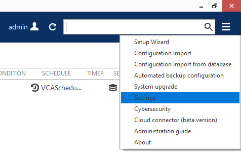

3.  In *General*, tick the box against **Show object IDs** and click **OK** to confirm.

    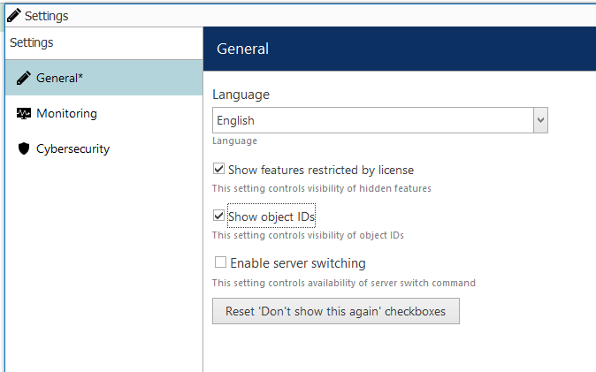

4.  Close the window.

    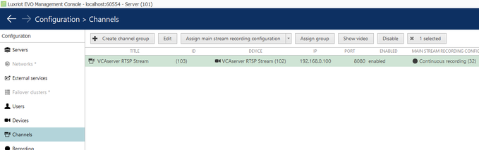

## Creating Events, Actions, and Rules

### Creating Events

#### Creating Data Source Events

Next, we configure the events, actions, and rules that will be sending the Data Sources notifications to the Luxriot EVO
S Monitor. The first step is create an event as follows:

1.  Click **Events & Action** in the left menu.

2.  Then, lick **Events** and **New Event** located top.

    

3.  In **Variables and Counter (4)** and select **Data Source** from the available types.

    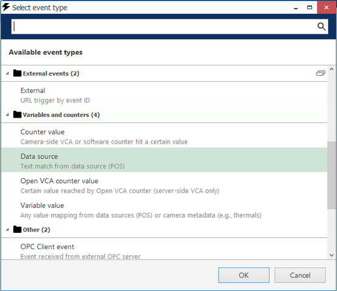

4.  In the new screen, configure the new event as follows:

    -   **Title:** Enter a descriptive name for the event.
    -   **Source:** Click **Change** and select **Data Source**. Then, click **OK** to confirm and close the Event
        source window.

    -   **Text:** Enter the text that will be triggering events.
    -   Click **OK** to confirm and close the Event window.

        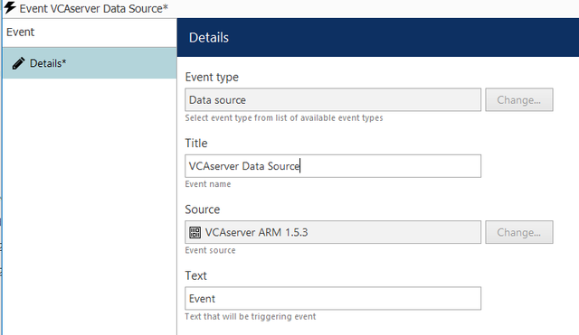

#### Creating Actions

1.  The next step is to create a new action. From the left menu, click **Actions**  and **New action** located top.

    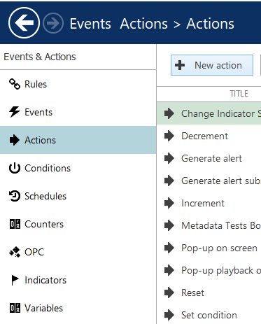

2.  In **Notifications (4)**, select **Send event to client** from the available types.

    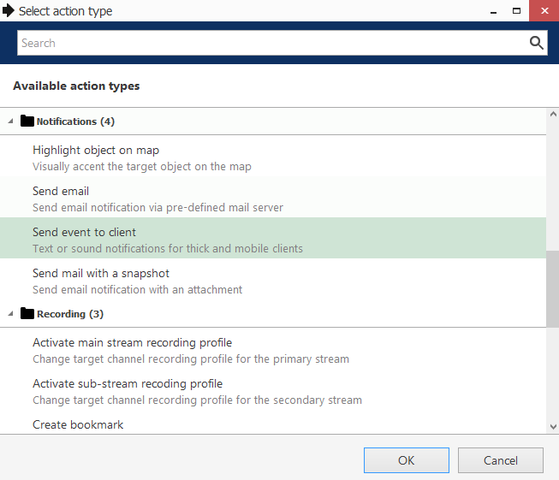

3.  Then, configure the notification as follows:

    -   **Title:** Enter a descriptive name for the notification.
    -   **Message:** Click the **Insert field** button located top right to add the fields that will contain the details
        of the events in the notification.

        

    -   **Enable** Display events in alert, Display a warning message box and Display event in notification panel.

        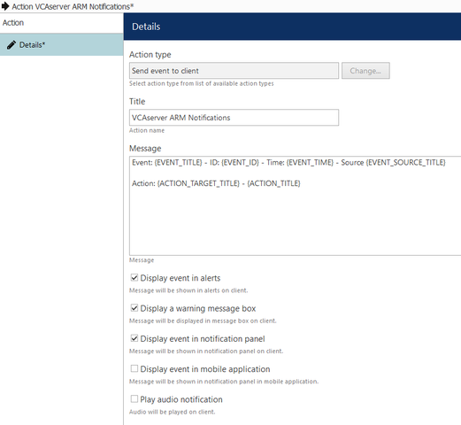

4.  Click **OK** to confirm and close the Actions window.

#### Creating Rules

1.  The last step is to create a new rule. From the left menu, click **Rules** and **Open configuration** located top.

    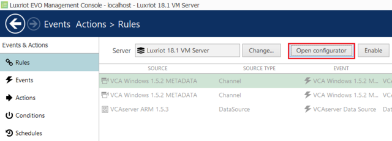

2.  In the Event and Actions `configurator` page, you will see three boxes associated with Events, Rules, and Actions.

3.  In **Events**, select the **Data Source** created previously. Then, click the greater than **>** button to move the
    event into the Rules box.

4.  In **Actions**, select the **Notification** created previously. Then, click the less than **<** button to move the
    action into the Rules box.

5.  In **Rules**, configure the box as follows:

    -   Click **Target channel** located bottom. In the pop-up screen, select the VCA device and click **OK** to
        confirm.

    -   Then, click **Schedule** located bottom. Configure the schedule for the events, and click **OK** to confirm.

        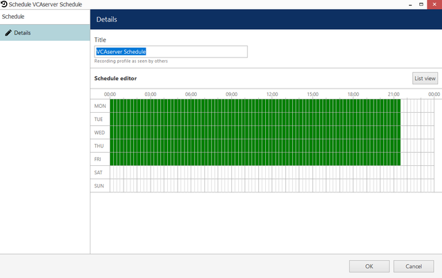

6.  Click **OK** to save the rule configuration.

    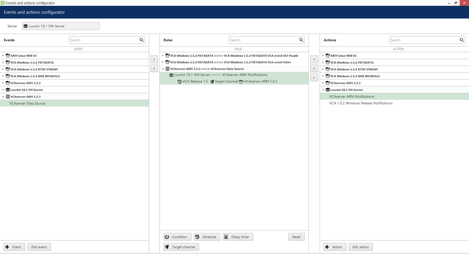

Optionally, you can test this Rule by clicking the Test button located top. The notification will appear on the Luxriot
EVO S Monitor.

### Creating External Channel Events

#### Creating Actions

1.  From the left menu, click **Actions**  and **New action** located top.

    

2.  In **Notifications (4)**, select **Send event to client** from the available types.

    

3.  Then, configure the notification as follows:

    -   **Title:** Enter a descriptive name for the notification.
    -   **Message:** Click the **Insert field** button located top right to add the fields that will contain the details
        of the events in the notification.

        

    -   **Enable** Display events in alert, Display a warning message box and Display event in notification panel.

        

4.  Click **OK** to confirm and close the Actions window.

#### Creating Rules

1.  From the left menu, click **Rules** and **Open configuration** located top.

    

2.  In the Event and Actions `configurator` page, you will see three boxes associated with Events, Rules, and Actions.

3.  In **Events**, select one of the the **External Events** listed for the previously configured device. Then, click
    the greater than **>** button to move the event into the Rules box.

4.  In **Actions**, select the **Notification** created previously. Then, click the less than **<** button to move the
    action into the Rules box.

5.  In **Rules**, configure the box as follows:

    -   Click **Target channel** located bottom. In the pop-up screen, select the VCA device and click **OK** to
        confirm.

    -   Then, click **Schedule** located bottom. Configure the schedule for the events, and click **OK** to confirm.

        

6.  Click **OK** to save the rule configuration.

    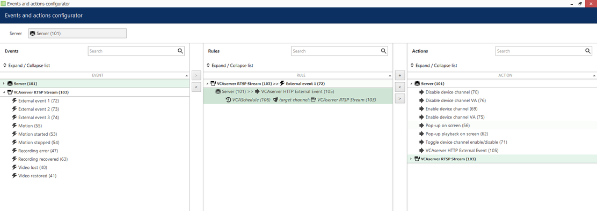

For more information on configuring devices, events, actions or rules, please refer to Luxriot EVO S Administration
[Guide](https://www.luxriot.com/wp-content/uploads/2017/10/Luxriot-EVO-S-Administration-Guide.pdf)

## Verifying Events on the Luxriot EVO S Monitor

From the Luxriot EVO S Monitor, you can verify the Data Source events and monitor the web interface. Every time a
event is triggered in the VCAserver, a pop-up notification will appear on the **Live** screen as follows:

### Data Source Events

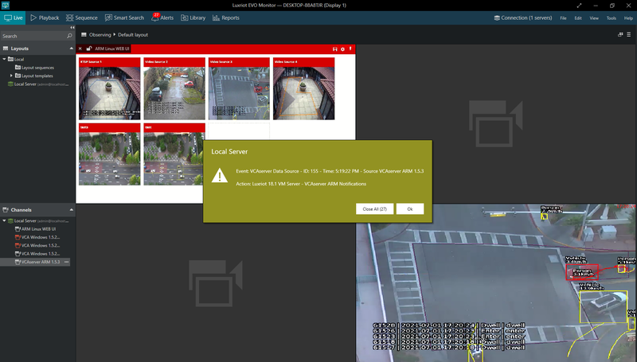

You will see the notifications on the **Alerts** tab located top.

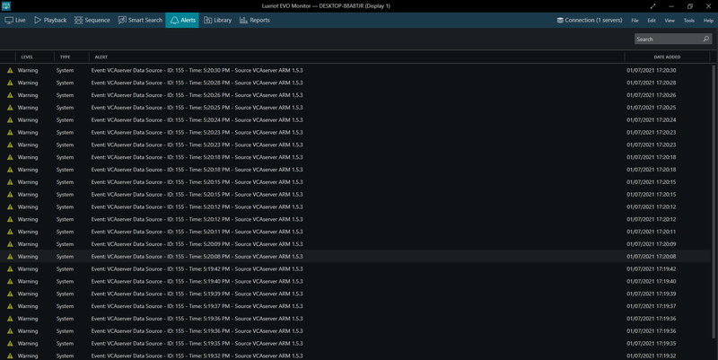

### External Channel Events

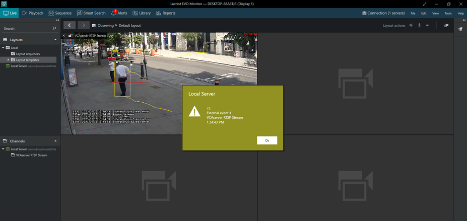

You will see the notifications on the **Alerts** tab located top.

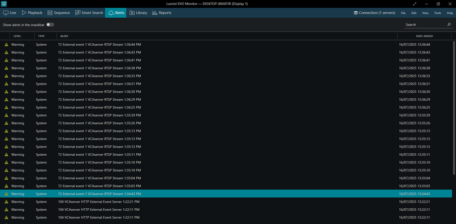
