# Introduction

## Prerequisites

-   VCAserver version 2.34.2 or greater.
-   Milestone XProtect Professional+ 2025 R1 or greater.

## Supported features

-   ONVIF Metadata Search (People and Vehicle Type).
-   ONVIF Events (appear, disappear, enter, exit, tailgating, loitering).

## Architecture

Milestone Professional+ will connect to the VCAserver and consume the ONVIF Metadata (object annotation and class) and
Events from the rules configured in each channel.

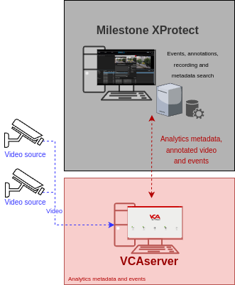

# VCAserver Configuration

## Confirming the ONVIF port used for transmitting video footage

Check, and change if required, the web port used by VCA for external connections to the channels within the VCA
service.

1.  From the main screen, click the **system cog** in the top right.

    

2.  Then, click on **System**.

    

3.  In **Network Settings**, you can see the Web port used by the VCAserver to send the video of its channels.
    Change it if necessary and click **Save**.

    

### Enabling ONVIF

1.  Navigate to **ONVIF** and tick the box against **Enabled** to enable the feature

    

    _Note: ONVIF runs on the web server port (whatever that may be). This is the same port the user configured_
    _previously._

## Creating a Channel

Configure the VCAserver as required with the appropriate channel and rules. A basic setup is detailed below as
an example:

1.  Configure a source to connect to a camera.

    _Note: the recommended settings for the camera stream to VCA is a maximum resolution of D1 (640 x 480) with a frame_
    _rate of 15 frames per second. A lower resolution and frame rate will reduce the analytic accuracy, a higher_
    _resolution and frame rate will result in high CPU usage and can reduce analytical accuracy._

2.  Select the **Tracking Engine** to identify objects in the scene.

3.  Create a **Zone** for the channel.

4.  Add **Rules** to trigger an event on object detection in the zone.

    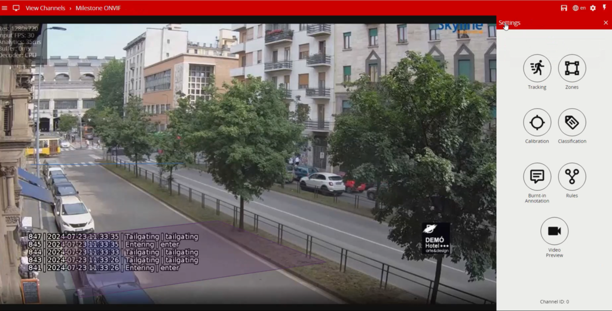

For more information on creating and configuring channels in VCA please refer to the
[VCA core manual 2.4](https://documentation.vcatechnology.com/).

# Milestone Management Client Configuration

## Adding a New Hardware

1.  Click **Recording Server** in the left menu. Then, right clicking on the Server and select **Add Hardware**.

    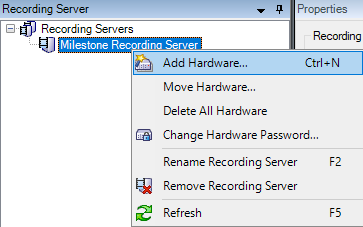

2.  In the pop-up screen, select **Manual** from the options and click **Next**.

    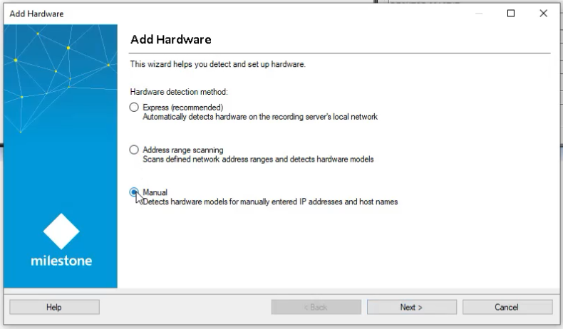

3.  Specify the **credentials** to connect to the VCAserver.

    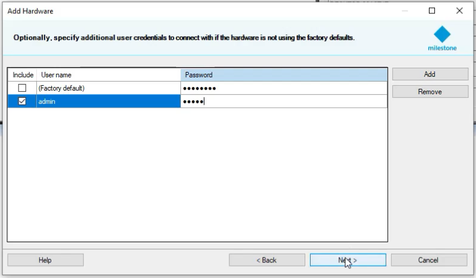

4.  Select which drivers to use when scanning the hardware. Expand **Other** and tick the box against **ONVIF**
    **`Conformant` Device**. Then, click **Next**.

    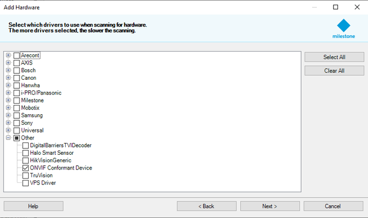

5.  Enter the network address and web port of the VCAserver you want to add. Optionally, you can select the hardware
    model to speed up detection. Click **Next**.

    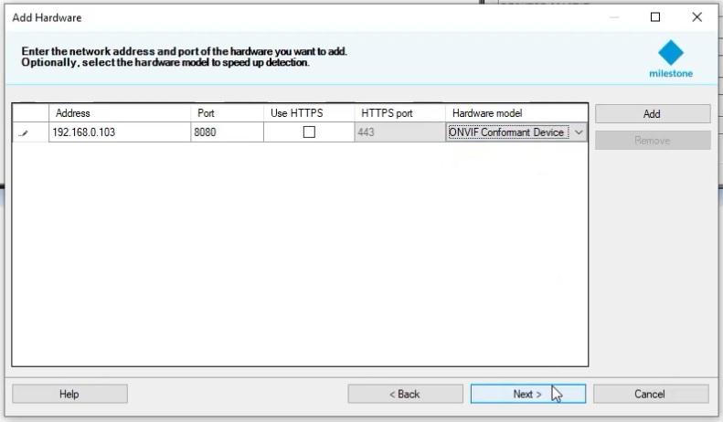

6.  Wait while the VCAserver is being detected. Once detection has been completed successfully, tick the box against
    the hardware and click **Next**.

    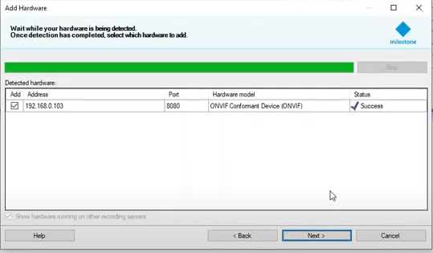

7.  Tick the box against **Metadata Port:** to add the feature and click **Next**.

    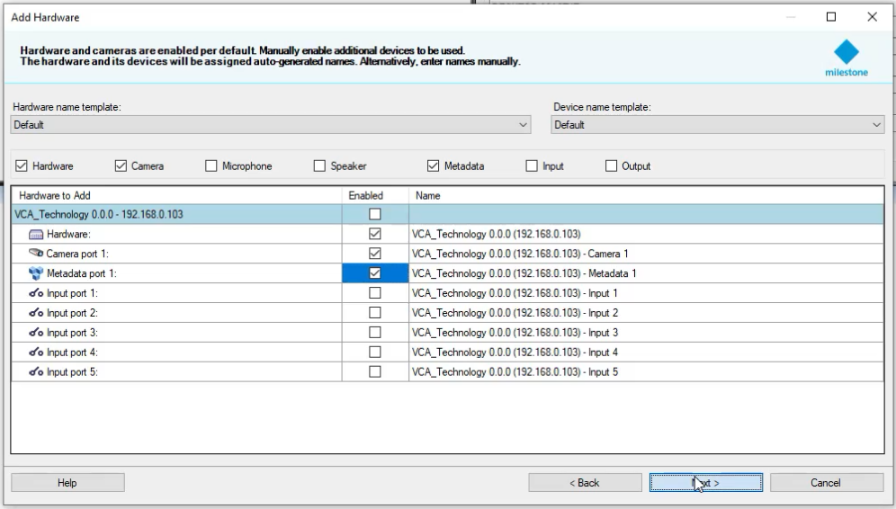

8.  Select default or individual *Group* for the device.

    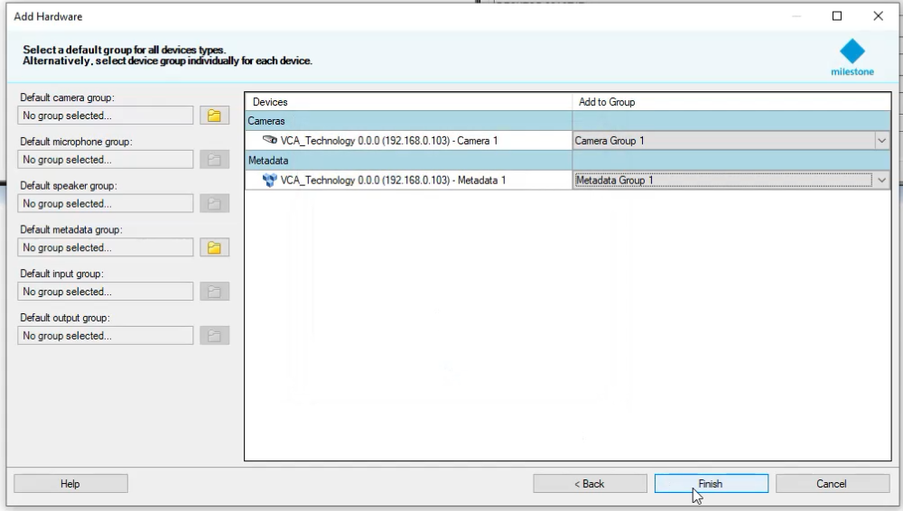

    _If no groups exist then you can create a new group for your device by selecting the create new group icon on the_
    _left._

    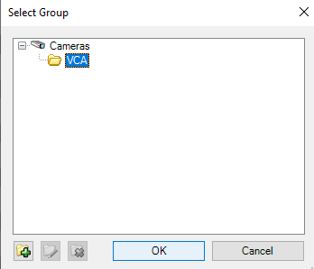

9.  Click **Finish** to confirm the process.

    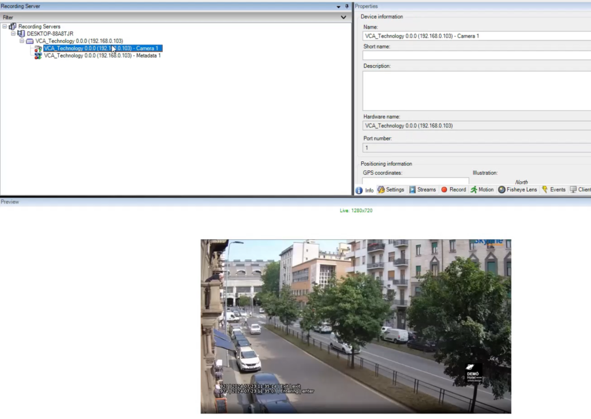

    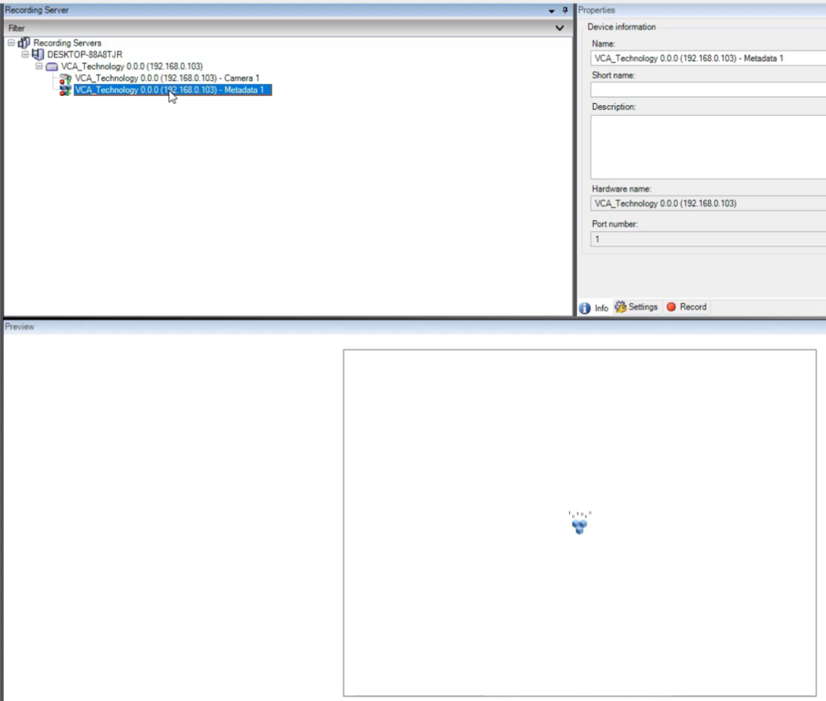

## Enabling Metadata Search

1.  Expand the *Metadata Use* menu on the left and click **Metadata Search** to enable the search filter in `XProctect`
    Smart Client.

    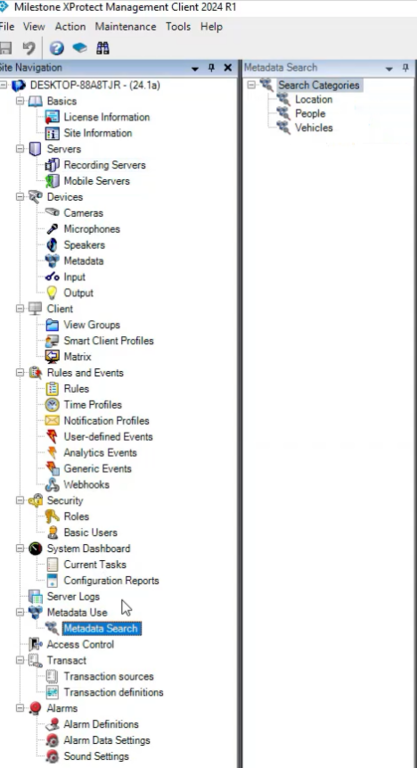

2.  Tick the corresponding box against **People** or **Vehicles** as follows:

    -   **Vehicles**: Enable **Vehicle type** and click the **save** button on the top left.

        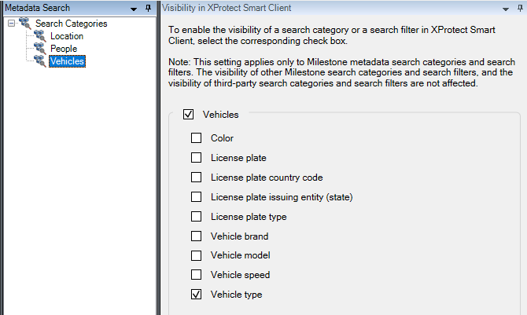

    -   Enable **People** and click the **save** button on the top left.

        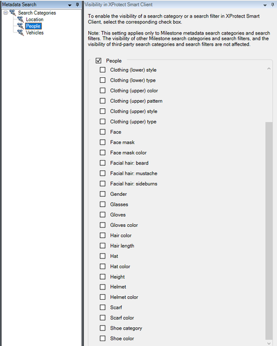

## Adding ONVIF Events

1.  Expand the *Devices* menu on the left and click **Cameras**.

    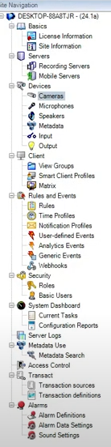

2.  In *Properties*, click **Events** to star adding the ONVIF events.

    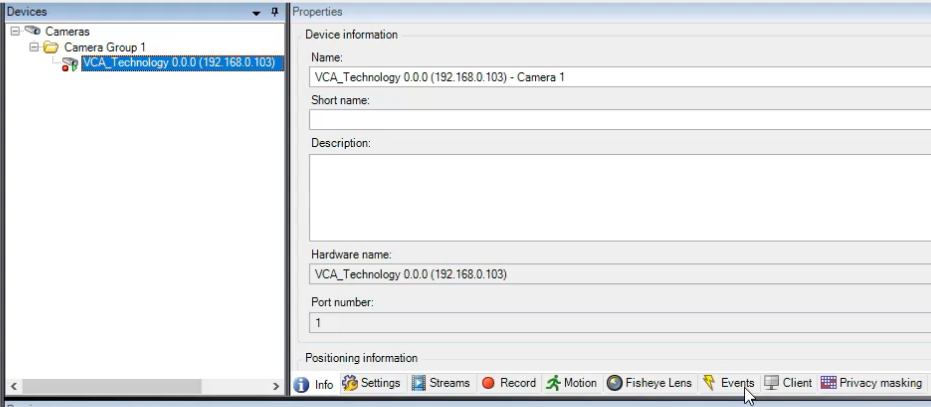

3.  In the *Configured events* page, click **Add...** to display the list of available events.
    *The ONVIF events start with*`(Dynamic/RuleEngine/...)`.

4.  Select the *Driver Event* that matches the rule configured in VCAserver and click **OK**.

    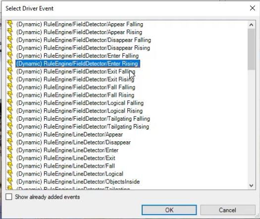

5.  Click the **save** button on the top left to confirm.

## Creating Alarm Definitions

Creating the alarm definition is required to link the event type created in the previous step to the channel which
will receive the events.

1.  Expand the *Alarms* menu on the left and click **Alarm Definitions**.

    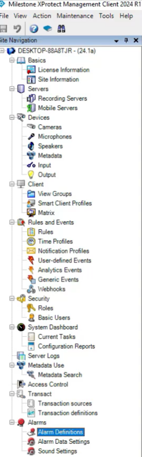

2.  Right click on *Alarm Definitions* and select **Add New...** to create a new alarm.

    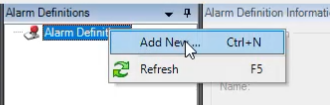

3.  Configure the new alarm as illustrated below:

    -   **Name**: Enter a descriptive **name** for the alarm.
    -   **Triggering event**: Select **Device events**. In the drop-down list below, select the specific ONVIF event
        added to the camera previously.
    -   **Sources**: Select the VCAserver or camera that this alarm will be link to.
    -   **Related sources**: Select the VCAserver or camera that this alarm will be link to.

        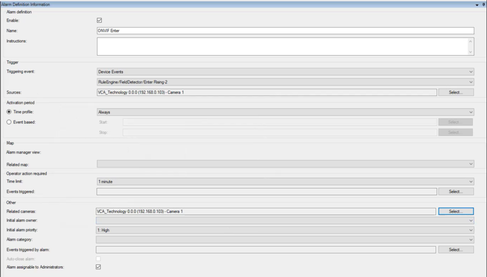

    -   **Save** the configuration.

## Verifying the Events in the Smart Client

In the XProtect Smart Client, the ONVIF events will be listed in the  **Alarm Manager** page as
well as the metadata of each object as follows:

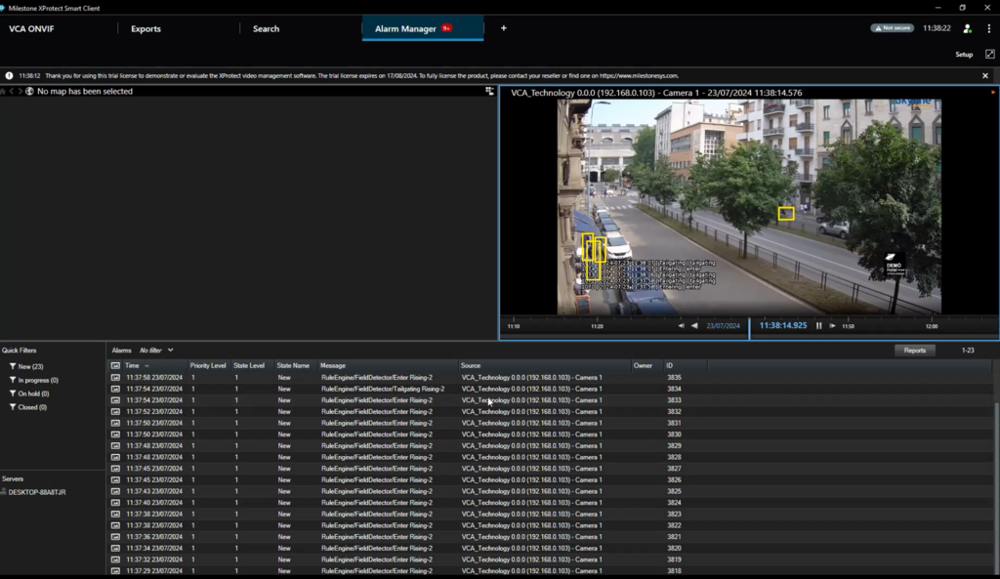

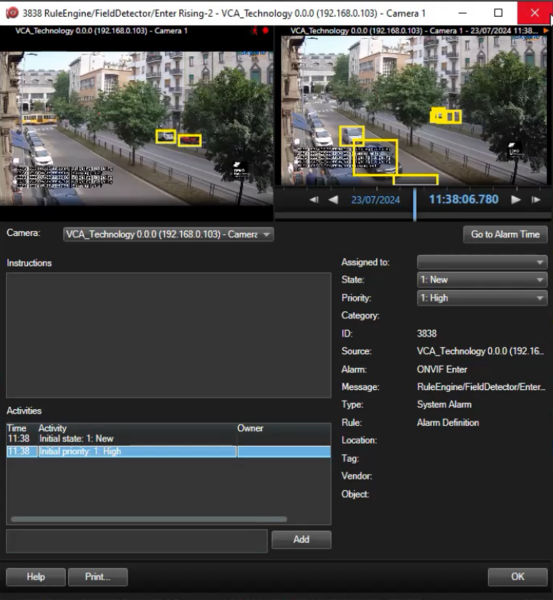

Navigate to the **Search** page to review the ONVIF metadata.

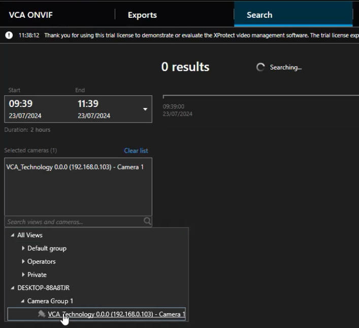

-   You can filter by camera:

    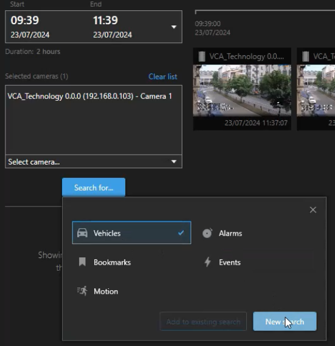

-   Search by object type:

    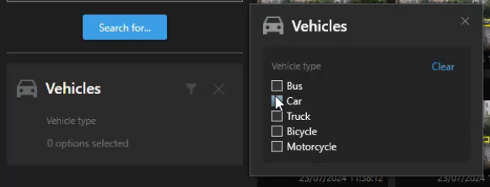

    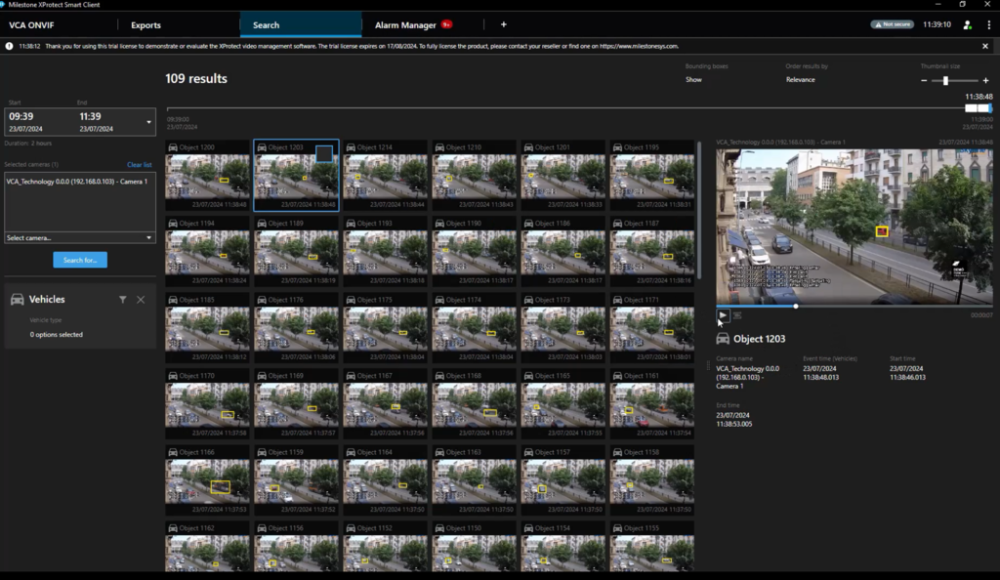

-   And review the recordings:

    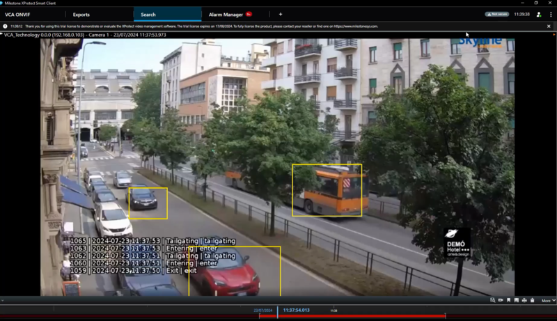
