# Introduction

## Prerequisites

-   VCAserver version 2.4.2 or greater.
-   Milestone XProtect Professional+ 2025 R1 or greater.

## Supported features

-   Annotated RTSP stream.
-   HTTP events with metadata available via tokens.
-   XML requests.

## Architecture

For this web UI integration, Milestone receives the annotated RTSP stream from the VCAserver and the analytics events
are sent through HTTP requests with XML format and VCA tokens containing details about the event.

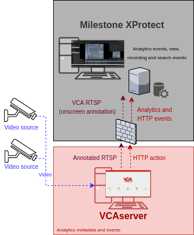

# VCAserver Configuration

## Confirming the RTSP port used for transmitting video footage

Check, and change if required, the RTSP port used by VCA for external connections to the channels within the VCA
service.

1.  From the main screen, click the **system cog** in the top right.

    

2.  Then, click on **System**.

    

3.  In **Network Settings**, you can see the RTSP port used by the VCAserver to send the RTSP stream of its channels.
    Change it if necessary and click **Save**.

    

    _Note: The syntax for connecting to these channels is:_

    `rtsp://<device_ip>:<RTSP_port>/channels/<channel_id>`.

    Example: `rtsp://192.168.1.10:8554/channels/27`.

## Creating a Channel

Configure the VCAserver as required with the appropriate channel and logical rules. A basic setup is detailed below as
an example:

1.  Configure a source to connect to a camera.

    _Note: the recommended settings for the camera stream to VCA is a maximum resolution of D1 (640 x 480) with a frame_
    _rate of 15 frames per second. A lower resolution and frame rate will reduce the analytic accuracy, a higher_
    _resolution and frame rate will result in high CPU usage and can reduce analytical accuracy._

2.  Configure a **zone** for the channel.

3.  Configure **rules or filters** to trigger an event on object detection in the zone.

    

4.  Note the **Channel ID** as this will be needed when connecting to the RTSP stream from the Milestone server.

    _Note: The channel ID can be located at the bottom of the channels menu._

    

For more information on creating and configuring channels in VCA please refer to the
[VCA core manual 2.4](https://documentation.vcatechnology.com/).

## Creating an Action

1.  Click the **system cog** in the top right to access the Settings.

    

2.  Then, click **Edit Actions**.

    

3.  Click **Add Action** and select **HTTP** from the list of available actions.

    

4.  Enter a descriptive name for the action.

5.  Click the arrow on the right of the action to expand the HTTP configuration options.

    -   **URI:** Enter the IP address of the Milestone XProtect server.
    -   **Port:** Enter the port number used to send the Analytics Event. _The default port used by XProtect is 9090_.
    -   **Headers:** Select **Custom** from the drop-down menu and add the content-type as follows:
        `Content-Type: text/xml`.

    -   **Body:** Select **Custom** from the drop-down menu. Then, add the XML required by the XProtect server with
        some VCA tokens.

    -   **Method:** Select **POST** from the available methods.
    -   **Enable Authentication:** Check to enable authentication.
    -   **Username:** Enter the username to access the XProtect server.
    -   **Password:** Enter the password to access the XProtect server.
    -   **Sources:** Click **Add Source +** to display a list of the available Sources, rules and filters. Select the
        rule created for the source you want to send to the Milestone XProtect server.

        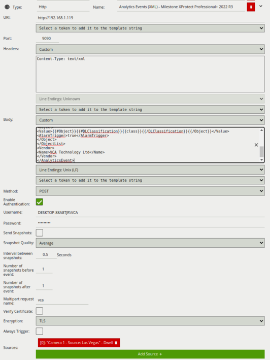

For this integration, the following tokens were used to send an information on the camera, zone and rule type that
triggered the event:

-   `{{start.iso8601}}`: The start time of the event.
-   `{{type.string}}`: The type of the event. This is usually the type of rule that triggered the event.
-   `{{name}}`: The name of the event.
-   `{{id}}`: The unique ID of the event.
-   `{{host}}`: The hostname of the device that generated the event.
-   `{{ip}}`: The IP address of the device that generated the event.
-   `{{#Object}}{{#DLClassification}}{{/DLClassification}}{{/Object}}`: The classification generated by a
    deep learning model (e.g. Deep Learning Filter or Deep Learning Object Tracker). This token is a property of the
    object token. The algorithm must be enabled in order to produce this token. It has the following sub-
    properties:
    -   `{{class}}`: What the object has been classified as (person, vehicle).
-   `{{#Channel}}{{id}}{{/Channel}`: The id of the channel that the event occurred on.
-   `{{#Channel}}{{name}}{{/Channel}`: The name of the channel that the event occurred on.
-   `{{#Zone}}{{name}}{{/Zone}}`: The name of the zone.
-   `{{#Object}}{{id}}{{/Object}}`: The id of the object.

# Milestone Management Client Configuration

## Adding a New Hardware

First, we add a new hardware into the system.

1.  Click **Recording Server** in the left menu. Then, right clicking on the Server and select **Add Hardware**.

    

2.  In the pop-up screen, select **Manual** from the options and click **Next**.

3.  Click **Add** to create a new entry and enter the credentials to access the VCAserver. Then, click **Next**.

4.  Now, you must choose the type of driver that will be scanned for the Hardware. Click **Clear All** and select
    **Universal** from the available drivers.

5.  Then, select the number of channels you want to add.

    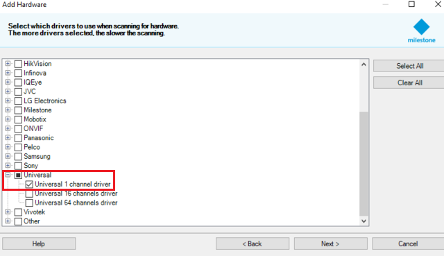

6.  Click **Next**.

7.  Click **Add** to create a new entry and configure it as follows:

    -   **Address**: Enter the IP address of the VCAserver.
    -   **Port**: Enter the web port configured in the VCAserver.
    -   **Hardware Model**: Select **Universal 1 channel drive** from the available options.
    -   Click **Next**.

        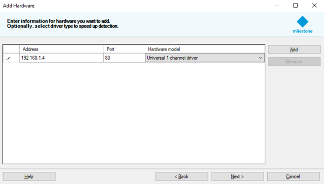

    -   The wizard will verify the new device connects successfully. If this fails, recheck the setup and try again.

        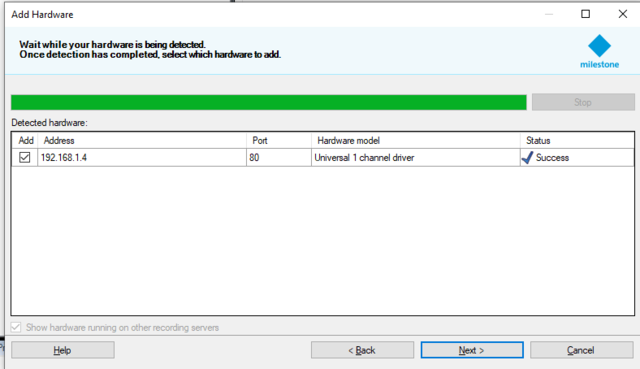

    -   Click **Next**.

        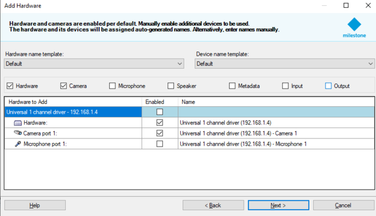

    -   Click **Next**.

8.  Then, assign the camera to a group and click **Select Group** from the drop-down menu.

     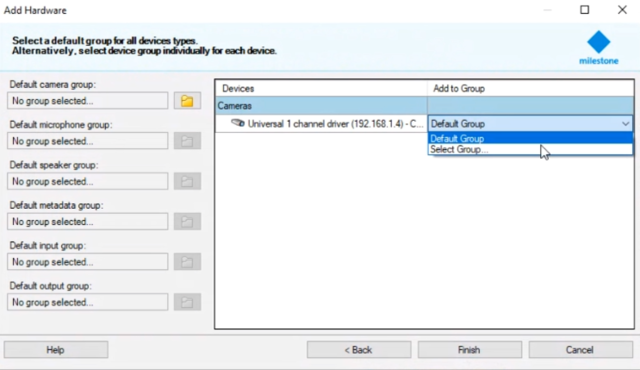

9.  Select the group you want to add the camera device to and click **OK**.

    _If no groups exist then you can create a new group for your device by selecting the create new group icon in the_
    _bottom left._

    

10.  Click **Finish** to complete the process for creating a new device.

### Configuring the VCA RTSP Stream

1.  Click **Recording Servers** and click the plus **+** button on the left side to expand the components.

2.  Select the **Universal driver** added previously and click **Settings** located bottom.

    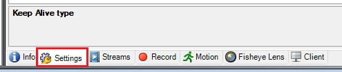

3.  Configure the properties of the **Video Stream 1** as follows:

    -   In **Codec**, select **H264** from the available options.
    -   In **Connection URI**, enter the URL to connect to the VCA channel. Default format: `/channels/<channel id>`.
    -   In **RTSP Port**, enter the RTSP port configured in the VCAserver.
    -   In **Streaming Mode**, select **RTP over RTSP (TCP)** from the available modes.

        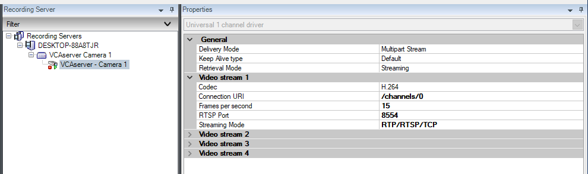

        _The preview window below the settings will display a live image of the VCA channel_

        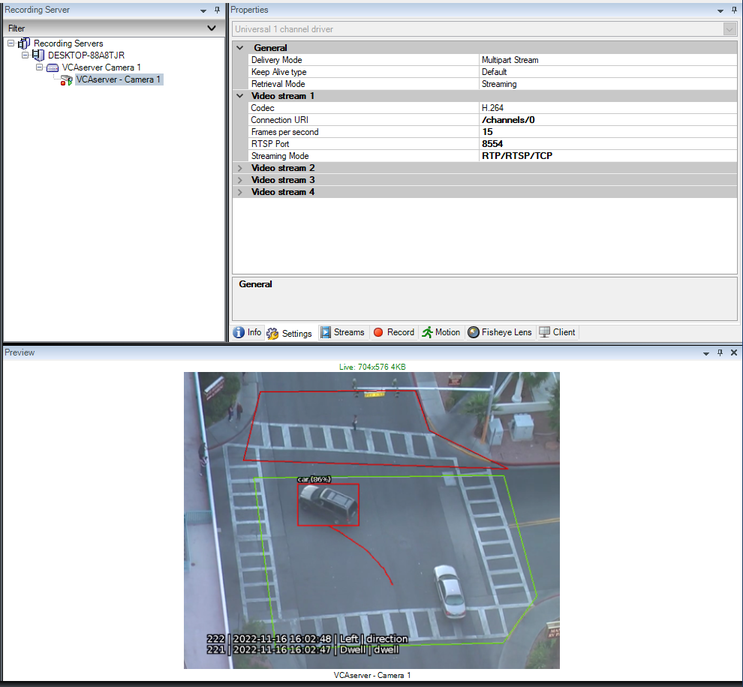

        _Additionally, click **Info** located bottom and enter a descriptive name for the device._

4.  Click the **floppy disk** icon to save the configuration.

## Configuring the Event Outputs

1.  Click **Tools** from the top menu and select **Options**.

2.  Then, click **Analytics Events** and **enable** the option.

    -   In **Port**, enter the port to receive the analytics events from external devices. _Note: 9090 is the default_
        _port used by XProtect and is used when creating the action event in VCA. If you change this to a different_
        _port then update the action event in VCA to match._

    -   In **Events allowed from**, select **All networks addresses** from the available options.
    -   Click **OK** to save the configuration.

        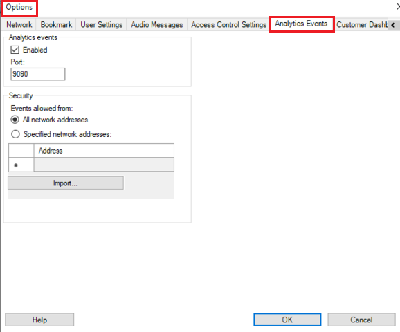

        _Make sure any active firewalls are configured to allow traffic using the port detailed above._

## Configuring Rules and Events

1.  Click **Rules and Events** in the left menu. Then, click **Analytics Events**.

    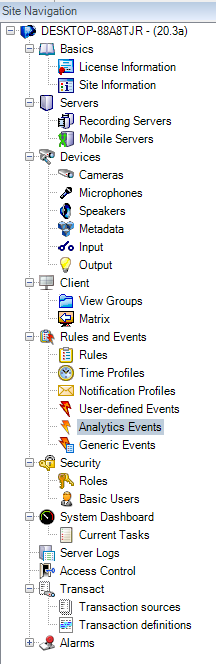

2.  Right clicking on the **Analytics Events** and select **New**.

    -   Enter a descriptive name for the event. Then, click **save** to confirm the configuration.

        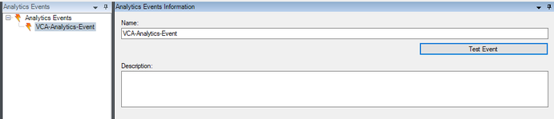

    _Note: If the event name does not exactly match `VCA-Analytics-Event`, events will not be received by the XProtect_
    _event server._

## Creating the Alarm Definitions in XProtect

Creating the alarm definition is required to link the event type created in the previous step to the channel which
will receive the events.

1.  Click **Alarms** in the left menu.

    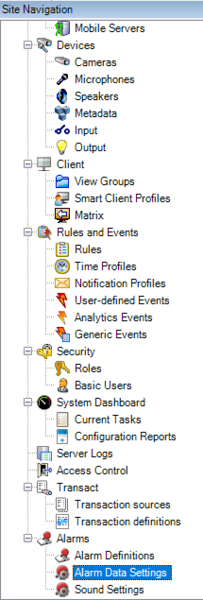

2.  Then, select **Alarm Definitions** and click **New/Create New**.

3.  Configure the new alarm as illustrated below:

    -   In **Alarm definition**, enter a descriptive **name** for the alarm.
    -   In **Trigger**, set **Triggering Event** to **Analytics Events** and then, select the specific event type to
        `VCA-Analytics-Event` (the event created in the previous step).

    -   In **Sources,** select the video source (channel) with which this event will be associated. This event is
        associated with Camera 1 (the VCA device), so click the **Select...** button to choose the VCA device.

        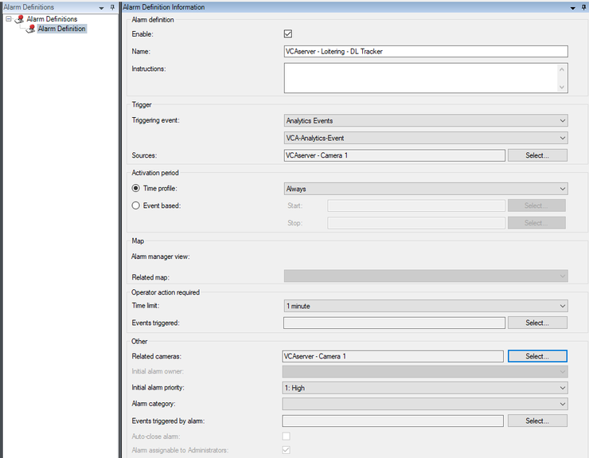

    -   **Save** the configuration.

### Testing the Analytics Event Configuration

1.  Click **Rules and Events** in the left menu. Then, click **Analytics Events**.

2.  Select the Analytics Events created previously and click **Test Event**.

    

3.  Highlight the VCA device from the list and click **OK**.

    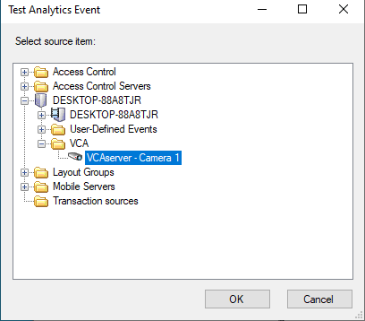

    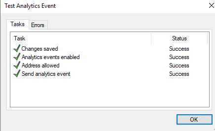

    _Note: If the test fails, repeat the steps above and check the event._

### Defining the Fields to Display in the Alarm Manager

Each analytic event is transmitted to the XProtect Event Server with a range of properties. To enable the event
properties to be displayed in the Smart Client, it may be necessary to enable them in the Management Client.

1.  Select and expand **Alarms** from the side menu. Then, select **Alarm Data Settings** from the configuration tree.

2.  Select the desired event properties and move them from the left to the right panel.

    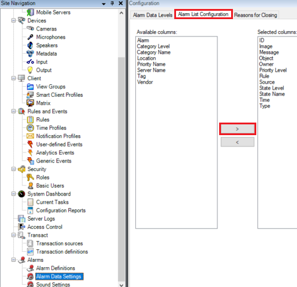

    _To display the event properties in the Smart Client, right clicking on the event header and select the fields_
    _to display._

    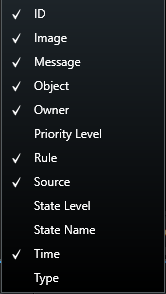

## Verifying the Events in the Smart Client

In the **Live** screen of the XProtect Smart Client, the analytics events will be listed within the Alarms panel as
well as the annotated RTSP of the VCA Channel.

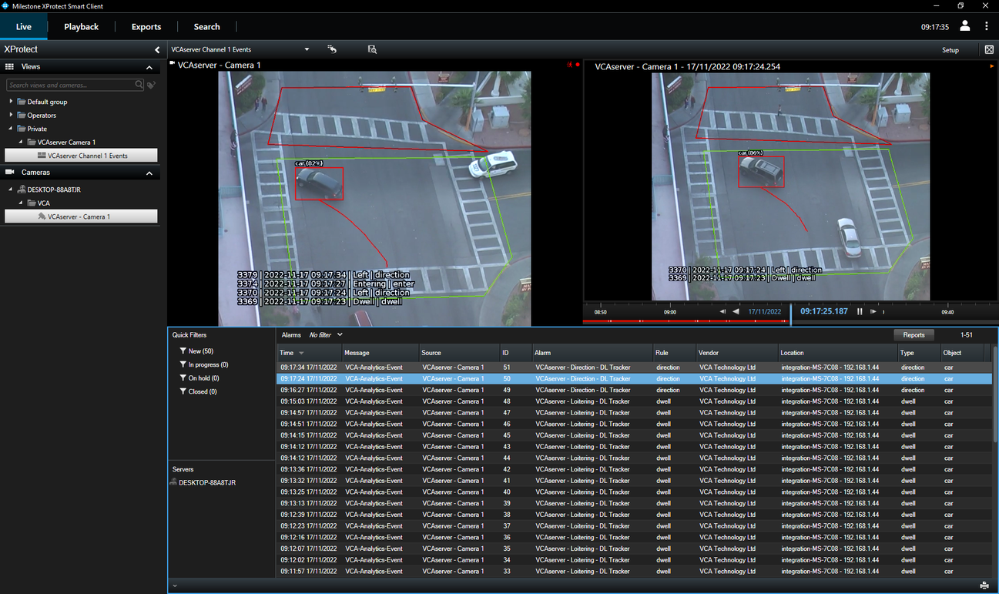

## Analytics Event XML Configuration

The Analytics Events XML template used for sending events to the Milestone server:

-   `<AnalyticsEvent>`: Root tag (representation of the analytics event).
-   `<EventHeader>`: This tag contains the details of the event such as ID, date, time, message (which must match
    the name of the Analytics Event) and source (cameras and Milestone servers).

-   `<ID>`: The unique ID of the event.
-   `<Timestamp>`: The time of the event.
-   `<Type>`: The type of the event.
-   `<Message>`: This must match the event message in an alarm definition for the event server to trigger an alarm.
-   `<Source>`: The source of the event (a camera, server, etc.).
-   `<Name>`: The name of the source.
-   `<FQID>`: The fully ID of the source. This contains a complete set of fields to contact a server and get further
    details.

-   `<ServerId>`: The ID of the server that owns the camera.
-   `<ObjectId>`: The ID of the camera.
-   `<Description>`: A description of the analytics event.
-   `<Location>`: The external device that generated the analytics event.
-   `<RuleList>`: The rules that trigger the analytics event.
-   `<ObjectList>`: The detected object in the scene.
-   `<Vendor>`: The analytics vendor.

Analytics Event XML template with embedded VCAcore Tokens:

```XML
<?xml version="1.0" encoding="utf-16"?>
<AnalyticsEvent xmlns:i="http://www.w3.org/2001/XMLSchema-instance" xmlns="urn:milestone-systems">
<EventHeader>
<ID>00000000-0000-0000-0000-000000000000</ID>
<Timestamp>{{start.iso8601}}</Timestamp>
<Type>{{type.string}}</Type>
<Message>VCA-Analytics-Event</Message>
<Source>
<Name>{{#Channel}}{{name}}{{/Channel}}</Name>
<FQID>
<ServerId>
<Id>60a0f837-bfd1-4186-be9b-b81e29ce7830</Id>
</ServerId>
<ObjectId>d503d306-b2f1-46d1-a6d8-ef2dfa53e53f</ObjectId>
</FQID>
</Source>
</EventHeader>
<Description>{{#Object}}{{id}}{{/Object}} - {{#Channel}}{{id}}{{/Channel}} - {{#Zone}}{{name}}{{/Zone}}
</Description>
<Location>{{host}} - {{ip}}</Location>
<RuleList>
<Rule>
<Type>{{type.string}}</Type>
</Rule>
</RuleList>
<ObjectList>
<Object>
<Value>{{#Object}}{{#DLClassification}}{{class}}{{/DLClassification}}{{/Object}}</Value>
<AlarmTrigger>true</AlarmTrigger>
</Object>
</ObjectList>
<Vendor>
<Name>VCA Technology Ltd</Name>
</Vendor>
</AnalyticsEvent>
```

## Finding the ID (Identifier) within XProtect

### Camera ID

In the XProtect Management Client GUI, locate the **Camera** (and specific stream in the case of multi-stream cameras).
Press and hold `CTRL` and click **Info**. The camera ID is displayed at the bottom of the right-hand panel.

Note that if `CTRL` is not held down when selecting the stream, the ID is not displayed.

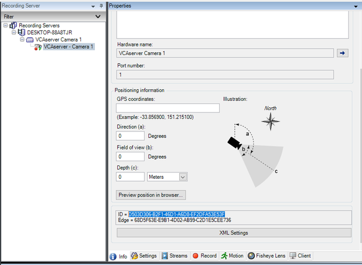

### Server ID

In the XProtect Management Client GUI, locate **Recording Server**. Press and hold `CTRL` and click **Info**. The ID
is displayed at the bottom of the right-hand panel.

The camera and server IDs as they will be used in the Analytics Event XML.
