# Introduction

## Prerequisites

-   Mirasys VMS 9.7.2 (System Manager, System Monitor and Spotter).

## Supported features

-   Annotated video, rules, zones, calibration and classification.
-   Alarms: Presence, enter, exit, appear, disappear, stopped, dwell, direction, speed, abandoned, tailgating, line
    counter, counting.

## Mirasys System Manager Configuration

### Adding a Camera

First, we add a new camera into the system.

1.  From the Mirasys System Manager, click **VMS Servers** in the left menu. Then, select **Hardware** from the
    options.

    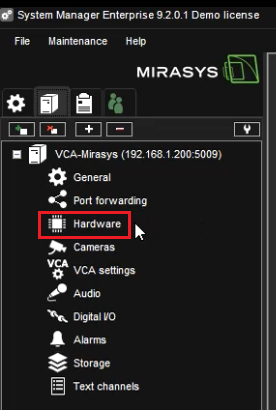

2.  In **Device settings** located bottom, click the **find** button to discovery a camera on the network.

    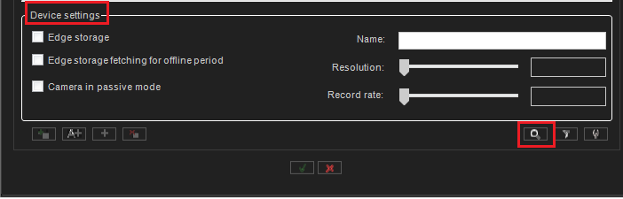

3.  In the **IP Camera Finder** window, once the camera is discovered, configure the device as follows:

    -   Select the camera you want to add.

        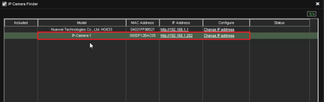

    -   Enter the **User** to access the IP camera.
    -   Enter the **Password** to access the IP camera.
    -   Click the **Add Selected Cameras** button to add the camera.

        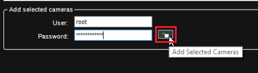

    -   _If your device has audio features then you can include them in the setup, otherwise, click the **x** button_
        _to continue._

       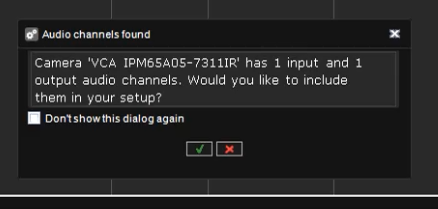

    -   Close the IP Camera Finder windows.
    -   Click the **tick box** button located bottom to save and close the HArdware settings window.

#### Renaming the Camera

1.  Click **Cameras** in the left menu.

    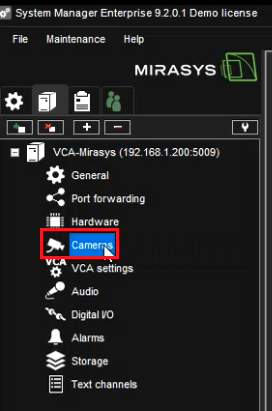

2.  In the **Camera Settings** page, enter a descriptive **name** for the new device. Then, click **OK** to save the
    settings.

    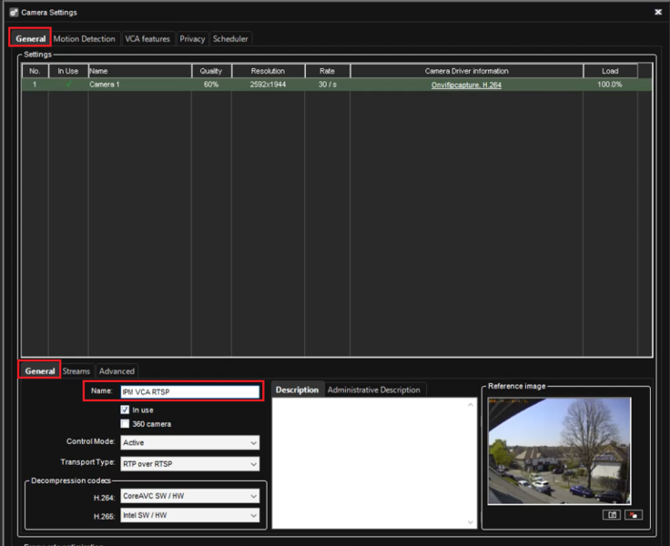

    _The Reference image windows will display a live image of the camera._

### Enabling The VCA Features

1.  In the **Camera Settings** page, click **VCA features** located top.

    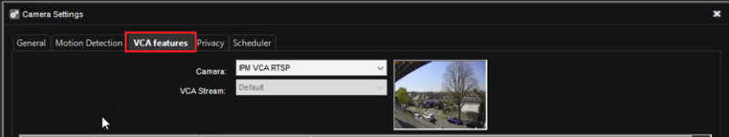

2.  Then, check the **In use box** against the **VCA Core** feature in the list.

    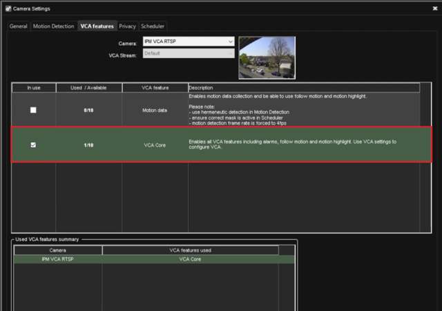

3.  Click the **tick box** button to save and close the Cameras Settings window.

### VCA Configuration

1.  Now, we configure VCAcore. From the left menu, click **VCA settings**

    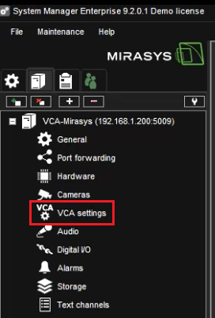

2.  The new page represents the web interface of VCAcore. From the **View Channels** page, click the previously added
    camera.

    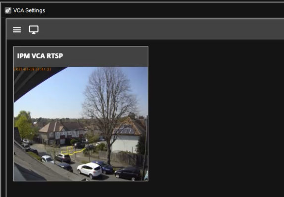

3.  In the **Channel Settings** page, we can add zones, calibrate the video and choose the rules that will trigger the
    event.

    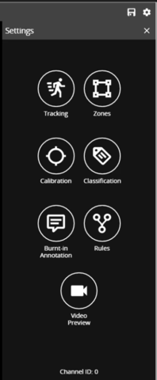

4.  In the channel settings page, click **Calibration** in the right menu.

    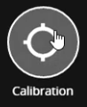

    -   **Enable the option** and use the mimics to match up with people or objects in the scene to help calibrate.
        They represent a height of 1.8 meters.

        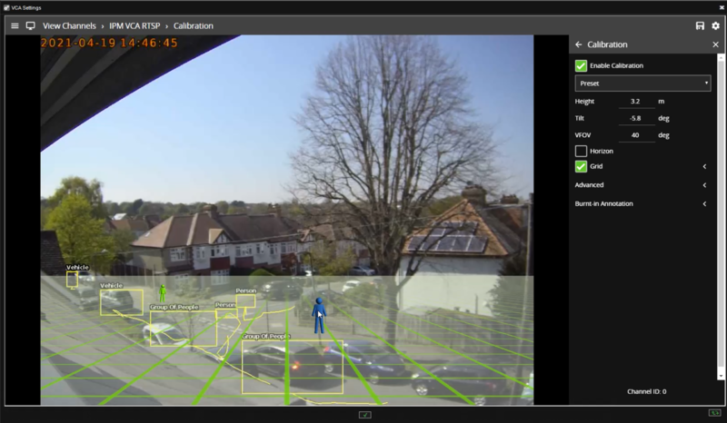

        _Calibration is required to allow the classification with the standard Object Tracker. If you are using DL_
        _Object/People Tracker then no calibration is required_.

5.  Return to the channel settings page and click **Zones** in the right menu.

    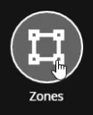

    -   Click **Create Zone +** located top right to create a detection zone.
    -   Position the zone and change the shape as required. You can add/remove nodes to create complex shapes.
    -   Enter a descriptive name for the zone and apply any colour to identify it.

        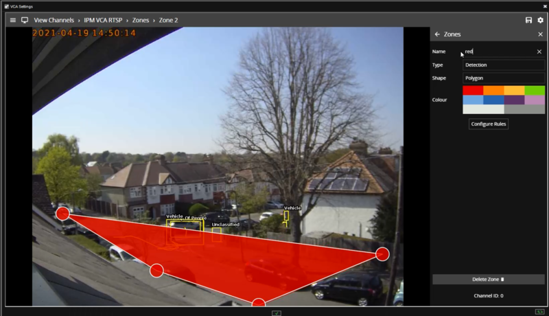

    -   Then, click the **Configure Rules** button below to go to the rules settings page.

        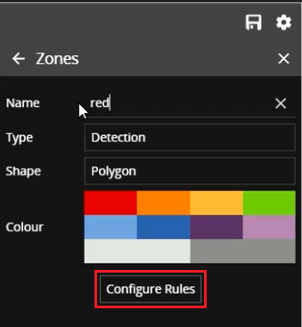

6.  In the **Rules** page, click **Add Rule +** located top right.

    -   Select the rule that will trigger the events.
    -   Attached the zone to the rule.
    -   Modify its properties as required.

        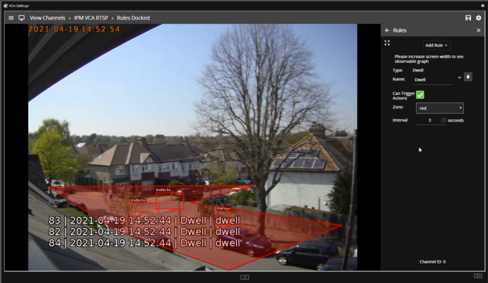

### Creating an Alarm

Next, we create an alarm to show notifications every time a VCA rule is triggered.

1.  Click **Alarms** in the left menu.

    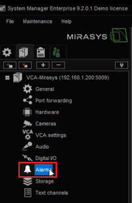

2.  Click the **New Alarm** button from the bottom to add a new alarm.

    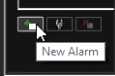

3.  In the **Alarm Configuration** page, configure the **General** tab as follows:

    -   Enter a descriptive **name** for the new alarm.
    -   Select the **Priority** for the alarm (High, Normal, or Low).
    -   Select a colour to identify the alarm.
    -   Enable **View alarm in profiles** in the right side.

        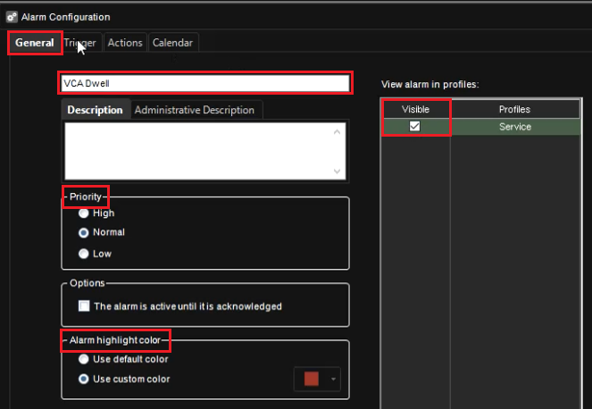

4.  Now, click the **Trigger** tab located top and configure as follows:

    -   In **Type**, select **Metadata** from the drop down list.
    -   Select the **Zone** and the **Rule** that will trigger the events.

        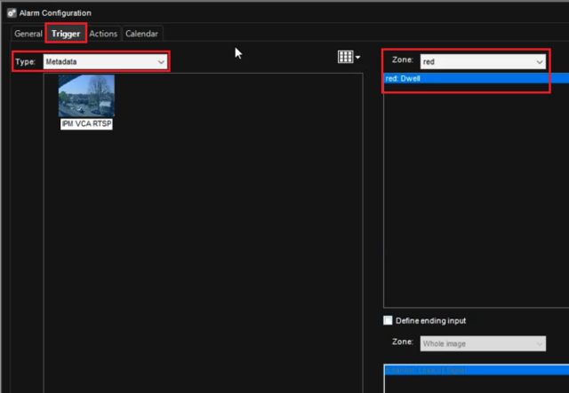

5.  Then, click the **Actions** tab located top to create a new action as follows:

    -   In **Type**, select **Camera recording** from the drop down list.
    -   Then, click **Add** to move the action into the **Visible** box.
    -   Configure **Pre-events** and **Post-events recording** as required.

        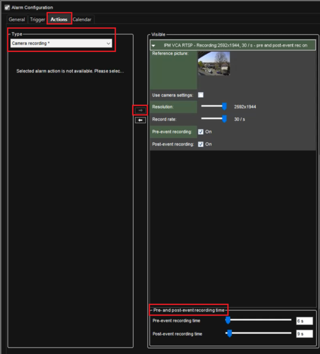

    -   Then, click the **tick box** button to confirm the configuration.

        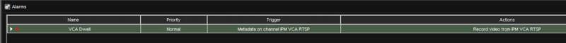

    -   Then, click the **tick box** button to save the new alarm.

### Verifying VCA Events on the Spotter

The VCA events appear on the Spotter client every time a VCA rule is triggered as follows:

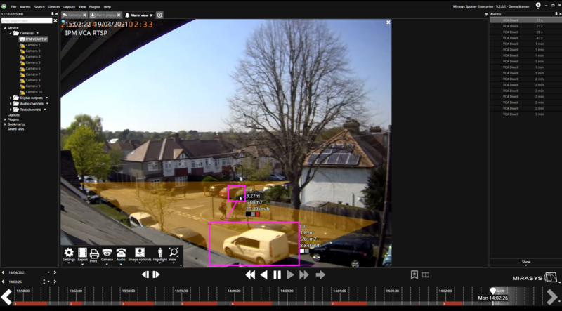
