# Introduction

## Prerequisites

-   VCAserver version 2.4.2 or greater.
-   Obseron 3 VMS.

## Supported features

-   On-screen annotations.
-   VCA Alarms: Counters, entering, exiting, presence, speed, tailgating, direction, dwell, stopped, removed, abandoned,
    appear, continuously.

## Architecture

Obseron will connect to the VCA channels to consume the metadata provided. The integration does not require the
configuration of VCAserver actions to send events to the VMS. The only requirement is that VCA rules are defined.

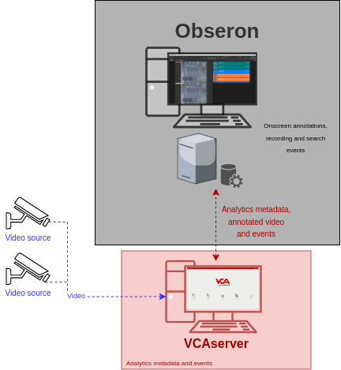

# VCAserver Configuration

## Confirming the RTSP port used for transmitting video footage

Check, and change if required, the RTSP port used by VCA for external connections to the channels within the VCA
service.

1.  From the main screen, click the **system cog** in the top right.

    

2.  Then, click on **System**.

    

3.  In **Network Settings**, you can see the RTSP port used by the VCAserver to send the RTSP stream of its channels.
    Change it if necessary and click **Save**.

    

    _Note: The syntax for connecting to these channels is:_ `rtsp://<device_ip>:<RTSP_port>/channels/<channel_id>`.

    Example: `rtsp://192.168.1.10:8554/channels/27`.

## Creating a Channel

Configure the VCAserver as required with the appropriate channel and logical rules. A basic setup is detailed below as
an example:

1.  Configure a source to connect to a camera.

    _Note: the recommended settings for the camera stream to VCA is a maximum resolution of D1 (640 x 480) with a frame_
    _rate of 15 frames per second. A lower resolution and frame rate will reduce the analytic accuracy, a higher_
    _resolution and frame rate will result in high CPU usage and can reduce analytical accuracy._

2.  Configure a **zone** for the channel.

3.  Configure **rules or filters** to trigger an event on object detection in the zone.

    

4.  Note the **Channel ID** as this will be needed when connecting to the RTSP stream from Obseron and to consume the
    metadata provided in the channel.

    _Note: The channel ID can be located at the bottom of the channels menu._

    

For more information on creating and configuring channels in VCA please refer to the
[VCA core manual 2.4](https://documentation.vcatechnology.com/).

# Obseron Configuration

## Configuring the VCA RTSP Stream

1.  From the Obseron GUI, click on **Main Menu** located top and select **Settings...** from the drop-down options.

    

2.  In the Settings pop-up window, click on **Cameras** in the left menu.

    

3.  Then, click the plus **+** button located at the bottom to add a new camera into the system.

    

4.  ​Change the camera type by clicking the **Change type...** button at the bottom.

    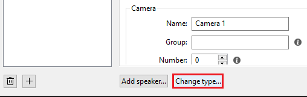

5.  In the **Select camera type** pop-up window, select **Generic RTSP camera** from the available types.

    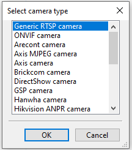

    -   Enter the number of cameras to add and click **OK** to confirm.

6.  In the **General** tab, configure the **Connection** to the VCAserver as follows:

    -   **IP address or hostname:** Enter the IP address or hostname of the VCAserver.
    -   **RTSP Port:** Enter the RTSP port configured in the VCAserver.
    -   **RTSP Path:** ​Enter the path to connect to the RTSP stream of the VCA channel. Default format:
        `/channels/channel_id`. Example: /channels/0.

    -   Enter the **username** and **password** to access the VCAserver.
    -   Then, click **Connect**.

        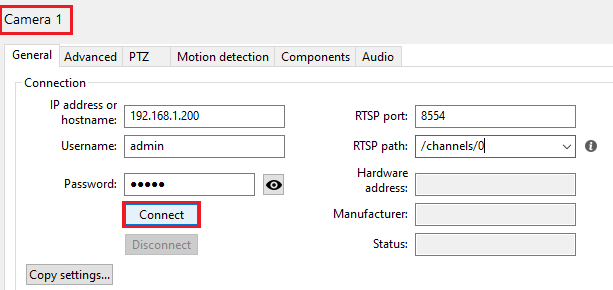

    The **Status** will change to **OK** and the preview window will display a live camera image.

    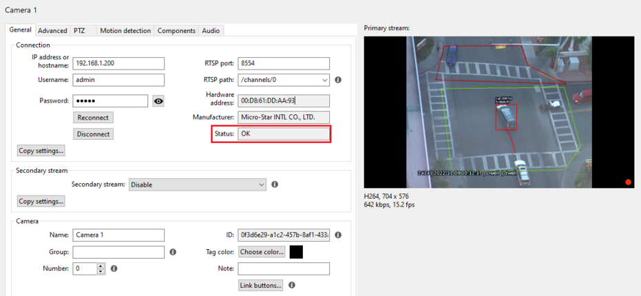

    _Note: You can rename the camera by entering a name for the device on the Camera section below._

## Configuring the VCA Component

Obseron provides external sources called *components* which offer data such as video analytics or sensor readings that
allow to trigger rules.

1.  The next step is to connect to the VCA channel to consume the metadata provided. click the **Components** tab from
    the top menu.

2.  Configure the `Component1` as follows:

    -   In **Component**, select **VCA** from the drop-down list. Then, click **Add** located at the bottom to add the
        new component.

        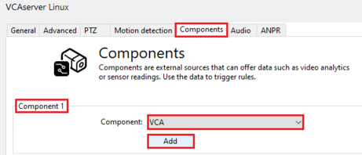

3.  In **Channel**, enter the **ID** of the VCA channel you want to get the metadata from.

4.  Then, configure **Connection** as illustrated below:

    -   **IP address:** Enter the IP address of the VCAserver.
    -   **Port:** Enter the web port configured in the VCAserver.
    -   Confirm the **Username** and **Password** to access the VCAserver.
    -   The VMS will automatically connect to the channel and the VCA metadata will be displayed on the **Received**
        **events** box in the **Info** section. _If the connection fails, repeat the steps above or check the_
        _configuration and click Reconnect._

        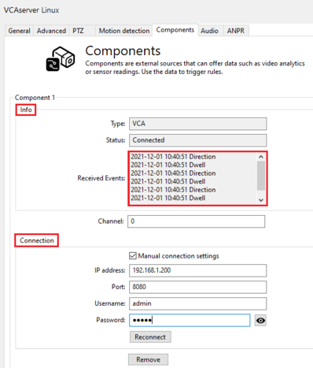

## Configuring Camera Rules and Actions

### Configuring Rules

1.  Now, we configure the rule that will trigger a specific action when a condition is met. From the left menu, click on
    **Rules**.

    

2.  Then, click the plus **+** button located bottom to create a new rule.

    

3.  Enter a descriptive **Name** for the rule and click on **Add Condition** below.

    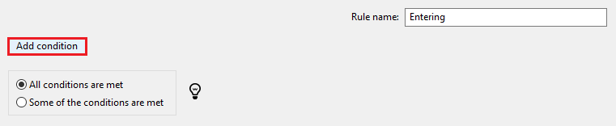

4.  Then, configure the `Condition1` as follows:

    -   **Condition type:** Select **Camera event** from the drop-down list.
    -   **Camera:** Select the camera related to the VCA channel.
    -   **Event type:** Select the detection rule configured in VCA from the drop-down list.
    -   **Hold for (sec):** ​Enter the time for the notification to remain on the screen.

        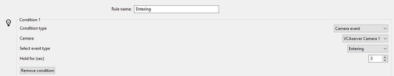

### Configuring Actions

Next, we decide how the system will react to the rules. ​Below is an example of how to configure the Obseron action to
create a Notification/Alarm for the events being received:

1.  Click on **Add action** located at the bottom.

    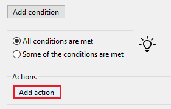

2.  Then, configure the `Action1` as follows:

    -   `Action1:` Select **Notification/Alarm** from the drop-down list of actions.
    -   **Bind a camera to the notification:** Select the VCA channel.
    -   **Notification Colour:** Select a colour to identify the notification.
    -   **Text to show in the notification:** Enter a description for the notification to appear on the screen when the
        event occurs.

        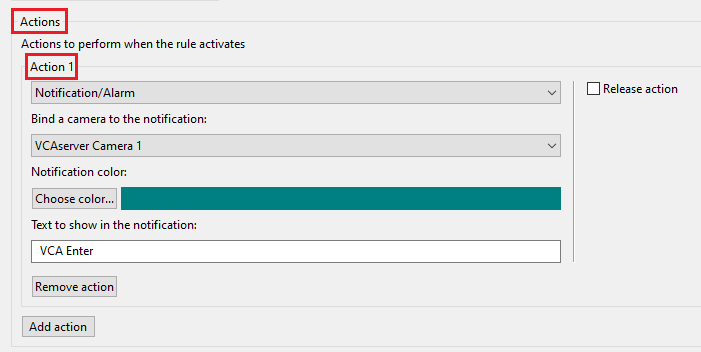

    _Note: You can add all the rules you need and configure different type of actions if required._

## Verifying The VCA Events

The **Live** screen of the Obseron Client will display a list of the events generated by the VCAserver along with the
annotated video.

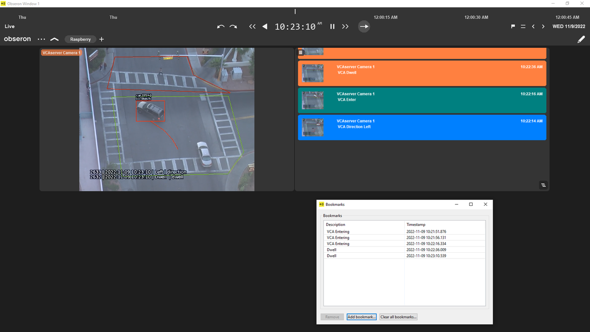
