# Introduction

## Prerequisites

-   VCAserver version 2.4.2 or greater.
-   Sentinel Monitor version 3.149.

## Supported features

-   HTTP events with metadata available via tokens.
-   SMTP events with metadata available via tokens.

## Architecture

In this web UI integration, Sentinel receives the alarms through the HTTP or Email actions with VCA tokens containing
details about the event.

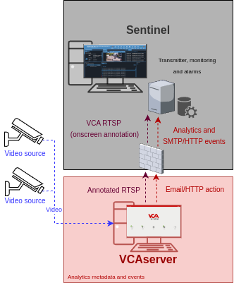

# VCAserver Configuration

## Confirming the RTSP port used for transmitting video footage

Check, and change if required, the RTSP port used by VCA for external connections to the channels within the VCA
service.

1.  From the main screen, click the **system cog** in the top right.

    

2.  Then, click on **System**.

    

3.  In **Network Settings**, you can see the RTSP port used by the VCAserver to send the RTSP stream of its channels.
    Change it if necessary and click **Save**.

    

    _Note: The syntax for connecting to these channels is:_

    `rtsp://<device_ip>:<RTSP_port>/channels/<channel_id>`.

    Example: `rtsp://192.168.1.10:8554/channels/27`

## Creating a Channel

Configure the VCAserver as required with the appropriate channel and logical rules. A basic setup is detailed below as
an example:

1.  Configure a source to connect to a camera.

    _Note: the recommended settings for the camera stream to VCA is a maximum resolution of D1 (640 x 480) with a frame_
    _rate of 15 frames per second. A lower resolution and frame rate will reduce the analytic accuracy, a higher_
    _resolution and frame rate will result in high CPU usage and can reduce analytical accuracy._

2.  Configure a **zone** for the channel.

3.  Configure **rules or filters** to trigger an event on object detection in the zone.

    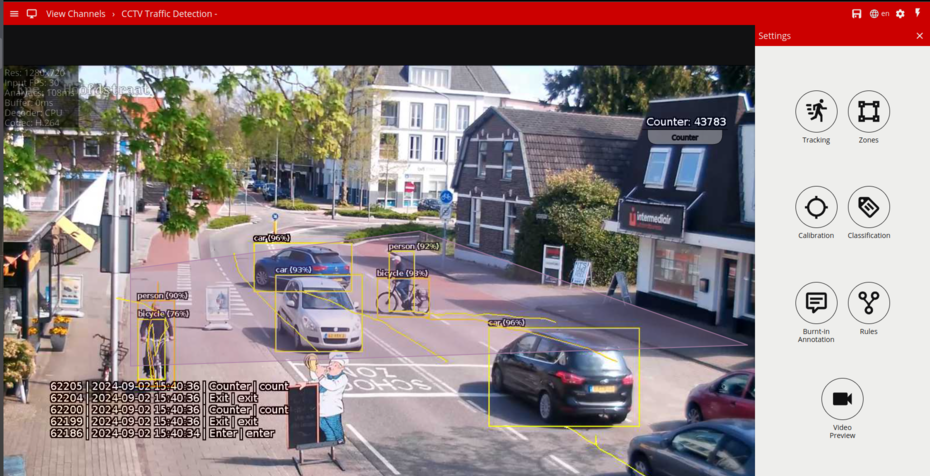

For more information on creating and configuring channels in VCA please refer to the
[VCA core manual 2.4](https://documentation.vcatechnology.com/).

## Creating an Action

### HTTP

Events can be transmitted to Sentinel using HTTP(S) Posts, the request body must contain the event information in the
appropriate format. The URL (including the IP Address and Port Number) to which the event should be posted will be
provided by the system administrator.

1.  Click the **system cog** in the top right to access the Settings.

    

2.  Then, click **Edit Actions**.

    

3.  Click **Add Action** and select **HTTP** from the list of available actions.

    

4.  Enter a descriptive name for the action.

5.  Click the arrow on the right of the action to expand the HTTP configuration options.

    -   **URI:** Enter the IP Address or required URI to send events to Sentinel. Example:
        `http://efep1.demo.monitor.equipment:8022/GenericLineHTTP`.
    -   **Port:** Enter the web port required by the Sentinel server.
    -   **Headers:** N/A.
    -   **Body:** Select **Custom** from the drop-down menu. Then, add the message required by the Sentinel server with
        some VCA tokens.

    -   **Method:** Select **POST** from the available methods.
    -   **Enable Authentication:** N/A.
    -   **Username:** N/A
    -   **Password:** N/A.
    -   **Sources:** Click **Add Source +** to display a list of the available Sources, rules and filters. Select the
        rule created for the source you want to send to the Sentinel server.

        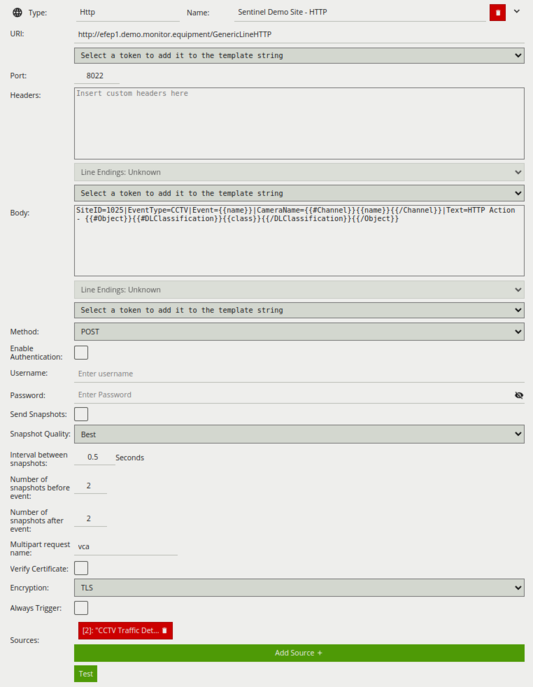

For this integration, the following tokens were used to send an information on the camera, zone and rule type that
triggered the event:

-   `{{name}}`: The name of the event.
-   `{{#Object}}{{#DLClassification}}{{/DLClassification}}{{/Object}}`: The classification generated by a deep learning
    model (e.g. Deep Learning Object Tracker or Deep Learning People Tracker). This token is a property of the
    object token. The algorithm must be enabled in order to produce this token. It has the following sub-properties:
    -   `{{class}}`: What the object has been classified as (person, vehicle).
-   `{{#Channel}}{{name}}{{/Channel}`: The name of the channel that the event occurred on.

### Email

Events can be transmitted directly into Sentinel’s inbuilt SMTP server (point to point) or Sentinel can be configured to
read emails from a mail server using POP3.

1.  Click the **system cog** in the top right to access the Settings.

    

2.  Then, click **Edit Actions**.

    

3.  Click **Add Action** and select **Email** from the list of available actions.

    

4.  Enter a descriptive name for the action.

5.  Click the arrow on the right of the action to expand the Email configuration options.

    -   **Server:** Enter the IP address or required URI by Sentinel. Example: `efep1.demo.monitor.equipment`.
    -   **Port:** Enter the SMTP port of the Sentinel server.
    -   **From:** Enter `<YourCompanyName>@demo.com` as the sender address.
    -   **To:** Enter `noreply@monitortsoft.com` as the recipient address.
    -   **Subject:** N/A.
    -   **Body:** Select **Custom** from the drop-down menu. Then, add the message required by the Sentinel server with
        some VCA tokens.

    -   **Enable** Send Snapshots.
    -   **The interval between snapshots:** 0.5 Seconds.
    -   **Snapshots Quality:** Select **Best** from the drop-down list.
    -   **Number of snapshots before the event:** 2.
    -   **Number of snapshots after the event:** 2.
    -   **Sources:** Click **Add Source +** to display a list of the available Sources and rules and select the logical
        rule created for the source you want to send to Sentinel.

        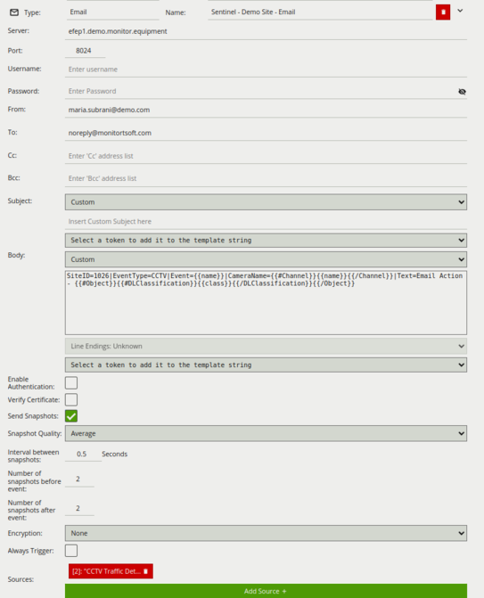

For this integration, the following tokens were used to send an information on the camera, zone and rule type that
triggered the event:

-   `{{name}}`: The name of the event.
-   `{{#Object}}{{#DLClassification}}{{/DLClassification}}{{/Object}}`: The classification generated by a deep learning
    model (e.g. Deep Learning Object Tracker or Deep Learning People Tracker). This token is a property of the
    object token. The algorithm must be enabled in order to produce this token. It has the following sub-properties:
    -   `{{class}}`: What the object has been classified as (person, vehicle).
-   `{{#Channel}}{{name}}{{/Channel}`: The name of the channel that the event occurred on.

# Sentinel Configuration

​For this document, it is assumed that​ you can access the Sentinel alarm monitoring system and the system is
preconfigured as required.

## The Generic Line Transmitter

### HTTP Notifications

1.  Configure the first transmitter as follows:

    -   **Type:** Select **Generic Line Interface** from the drop-down list.
    -   **Receiver ID:** Select **`GenericLine`** from the drop-down list.
    -   **Name:** Enter a descriptive name for the transmitter.
    -   **ID:** Make sure an ID is available. Otherwise, click **Next ID** to find the next available ID.

        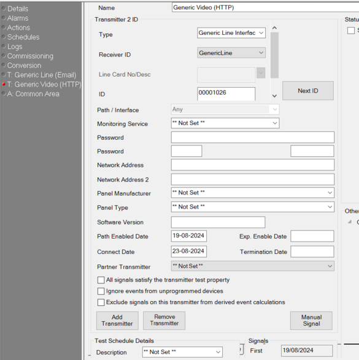

2.  Click the **Disk** button located top left to save the configuration.

### SMTP Notifications

1.  Configure the second transmitter as follows:

    -   **Type:** Select **Generic Line Interface** from the drop-down list.
    -   **Receiver ID:** Select **`GenericLine`** from the drop-down list.
    -   **Name:** Enter a descriptive name for the transmitter.
    -   **ID:** Make sure an ID is available. Otherwise, click **Next ID** to find the next available ID.

        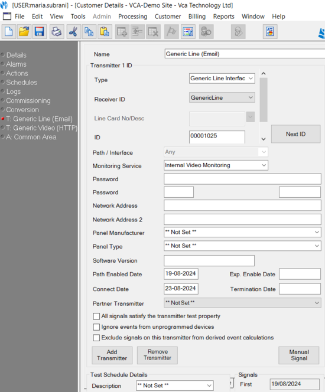

2.  Click the **Disk** button located top left to save the configuration.

## Identifying the Events

Sentinel offers an extensible set of event types and events that it can decode and handle differently depending on the
requirements of the Alarm Receiving Centre. These should be transmitted in the payload using the following fields:

-   **`EventType`:** This defines the category of the event being sent, for example a CCTV, or Lone Worker Type event.
-   **Event:** This specifies the actual event that has been triggered, for example Tamper or `ManDown`.
-   **`CameraName`:** The Camera Name that triggered the event. Typically used for CCTV systems where a unique camera
    number does not exist, and the only way of tying an event to a device is by its name alone.
-   **Text:** Any additional text information associated with the event being raised.
-   **`SiteID`:** Required to identify the device, system or existing alarm. This is an Integer field, and can be
    combined with offsets at the Alarm Receiving Centre to ensure that each Site ID is unique. This is particularly
    useful when dealing with alarm panels, or system with integer based unique IDs.

### Example

Below is typical example of a payload from different types of devices:

-   `SiteID=22131|EventType=CCTV|Event=Tamper|CameraName=Parking PTZ`.

#### Example using VCA Tokens

`SiteID=1025|EventType=CCTV|Event={{name}}|CameraName={{#Channel}}{{name}}{{/Channel}}|Text=HTTP Action -`
`{{#Object}}{{#DLClassification}}{{class}}{{/DLClassification}}{{/Object}}`

_For more information on creating and configuring events in Sentinel please refer to their Sending Alarms to Sentinel_
_user guide._

## Verifying the VCA Events

1.  Alarms and notifications of the events triggered in the VCAserver will appear at the top as follows:

    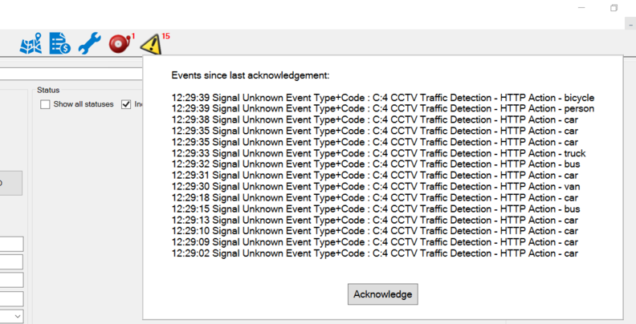

    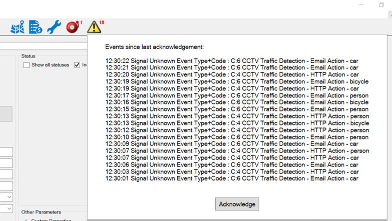

2.  Click on **Accept Highest Priority Alarm** to access the alarm monitoring system interface and to see details of
    the events.

    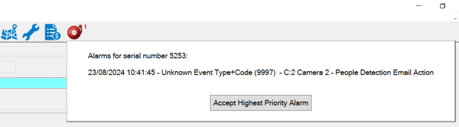

3.  Click **Events Received** to display the list of incoming alarms.

    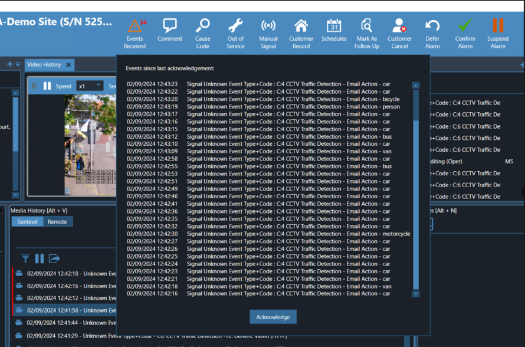

4.  Additionally,navigate to the _Media History_ section and click on an event to review the annotated recording, the
    category of the event sent and the camera name that triggered the event:

    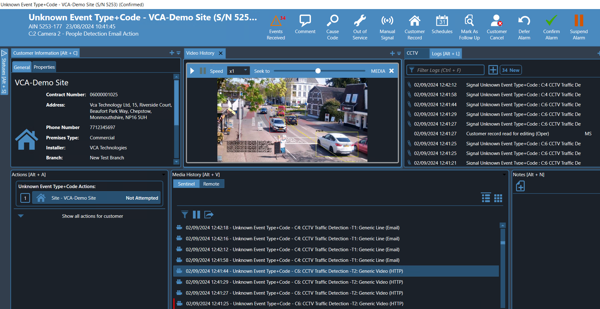

    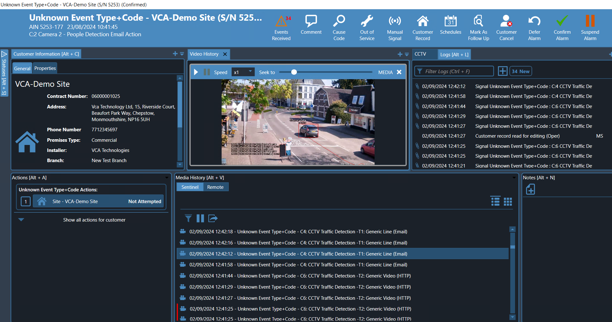
