# Introduction

## Prerequisites

-   VCAnx server version `2.9r3` or greater and configuration tool version 2.9.5 or greater.
-   Wisenet WAVE VMS version 5.1 or greater.

## Supported features

-   All the VCAnx server features.

## Architecture

The VCAnx plug-in is installed alongside the Wisenet Wave server and provides the link to the VCAnx servers. The VCAnx
server component receives the encoded video from Wisenet Wave, decodes and processes the video through the analytics
engines and rules. It will then feedback the metadata to the VCAnx plug-in to be integrated into the video stream in
Wisenet Wave.

We can also use the VCAnx configuration tool to provide a feature rich experience when configuring a channels video
analytic features.

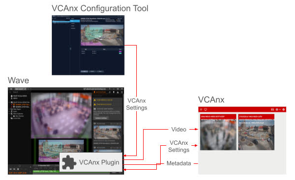

# VCAnx Configuration Tool

## Logging In

First, we launch the VCAnx Configuration tool to connect to the Wisenet WAVE server.

1.  Enter the **Host** or IP address of the Wisenet WAVE server.
2.  Enter the **Port** (7001 by default).
3.  Enter the **Login** and **Password** to access the Wisenet WAVE server.
4.  Click **Connect**.

    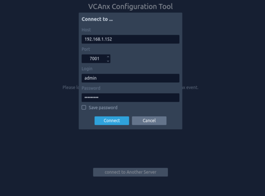

## Configuring Wisenet WAVE server

1.  After the VCAnx server has been installed, the Wisenet WAVE server needs to be configured.
2.  Click on the menu icon in the top left and select **VCAnx Server List** from the drop-down options.

    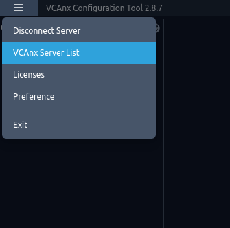

3.  Then, click **Add** to add a new server and configure it as follows:
    -   Enter the **IP Address** VCAnx server is installed on.
    -   Leave the **Port** set to **3030**

        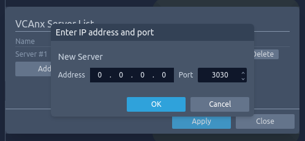

    -   Click **OK** to return to the previous menu.
    -   Click **Apply** to save your changes.
    -   Click Close to close and return to the previous menu. _Note: You can define up to 4 VCAnx servers._

        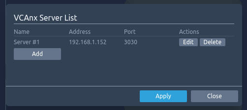

## Enabling VCAnx Plug-in

1.  Once you are logged into the Wisenet WAVE server, there is a list of the cameras on the left side bar. This list
    shows all the cameras that have had the VCAnx plug-in enabled.

    _Note: The plug-in can be enabled or disabled through the Wisenet WAVE Client._

2.  Select the camera in which you want to enable the plug-in in.

    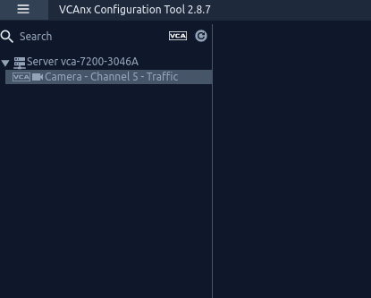

3.  In *Enable*, toggle to enable the plug-in for the selected camera.

4.  Configure *License and Tracker Engine* as follows:

    -   **License**: select the license type that will be used against the camera (this will control which features are
        available).

    -   **Tracking Engine**: select the tracking engine that will be used for analytics.
    -   Click **Apply** to confirm the settings.

        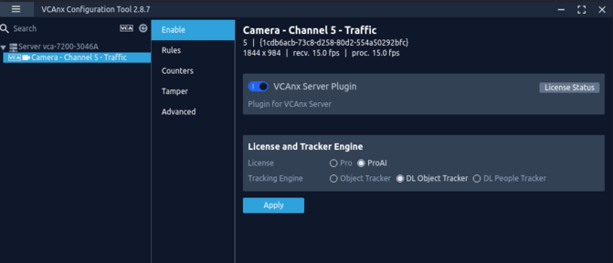

## Configuring Rules

Configure the camera as required with the appropriate tracking engine and rules. A basic setup is detailed below as an
example:

1.  Select the camera en click on **Rules**.

    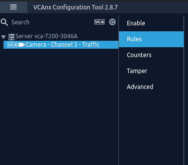

2.  Click **Add** to display the list of available rules.

    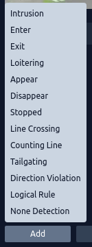

3.  Select a rule and adjust the properties as required.

    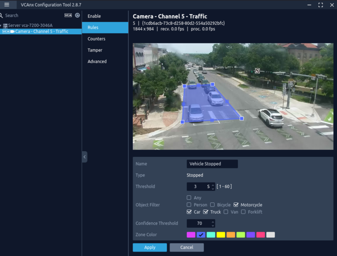

4.  Click **Apply** to apply the settings to the camera.

# Wisenet Wave Configuration

## Discovering Cameras

By default, Wisenet WAVE automatically scans for new devices. However, if the camera is not discovered, you will need
to add it manually.

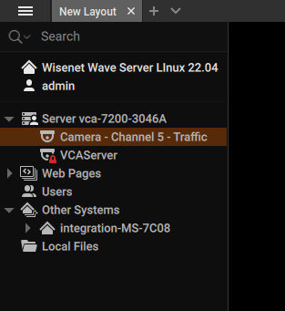

### Adding Cameras Manually

1.  Right clicking on the server name​ and select​ **Add Device...** from the menu​.

    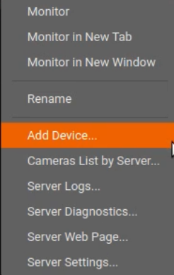

2.  The *Add Devices* window will pop up on the main screen. Then, configure the device as follows:

    -   **Address**: ​Enter the IP address of the camera.
    -   **Port**: Leave it as default if you are using the web port 80. Otherwise, unselect it and add the correct port.
    -   **Login**: ​Enter the username to access the camera.
    -   **Password:**​ Enter the password to access the camera.
    -   Click **Search**​ and wait until the device appears at the bottom of the screen.
    -   Select the new device and click **​Add all Devices** at the bottom​.

        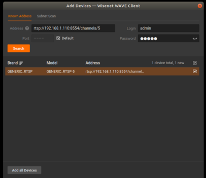

    _Note: Additionally, you can rename the device by right clicking and selecting Rename._

### Configuring Recording

1.  Right clicking on the camera screen and select **Camera Settings...**.

    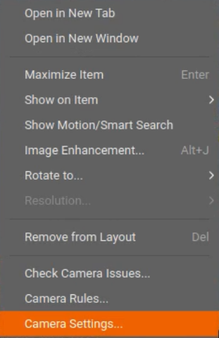

2.  In the pop-up screen, click **Recording** and toggle to enable the feature.

    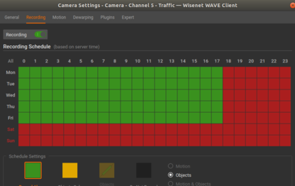

    _Optionally, you can schedule the recording of events if required. To do this, select the type of recording (Always_
    _or Motion Only) for the days._

3.  Click **Apply** to save the configuration.

4.  Click **OK** to close the Camera Settings window.

## Displaying VCAnx On-screen Annotations

1.  Right clicking on the camera screen and select **Show On Item**. Then, select **Objects** from the available
    options.

    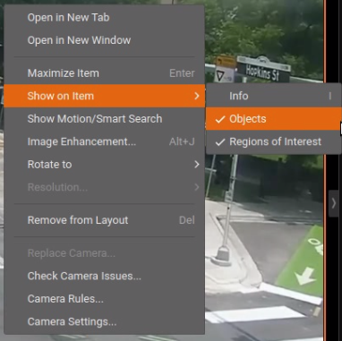

    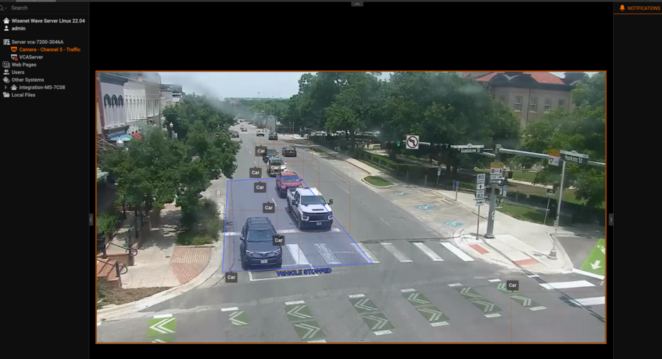

## Configuring Camera Rules in the Event Rules

Next, we configure the rule that will trigger a specific action when a condition is met. Right clicking on the camera
screen and select **Camera Rules...** from the available options.

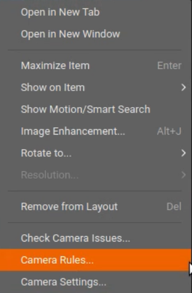

1.  Click the **+Add** button located top right.

    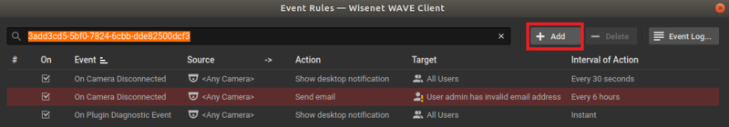

2.  Configure **Event** as follows:

    -   Click on the drop down menu for **When** and select **Analytics Event**.
    -   **At**: Select one or more cameras. Then, click **OK** to close the window.
    -   **Event Type**: Select the [rule](#configuring-rules) configured on the camera previously from the drop-down
        list.  

    -   **Caption Contains**: Add a captions if required.
    -   **Description Contains**: Add a description if required.

        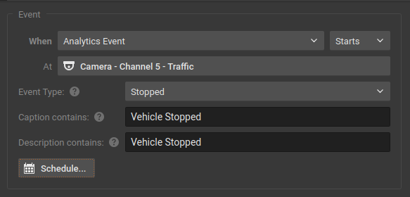

3.  Configure **Action** as follows:

    -   Click on the drop down menu for **Do** and select **Bookmark**.
    -   **At:** Select one or more cameras. Then, click **OK** to close the window.
    -   **Configure the duration** for pre-recording and post-recording.
    -   **Tags and Comments:** N/A.

        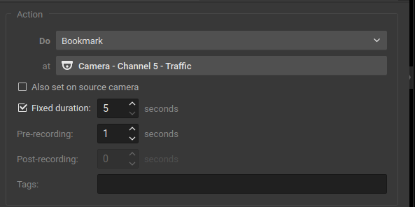

    -   Click **Apply** and **OK** to save the confirm configuration.

## Verifying VCAnx Events

Every time the VCAnx server triggers a rule, a bookmark will appear in the **BOOKMARKS** tab on the right side menu as
follows:

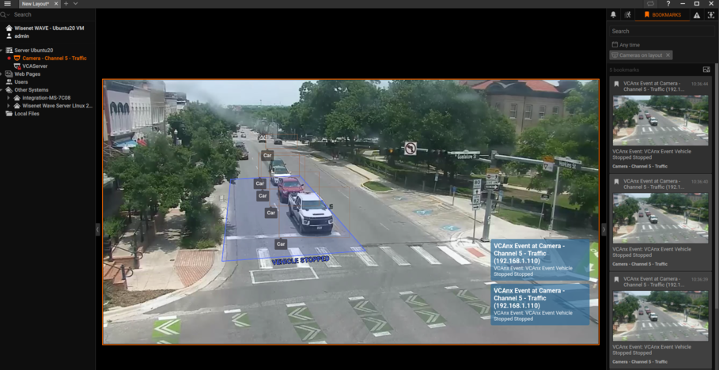
