# Introduction

## Prerequisites

-   VCAserver version 2.4 or greater.
-   Verint VMS version 7.7 or greater.

## Supported features

-   TCP events with metadata available via tokens.
-   Annotated RTSP.

## Architecture

In this web UI integration, the Verint VMS receives the annotated RTSP stream from the VCAserver and the alarms
are sent through the TCP action with VCA tokens containing details about the event.

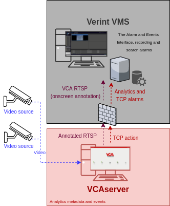

## VCAserver Configuration

### Confirming the RTSP port used for transmitting video footage

Check, and change if required, the RTSP port used by VCA for external connections to the channels within the VCA
service.

1.  From the main screen, click the **system cog** in the top right.

    

2.  Then, click on **System**.

    

3.  In **Network Settings**, you can see the RTSP port used by the VCAserver to send the RTSP stream of its channels.
    Change it if necessary and click **Save**.

    

    _Note: The syntax for connecting to these channels is:_ `rtsp://<device_ip>:<RTSP_port>/channels/<channel_id>`.

    Example: `rtsp://192.168.1.10:8554/channels/27`.

### Creating a Channel

Configure the VCAserver as required with the appropriate channel and logical rules. A basic setup is detailed below as
an example:

1.  Configure a source to connect to a camera.

    _Note: the recommended settings for the camera stream to VCA is a maximum resolution of D1 (640 x 480) with a frame_
    _rate of 15 frames per second. A lower resolution and frame rate will reduce the analytic accuracy, a higher_
    _resolution and frame rate will result in high CPU usage and can reduce analytical accuracy._

2.  Configure a **zone** for the channel.

3.  Configure **rules or filters** to trigger an event on object detection in the zone.

    

4.  Note the **Channel ID** as this will be needed when connecting to the RTSP stream from the VMS server.

    _Note: The channel ID can be located at the bottom of the channels menu._

    

For more information on creating and configuring channels in VCA please refer to the
[VCA core manual 2.4](https://documentation.vcatechnology.com/).

### Creating an Action

1.  Click the **system cog** in the top right to access the settings.

    

2.  Click **Edit Actions**.

    

3.  Then, click **Add Action** and select **TCP** from the list of available actions.

    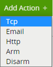

4.  Enter a descriptive name for the action.

5.  Click the arrow on the right of the action to expand the TCP configuration options.

    -   **URI**: Enter the IP address of the VMS server.
    -   **Port**: Enter the TCP port configured for the Alarm Interface service of Verint.
    -   **Body**: Select **Custom** from the drop-down menu and add some tokens.
    -   **Sources**: Click **Add Source +** to display a list of the available rules and filters and select the rules
        created for the source you want to send to the VMS server.

        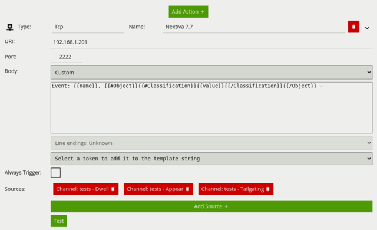

For this integration, the following Tokens were used to send an alert containing information on the camera, zone and
rule type that triggered the event and time.

Where:

-   `{{name}}`: The name of the event.
-   `{{#Object}}{{/Object}}`: An array of the objects that triggered the event.
    -   `{{#Classification}}{{value}}{{/Classification}}`: The classification of the object (it is only produced if
        calibration is enabled).

## Verint VMS Control Centre Configuration

### Configuring a New Device

First, we configure a new device into the VMS Control Centre.

1.  From the Control Centre main screen, click **Device Discovery** in the top menu.

    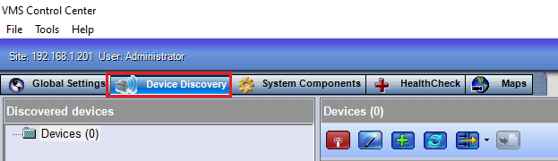

2.  In **Devices**, click on the **wand** icon at the top to run the System Setup Wizard.

    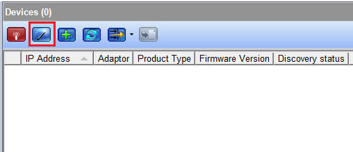

    -   In the **System Setup Wizard** first window, click **Next** to start adding a new device.
    -   In **New Components**, click the green **+** button to discovery a new device manually.

        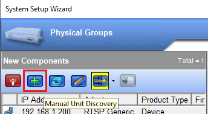

3.  In the **Unit Discovery** window, configure the new device as follows:

    -   **Adaptor**: Select **RTSP Generic** from the drop down list.
    -   **IP Address Start**: Enter the IP address of the VCAserver.
    -   **Username**: Enter the username to access the VCAserver.
    -   **Password**: Enter the password to access the VCAserver.
    -   **Port**: Enter the RTSP port configured in the VCAserver.
    -   Click **Discover** located top and wait for the device to appear listed in the window.

        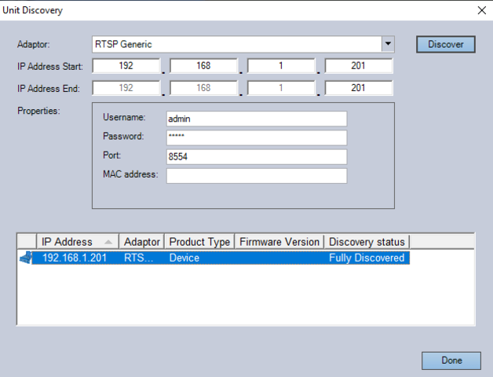

    -   Click **Done** located bottom to confirm.

4.  Drag the new device to the right to include it within the **Physical Groups View**. Then, click **Next**

    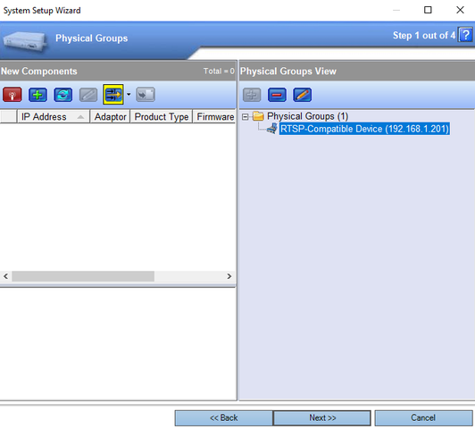

5.  Drag the new **Video Input** from the *Physical Groups View* to **Cameras** in the *Logical Groups View*.
    Then, click **Next**.

    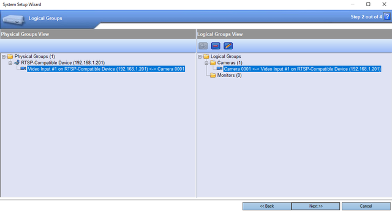

6.  Verify the **Summary Of Changes** and click **Finish**.

    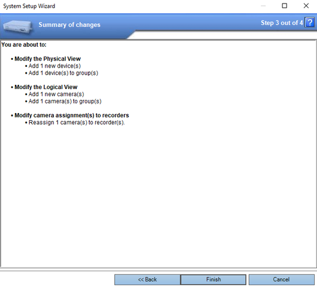

7.  Wait for the configuration to finish and click **Done**.

    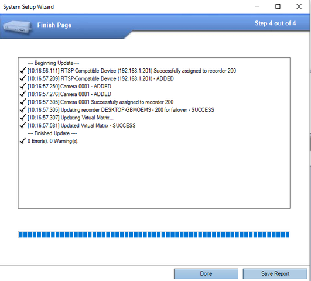

#### Configuring The VCA RTSP Stream

Next, we configure the RTSP stream of the VCA channel.

1.  From the Control Centre main screen, click **System Components** in the top menu.

2.  In **Devices** located left side, switch to **Physical View**.

    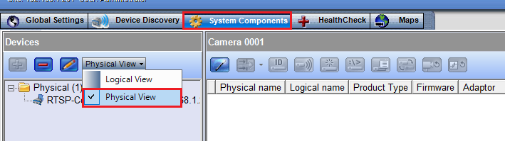

3.  Expand the **Physical** folder to show the devices. Then, select the device you want to configure.

    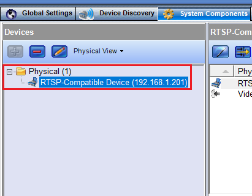

4.  In the right side, select the **Video Input** you want to configure.

    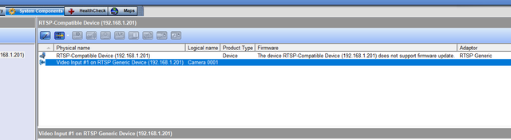

5.  Then, configure the **Advanced** settings as follows:

    -   **Live Command**: Enter the VCA RTSP stream URL to connect to a channel. Default URL
        `rtsp://<device_ip>:<RTSP_port>/channels/<channel_id>`.

    -   **Recording Command**: Enter the VCA RTSP stream URL to connect to a channel. Default URL
        `rtsp://<device_ip>:<RTSP_port>/channels/<channel_id>`.

        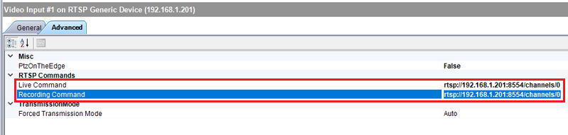

    -   Then, click **Apply** located bottom to save the configuration.

    _The VMS Recorder will display a live image of the channel._

    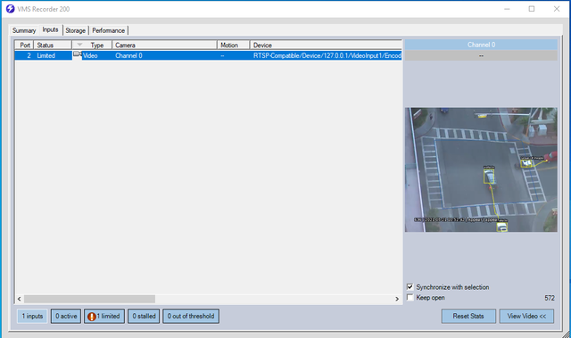

### Configuring a Scenario in Event Manager

1.  First, we configure a Event Manager Scenario to send the alarms to the VMS. From the **System Components** page,
    click **Event Manager** in the bottom left menu.

    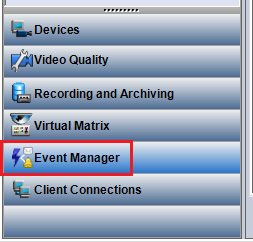

2.  Then, click **Scenarios** from the top left menu.

    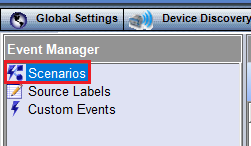

3.  In **Scenarios**, click the green **+** button to add a new scenario and configure as follows:

    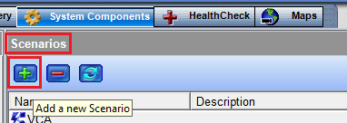

    -   In the **General** tab located bottom, enter a descriptive **name** for the scenario.
    -   Ensure that the **Active** check box is selected.

        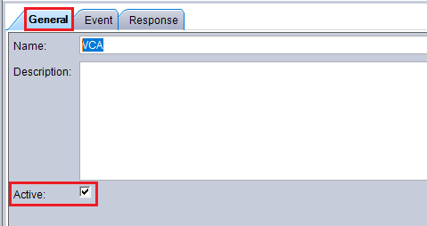

#### Configuring a Custom Event

1.  Next, we define a **Custom Event** for the alarms. From the selected scenario, click the **Event** tab. Then,
    select **Event A Only** from the Scenario Type list.

    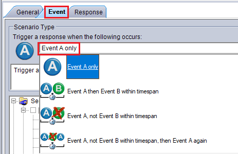

2.  Then, Select **Legacy Custom Event** from the available **Custom Security Events**._This category is related to_
     _the Alarm Interface Events._

    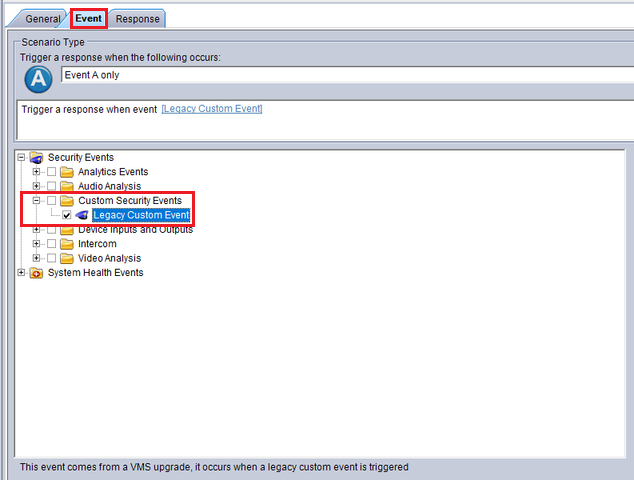

#### Triggering an Alarm

1.  Now, we define the alarm message that will be displayed in the **Verint Review Client** when the specified event
    occurs. In the **Response** tab, click the green **+** button to add a new response.

    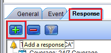

2.  Then, select **Trigger an Alarm** from the drop down list.

    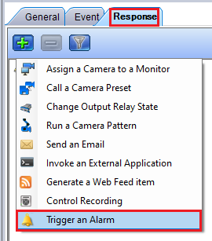

    -   Configure the **Priority** for the alarm. _Enter a number from 1 to 20_.
    -   Configure the **Description** for the alarm. _Use the items listed in the tree below to create the description._

        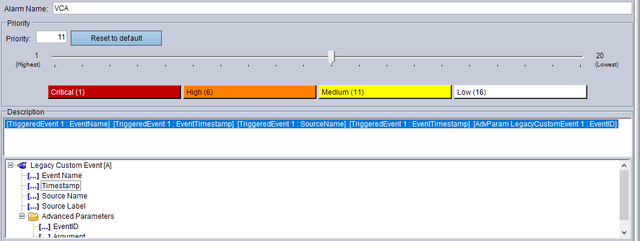

    -   In **Attachments**, select the camera associated with the events.

        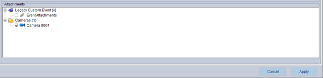

    -   Then, select the **Coverage** for the alarms.

        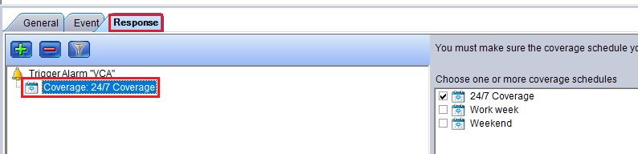

    -   Click **Apply** located bottom to save the configuration.

#### Filtering an Event Response

1.  Lastly, we configure a **Filter** for an event response. The response will only occur when a particular advance
    parameter settings occurs. In the selected scenario, click the **Response** tab.

2.  Then, select a response and click the **Filter** button located top.

    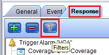

3.  Configure the **Advanced Parameters** as follows:

     -   In **Parameter**, select `EventID` from the list drop down list.
     -   In **Condition**, select **Equals** from the drop down list.
     -   In **Value**, enter the alarm ID value and click **Add to Filters**.

         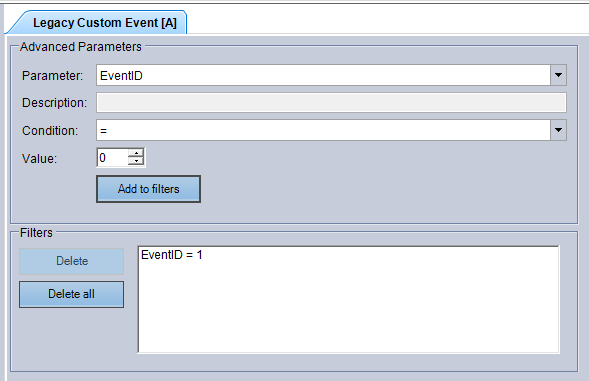

     -   Click **Apply** to save the configuration.

         _When the selected event occurs, this response will only be generated if the events' advanced parameters_
         _setting matches the settings in the filter._

    _For more information on configuring the Event Manager, please refer to the TN137: Verint VMS Alarm and Event_
    _Interface Server technical note._

### Configuring the Verint Alarm and Event Interface

When we install the _Verint Alarm and Event Interface_, a sample configuration file (`config.xml`), is added to the
folder of the interface. In this file, we can configure the events that will be generated by Verint, the ports that
will be listening for the VCA events, the strings that will trigger the events, and more.

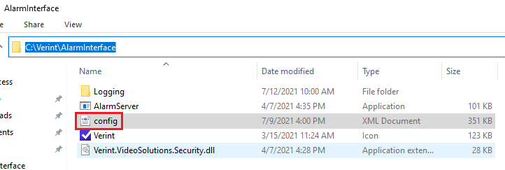

#### Configuring TCP/IP Sockets

First, we configure a TCP/IP socket that will be used to receive the VCA events.

1.  Go to the path `c:\Verint\AlarmInterface` and open the `confing.xml` file in a Text editor.
    _Before modifying the configuration file, it is recommended to save a copy of the default version._

2.  Scroll to the `<tcpPort>` tag and configure as follows:

    -   In **name**, enter a descriptive name to identify the port.
    -   In **Port**, enter the TCP port that will be used to receive the VCA events. _This port must match the TCP_
        _port configured in the VCA TCP action_.

        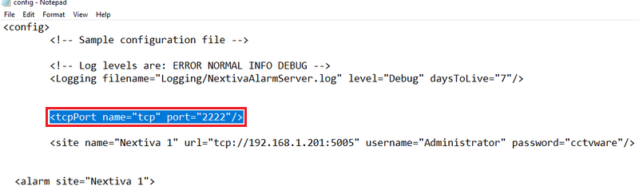

    -   **Save** the configuration.

#### Configuring Rules

1.  Next, we configure a rule for the TCP Listener. From the `confing.xml`, scroll to the `<rule>` tag and configure as
    follow:

    -   In `<match conatins=>`, enter the string that will trigger the rule. _This string should match the message_
        _configured in the body of the VCA TCP action._

    -   In `<event id=>`, enter the ID configured in the Filter and Response Event section.
    -   In `<event id="" argument=>`, enter the ID of the camera associated with the event.
    -   In `<separator=>`, enter a separator that will be used by the protocol to mark the end of the string.
        _The separator is mandatory._

        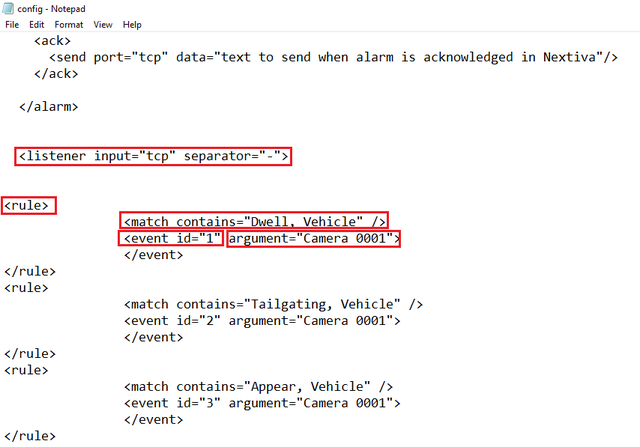

    _For more information on configuring the Alarm and Events Interface, please refer to the TN137: Verint VMS Alarm_
    _and Event Interface Server technical note._

### Verifying the VCA Events in the Verint VMS Review

From the Verint VMS Review, verify that the VCA event are being displayed in the **Alarms** page.

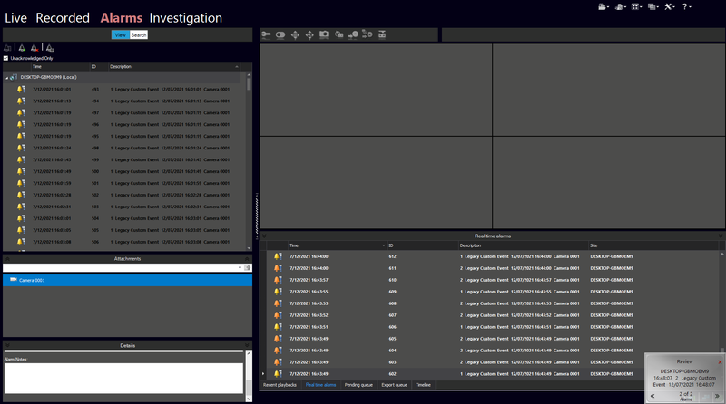
