# Introduction

## Prerequisites

-   VCAserver version 2.4.2 or greater.
-   Vivotek VSS or VAST2.

## Supported Features

-   Annotated RTSP stream.
-   HTTP events with JSON metadata available via tokens.

## Architecture

For this web UI integration, VSS receives the annotated RTSP stream from the VCAserver and the analytics data is
sent through HTTP requests with JSON format and VCA tokens containing details about the event.

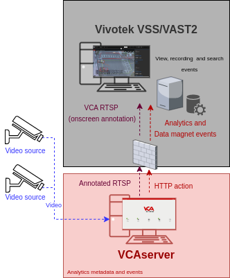

# VCAserver Configuration

## Confirming the RTSP port used for transmitting video footage

Check, and change if required, the RTSP port used by VCA for external connections to the channels within the VCA
service.

1.  From the main screen, click the **system cog** in the top right.

    

2.  Then, click on **System**.

    

3.  In **Network Settings**, you can see the RTSP port used by the VCAserver to send the RTSP stream of its channels.
    Change it if necessary and click **Save**.

    

    _Note: The syntax for connecting to these channels is:_

    `rtsp://<device_ip>:<RTSP_port>/channels/<channel_id>`.

    Example: `rtsp://192.168.1.44:8554/channels/0`.

## Creating a Channel

Configure the VCAserver as required with the appropriate channel and logical rules. A basic setup is detailed below as
an example:

1.  Configure a source to connect to a camera.

    _Note: the recommended settings for the camera stream to VCA is a maximum resolution of D1 (640 x 480) with a frame_
    _rate of 15 frames per second. A lower resolution and frame rate will reduce the analytic accuracy, a higher_
    _resolution and frame rate will result in high CPU usage and can reduce analytical accuracy._

2.  Configure a **zone** for the channel.

3.  Select the **Tracking Engine** to identify objects in the scene.

4.  Configure **rules or filters** to trigger an event on object detection in the zone.

    

5.  Note the **Channel ID** as this will be needed when connecting to the RTSP stream from the VSS server.

    _Note: The channel ID can be located at the bottom of the channels menu._

    

For more information on creating and configuring channels in VCA please refer to the
[VCA core manual 2.4](https://documentation.vcatechnology.com/).

## Creating an Action

1.  Click the **system cog** in the top right to access the Settings.

    

2.  Then, click **Edit Actions**.

    

3.  Click **Add Action** and select **HTTP** from the list of available actions.

    

4.  Enter a descriptive name for the action.

5.  Click the arrow on the right of the action to expand the HTTP configuration options.

    -   **URI:** Enter the URI required by Data Magnet to integrate any external data into VSS. Default
        endpoint: `http://<serverIP>:<serverPort>/api/udi`

    -   **Port:** Enter the web port of the VSS server (by default 3454).
    -   **Headers:** ```Content-Type: Application/JSON.```
    -   **Body:** Add the JSON data required by Data Magnet and the VSS server with the VCA tokens.
    -   **Method:** Select **POST** from the available methods.
    -   **Enable Authentication:** Check to enable authentication.
    -   **Username:** Enter the username to access the VSS server.
    -   **Password:** Enter the password to access the VSS server.
    -   **Sources:** Select **Add Source +** to display a list of the available Sources and logical rules and select the
        logical rule created for the source you want to send to the server.

        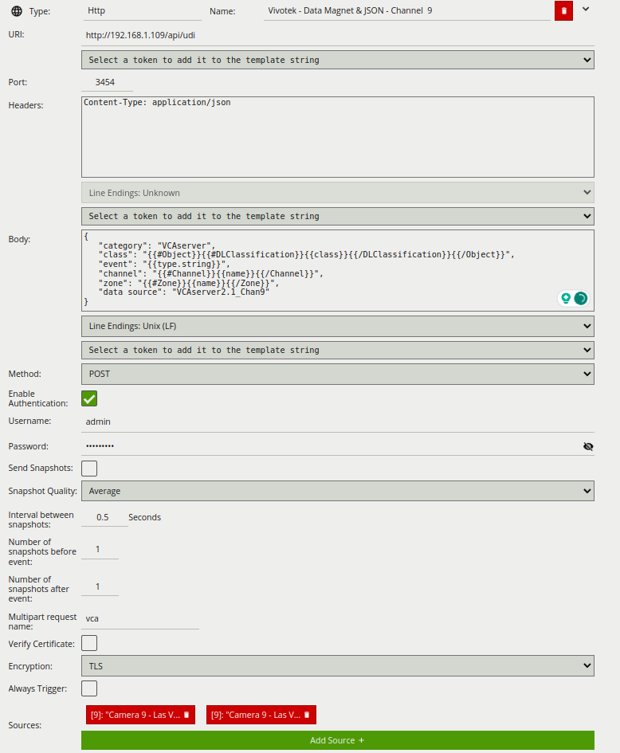

For this integration, the following tokens were used to send an information on the camera, zone and rule type that
triggered the event:

-   `category`: Reserved key (required). The category needed for Data Magnet.
-   `{{#DLClassification}}{{class}}{{/DLClassification}}{{/Object}}`: The Deep-Learning classification name of the
    object.
-   `{{type.string}}`: The type of the event. This is usually the type of rule that triggered the event.
-   `{{#Channel}}{{name}}{{/Channel}}`: The name of the channel that the event occurred on.
-   `{{#Zone}}{{name}}{{/Zone}}`: An array of zones associated with the event.
-   `data source`: Reserved key (required). The name of the data source created for Data Magnet.

_Note: The message is an example. You can adjust the data and add more tokens as needed._

# Vivotek VSS Configuration

## Configuring a New Camera

1.  The first step is to add a new camera to the system. From the main screen, click on the **cog** icon at the top
    right and select **Settings**.

    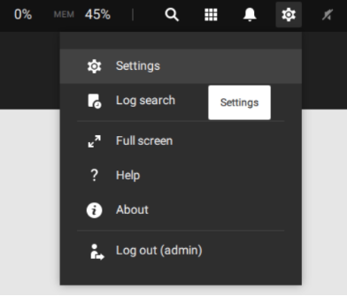

2.  Click on **Cameras** on the left hand side. Then, click on the **+** button at the top to add a new camera.

    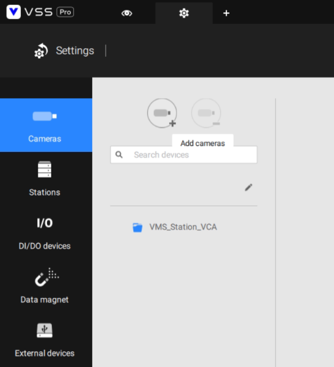

3.  Click on the **+** button to add a new device, and configure it as follows:

    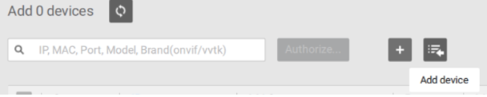

    -   Select **RTSP** from the drop-down list.
    -   Enter the RTSP **URL** to connect to a VCA channel. Example:
    `<ip_address>/channels/<channel_ID>`.

    -   Enter the **RTSP port** configured in the VCAserver (8554 by default).
    -   In *Protocol*, select **TCP** from the drop-down list.
    -   Click on **Add** to add the new device.

        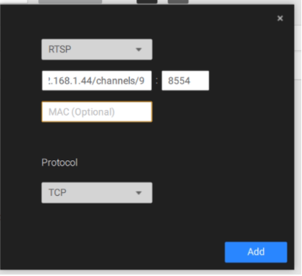

4.  Select the newly created device and click on **Add**.

    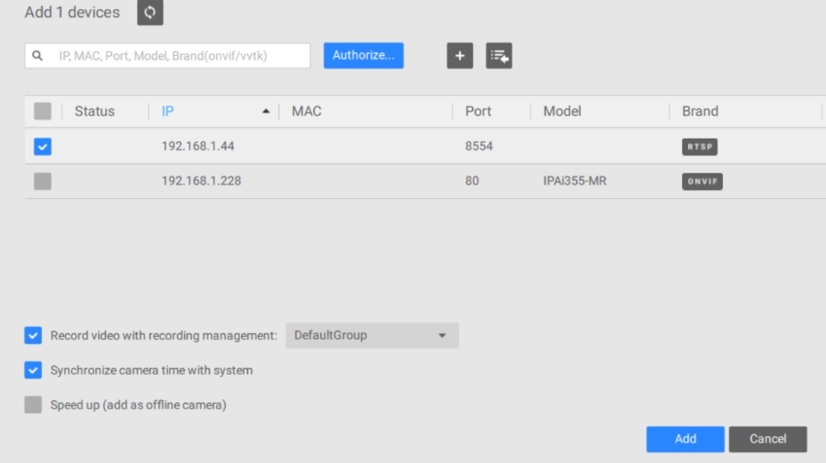

5.  Enter the credentials to access the VCAserver and click **Apply**.

    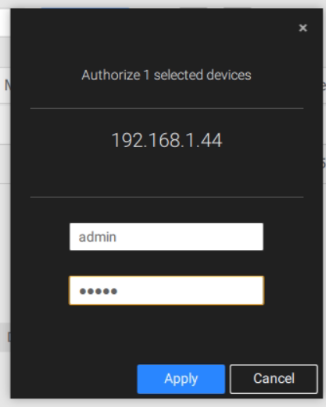

6.  Wait for the camera to synchronize with the server.

7.  A live image of the camera will be displayed in the preview window.

    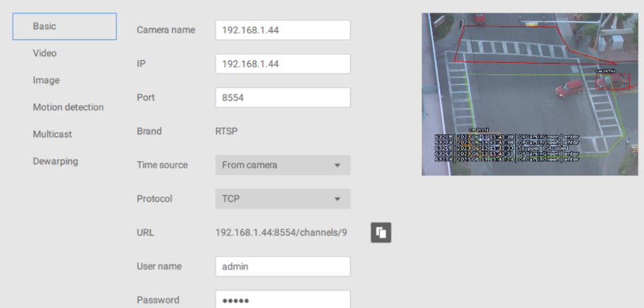

## Configuring Data Magnet

Data Magnet is an open platform for system integrators to integrate any external data into VSS or VAST2.

1.  To configure a new Data Magnet, click on **Data magnet** on the left hand side menu. Then, click on the **+**
    button at the top to create a new data source.

    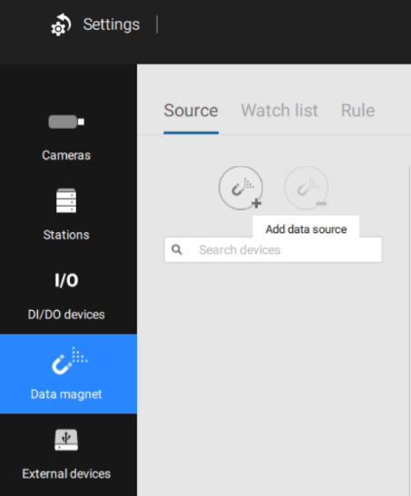

2.  In the *Add a data source* pop-up window, select **Third party data source** from the available options.

    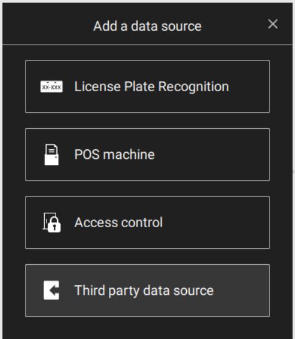

3.  Configure the data source a illustrated bellow:

    -   **Source**: Select **Single source** from the drop-down list. _You can add Multiple sources if multiple_
        _channels sends data to the same port._

    -   **Name**: Enter a descriptive name for the new data source.
    -   **Port**: Enable **Use default port** to send data to port 3454.
    -   Enable **Data source authorization**.
    -   **Related camera**: Select the VCA channel(s) that will send data to the VSS server.

        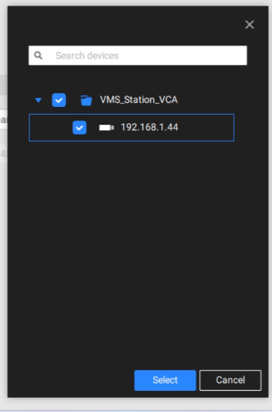

    -   Click on **Add** to add the new data source.

    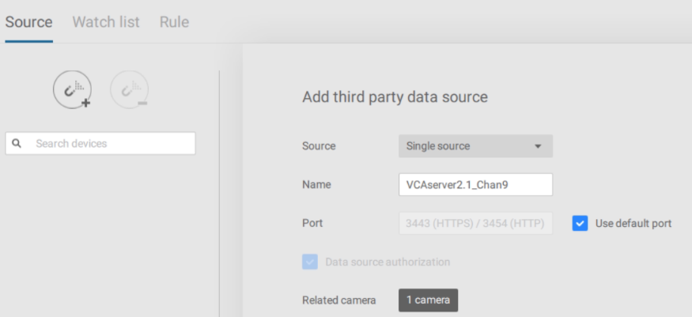

### Data Format

All data sent to VAST2 Data Magnet server is in JSON format and using UTF-8 encoding. The JSON should be in key-
value-pair, where all keys are strings and values are strings or arrays.

-   `category`: User defined category (required).
-   `class`: Classification of the object.
-   `event`: The type of the event. This is usually the type of rule that triggered the event.
-   `channel`: The name of the channel/camera that the event occurred on.
-   `zone`: The detection zones associated with the event.
-   `data source`: The name of the data source (required).

#### Template of the JSON Message With VCA Tokens

```JSON
{
   "category": "VCAserver",
   "class": "{{#Object}}{{#DLClassification}}{{class}}{{/DLClassification}}{{/Object}}",
   "event": "{{type.string}}",
   "channel": "{{#Channel}}{{name}}{{/Channel}}",
   "zone": "{{#Zone}}{{name}}{{/Zone}}",
   "data source": "VCAserver2.1_Chan9"
}
```

_For more information on configuring data sources or Data Magnet, please refer to the Vivotek Data Magnet document._

## Data Magnet Overlay Events

1.  Navigate to the VSS **Live** page and right-click on the camera. Then, select **Show data** from the *Data magnet*
    menu.

    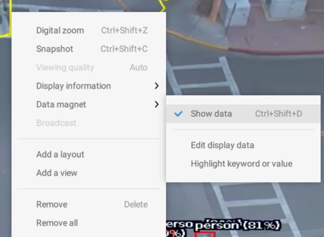

2.  Every time a logical rule is triggered on the VCAserver, an event will be overlaid on the selected camera as
    follows:

    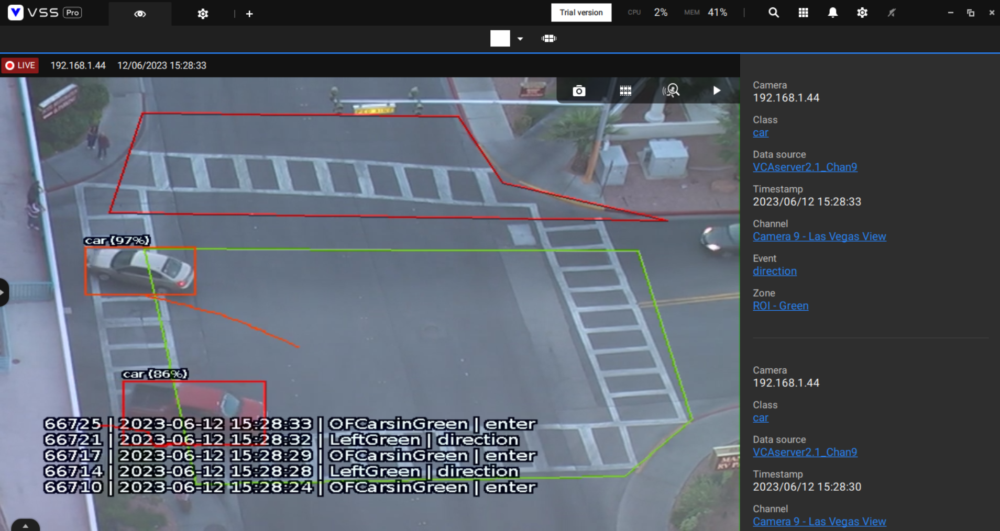

    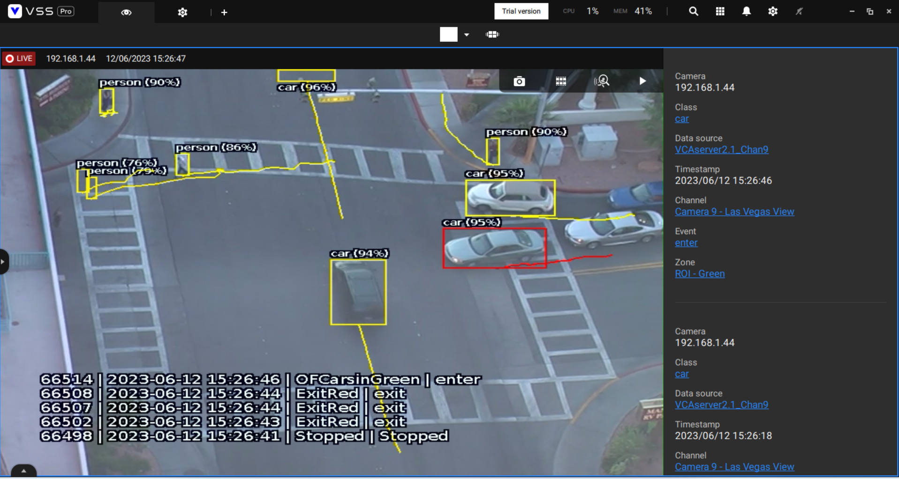

### Data Magnet Search

1.  From the main screen, click on **Applications** on the top menu.

    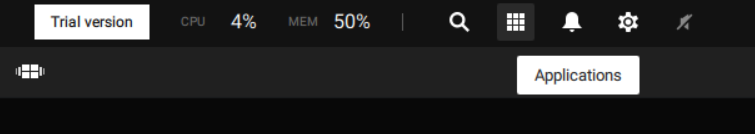

2.  Select **Data magnet** from the available options.

    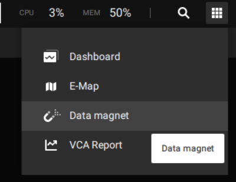

3.  ​You can review specific events on the *Data Magnet* page.​ Select the data source, camera, time frame and search
    criteria.

    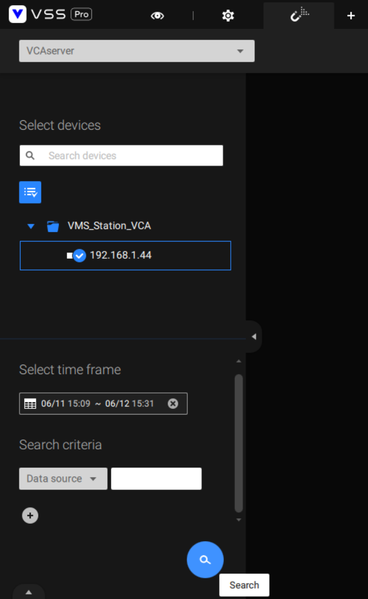

4.  The results will be listed on the right-hand side (events with annotated recordings).

    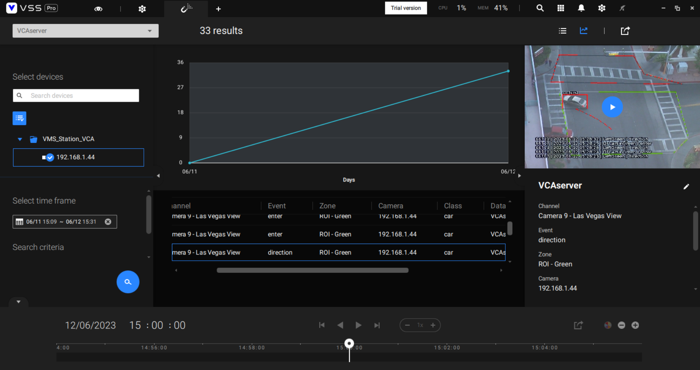

    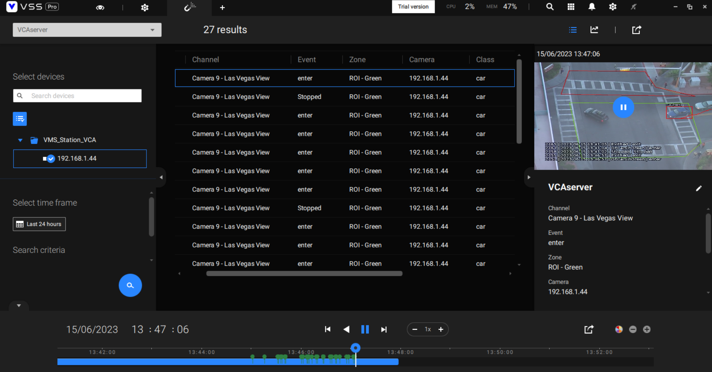
