# Introduction

## Prerequisites

-   VCAserver version 2.4.2 or greater.
-   Wavestore Server and `WaveView` Client version 6.38.

## Supported features

-   TCP events with metadata available via tokens.
-   Annotated RTSP.

## Architecture

In this web UI integration, Wavestore receives the annotated RTSP stream from the VCAserver, and the events are sent
using the TCP action with VCA tokens containing details about the event.

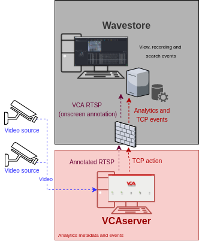

# VCAserver Configuration

## Confirming the RTSP port used for transmitting video footage

Check, and change if required, the RTSP port used by VCA for external connections to the channels within the VCA
service.

1.  From the main screen, click the **system cog** in the top right.

    

2.  Then, click on **System**.

    

3.  In **Network Settings**, you can see the RTSP port used by the VCAserver to send the RTSP stream of its channels.
    Change it if necessary and click **Save**.

    

    _Note: The syntax for connecting to these channels is:_`rtsp://<device_ip>:<RTSP_port>/channels/<channel_id>`.

    Example: `rtsp://192.168.1.10:8554/channels/27`.

## Creating a Channel

Configure the VCAserver as required with the appropriate channel and logical rules. A basic setup is detailed below as
an example:

1.  Configure a source to connect to a camera.

    _Note: the recommended settings for the camera stream to VCA is a maximum resolution of D1 (640 x 480) with a frame_
    _rate of 15 frames per second. A lower resolution and frame rate will reduce the analytic accuracy, a higher_
    _resolution and frame rate will result in high CPU usage and can reduce analytical accuracy._

2.  Configure a **zone** for the channel.

3.  Configure **rules or filters** to trigger an event on object detection in the zone.

    

4.  Note the **Channel ID** as this will be needed when connecting to the RTSP stream from the Wavestore server.

    _Note: The channel ID can be located at the bottom of the channels menu._

    

For more information on creating and configuring channels in VCA please refer to the
[VCA core manual 2.4](https://documentation.vcatechnology.com/).

## Creating an Action

1.  Click the **system cog** in the top right to access the settings.

    

2.  Click **Edit Actions**.

    

3.  Then, click **Add Action** and select **TCP** from the list of available actions.

    

4.  Enter a descriptive name for the action.

5.  Click the arrow on the right of the action to expand the TCP configuration options.

    -   **URI**: Enter the IP address of the Wavestore server.
    -   **Port**: Enter the TCP port configured for the I/O Device.
    -   **Body**: Select **Custom** from the drop-down menu and add some tokens.
    -   **Sources**: Click **Add Source +** to display a list of the available rules and filters and select the rules
        created for the source you want to send to the Wavestore server.

        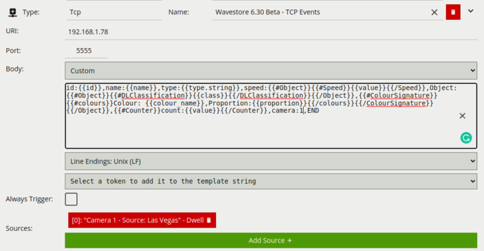

For this integration, the following Tokens were used to send an alert containing information on the camera, zone and
rule type that triggered the event and time.

Where:

-   `{{id}}`: The ID of the event.
-   `{{name}}`: The name of the event.
-   `{{type.string}}`: The type of the event. This is usually the type of rule that triggered the event.
-   `{{#Object}}{{#Speed}}{{/Speed}}{{/Object}}`: The estimated speed of the object. This token is a property of the
    object token, and it is only produced if calibration is enabled. It has the following sub-property:
    -   `{{value}}`: The estimated speed of the object.
-   `{{#Object}}{{#DLClassification}}{{/DLClassification}}{{/Object}}`: The classification generated by a deep learning
    model (e.g. Deep Learning Filter or Deep Learning Object Tracker). This token is a property of the object token.
    The algorithm must be enabled in order to produce this token, and calibration is not required. It has the following
    sub-properties:
    -   `{{class}}`: What the object has been classified as (person, vehicle).
-   `{{#Object}}{{#ColourSignature}}`: The colour signature of the object. This token is a property of the object
    token, and it is only produced if the colour signature algorithm is enabled. It has the following sub-properties:
    -   `{{#colours}}:Colour: {{colour_name}}`: Descriptive name of colour e.g. red.
    -   `Proportion: {{proportion}}{{/colours}}`: The percentage of an object that is made up of the specified colour.
-   `{{#Counter}}{{/Counter}}`:An array of counter counts with the following sub-property:
    -   `count: {{value}}`: The number of counts.
-   `camera`: Represents the ID of the camera configured in Wavestore.
-   `END`: Represents the end of the request.

# Wavestore `WaveView` Configuration

## Configuring the VCA RTSP Stream

1.  First, we add a new camera into the system. From the `WaveView` client main screen, click **View** in the top menu
    and select **Setup** from the available options.

    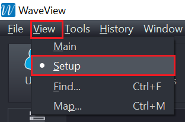

2.  Then, click on **Cameras** at the top.

    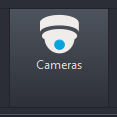

3.  In the *Cameras* page, click the **Cameras Groups** tab.

    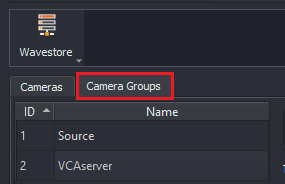

4.  In the *Cameras Groups* page,  click **Add** located at the bottom to create a new group.

    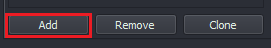

5.  Enter a descriptive **name** for the group.

6.  In **Type**, select **RTSP** from the available options.

    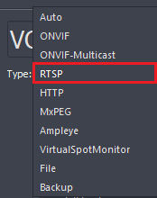

7.  Configure the new cameras as follows:

    -   In **General**, enter the **Username** and **Password** to access the VCAserver.
    -   In `Stream1`, select **Custom** as a stream type.
    -   In **Request**, enter the path for the VCA channel RTSP stream. Default format: `/channels/channel_id`.
        Example: /channels/3.

        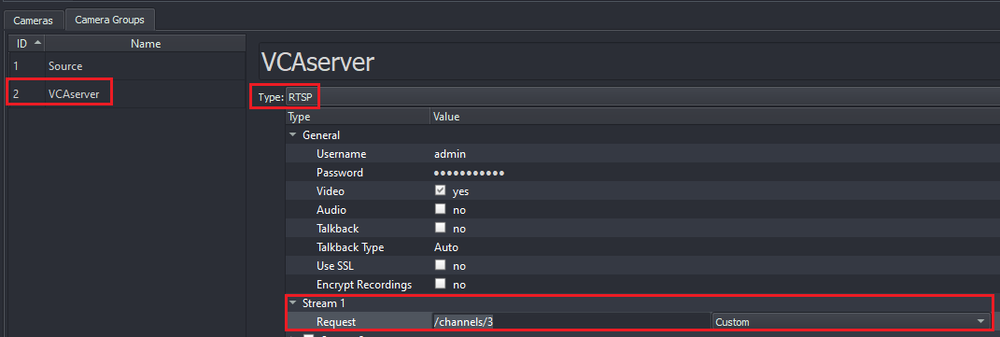

    -   In **All Tracks**, verify the settings for the **Recording** or modify them as required.

        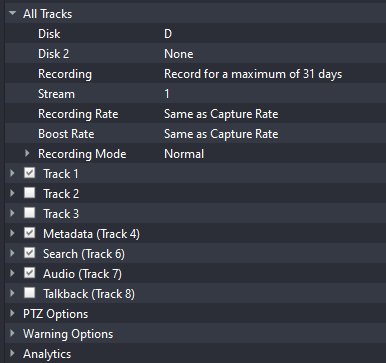

8.  Then, click the **floppy disk** icon located top right to save the configuration.

    

9.  Next, go back to **Cameras** tab and edit the new camera as follows:

    -   Enter a descriptive **name** for the new device.
    -   In **IP**, enter the IP address and RTSP port of the the VCAserver.
    -   In **Groups**, select the newly created group.
    -   Then, click the **floppy disk** icon located top right to save the configuration.

        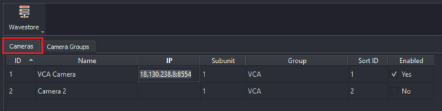

10.  The preview window will display a live camera image as follows:

     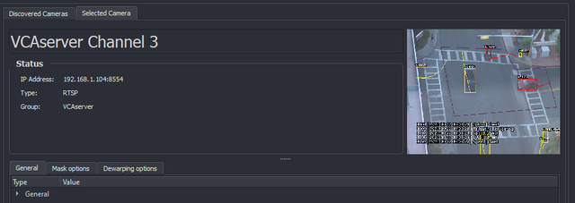

## Configuring I/O Devices

### Configuring TCP Protocol

1.  The VCAserver can send TCP events that are supported by Wavestore through the TCP protocol within the I/O Devices
feature. From the top menu, click on **Server**.

    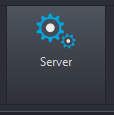

2.  Then, click **I/O Devices** from the left menu.

    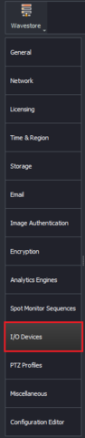

3.  Click **Add** at the bottom to create a new peripheral I/O device and configure as follows:

    -   **Name:** Enter a descriptive name for the new device.
    -   **Protocol:** Select **TCP** from the available protocols.

        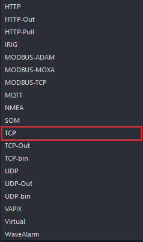

    -   **Port:** Enter the TCP port to receive the VCA events (it must match the port configured in the TCP action
        of the VCA server).

        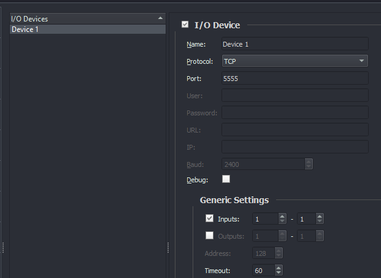

    -   Tick the box against **Integration Module** and select the `TCP_VCABridge` module. _Make sure you have the_
        _integration module corresponding to the `VCABridge`. Please, contact Wavestore for more information._

        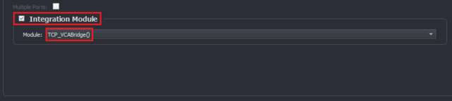

    -   Then, click the **floppy disk** icon located top right to save the configuration.

## Configuring Metadata Protocols

The Metadata Protocols is used to configure information about tags which might be captured as metadata when using an
integration module. From the top menu, click on **Metadata Protocols**.

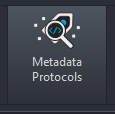

1.  Click **Add** at the bottom to create a new metadata protocol and configure as follows:

    -   In **Name**, enter descriptive name for the new protocol.
    -   In **Top Level Tag Name**, type `WaveVCA` as a top level name.
    -   In **Tags**, click **Add** on the right hand side to start adding the tags related to the metadata that will
        be captured when the VCAserver sends the events.

        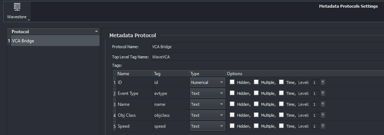

2.  Note that the following **tags** match the `TCP_VCABridge` **integration module** configured for the TCP protocol
    within the I/O device:

    |Name      |Tag        |Type     |
    |-----------|----------|---------|
    |ID         |id        |Numerical|
    |Event Type |`evtype`  |Text     |
    |Name       |name      |Text     |
    |`Obj` Class|`objclass`|Text     |
    |Speed      |speed     |Text     |

3.  Then, click the **floppy disk** icon located top right to save the configuration.

## Configuring Event Rules

The Event Rules menu allows the server to be configured to react to **event causes** (video loss, digital input,
motion event) by triggering **event actions** (send email, move PTZ camera, trigger digital
output).

1.  From the top menu, click on **Event Rules**.

    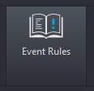

2.  Click **Add** at the bottom to create a new rule.

    

3.  In the *When following causes occur* section, double click on the red button **None** located at the top left to
    create a new cause.

    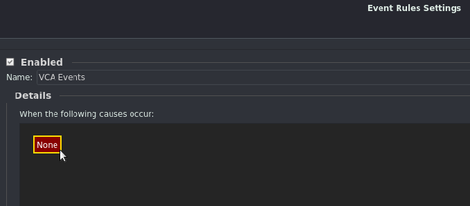

    -   In the *Edit Event Cause* pop-up window, select `VCAMetadata` from the available Event Causes.

        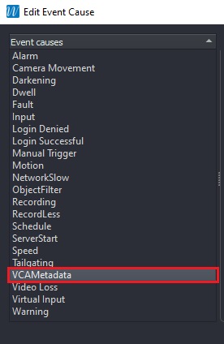

    -   In **Parameters**, configure the **Device ID** of the VCAserver.
    -   In **Sub-devices ID**, leave it **None**.
    -   In **Text Match**, leave it **None**.
    -   In **Post-event Settings**, select **Pass Through** from the available modes.

        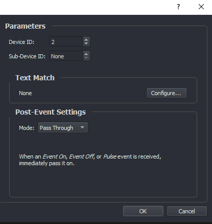

    -   Then, click the **OK** to save the configuration.

4.  In the *Trigger these actions* section, click **Add** at the right hand side to decide how the system will react to
    the VCA events.

    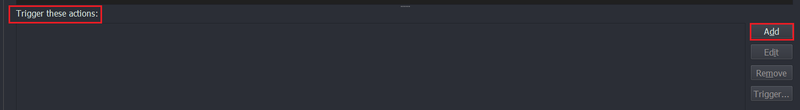

    -   In the *Edit Event Action* pop-up windows, select **Record Metadata** from the available actions.
    -   In **Parameters**, the **VCA channel** and click **OK** to save the action.

        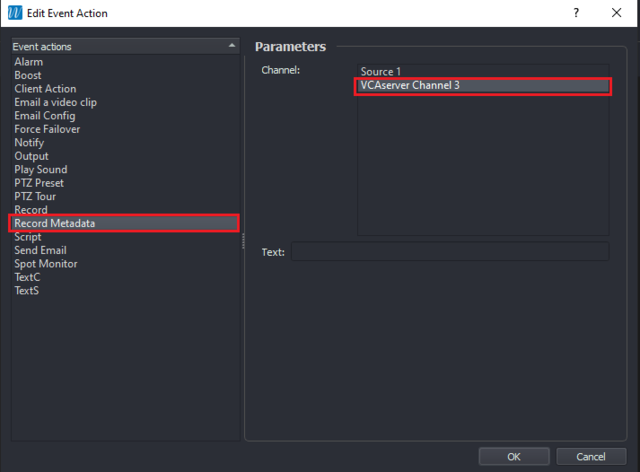

5.  Then, click the **floppy disk** icon located top right to save the configuration.

    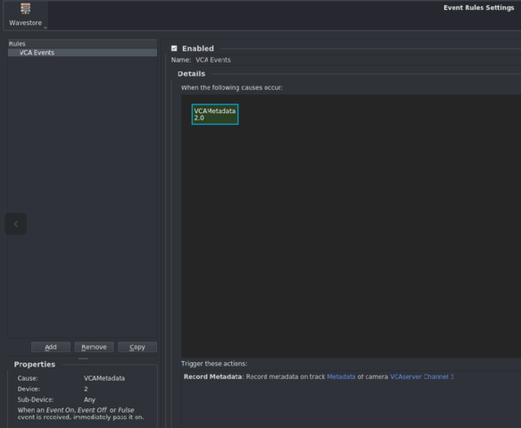

## Verifying Events

From the main screen, click on **View** located top and select **Main** from the available options.

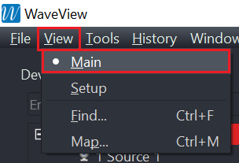

The notifications will appear on the **Live Event Stream** page when a event is triggered in the VCAserver as follows:

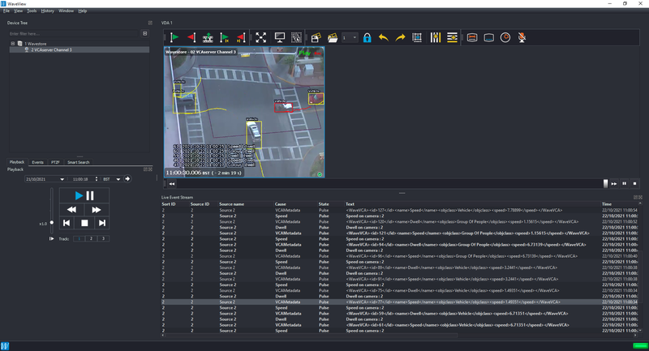
