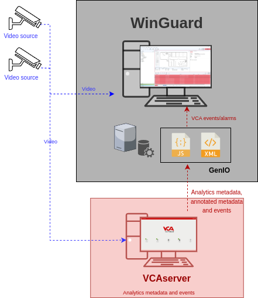
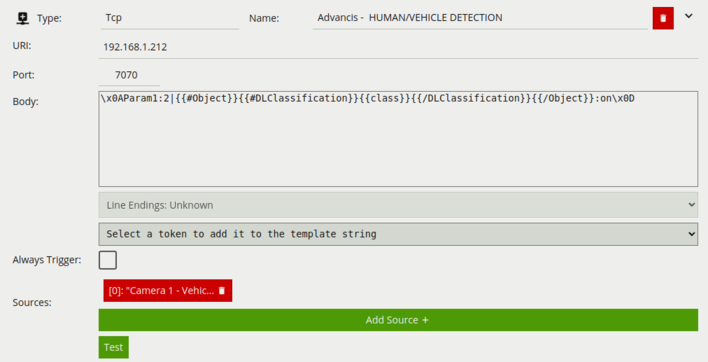
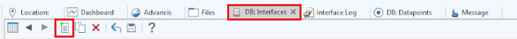
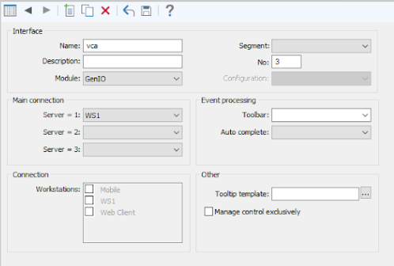
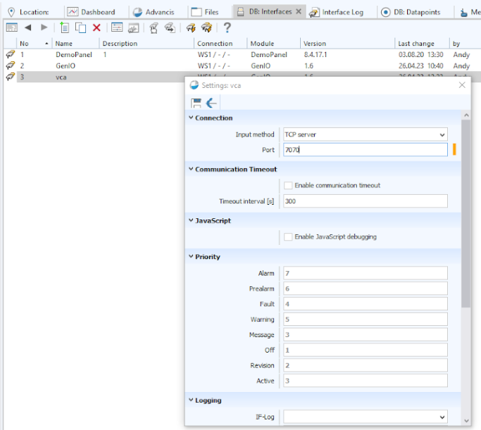
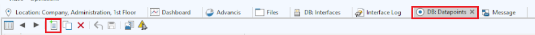
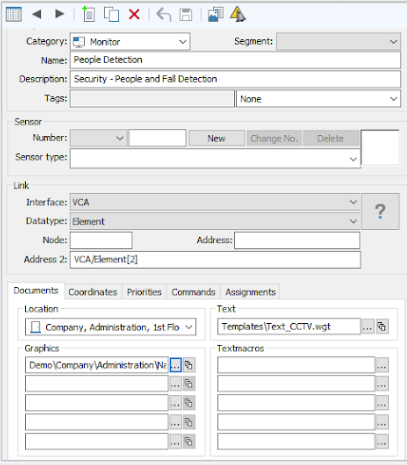
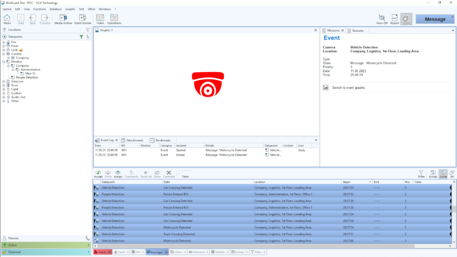

# Introduction

## Prerequisites

-   VCAserver version 2.4.2 or greater.
-   `WinGuard` X4.

## Supported features

-   TCP events with metadata available via tokens.

## Architecture

In this web UI integration, the `WinGuard` VMS receives the alarms via TCP action with VCA tokens containing details
about the event.

# VCAserver Configuration

## Confirming the RTSP port used for transmitting video footage

Check, and change if required, the RTSP port used by VCA for external connections to the channels within the VCA
service.

1.  From the main screen, click the **system cog** in the top right.

    

2.  Then, click on **System**.

    

3.  In **Network Settings**, you can see the RTSP port used by the VCAserver to send the RTSP stream of its channels.
    Change it if necessary and click **Save**.

    

    _Note: The syntax for connecting to these channels is:_

    `rtsp://<device_ip>:<RTSP_port>/channels/<channel_id>`.

    Example: `rtsp://192.168.1.10:8554/channels/27`.

## Creating a Channel

Configure the VCAserver as required with the appropriate channel and logical rules. A basic setup is detailed below as
an example:

1.  Configure a source to connect to a camera.

    _Note: the recommended settings for the camera stream to VCA is a maximum resolution of D1 (640 x 480) with a frame_
    _rate of 15 frames per second. A lower resolution and frame rate will reduce the analytic accuracy, a higher_
    _resolution and frame rate will result in high CPU usage and can reduce analytical accuracy._

2.  Configure a **zone** for the channel.

3.  Configure **rules or filters** to trigger an event on object detection in the zone.

    

For more information on creating and configuring channels in VCA please refer to the
[VCA core manual 2.4](https://documentation.vcatechnology.com/).

## Creating an Action

1.  Click the **system cog** in the top right to access the settings.

    

2.  Click **Edit Actions**.

    

3.  Then, click **Add Action** and select **TCP** from the list of available actions.

    

4.  Enter a descriptive name for the action.

5.  Click the arrow on the right of the action to expand the TCP configuration options.

    -   **URI**: Enter the IP address of the `WinGuard` server.
    -   **Port**: Enter the TCP port configured for the `GenIO` interface in `WinGuard`.
    -   **Body**: Select **Custom** from the drop-down menu and add the address for the interface of the object
        required by the `GenIO` module with some VCA tokens.
    -   **Sources**: Click **Add Source +** to display a list of the available rules and filters and select the rules
        created for the source you want to send to the VMS server.

        

For this integration, the following Tokens were used to send an alert containing information on the camera, zone and
rule type that triggered the event and time.

Where:

-   `{{#Object}}{{#DLClassification}}{{class}}{{/DLClassification}}{{/Object}}`: The classification generated by a deep
     learning model.

# `WinGuard` Configuration

## Configuring `GenIO`

`GenIO` is an interface module that evaluates raw data from a TCP connection (either incoming or outbound) and passes
it to a user-defined JavaScript file, which in turn can generate events and states within `WinGuard`.

1.  Go to the **`DB:Interfaces`** tab from the top menu.
2.  Click on **New** to create a new interface.

    

3.  Configure the interface table as follows:

    -   Enter a descriptive **Name**.
    -   In **Module**, select **`GenIO`** from the drop-down list.
    -   Select the **Main Connection** to the **Server** from the drop-down list.
    -   Click **Save** to confirm the settings.

        

4.  For interface setup, click the **Settings** icon in the toolbar of **`DB:Interfaces`** table view to open the
    `GenIO` Interface Settings window.

    -   Configure the connection as follows:

        -   **Input method**: Select **TCP server** from the drop-down options.
        -   **Port**: Specify the port of the TCP server. Default is 18000.
        -   Click **Save** to confirm the settings.

        

_Note: The `GenIO` module was customized to send events using VCA metadata. For more information on installing and_
_configuring the `GenIO` module, please refer to the `WinGuard GenIO` Technical User Guide._

## Configuring `Datapoints`

1.  Go to the **`DB:Datapoints`** tab from the top menu.
2.  Click on **New** to create a new `datapoint`.

    

3.  Configure the `datapoint` table as follows:

    -   Select the **Category** from the drop-down list.
    -   Enter a descriptive **Name** to identify the `datapoint`.
    -   Enter a **Description** to identify the `datapoint`.
    -   In *Link*, select the newly `GenIO` interface created previously.

        -   In *`Datatype`*, select **Element** from the drop-down list.
        -   In *Address 2*, enter the required address for the Objects interface. Format: `GenIO/Element[]`.
            For example: `GenIO/Element[1]`. _The `GenIO` module was customized to send events using VCA metadata._

    -   Click **Save** to confirm the settings.

    

The `GenIO` files basically serve as a sample with no real functionality. These can be used as a starting point for new
custom configurations. Please refer to the `WinGuard GenIO` Technical User Guide for more information.

Optionally, you can test the sample functionality by sending `[LF]Param1:1|Param2:on|Param3:off[CR]` via a TCP client to
the interface, and this will result in an alarm inside `WinGuard`.

## Verifying Events

Every time the VCAserver triggers a rule, the TCP action will send the event to the `WinGuard` VMS. The new event will
be listed in the **Alarm Panel** showing the `Datapoint` name, State, Location and Begin.

