# Introduction

## Prerequisites

-   VCAserver version 2.4.2 or greater.
-   Wisenet Wave VMS version 6.0 or greater.

## Supported features

-   HTTP events with JSON metadata available via tokens.
-   Annotated RTSP stream.

## Architecture

In this web UI integration, the Wisenet Wave VMS receives the annotated RTSP stream from the VCAserver and the generic
events are sent through the HTTP action with VCA tokens containing details about the event.

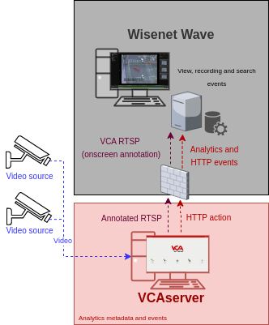

# VCAserver Configuration

## Confirming the RTSP port used for transmitting video footage

Check, and change if required, the RTSP port used by VCA for external connections to the channels within the VCA
service.

1.  From the main screen, click the **system cog** in the top right.

    

2.  Then, click on **System**.

    

3.  In **Network Settings**, you can see the RTSP port used by the VCAserver to send the RTSP stream of its channels.
    Change it if necessary and click **Save**.

    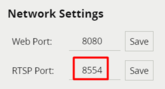

    _Note: The syntax for connecting to these channels is:_ `rtsp://<device_ip>:<RTSP_port>/channels/<channel_id>`.

    Example: `rtsp://192.168.1.10:8554/channels/27`.

## Creating a Channel

Configure the VCAserver as required with the appropriate channel and logical rules. A basic setup is detailed below as
an example:

1.  Configure a source to connect to a camera.

    _Note: the recommended settings for the camera stream to VCA is a maximum resolution of D1 (640 x 480) with a frame_
    _rate of 15 frames per second. A lower resolution and frame rate will reduce the analytic accuracy, a higher_
    _resolution and frame rate will result in high CPU usage and can reduce analytical accuracy._

2.  Configure a **zone** for the channel.

3.  Configure **rules or filters** to trigger an event on object detection in the zone.

    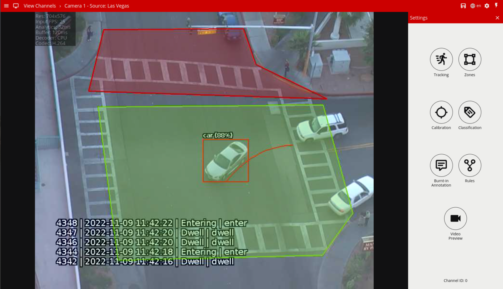

4.  Note the **Channel ID** as this will be needed when connecting to the RTSP stream from the Wisenet Wave server.

    _Note: The channel ID can be located at the bottom of the channels menu._

    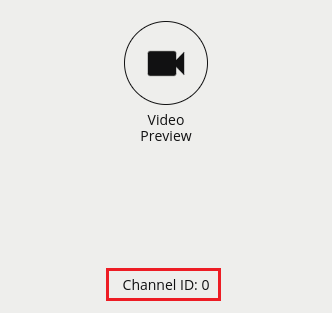

For more information on creating and configuring channels in VCA please refer to the
[VCA core manual 2.4](https://documentation.vcatechnology.com/).

## Creating an Action

1.  Click the **system cog** in the top right to access the settings.

    

2.  Click **Edit Actions**.

    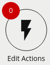

3.  Then, click **Add Action** and select **HTTP** from the list of available actions.

    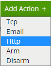

4.  Enter a descriptive name for the action.

5.  Click the arrow on the right of the action to expand the HTTP configuration options.

    -   **URI:** Enter the `CreateEvent` API call required to trigger an event of the 'Generic Event' type in the
        Wisenet Wave system. Example: `https://<IP_address:7001>/api/createEvent`.
    -   **Port:** Enter the port number used for sending the notification to the Wisenet Wave server.
    -   **Headers:** Include ```Authorization: Bearer  <access_token_provided>``` and add `application/json`.
    -   **Body:** Add the [required JSON object message](#example-of-the-post-apicreateevent-method-with-vca-tokens).
    -   **Method:** `POST`.
    -   **Sources:** Click the **Add Source +** button to display a list of the available Sources and logical rules and
    select the logical rule created for the source you want to send to the VMS.

        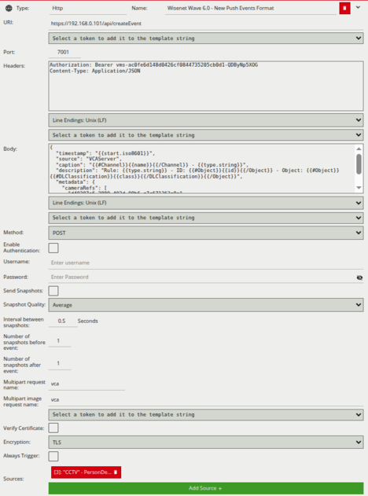

For this integration, the following tokens were used to send an information on the camera, zone and rule type that
triggered the event:

-   `{{#Object}}{{#DLClassification}}{{class}}{{/DLClassification}}{{/Object}}`: The Deep Learning classification of
     the object.
-   `{{type.string}}`: The type of the event (usually the type of rule that triggered the event).
-   `{{#Channel}}{{name}}{{/Channel}}`: The name of the channel that the event occurred on.
-   `{{#Object}}{{id}}{{/Object}}`: The unique id of the event.
-   `{{start.iso8601}}`: The start time of the event. The `iso8601` property is a date string in the ISO 8601 format.

# Wisenet Wave Configuration

## Configuring the VCA RTSP Stream

First, we add a new device. From the left menu, right-click on the server you want to add the RTSP stream to. Then,
select **Add Device...** from the list.


1.  In the **Add Devices** window, configure the VCA RTSP stream as follows:

    -   **Address:** Enter the RTSP URL of the VCA channel. The default format is:

        `rtsp://<device ip>:<RTSP_port>/channels/<channel id>`.

    -   **Port:** Unchecked the default option and enter the RTSP port configured in the VCAserver.
    -   **Login:** Enter the username to access the VCAserver.
    -   **Password:** Enter the password to access the VCAserver.
    -   Then, click **Search** and wait until the generic RTSP is listed in the window.
    -   Select the new device and Click **Add all devices**.

        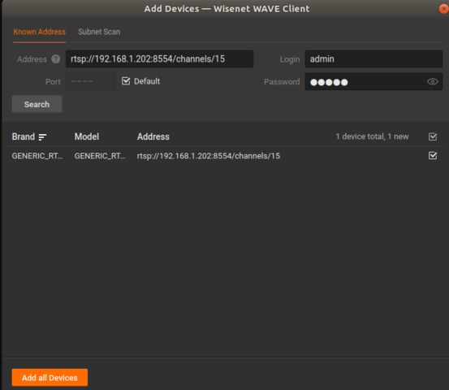

    _Note: Additionally, you can rename the device by right clicking and selecting Rename._

## Configuring the Recording

1.  Right clicking on the camera screen and select **Camera Settings...**.

    

2.  In the pop-up screen, click **Recording** and **enable** the option.

    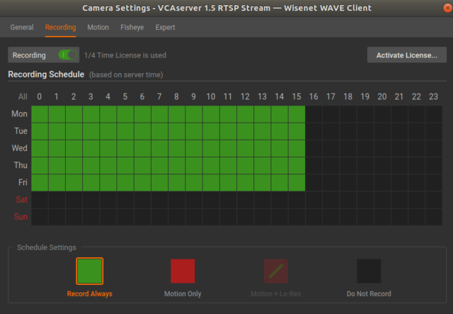

    _Optionally, you can schedule the recording of events if required. To do this, select the type of recording (Always_
    _or Motion Only) for the days._

3.  Click **Apply** to save the configuration.

4.  Click **OK** to close the Camera Settings window.

### Getting the Camera ID

1.  Right click on the camera view and select **Camera Settings...** from the menu.

    

2.  In *General*, expand **More Info** to display the camera ID.

3.  **Copy** the string and **close** the window.

    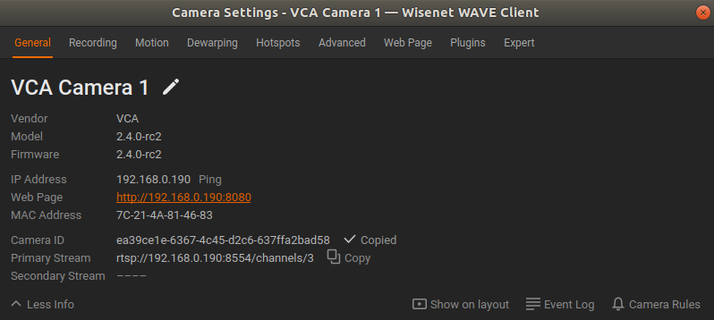

## Generating the `CreateEvent` API Call

The `CreateEvent` API call allows 3rd party systems to send Generic Events to the Wisenet Wave Server for use in the
Rules Engine. A Generic Event occurs when the server receives an HTTP request from an external device. The `CreateEvent`
API calls must comply with the following format: `https://<address>:<port>/api/createEvent`.

-   **Address**: Indicates the IP address of the Wisenet Wave server.
-   **Port**: Indicates port of the Wisenet Wave server.
-   `/api/createEvent`: Endpoint to send the HTTP events.

### Example of the POST `/api/createEvent` Method with VCA Tokens

With this method it is possible to trigger an event of the "Generic Event" type in the System from a 3rd party System.
Such event will be handled and logged according to current Event Rules. Parameters of the generated Event, such as
"source", "caption" and "description", are intended to be analysed by these Rules.

Parameters should be passed as a JSON object in POST message body with content type `application/json`. An example can
be found below:

```json
{
    "timestamp": "{{start.iso8601}}",
    "source": "VCAServer",
    "caption": "{{#Channel}}{{name}}{{/Channel}} - {{type.string}}",
    "description": "Rule: {{type.string}} - ID: {{#Object}}{{id}}{{/Object}} - Object:
    {{#Object}}{{#DLClassification}}{{class}}{{/DLClassification}}{{/Object}}",
    "metadata": {
        "cameraRefs": [
            "d40287e6-2889-402d-09b6-c7c671363e9e"
        ]
    }
}
```

Where:

-   **Timestamp:** Event date and time.

-   **Source:** Name of the Device which has triggered the Event. It can be used in a filter in Event Rules to assign
    different actions to different Devices.

-   **Caption:** Short Event description. It can be used in a filter in Event Rules to assign actions depending on this
    text.

-   **Description:** Long Event description. It can be used as a filter in Event Rules to assign actions depending on
    this text.

-   **Metadata:**: Additional information associated with the Event.

-   **`cameraRefs`:** Camera ID registered in Wisenet Wave Spectrum server. Specifies the list of Devices which are
    linked to the Event.

### Authentication: Getting an HTTP Bearer - Session Token

Should only be used over HTTPS or RTSPS, raw HTTP or RTSP requests are forbidden. New API functions which require
administrator permissions expect the session token to be recently confirmed by the administrator's password. Here is a
breakdown of the common steps required to generate an API Token depending on the authentication method:

1.  Check User type on the VMS Server (for example 'Local', 'LDAP', 'Cloud').
2.  Execute login request to the VMS Server to obtain session token.
3.  Check if session token is valid on the VMS Server.
4.  Execute any request, which requires authentication with bearer token on the VMS Server.

For more details about authentication of third-party integrations and how to get a Session Token please refer to Wisenet
Wave Spectrum API Documentation -
[Authentication](https://sync.wavevms.com/doc/developers/api-tool/authentication?type=1&system=21)

## Configuring the Camera Rules in the Event Rules

Next, we configure the rule that will trigger a specific action when a condition is met. Right clicking on the camera
screen and select **Camera Rules...** from the available options.


1.  Click the **+Add** button located top right.

    

2.  Configure **Event** as follows:

    -   Click on the drop down menu for **When** and select **Generic Event**.

        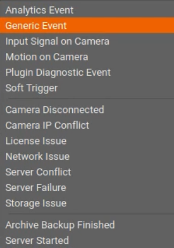

    -   **Source Contains:** Leave empty (information sent by the VCAserver).
    -   **Caption Contains:** Leave empty (information sent by the VCAserver).
    -   **Description Contains:** Leave empty (information sent by the VCAserver).

        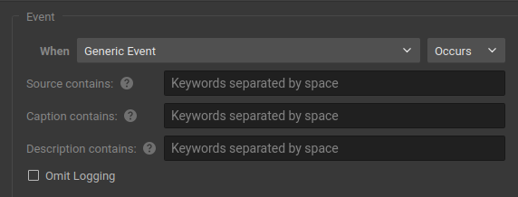

3.  Configure **Action** as follows:

    -   Click on the drop down menu for **Do** and select **Bookmark**.

        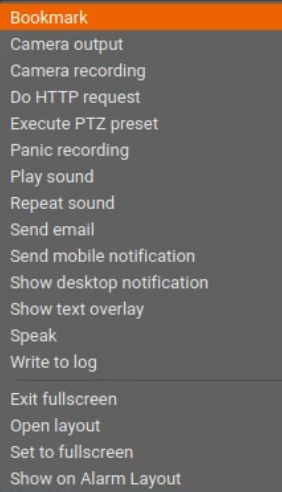

    -   **At:** Select one or more cameras. Then, click **OK** to close the window.

        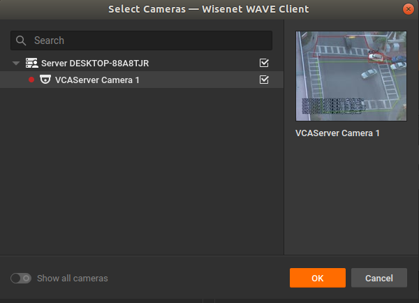

    -   **Configure the duration** for pre-recording and post-recording.
    -   **Tags and Comments:** N/A.
    -   Click **OK** to save the configuration.

        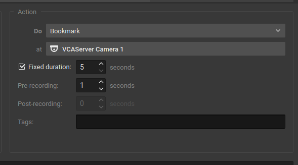

## Verifying VCA Events

Every time the VCAserver triggers an event, a bookmark will appear in the **BOOKMARKS** tab alongside a generic
notification in the **NOTIFICATIONS** tab on the right side as follows:

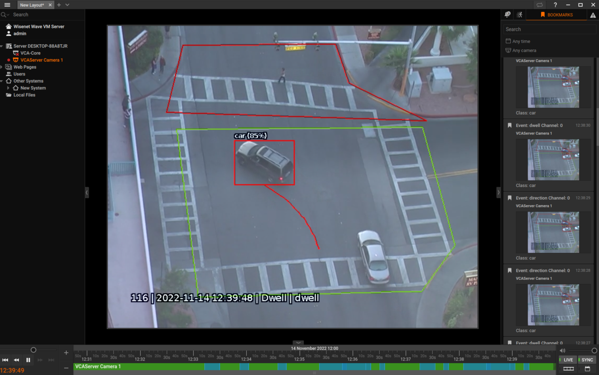

You can verify the events in the **Event Log** by pressing `Ctrl + l`:

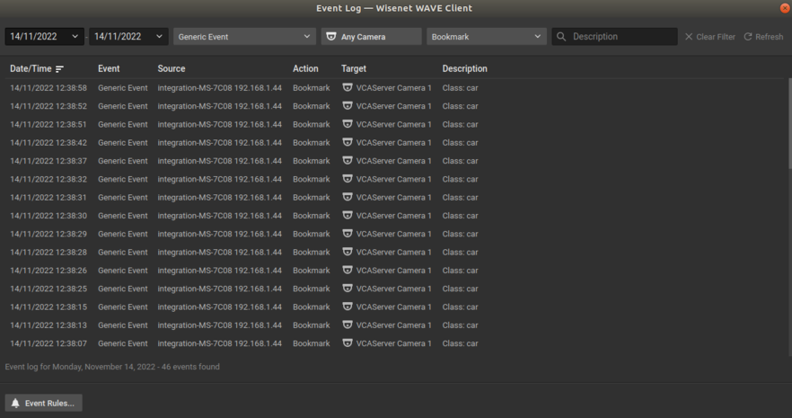
